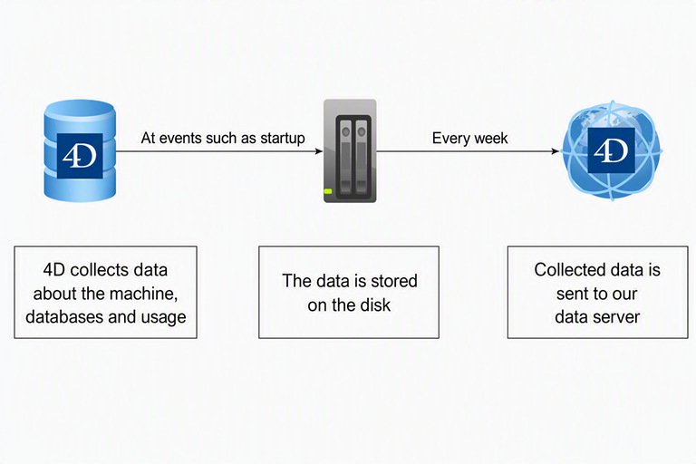

To help us make our products always better, we automatically collect data regarding usage statistics on running 4D Server applications. Collected data is transferred with no impact on the user experience. No personal data is collected. For more information on 4D policy regarding personal data protection, please visit [this page](https://us.4d.com/privacy-policy).

The section below explains:

- what information is collected,
- where information is stored and when it is sent to 4D,
- how to disable automatic data collection in client/server built applications.

## Collected information

Data is collected during the following events: 

- database startup,
- database closure,
- web server startup,
- use of specific features such as php, open datastore, remote debugger,
- client connection,
- data collection sending.

Some data is also collected at regular intervals.

|Data|Type|Notes|
|---|----|---|
| appServer | Object | Object containing application server information |
| appServer.hits | Number | Number of requests from internal processes  |
| appServer.bytesIn | Number | Bytes received by internal processes  |
| appServer.bytesOut | Number | Bytes sent by internal processes   |
| appServer.executionTime | Number | CPU execution time for internal processes  |
|cacheMissBytes|Object|Number of bytes missed from cache |
|cacheMissCount|Object|Number of reads missed in the cache |
|cacheReadBytes|Object|Number of bytes read from cache|
|cacheReadCount|Object|Number of reads in the cache |
|classUsage|Object|Number of instances of certain language classes|
|connectionSystems|Collection|Client OS without the build number (in parenthesis) and number of clients using it|
|databases[].cacheSize|Number|Cache size in bytes|
|databases[].compatibilitySettings|Object|Enabled Compatibility settings|
|databases[].externalDatastoreOpened|Number|Number of calls to `Open datastore`|
|databases[].fluentUI|Boolean|True if Use Fluent UI on Windows setting is checked|
|databases[].id|Number|Database ID|
|databases[].internalDatastoreOpened|Number|Number of times the datastore is opened by an external server|
|databases[].maxConcurrent4DClients|Number|Maximum number of simultaneous 4D Client sessions (using a 4D Client license) over the collection interval |
|databases[].maxConcurrentRestSessions|Number|Maximum number of simultaneous REST sessions over the collection interval|
|databases[].maxConcurrentWebSessions|Number|Maximum number of simultaneous Web sessions (4DACTION and SOAP) over the collection interval|
|databases[].maximum4DClientConnections|Number|Maximum number of 4D Client connections to the server |
|databases[].numberOfDistinctClients|Number|Distinct count of client persistent UUID seen over collection interval|
|databases[].numberOfFields|Number|Number of fields|
|databases[].numberOfKeepRecordSyncInfo|Number|Number of tables with the "Enable Replication" option checked|
|databases[].numberOfRecordsMax|Number|Total number of records|
|databases[].numberOfTables|Number|Number of tables|
|databases[].qodly.webforms|Number|Number of Qodly webforms|
|databases[].remoteDebugger4DRemoteAttachments|Number|Number of attachments to the remote debugger from a remote 4D|
|databases[].remoteDebuggerQodlyAttachments|Number|Number of attachments to the remote debugger from Qodly|
|databases[].remoteDebuggerVSCodeAttachments|Number|Number of attachments to the remote debugger from VS Code|
|databases[].sdi|Boolean|True if Use SDI mode on Windows setting is checked|
|databases[].structureHash|Text||
|databases[].uniqueID|Text (hashed string)|Unique id associated to the database (*Polynomial Rolling hash of the database name*)|
|databases[].uptime|Number|Time elapsed (in seconds) between two collection events|
|databases[].uuid|Text|Database UUID|
|databases[].webIPAddressesNumber|Number|Number of different IP addresses that made a request to 4D Server |
|databases[].webMaxScalableSessions|Number|Maximum number of scalable sessions on the server |
|databases[].webScalableSessions|Boolean|True if scalable sessions are activated |
|dataSegment1.diskReadBytes|Object|Number of bytes read in the data file |
|dataSegment1.diskReadCount|Object|Number of reads in the data file |
|dataSegment1.diskWriteBytes|Object|Number of bytes written in the data file |
|dataSegment1.diskWriteCount|Object|Number of writes in the data file |
|dataSize|Number|Data file size in bytes|
| dbServer | Object | Object containing DB4D server information |
| dbServer.hits | Number | Number of requests from internal processes |
| dbServer.bytesIn | Number | Bytes received by internal processes  |
| dbServer.bytesOut | Number | Bytes sent by internal processes  |
| dbServer.executionTime | Number | CPU execution time for internal processes |
|encryptedConnections|Boolean|True if client/server connections are encrypted|
|externalPHP|Boolean|True if the client performs a call to `PHP execute` and uses its own version of php |
|general.buildNumber|Number|Build number of the 4D application|
|general.headless|Boolean|True if the application is running in headless mode|
|general.isRosetta|Boolean|True if 4D is emulated through Rosetta on macOS, False otherwise (not emulated or on Windows).|
|general.license|Object|Commercial name and description of product licenses|
|general.uniqueID|Text|Unique ID of the 4D Server|
|general.version|Text|Version number of the 4D application|
|hasDataChangeTracking|Boolean|True if a "__DeletedRecords" table exists|
|indexSegment.diskReadBytes|Number|Number of bytes read in the index file|
|indexSegment.diskReadCount|Number|Number of reads in the index file |
|indexSegment.diskWriteBytes|Number|Number of bytes written in the index file |
|indexSegment.diskWriteCount|Number|Number of writes in the index file |
|indexSize|Number|Index size in bytes|
|isCompiled|Boolean|True if the application is compiled|
|isEncrypted|Boolean|True if the data file is encrypted|
|isEngined|Boolean|True if the application is merged with 4D Volume Desktop|
|isProjectMode|Boolean|True if the application is a project|
|LDAPLogin|Number|Number of calls to `LDAP LOGIN`|
|license.sffPrimaryKey|Number|Server master product number|
|machine.CPU|Text|Name, type, and speed of the processor|
|machine.memory|Number|Volume of memory storage (in bytes) available on the machine|
|machine.numberOfCores|Number|Total number of cores|
|machine.system|Text|Operating system version and build number|
|maximumNumberOfWebProcesses|Number|Maximum number of simultaneous web processes|
|maximumUsedPhysicalMemory|Number|Maximum use of physical memory|
|maximumUsedVirtualMemory|Number|Maximum use of virtual memory|
|mobile|Collection|Information on mobile sessions|
|numberOfWebServices|Number|Number of methods published as Web Services|
|ODBCLogin|Number|Number of calls to `SQL LOGIN` using ODBC|
|phpCall|Number|Number of calls to `PHP execute` |
|plugins|Collection|List of loaded plugins|
|QueryBySQL|Number|Number of calls to `QUERY BY SQL`|
| restServer | Object | Object containing REST server information |
| restServer.bytesIn | Number | Bytes received by the REST server   |
| restServer.bytesOut | Number | Bytes sent by the REST server  |
| restServer.hits | Number | Number of hits on the REST server  |
| restServer.executionTime | Number | CPU execution time for  the REST WEB server  |
| soapServer | Object | Object containing SOAP server information |
| soapServer.bytesIn | Number | Bytes received by the SOAP server  |
| soapServer.bytesOut | Number | Bytes sent by the SOAP server  |
| soapServer.hits | Number | Number of hits on the SOAP server  |
| soapServer.executionTime | Number | CPU execution time for the SOAP server |
|SQLBeginEndStatement|Number|Number of uses of `Begin SQL` / `End SQL`|
|SQLLoginInternal|Number|Number of calls to `SQL LOGIN` using SQL_INTERNAL|
| sqlServer | Object | Object containing SQL server information |
| sqlServer.hits | Number | Number of SQL queries executed  |
| sqlServer.bytesIn | Number | Bytes received by the SQL engine  |
| sqlServer.bytesOut | Number | Bytes sent by the SQL engine  |
| sqlServer.executionTime | Number | CPU execution time for SQL queries |
|usingQUICNetworkLayer|Boolean|True if the database uses the QUIC network layer|
| totalExecutionTime | Number | Total CPU execution time: sum of all request types |
| totalRequests | Number | Total requests: sum of web, REST, SOAP, SQL, and internal traffic  |
| webServer | Object | Object containing Web server information|
| webServer.bytesIn | Number | Bytes received by the Web server  |
| webServer.bytesOut | Number | Bytes sent by the Web server   |
| webServer.hits | Number | Number of hits on the Web server  |
| webServer.executionTime | Number | CPU execution time for the Web server   |
| webStaticServer | Object | Object containing the static Web server information |
| webStaticServer.bytesIn | Number | Bytes received by the static Web server   |
| webStaticServer.bytesOut | Number | Bytes sent by the static Web server  |
| webStaticServer.hits | Number | Number of hits on the static Web server   |
| webStaticServer.executionTime | Number | CPU execution time for the static Web server  |

## Where is it stored and sent?

Collected data is written in a text file (JSON format) per database when 4D Server quits. The file is stored inside the [active 4D folder](../commands/get-4d-folder), i.e.:

- on Windows: `Users\[userName]\AppData\Roaming\4D Server`
- on macOS: `/Users/[userName]/Library/ApplicationSupport/4D Server`

Once a week, the file is automatically sent over the network to 4D. The file is then deleted from the active 4D folder. 

> If the file could not be sent for some reason, it is nevertheless deleted and no error message is displayed on the 4D Server side. 

The file is sent to the following server address: `https://dcollector.4d.com` (ip: 195.68.52.83).

## Disabling data collection in client/server built applications

You can disable the automatic data collection in [client/server built applications](../Desktop/building.md#clientserver-page).

To disable the collection, pass the value **False** to the [`ServerDataCollection`](https://doc.4d.com/4Dv20/4D/20/ServerDataCollection.300-6335775.en.html) key in the `buildApp.4DSettings` file, used to build the client/server application.
