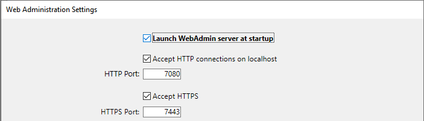
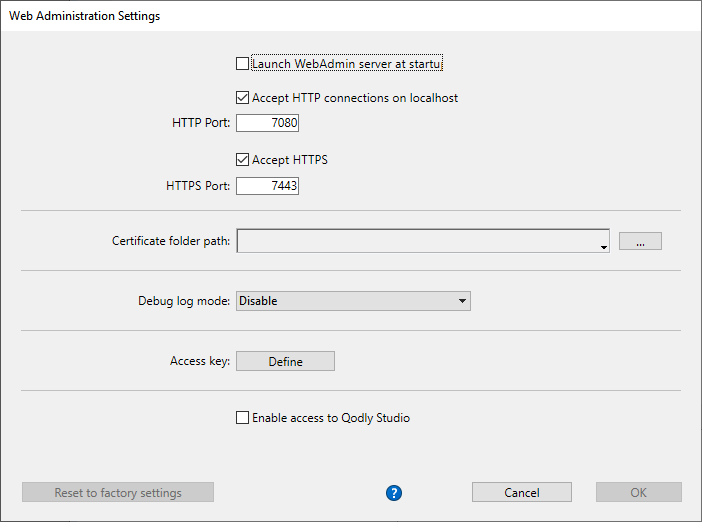

An embedded web server component, named `WebAdmin`, is used by 4D and 4D Server to provide a secured web access to specific features:

- REST accesses to the project 
- the [Data Explorer](dataExplorer.md)
- the [Qodly Studio preview rendering](https://developer.4d.com/qodly/4DQodlyPro/rendering#preview-in-qodly-studio)

You can connect locally or remotely to this web server from a browser or any web application and access the associated 4D application. 

The Web Administration Server handles the authentication of users with `WebAdmin` privileges, so that they can open administration sessions and access dedicated interfaces. 

This feature can be used in 4D applications running headless as well as 4D applications running with interfaces.


## Starting the Web Administration Server

By default, the Web Administration Server web server is not launched. You need to configure the launch at startup, or (in versions with interface) launch it manually using a menu item. 


### Launch at startup

You can configure the Web Administration Server to be launched at 4D or 4D Server application startup (before any project is loaded).  

- If you use a 4D application with interface, select the **File > Web Administration > Settings...** menu item. 


Check the **Launch WebAdmin server at startup** option in the settings dialog box:



- Whether you use 4D application which is headless or not, you can enable the automatic startup mode using the following *Command Line Interface* argument:


```
open ~/Desktop/4D.app --webadmin-auto-start true
```

> If the TCP port used by the Web Administration Server ([HTTPS](#https-port) or [HTTP](#http-port), depending on the settings) is not free at startup, 4D will try successively the 20 following ports, and use the first one that is available. If no port is available, the web server is not launched and an error is displayed or (headless application) logged in the console. 


### Start and stop

If you use a 4D application with interface, you can start or stop the Web Administration Server for your project at any moment:

Select the **File > Web Administration > Start Server** menu item.


The menu item becomes **Stop Server** when the server is launched; select **Stop Server** to stop the Web Administration Server.


## Settings {#settings}

Configuring the Web Administration Server is mandatory in particular to define the [**access key**](#access-key). By default when the access key is not set, access via a URL is not allowed. 

You can configure the Web Administration Server using the [Web Administration settings dialog box](#settings-dialog-box) (see below). 

> If you use a headless 4D application, you can use [*Command Line Interface* arguments](#webadmin-headless-configuration) to define basic settings. You will have to customize the settings file to define advanced parameters. 


### Settings dialog box

To open the Web Administration settings dialog box, select the **File > Web Administration > Settings...** menu item.


The following dialog box is displayed:



#### Launch WebAdmin server at startup

Check this option if you want the Web Administration Server to be automatically launched when the 4D or 4D Server application starts ([see above](#launch-at-startup)). By default, this option is not checked.

#### Accept HTTP connections on localhost

When this option is checked, you will be able to connect to the Web Administration Server through HTTP on the same machine as the 4D application. By default, this option is checked.

:::note Notes

- Connections with HTTP other than localhost are never accepted.
- Even if this option is checked, when [Accept HTTPS](#accept-https) is checked and the TLS configuration is valid, localhost connections use HTTPS.

:::


#### HTTP Port 

Port number to use for connections through HTTP to the Web Administration Server when the **Accept HTTP connections on localhost** option is checked. Default value is 7080. 


#### Accept HTTPS

When this option is checked, you will be able to connect to the Web Administration Server through HTTPS. By default, this option is checked. 

#### HTTPS Port 

Port number to use for connections through HTTPS to the Web Administration Server when the **Accept HTTPS** option is checked. Default value is 7443.


#### Certificate folder path

Path of the folder where the TLS certificate files are located. By default, the certificate folder path is empty and 4D or 4D Server uses the certificate files embedded in the 4D application (custom certificates must be stored next to the project folder). 

#### Debug log mode

Status or format of the HTTP request log file (HTTPDebugLog_*nn*.txt, stored in the "Logs" folder of the application -- *nn* is the file number). The following options are available:

- **Disable** (default)
- **With all body parts** - enabled with body parts in response and request
- **Without body parts** - enabled without body parts (body size is provided)
- **With request body** - enabled with body part in request only
- **With response body** - enabled with body part in response only

#### Access Key

Defining an access key is mandatory to unlock access to the Web Administration Server through a URL (access via a 4D menu command does not require an access key). When no access key is defined, no web client is allowed to connect through a URL to a web administration interface like the [Data Explorer page](dataExplorer.md). An error page is returned in case of connection request: 


An access key is similar to a password but not associated to a login. 

- To define a new access key: click the **Define** button, enter the access key string in the dialog box and click **OK**. The button label becomes **Modify**.
- To modify the access key: click the **Modify** button, enter the new access key string in the dialog box and click **OK**.
- To delete the access key: click the **Modify** button, let the access key area empty and click **OK**.

#### Enable access to Qodly Studio

:::note

This option only appears if the Qodly Studio license is activated.

::: 

This option enables user access to [Qodly Studio](../WebServer/qodly-studio.md) at the 4D application level. Note that you also need to [enable the access at every project level](../settings/web.md#enable-access-to-qodly-studio).

:::note

This option is automatically checked if you used the [One-click configuration dialog box](https://developer.4d.com/qodly/4DQodlyPro/gettingStarted#one-click-configuration). 

:::


## Headless Configuration

All [Web Administration Server settings](#settings) are stored in the `WebAdmin.4DSettings` file. There is one default `WebAdmin.4DSettings` file per 4D and 4D Server application, so that it is possible to deploy multiple applications on the same host machine.

When running a 4D or 4D Server application headless, you can set and use the default `WebAdmin.4DSettings` file, or designate a custom `.4DSettings` file. 

To set the file contents, you can use the [WebAdmin settings dialog](#settings-dialog-box) of the 4D application with interface and run it headless afterwards. The default `WebAdmin.4DSettings` file is then used.  

Or, you can set a custom `.4DSettings` file (xml format) and use it instead of the default file. Several dedicated arguments are available in the [Command line interface](cli.md) to support this feature.  

> The access key is not stored in clear in the `.4DSettings` file. 

Example:

```
"%HOMEPATH%\Desktop\4D Server.exe" MyApp.4DLink --webadmin-access-key 
	"my Fabulous AccessKey" --webadmin-auto-start true   
	--webadmin-store-settings

```


## Authentication

When a web page controlled by the Web Administration Server is accessed by entering a URL and without prior identification, an authentication is required. The user must enter the [access key](#access-key) in an authentication dialog box:


If the access key was not defined in the Web Administration Server settings, no access via URL is possible (a specific message is displayed). 

When a web page controlled by the Web Administration Server page is accessed directly from a 4D or 4D Server menu item (such as **Records > Data Explorer** or **Window > Data Explorer** (4D Server)), access is granted without authentication, the user is automatically authenticated. 

:::note

Once the access is granted, a [web session](WebServer/sessions.md) with a specific "WebAdmin" privilege is created by the Web Administration Server. This privilege provides an open access to all data through web processes, as soon as no [specific permissions are applied to resources](../ORDA/privileges.md). 

:::

