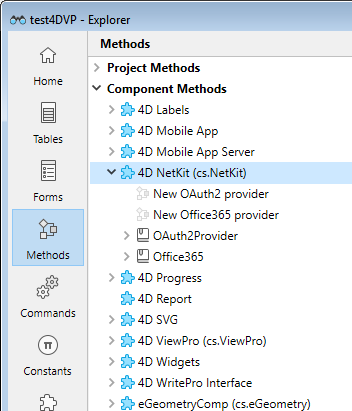

A 4D component is a set of 4D code and forms representing one or more functionalities that you can install and use in your projects. For example, the [4D SVG component](https://github.com/4d/4D-SVG) adds advanced commands and an integrated rendering engine that can be used to display SVG files.

## Installing components

Installation and loading of components in your 4D projects are handled through the [4D Dependency manager](../Project/components.md). 

Several components are [developed by 4D](../Extensions/overview.md#components-developed-by-4d), but a lot of 4D components from the 4D community [can be found on GitHub](https://github.com/topics/4d-component). Additionnally, you can [develop your own 4D components](../Extensions/develop-components.md).

## Using components

Exposed component code (methods and functions) as well as forms can be used as standard elements in your 4D development.

When an installed component contains methods, classes, and functions, they appear in the **Component Methods** theme of the Explorer's Methods page:

:::note

If the component is compiled, its [namespace](../Extensions/develop-components.md#declaring-the-component-namespace) is written between parentheses after its name. Use this namespace to access the component's functions.

:::

You can select a component [project method](methods.md) or [class](classes.md) and click on the **Documentation** button of the Explorer to get information about it, [if any](Project/documentation.md).

:::note

Interpreted component code can be [edited directly from the host project](../Extensions/develop-components.md#editing-components-from-the-host) if the context is supported. 

:::