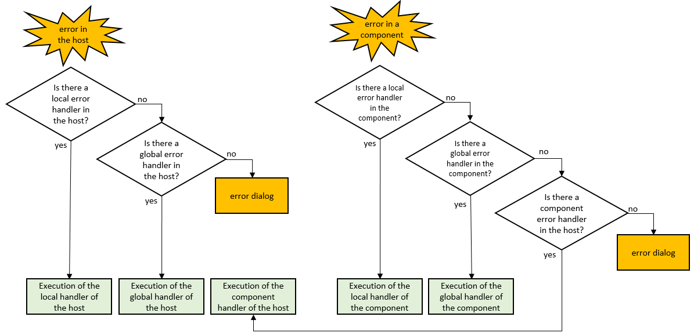

Error handling is the process of anticipating and responding to errors that might occur in your application. 4D provides a comprehensive support for catching and reporting errors at runtime, as well as for investigating their conditions. 

Error handling meets two main needs:

- finding out and fixing potential errors and bugs in your code during the development phase,
- catching and recovering from unexpected errors in deployed applications; in particular, you can replace system error dialogs (disk full, missing file, etc.) with you own interface. 

Basically, there are two ways to handle errors in 4D. You can:

- [install an error-handling method](#installing-an-error-handling-method), or
- use a [`Try()` keyword](#tryexpression) or a [`Try/Catch` structure](#trycatchend-try) before pieces of code that call a function, method, or expression that can throw an error.

:::tip Good practice

It is highly recommended to install a global error-handling method on 4D Server, for all code running on the server. When 4D Server is not running [headless](../Admin/cli.md) (i.e. launched with its [administration window](../ServerWindow/overview.md)), this method would avoid unexpected dialog boxes to be displayed on the server machine. In headless mode, errors are logged in the [4DDebugLog file](../Debugging/debugLogFiles.md#4ddebuglogtxt-standard) for further analysis. 

:::


## Error or status

Many 4D class functions, such as `entity.save()` or `transporter.send()`, return a *status* object. This object is used to store "predictable" errors in the runtime context, e.g. invalid password, locked entity, etc., that do not stop program execution. This category of errors can be handled by regular code.

Other "unpredictable" errors include disk write error, network failure, or in general any unexpected interruption. This category of errors generates exceptions and needs to be handled through an error-handling method or a `Try()` keyword.  


## Installing an error-handling method

In 4D, all errors can be caught and handled by specific project methods, named **error-handling** (or **error-catching**) methods. 

Once installed, error handlers are automatically called in interpreted or compiled mode in case of error in the 4D application or one of its components. A different error handler can be called depending on the execution context (see below).  

To *install* an error-handling project method, you just need to call the [`ON ERR CALL`](https://doc.4d.com/4dv19/help/command/en/page155.html) command with the project method name and (optionnally) scope as parameters. For example:

```4d
ON ERR CALL("IO_Errors";ek local) //Installs a local error-handling method
```

To stop catching errors for an execution context and give back hand, call `ON ERR CALL` with an empty string:

```4d
ON ERR CALL("";ek local) //gives back control for the local process
```

The  [`Method called on error`](https://doc.4d.com/4dv20/help/command/en/page704.html) command allows you to know the name of the method installed by `ON ERR CALL` for the current process. It is particularly useful in the context of generic code because it enables you to temporarily change and then restore the error-catching method:

```4d
 $methCurrent:=Method called on error(ek local)
 ON ERR CALL("NewMethod";ek local)
  //If the document cannot be opened, an error is generated
 $ref:=Open document("MyDocument")
  //Reinstallation of previous method
 ON ERR CALL($methCurrent;ek local)

```

### Scope and components

An error-handling method can be set for different execution contexts:

- for the **current process**- a local error handler will be only called for errors that occurred in the current process of the current project,
- for the **whole application**- a global error handler will be called for all errors that occurred in the application execution context of the current project,
- from the **components**- this error handler is defined in a host project and will be called for all errors that occurred in the components when they were not already caught by a component handler.

Examples:

```4d
ON ERR CALL("IO_Errors";ek local) //Installs a local error-handling method
ON ERR CALL("globalHandler";ek global) //Installs a global error-handling method
ON ERR CALL("componentHandler";ek errors from components) //Installs an error-handling method for components
```

You can install a global error handler that will serve as "fallback" and specific local error handlers for certain processes. A global error handler is also useful on the server to avoid error dialogs on the server when run with interface.

You can define a single error-catching method for the whole application or different methods per application module. However, only one method can be installed per execution context and per project.

When an error occurs, only one method is called, as described in the following diagram:




### Handling errors within the method

Within a custom error method, you have access to several pieces of information that will help you identifying the error:

- dedicated system variables:

  - `Error` (longint): error code
  - `Error method` (text): name of the method that triggered the error
  - `Error line` (longint): line number in the method that triggered the error
  - `Error formula` (text): formula of the 4D code (raw text) which is at the origin of the error. 
  
:::info

4D automatically maintains a number of variables called [**system variables**](variables.md#system-variables), meeting different needs. 
:::

- the [`Last errors`](https://doc.4d.com/4dv19/help/command/en/page1799.html) command that returns a collection of the current stack of errors that occurred in the 4D application. You can also use the [`Last errors`](https://doc.4d.com/4dv19/help/command/en/page1015.html) command that returns the same information as arrays.
- the `Call chain` command that returns a collection of objects describing each step of the method call chain within the current process. 


#### Example

Here is a simple error-handling system:

```4d
//installing the error handling method
 ON ERR CALL("errorMethod")
 //... executing code
 ON ERR CALL("") //giving control back to 4D
```

```4d
// errorMethod project method
 If(Error#1006) //this is not a user interruption
    ALERT("The error "+String(Error)+" occurred". The code in question is: \""+Error formula+"\"")
 End if
```

### Using an empty error-handling method

If you mainly want the standard error dialog box to be hidden, you can install an empty error-handling method. The `Error` system variable can be tested in any method, i.e. outside of the error-handling method:

```4d
ON ERR CALL("emptyMethod") //emptyMethod exists but is empty
$doc:=Open document( "myFile.txt")
If (Error=-43)
	ALERT("File not found.")
End if
ON ERR CALL("")
```


## Try(expression)

The `Try(expression)` statement allows you to test a single-line expression in its actual execution context (including, in particular, local variable values) and to intercept errors it throws so that the 4D error dialog box is not displayed. Using `Try(expression)` provides an easy way to handle simple error cases with a very low number of code lines, and without requiring an error-handling method. 

:::note

If you want to try a more complex code than a single-line expression, you might consider using a [`Try/Catch` structure](#trycatchend-try). 

:::

The formal syntax of the `Try(expression)` statement is:

```4d

Try (expression) : any | Undefined

```

*expression* can be any valid expression. 

If an error occurred during its execution, it is intercepted and no error dialog is displayed, whether an [error-handling method](#installing-an-error-handling-method) was installed or not before the call to `Try()`. If *expression* returns a value, `Try()` returns the last evaluated value, otherwise it returns `Undefined`. 

You can handle the error(s) using the [`Last errors`](https://doc.4d.com/4dv20/help/command/en/page1799.html) command. If *expression* throws an error within a stack of `Try()` calls, the execution flow stops and returns to the latest executed `Try()` (the first found back in the call stack). 
 
:::note

If an [error-handling method](#installing-an-error-handling-method) is installed by *expression*, it is called in case of error. 

:::


### Examples

1. You want to display the contents of a file if the file can be open without error, and if its contents can be read. You can write:

```4d
var $text : Text
var $file : 4D.File := File("/RESOURCES/myFile.txt")
var $fileHandle : 4D.FileHandle := Try($file.open())
If ($fileHandle # Null)
  $text:=Try($fileHandle.readText()) || "Error reading the file"
End if
```


2. You want to handle the divide by zero error. In this case, you want to return 0 and throw an error:

```4d
function divide( $p1: real; $p2: real)-> $result: real
  if ($p2=0)
     $result:=0 //only for clarity (0 is the default for reals)
     throw(-12345; "Division by zero")
  else
    $result:=$p1/$p2
  end if

function test()
  $result:=Try(divide($p1;$p2))
  If (Last errors # null)
    ALERT("Error")
  End if

```

3. You want to handle both [predictable and non-predictable](#error-or-status) errors:

```4d
var $e:=ds.Employee.new()
$e.name:="Smith"
$status:=Try($e.save()) //catch predictable and non-predictable errors
If ($status.success)
   ALERT( "Success")
Else
   ALERT( "Error: "+JSON Stringify($status.errors))
End if

``` 


## Try...Catch...End try

The `Try...Catch...End try` structure allows you to test a block code in its actual execution context (including, in particular, local variable values) and to intercept errors it throws so that the 4D error dialog box is not displayed.

Unlike the `Try(expression)` keyword that evaluates a single-line expression, the `Try...Catch...End try` structure allows you to evaluate any code block, from the most simple to the most complex, without requiring an error-handling method. In addition, the `Catch` block can be used to handle the error in any custom way. 


The formal syntax of the `Try...Catch...End try` structure is:

```4d

Try 
	statement(s) // Code to evaluate
Catch
	statement(s) // Code to execute in case of error
End try

```

The code placed between the `Try` and the `Catch` keywords is first executed, then the flow depends on the error(s) encountered during this execution. 

- If no error is thrown, the code execution continues after the corresponding `End try` keyword. The code placed between the `Catch` and the `End try` keywords is not executed.
- If the code block execution throws a *non-deferred error*, the execution flow stops and executes the corresponding `Catch` code block. 
- If the code block calls a method that throws a *deferred error*, the execution flow jumps directly to the corresponding `Catch` code block.
- If a deferred error is directly thrown from the `Try` block, the execution flow continues until the end of the `Try` block and does not execute the corresponding `Catch` block.

:::note

If a *deferred* error is thrown outside of the `Try` block, the code execution continues until the end of the method or function. 

:::

:::info

For more information on *deferred* and *non-deferred* errors, please refer to the [`throw`](https://doc.4d.com/4dv20R/help/command/en/page1805.html) command description.

:::


In the `Catch` code block, you can handle the error(s) using standard error handling commands. The [`Last errors`](https://doc.4d.com/4dv20/help/command/en/page1799.html) function contains the last errors collection. You can [declare an error-handling method](#installing-an-error-handling-method) in this code block, in which case it is called in case of error (otherwise the 4D error dialog box is displayed).

:::note

If an [error-handling method](#installing-an-error-handling-method) is installed in the code placed between the `Try` and the `Catch` keywords, it is called in case of error. 

:::

### Example

Combining transactions and `Try...Catch...End try` structures allows writing secured code for critical features. 

```4d
Function createInvoice($customer : cs.customerEntity; $items : Collection; $invoiceRef : Text) : cs.invoiceEntity
	var $newInvoice : cs.invoiceEntity
	var $newInvoiceLine : cs.invoiceLineEntity
	var $item : Object
	ds.startTransaction()
	Try
		$newInvoice:=This.new()
		$newInvoice.customer:=$customer
		$newInvoice.invoiceRef:=$invoiceRef
		For each ($item; $items)
			$newInvoiceLine:=ds.invoiceLine.new()
			$newInvoiceLine.item:=$item.item
			$newInvoiceLine.amount:=$item.amount
			$newInvoiceLine.invoice:=$newInvoice
			//call other specific functions to validate invoiceline
			$newInvoiceLine.save()
		End for each 
		$newInvoice.save()
		ds.validateTransaction()
	Catch
		ds.cancelTransaction()
		ds.logErrors(Last errors)
		$newInvoice:=Null
	End try
	return $newInvoice

```
