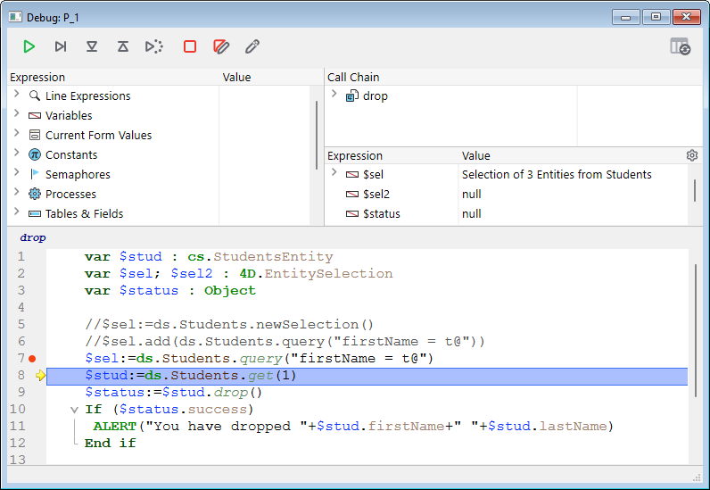
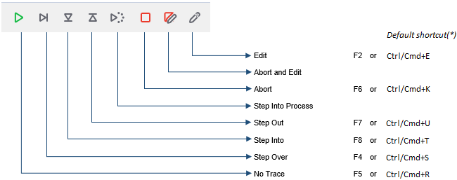
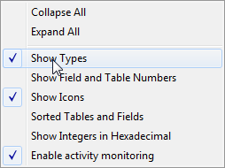
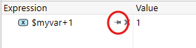
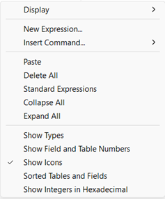

The debugger is useful when you need to spot errors or monitor the execution of methods. It allows you to step through your code slowly and examine the information. This process is called "tracing".



## Calling the Debugger

There are multiple ways to get the Debugger to display:

* Clicking the **Trace** button in the [Syntax Error window](basics.md#syntax-error-window)
* Using the [`TRACE`](../commands-legacy/trace.md) command
* Clicking the **Debug** button in the Execute Method window or selecting **Run and debug...** button in the Code Editor
* Using **Alt+Shift+Right click** (Windows) or **Ctrl+Option+Cmd+Click** (macOS) while a method is executing, then selecting the process to trace in the pop-up menu:


* Clicking the **Trace** button when a process is selected in the Process page of the Runtime Explorer.
* Adding a break point in the Code Editor window or in the Break and Catch pages of the Runtime Explorer.

When called, the debugger window provides the name of the method or class function you're currently tracing, and the action causing the initial appearance of the Debugger window. For example, in the above debugger window:

* *drop* is the method being traced
* The debugger window appeared because of a break point. 

Displaying a new debugger window uses the same configuration as the last window displayed in the same session. If you run several user processes, you can trace them independently and have one debugger window open for each process.

The Debugger window is usually displayed on the machine where the code is executed. With a single-user application, it is always displayed on the machine running the application. With a client/server application, it is displayed:

* on the remote 4D for code running locally
* on the server machine for code running on the server (for example, a method with the **execute on server** option).

:::note Notes

- If the server is running headless, no debugger window can be displayed on the server, you need to use the remote debugger. See [Debugging from remote machines](./debugging-remote.md).
- You can also [attach the Qodly Studio debugger to a 4D Server application](../WebServer/qodly-studio.md#using-qodly-debugger-on-4d-server) if you need to debug Qodly pages in a deployed environment.

:::

## Tool bar Buttons

The debugger's tool bar includes several buttons, associated with default shortcuts:



:::note

Default shortcuts can be customized in the [Shortcuts Page](../Preferences/shortcuts.md) of the Preferences dialog box.

:::

#### No Trace

Tracing stops and normal method execution resumes.

> **Shift** + **F5** or **Shift** + clicking the **No Trace** button resumes execution. It also disables all the subsequent TRACE calls for the current process.

#### Step Over

Executes the current method line, indicated by the program counter (the yellow arrow). The Debugger steps to the next line.

The Step Over button does not step into subroutines and functions, it stays at the level of the method you're currently tracing. If you want to also trace subroutines and functions calls, use the **Step Into** button.

In remote debugging, if the method executes on the server, the parent method is called after the last line of the child method executes. If the parent method is executed on the remote side, the **Step Over** button has the same effect as the **No Trace** button.

#### Step Into

When a line that calls another method (subroutine or function) is executed, click this button to display the the other method and step through it.

The new method becomes the current (top) method in the [Call Chain Pane](#call-chain-pane) of the Debugger window.

When executing a line that does not call another method, this button has the same effect as the **Step Over** button.


#### Step Out

If you are tracing subroutines and functions, clicking on this button allows you to execute the entire method currently being traced and to step back to the caller method. The Debugger window is brought back to the previous method in the call chain. If the current method is the last method in the call chain, the Debugger window is closed.

In remote debugging, on execution of the last line of the method, if the method is executed on the server, the parent method is called. If the parent method is executed on the remote side, the button acts in the same manner as the No Trace button.

#### Step Into Process

On execution of a line that creates a new process (i.e., calling the New process command), this button opens a new Debugger window that allows you to trace the process method of the newly created process. On execution of a line that does not creates a new process, this button acts in the same manner as the Step Over button.


#### Abort

Stops method execution, and returns to the state before the method started executing:

* When tracing a form or object method executing in response to an event: Stops and returns to the form.
* When tracing a method executing from within the Application environment: Stops and returns to the environment.

#### Abort and Edit

The method that is executing when you click the **Abort and Edit** button opens in the Code Editor.

>**Tip**: Use this button when you know which changes are required in your code, and when these changes are required to pursue the testing of your methods. After you're finished with the changes, rerun the method.

#### Edit

The method that is executing at the time you click the Edit button opens in the Code Editor.

If you use this button to modify a method, the modifications are only effective the next time it executes.

> **Tip:** Use this button when you know which changes are required in your code and when they don't interfere with the rest of the code to be executed or traced.

## Saving configuration  

The configuration of the debugger window is automatically saved in the project. This includes:

- expressions currently displayed in the custom watch pane expressions. By default, expressions are saved with the current method or function. You can also [pin an expression](#pin-an-expression) to display it in all contexts. 
- the size and position of the window,
- the position of the division lines.

These parameters are stored .

This action is not available in remote debugging mode (see [Debugging from Remote Machines](./debugging-remote)).


The **Default size settings** button restores the default position and size of the window (including the window itself and the division lines). 


## Watch Pane

The **Watch pane** is displayed in the top left corner of the Debugger window, below the Execution Control Tool Bar. Here is an example:


> This pane is not available in remote debugging mode.

The **Watch Pane** displays useful general information about the system, the 4D environment, and the execution environment.

The **Expression** column displays the names of the objects and expressions. The **Value** column displays their current corresponding values. Clicking on any value on the right side of the pane allows you to modify the value of the object, if this is permitted for that object.

At any point, you can drag and drop themes, theme sublists (if any), and theme items to the [Custom Watch Pane](#custom-watch-pane).

### Expression list

#### Line Expressions

This theme lets you keep track of the values of expressions:

* used in the line of code to be executed (the one marked with the program counter—the yellow arrow in the [Source Code Pane](#source-code-pane)),
* used in the previous line of code

Since the previous line of code is the one that was just executed before, this theme therefore shows the objects or expressions of the current line before and after that the line was executed.  Let's say you execute the following method:

```4d
TRACE
$a:=1
$b:=a+1
$c:=a+b
```

1. A Debugger window opens with the program counter set to the line with `a:=1`. At this point the **Line Objects** theme displays:

    |$a|Undefined|
    |---|---|

    The `$a` variable is not yet initialized, but it is displayed because it is used in the line to be executed.

2. You click the **Step Over** button. The program counter is now set to the line `b:=a+1`. At this point, the **Line Objects** theme displays:

    |$a|1|
    |---|---|
    |$b|Undefined|

    The value of the `$a` variable is now 1. The `$b` variable is not yet initialized, but it is displayed because it is used in the line to be executed.

3. You click the **Step Over** button again. The program counter is now set on the line with $c:=a+b. the **Line Objects** theme displays:

    |$c|Undefined|
    |---|---|
    |$a|1|
    |$b|2|

    The value of the `$b` variable is now 2. The `$c` variable is not yet initialized, but it is displayed because it is used in the line to be executed.

#### Variables

This theme is composed of the following subthemes:

|Subtheme|Description|Can the values be modified?
|---|---|---|
|Interprocess|List of interprocess variables being used at this point|Yes|
|Process|List of process variables used by the current process|Yes|
|Local|List of local variables used by the method being traced|Yes|
|Parameters|List of parameters received by the method|Yes|
|Self| Pointer to the current object, when tracing an Object Method|No|

Arrays, like other variables, appear in the Interprocess, Process, and Local subthemes, depending on their scope. The debugger displays the first 100 elements. Inside the **Value** column, you can modify the values of array elements, but not the size of the arrays.

To display the variable types and their internal names, right click and check the **Show Types** option in the context menu:



Here's the result:


#### Current Form Values

This theme contains the name of each dynamic object included in the current form, as well as the value of its associated variable:


Some objects, such as list box arrays, can be presented as two distinct objects, the variable of the object itself and its data source.

#### Constants  

Like the Constants page of the Explorer window, this theme displays predefined constants provided by 4D. The expressions from this theme cannot be modified.

#### Semaphores  

This theme lists the local semaphores currently being set. For each semaphore, the Value column provides the name of the process that sets the semaphore. The expressions from this theme cannot be modified. Global semaphores are not displayed.

#### Processes

This theme lists the processes started since the beginning of the working session. The value column displays the time used and the current state for each process (i.e., Executing, Paused, and so on). The expressions from this theme cannot be modified.

#### Tables and Fields  

This theme lists the tables and fields in the 4D database. For each Table item, the Value column displays the size of the current selection for the current process as well as the number of **locked records**.

For each Field item, the Value column displays the value of the field for the current record (except picture and BLOB). You can modify the field values but not the the tables' information.

#### Sets

This theme lists the sets defined in the current process (the one you're currently tracing) and the interprocess sets. For each set, the Value column displays the number of records and the table name. The expressions from this theme cannot be modified.

#### Named Selections  

This theme lists the named selections that are defined in the current process (the one you’re currently tracing); it also lists the interprocess named selections. For each named selection, the Value column displays the number of records and the table name. The expressions from this theme cannot be modified.

#### Information  

This theme contains general information regarding database operation, such as the current default table (if one exists), physical, virtual, free and used memory space, query destination, etc.

#### Web  

This theme displays information regarding the main Web server of the application (only available if the Web server is active):

* Web File To Send: name of Web file waiting to be sent (if any)
* Web Cache Usage: number of pages present in Web cache as well as its use percentage
* Web Server Elapsed Time: duration of Web server use in hours:minutes:seconds format
* Web Hits Count: total number of HTTP requests received since Web server launch, as well as the instantaneous number of requests per second
* Number of active Web processes: number of active Web processes, all Web processes together

The expressions contained within this theme cannot be modified.

### Contextual Menu

Additional options are available from the contextual menu of the Watch pane.


* **Collapse All**: Collapses all levels of the hierarchical list.
* **Expand All**: Expand all levels of the hierarchical list.
* **Show Types**: Displays the type of each item (when appropriate).
* **Show Field and Table Numbers**: Displays the number of each table or field. Useful if you work with table or field numbers, or with pointers using commands such as `Table` or `Field`.
* **Show Icons**: Displays an icon denoting the object type for each object. You can turn this option off in order to speed up the display, or just because you prefer to use only the **Show Types** option.
* **Sorted Tables and Fields**: Sorts the tables and fields in alphabetical order within their respective lists.
* **Show Integers in Hexadecimal**: Numbers are usually displayed in decimal notation. This option displays them in hexadecimal notation. Note: To enter a numeric value in hexadecimal, type 0x (zero + "x"), followed by the hexadecimal digits.
* **Enable activity monitoring**: Activates the monitoring of activity (advanced checking of internal activity of the application) and displays the information retrieved in the additional themes: **Scheduler**, **Web** and **Network**.

## Call Chain Pane

A method may call other methods or class functions, which may call other methods or functions. The Call Chain pane lets you keep track of that hierarchy.


Each main level item is the name of a method or class function. The top item is the one you are currently tracing, the next main level item is the name of the caller (the method or function that called the one you are currently tracing), the next one is the caller's caller, and so on.

In the image above:

* `thirdMethod` has not received any parameter
* `$0` is currently undefined, as the method did not assign any value to `$0` (because it has not executed this assignment yet or because the method is a subroutine and not a function)
* `secondMethod` has received three parameters from `firstMethod`:
  * $1 is a pointer to the `[Employee]` table
  * $2 is a pointer to the `ID` field in the  `[Employee]` table
  * $3 is an alphanumeric parameter whose value is "Z"

You can double-click the name of any method to display its contents in the [Source Code Pane](#source-code-pane).

Clicking the icon next to a method or function name expands or collapses the parameters and the result (if any). Values appear on the right side of the pane. Clicking on any value on the right side allows you to change the value of any parameter or function result.

To display the parameter type, check the **Show types** option in the contextual menu:


After you deploy the list of parameters, you can drag and drop parameters and function results to the [Custom Watch Pane](#custom-watch-pane).

You can also use the [Call chain](https://doc.4d.com/4dv19/help/command/en/page1662.html) command to retrieve the call chain programmatically.

## Custom Watch Pane

The Custom Watch Pane is useful for evaluating expressions. It is similar to the [Watch Pane](#watch-pane), except here you decide which expressions are displayed. Any type of expression can be evaluated:

* variable
* object and object property
* field
* pointer
* calculation
* 4D command
* method
* and anything else that returns a value


You can evaluate any expression that can be shown in text form. This does not cover picture and BLOB fields or variables. To display BLOB contents, you can use BLOB commands, such as [BLOB to text](../commands-legacy/blob-to-text.md).

### Display mode

You select the display mode to be used for all debugger windows using the **Display** option of the Custom Watch pane's [contextual menu](#contextual-menu). 


The following options are available:

- **Local variables**: Displays and evaluates automatically local variables as soon as they are used in the source code. 
- **Line Expressions**: Displays and evaluates automatically the same contents as the [Line Expressions](#line-expressions) item of the Expression List. 
- **Expressions**: Only displays custom expressions that you have entered manually. Custom expressions have a specific blue icon .

:::note

Whatever the display mode, you can add custom expressions at any moment. 

:::


### Handling expressions

You can enter any expression to evaluate. A custom expression is only displayed in the current debugger window, except if you [pin it](#pin-an-expression). 

There are several ways to add expressions to the list:

* Drag and drop an object or expression from the Watch Pane or the Call Chain Pane
* Select an expression in the [Source Code pane](#source-code-pane) and press **ctrl+D**  (Windows) or **cmd+D** (macOS)
* Double-click somewhere in the empty space of the Custom Watch Pane (adds an expression with a placeholder name that you can edit)
* Select a [display option](#display-mode) that automatically inserts expressions. 
* Select [**New Expression...**] in the Custom Watch pane's [contextual menu](#contextual-menu) to add an expression using the **Formula Editor**.  

You can enter any formula that returns a result.

To edit an expression, click on it to select it, then click again or press **Enter** on your keyboard.

To delete an expression, click on it to select it, then press **Backspace** or **Delete** on your keyboard.

:::warning

Be careful when you evaluate a 4D expression modifying the value of one of the System Variables (for instance, the OK variable) because the execution of the rest of the method may be altered.

:::

### Pin an expression

You can click on the pushpin icon to pin an expression. 



It will then be displayed in every debugger window. 

### Contextual Menu

The Custom Watch Pane’s menu is available on a contextual click or using the  icon:



- **Display**: Selects the [display mode](#display-mode) to be used for all debugger windows.
- **New Expression...**: Inserts a new expression and displays the 4D Formula Editor.

For more information on the Formula Editor, see the [4D Design Reference manual](https://doc.4d.com/4Dv20/4D/20.2/Description-of-formula-editor.300-6750169.en.html).

* **Insert Command... **: Displays a menu allowing to insert a 4D command as a new expression.
* **Delete All**: Removes all expressions from the Custom Watch Pane.
* **Standard Expressions**: Copies the Watch Pane's list of expressions as custom expressions.

> This option is not available in [remote debugging mode](debugging-remote.md).

* **Collapse All/Expand All**: Collapses or Expands all the hierarchical lists.
* **Show Types**: Displays the type of each item in the list (when appropriate).
* **Show Field and Table Numbers**: Displays the number of each table or field of the **Fields**. Useful if you work with tables, field numbers or pointers using the commands such as `Table` or `Field`.
* **Show Icons**: Displays an icon denoting the type of each item.
* **Sorted Tables and Fields**: Displays the table and fields in alphabetical order.
* **Show Integers in Hexadecimal**: Displays numbers using hexadecimal notation. To enter a numeric value in hexadecimal, type 0x (zero + "x"), followed by the hexadecimal digits.


## Source Code Pane

The Source Code Pane shows the source code of the method or function currently being traced.

This area also allows you to add or remove [**break points**](breakpoints.md).

### Tool tip

Hover your pointer over any expression to display a tool tip that indicates:

* the declared type of the expression
* the current value of the expression


This also works with selections:


### Adding expressions to the Custom Watch Pane

You can copy any selected expression from the Source Code Pane to the [Custom Watch Pane](#custom-watch-pane).

1. In the Source code pane, select the expression to evaluate
2. Do one of the following:
    * Drag and drop the selected text to the Expression area of the Custom Watch Pane
    * Press **Ctrl+D** (Windows) or **Cmd+D** (macOS)
    * Right-click the selected text **>** **Copy to Expression Pane**

### Program Counter

The yellow arrow in the left margin of the Source Code pane is called the program counter. It marks the next line to be executed.

By default, the program counter line (also called the running line) is highlighted in the debugger. You can customize the highlight color in the [Methods page of the Preferences](Preferences/methods.md).

#### Moving the program counter

For debugging purposes, you can move the program counter for the method at the top of the call chain (the method currently executing). To do so, click and drag the yellow arrow to another line.

This only tells the debugger to pursue tracing or executing from a different point. It does not execute lines or cancel their execution. All current settings, fields, variables, etc. are not impacted.

For example:

```4d
  // ...
 If(This condition)
    DO_SOMETHING
 Else
    DO_SOMETHING_ELSE
 End if
  // ...
```

Say the program counter is set to the line `If (This condition)`.
When you click the **Step over** button, the program counter moves directly to the `DO_SOMETHING_ELSE` line.
To examine the results of the `DO_SOMETHING` line, you can move the program counter to that line and execute it.

### Contextual menu

The contextual menu of the Source Code Pane provides access to several functions that are useful when executing methods in Trace mode:


* **Goto Definition**: Goes to where the selected object is defined. This command is available for:
  * *Project methods:* displays method contents in a new window of the Code Editor
  * *Fields:* Displays field properties in the inspector of the Structure window
  * *Tables:* Displays table properties in the inspector of the Structure window
  * *Forms:* Displays form in the Form editor
  * *Variables* (local, process, interprocess or $n parameter): displays the line in the current method or among the compiler methods where the variable is declared
* **Search References** (also available in Code Editor): Searches all project objects (methods and forms) in which the current element of the method is referenced. The current element is the one selected or the one where the cursor is located. This can be the name of a field, variable, command, string, and so on. Search results are displayed in a new standard results window.
* **Copy**: Standard copy of the selected expression to the pasteboard.
* **Copy to Expression Pane**: Copy the selected expression to the Custom Watch Pane.
* **Run to Cursor**:Executes statements found between the program counter and the selected line of the method (where the cursor is found).
* **Set Next Statement**:Moves program counter to the selected line without executing this line or any intermediate ones. The designated line is only run if the user clicks on one of the execution buttons.
* **Toggle Breakpoint** (also available in Code Editor): Alternately inserts or removes the breakpoint corresponding to the selected line. This modifies the breakpoint permanently: for instance, if you remove a breakpoint in the debugger, it no longer appears in the original method.
* **Edit Breakpoint** (also available in Code Editor): Displays the Breakpoint Properties dialog box. Any changes made modify the breakpoint permanently.

### Find Next/Previous  

Specific shortcuts allow you to find strings identical to the one selected:

* To search for the next identical strings, press **Ctrl+E** (Windows) or **Cmd+E** (macOS)
* To search for the previous identical strings, press **Ctrl+Shift+E** (Windows) or **Cmd+Shift+E** (macOS)

The search is carried out only if you select at least one character in the Source code pane.

## Shortcuts

This section lists all the shortcuts available in the debugger window.

> The tool bar also has [shortcuts](#tool-bar-buttons).

#### Watch Pane & Custom Watch Pane

* **Double-click** an item in the Watch Pane to copy it to the Custom Watch Pane
* **Double-Click** in the Custom Watch Pane to create a new expression

#### Source Code Pane

* Click in the left margin to set or remove break points.
* **Alt+Shift+Click** (Windows) or **Option+Shift+Click** (macOS) sets a temporary break point.
* **Alt-Click** (Windows) or **Option-Click** displays the Edit Break window for a new or existing break point.
* A selected expression or object can be copied to the Custom Watch Pane by simple drag and drop.
* **Ctrl+D** (Windows) or **Cmd+D** (macOS) key combinations copy the selected text to the Custom Watch Pane.
* **Ctrl+E** (Windows) or **Cmd+E** (macOS) key combinations find the next strings identical to the one selected.
* **Ctrl+Shift+E** (Windows) or **Cmd+Shift+E** (macOS) key combinations find the previous strings identical to the one selected.

#### All Panes

* **Ctrl** + **+/-** (Windows) or **Command** + **+/-** (macOS) increases or decreases the font size for a better readability. The modified font size is also applied to the Code Editor and is stored in the Preferences.
* **Ctrl + \*** (Windows) or **Command + \*** (macOS) forces the updating of the Watch Pane.
* When no item is selected in any pane, press **Enter** to step over.
* When an item value is selected, use the arrows keys to navigate through the list.
* When editing an item, use the arrow keys to move the cursor. Use Ctrl-A/X/C/V (Windows) or Command-A/X/C/V (macOS) as shortcuts to the Select All/Cut/Copy/Paste menu commands of the Edit menu.
