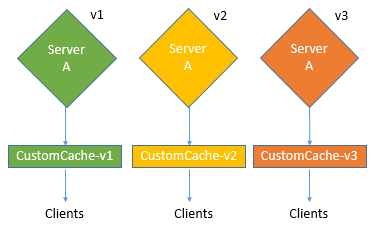
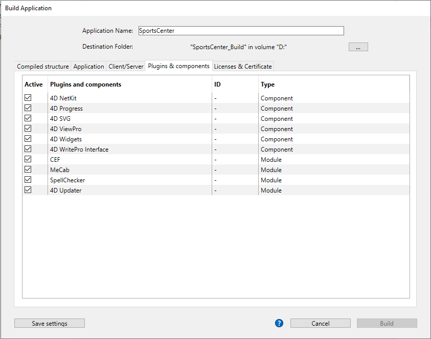

4D includes an application builder to create a project package (final build). This builder simplifies the finalization and deployment process for 4D compiled applications. It automatically handles the specific features of different operating systems and facilitates the deployment of client-server applications.

The application builder allows you to:

* Build a compiled structure or component, without interpreted code,
* Build a stand-alone, double-clickable application, *i.e.*, merged with 4D Volume Desktop, the 4D database engine,
* Build different applications from the same compiled structure via an XML project,
* Build homogeneous client-server applications,
* Build client-server applications with automatic updating of client and server parts.
* Save your build settings for future use (*Save settings* button).

> Compiled applications are based upon [.4dz files](#build-compiled-structure) that are **read-only**. Keep in mind that using commands or functions that modify the source files (such as `CREATE INDEX` or `CREATE TABLE` (SQL)) is not possible by default in compiled applications. However, you can build specific applications that support local modifications by using the `PackProject` XML key (see [doc.4d.com](https://doc.4d.com)).

## Overview

Building a project package can be carried out using:

* either the [`BUILD APPLICATION`](../commands-legacy/build-application.md) command,
* or the [Build Application dialog](#application-builder).

:::tip

You can also download and use [`Build4D`](https://github.com/4d-depot/Build4D), a component that provides classes to compile, build, and sign 4D projects, even from a headless application.

:::


### Build application dialog

To display the Build application dialog, select **Design** > **Build Application...** from the menu bar.


The Build Application dialog includes several pages that can be accessed using tabs:


Building can only be carried out once the project is compiled. If you select this command without having previously compiled the project, or if the compiled code does not correspond to the interpreted code, a warning dialog box appears indicating that the project must be (re)compiled.

### buildApp.4DSettings

Each build application parameter is stored as an XML key in the application project file named `buildApp.4DSettings` XML file, located in the [`Settings` folder of the project](../Project/architecture.md#settings-1).

Default parameters are used the first time the Build Application dialog box is used. The contents of the project file are updated, if necessary, when you click **Build** or **Save settings**. You can define several other XML settings file for the same project and employ them using the [`BUILD APPLICATION`](../commands-legacy/build-application.md) command.

XML keys provide additional options besides those displayed in the Build Application dialog box. The description of these keys are detailed in the [4D XML Keys BuildApplication](https://doc.4d.com/4Dv20/4D/20/4D-XML-Keys-BuildApplication.100-6335734.en.html) manual.

### Log file

When an application is built, 4D generates a log file named *BuildApp.log.xml* in the **Logs** folder of the project. The log file stores the following information for each build:

* The start and end of building of targets,
* The name and full access path of the files generated,
* The date and time of the build,
* Any errors that occurred,
* Any signing issues (e.g. a non-signed plug-in).

Checking this file may help you saving time during the subsequent deployment steps, for example if you intend to [notarize](#about-notarization) your application on macOS.

> Use the `Get 4D file(Build application log file)` statement to get the log file location.

## Application name and destination folder


Enter the name of the application in **Application Name**.

Specify the folder for the built application in **Destination Folder**. If the specified folder does not already exist, 4D will create a *Build* folder for you.

## Compiled structure page

This tab allows you to build a standard compiled structure file and/or a compiled component:


### Build compiled structure

Builds an application containing only compiled code.

This feature creates a *.4dz* file within a `Compiled Database/<project name>` folder. For example, if you have named your application "MyProject", 4D will create:

`<destination>/Compiled Database/MyProject/MyProject.4dz`

A .4dz file is essentially a zipped (packed) version of the project folder. .4dz files can be used by 4D Server, 4D Volume license (merged applications), and 4D. The compact and optimized size of .4dz files makes project packages easy to deploy.  

> When generating .4dz files, 4D uses a **standard** zip format by default. The advantage of this format is that it is easily readable by any unzip tool. If you do not want to use this standard format, add the `UseStandardZipFormat` XML key with value `False` in your [`buildApp.4DSettings`](#build-application-settings) file (for more information, see the [4D XML Keys BuildApplication](https://doc.4d.com/4Dv20/4D/20/4D-XML-Keys-BuildApplication.100-6335734.en.html) manual).

#### Include related folders

When you check this option, any folders related to the project are copied into the Build folder as *Components* and *Resources* folders. For more information about these folders, refer to the [description of project architecture](Project/architecture.md).

### Build component

Builds a compiled component from the structure.

A [component](../Extensions/develop-components.md) is a standard 4D project in which specific functionalities have been developed. Once the component has been configured and [installed in another 4D project](../Project/components.md#basics) (the host application project), its functionalities are accessible from the host project.

If you have named your application *MyComponent*, 4D will automatically create a *Components* folder with the following structure:

`<destination_folder>/Components/MyComponent.4dbase/Contents/`.

The *MyComponent.4dbase* folder is the [package folder of the compiled component](../Project/components.md).

The *Contents* folder contains:

* *MyComponent.4DZ* file - the [compiled structure](#build-compiled-structure).
* A *Resources* folder - any associated Resources are automatically copied into this folder. Any other components and/or plugins folders are not copied (a component cannot use plug-ins or other components).
* An *Info.plist* file - this file is required to build [notarizeable and stapleable](#about-notarization) components for macOS (it is ignored on Windows). It contains the following prefilled fields:
  - `CFBundleDisplayName` and `CFBundleName` for the application name,
  - `NSHumanReadableCopyright`, can be [set using an XML key](https://doc.4d.com/4Dv20/4D/20/CommonCopyright.300-6335859.en.html).
  - `CFBundleShortVersionString` and `CFBundleVersion` for the application version (x.x.x format, e.g. 1.0.5), can be [set using an XML key](https://doc.4d.com/4Dv20/4D/20/CommonVersion.300-6335858.en.html). 


## Application page

This tab allows you can build a stand-alone, single-user version of your application:


### Build stand-alone Application

Checking the **Build stand-alone Application** option and clicking **Build** will create a stand-alone (double-clickable) application directly from your application project.

The following elements are required for the build:

* 4D Volume Desktop (the 4D database engine),
* an [appropriate license](#licenses)

On Windows, this feature creates an executable file (.exe). On macOS, it handles the creation of software packages.

The principle consists of merging a compiled structure file with 4D Volume Desktop. The functionality provided by the 4D Volume Desktop file is linked with the product offer to which you have subscribed. For more information about this point, refer to the sales documentation and to the [4D Store](http://www.4d.com/).

You can define a default data file or allow users to [create and use their own data file](#management-of-data-files).

It is possible to [automate the update of merged single-user applications](#automatic-updating-of-server-or-single-user-applications) by means of a sequence of language commands.

#### 4D Volume Desktop Location

In order to build a stand-alone application, you must first designate the folder containing the 4D Volume Desktop file:

* *Windows* - the folder contains the 4D Volume Desktop.4DE, 4D Volume Desktop.RSR, as well as various files and folders required for its operation. These items must be placed at the same level as the selected folder.
* *macOS* - 4D Volume Desktop is provided in the form of a structured software package containing various generic files and folders.

To select the 4D Volume Desktop folder, click on the **[...]** button. A dialog box appears allowing you to designate the 4D Volume Desktop folder (Windows) or package (macOS).

Once the folder is selected, its complete pathname is displayed and, if it actually contains 4D Volume Desktop, the option for building an executable application is activated.

> The 4D Volume Desktop version number must match the 4D Developer Edition version number. For example, if you use 4D Developer v18, you must select a 4D Volume Desktop v18.

#### Data linking mode

This option lets you choose the linking mode between the merged application and the local data file. Two data linking modes are available:

* **By application name** (default) - The 4D application automatically opens the most recently opened data file corresponding to the structure file. This allows you to move the application package freely on the disk. This option should generally be used for merged applications, unless you specifically need to duplicate your application.

* **By application path** - The merged 4D application will parse the application's *lastDataPath.xml* file and try to open the data file with an "executablePath" attribute that matches the application's full path. If such an entry is found, its corresponding data file (defined through its "dataFilePath" attribute) is opened. Otherwise, the last opened data file is opened (default mode).

For more information about the data linking mode, refer to the [Last data file opened](#last-data-file-opened) section.

#### Generated files  

When you click on the **Build** button, 4D automatically creates a **Final Application** folder in the specified **Destination Folder**. Inside the Final Application folder is a subfolder with the name of the specified application in it.

If you have specified "MyProject" as the name of the application, you will find the following files in this subfolder (aka MyProject):

* *Windows*
  * MyProject.exe  - Your executable and a MyProject.rsr (the application resources)
  * 4D Extensions folder, Resources folder, various libraries (DLL), Native Components folder, SASL Plugins folder - Files necessary for the operation of the application
  * Database folder  - Includes a Resources folder and  MyProject.4DZ file. They make up the compiled structure of the project as well as the project Resources folder.
**Note**: This folder also contains the *Default Data* folder, if it has been defined (see [Data file management in final applications](#data-file-management-in-final-applicatons).
  * (Optional) Components folder and/or Plugins folder - Contains any components and/or plug-in files included in the project. For more information about this, refer to the [Plugins and components](#plugins-and-components) section.
  * Licenses folder - An XML file of license numbers integrated into the application. For more information about this, refer to the [Licenses & Certificate](#licenses-and-certificate) section.
  * Additional items added to the 4D Volume Desktop folder, if any (see [Customizing the 4D Volume Desktop folder](#customizing-4d-volume-desktop-folder)).

 All these items must be kept in the same folder in order for the executable to operate.

* *macOS*
  * A software package named MyProject.app containing your application and all the items necessary for its operation, including the plug-ins, components and licenses. For more information about integrating plug-ins and components, refer to the [Plugins and components](#plugins-and-components) section. For more information about integrating licenses, refer to the [Licenses & Certificate](#licenses-and-certificate) section. **Note**: In macOS, the [Application file](../commands-legacy/application-file.md) command of the 4D language returns the pathname of the ApplicationName file (located in the Contents:macOS folder of the software package) and not that of the .comp file (Contents:Resources folder of the software package).

#### Customizing 4D Volume Desktop folder

When building a stand-alone application, 4D copies the contents of the 4D Volume Desktop folder into Destination folder > *Final Application* folder. You're then able to customize the contents of the original 4D Volume Desktop folder according to your needs. You can, for example:

* Install a 4D Volume Desktop version corresponding to a specific language;
* Add a custom *PlugIns* folder;
* Customize the contents of the *Resources* folder.

>In macOS, 4D Volume Desktop is provided in the form of a software package. In order to modify it, you must first display its contents (**Control+click** on the icon).

#### Location of Web files  

If your stand-alone application is used as a Web server, the files and folders required by the server must be installed in specific locations. These items are the following:

* *cert.pem* and *key.pem* files (optional): These files are used for TLS connections and by data encryption commands,
* default Web root folder.

Items must be installed:  

* **on Windows**: in the *Final Application\MyProject\Database* subfolder.
* **on macOS**: next to the *MyProject.app* software package.

## Client/Server page

On this tab, you can build customized client-server applications that are homogenous, cross-platform and with an automatic update option.


### What is a Client/Server application?  

A client/server application comes from the combination of three items:

* A compiled 4D project,
* The 4D Server application,
* The 4D Volume Desktop application (macOS and/or Windows).

Once built, a client/server application is composed of two customized parts: the Server portion (unique) and the Client portion (to install on each client machine).

> If you want to deploy a client/server application in an heterogeneous environment (client applications running on Intel/AMD and Apple Silicon machines), it is recommended to [compile the project for all processors](Project/compiler.md#compilation-target) on a macOS machine, so that all client applications will run natively.

Also, the client/server application is customized and its handling simplified:

* To launch the server portion, the user simply double-clicks on the server application. The project file does not need to be selected.
* To launch the client portion, the user simply double-clicks the client application, which connects directly to the server application. You do not need to choose a server in a connection dialog box. The client targets the server either using its name, when the client and server are on the same sub-network, or using its IP address, which is set using the `IPAddress` XML key in the buildapp.4DSettings file. If the connection fails, [specific alternative mechanisms can be implemented](#management-of-client-connections). You can "force" the display of the standard connection dialog box by holding down the **Option** (macOS) or **Alt** (Windows) key while launching the client application.
Only the client portion can connect to the corresponding server portion. If a user tries to connect to the server portion using a standard 4D application, an error message is returned and connection is impossible.
* A client/server application can be set so that the client portion [can be updated automatically over the network](#copy-of-client-applications-in-the-server-application). You only need to create and distribute an initial version of the client application, subsequent updates are handled using the automatic update mechanism.
* It is also possible to automate the update of the server part through the use of a sequence of language commands ([SET UPDATE FOLDER](https://doc.4d.com/4dv19/help/command/en/page1291.html) and [RESTART 4D](https://doc.4d.com/4dv19/help/command/en/page1292.html).

### Build server application

Check this option to generate the server part of your application during the building phase. You must designate the location on your disk of the 4D Server application to be used. This 4D Server must correspond to the current platform (which will also be the platform of the server application).

#### 4D Server location

Click on the **[...]** button and use the *Browse for folder* dialog box to locate the 4D Server application. In macOS, you must select the 4D Server package directly.

#### Current version

Used to indicate the current version number for the application generated. You may then accept or reject connections by client applications according to their version number. The interval of compatibility for client and server applications is set using specific [XML keys](#buildapp4dsettings)).

#### Embed the project Users and Groups in built server application

**Preliminary Note:** The following terms are used in this section:

|Name| Definition |
| --- | --- |  
| Project directory file | [directory.json](../Users/handling_users_groups.md#directoryjson-file) file located in the [Settings folder](../Project/architecture.md#settings-1) of the project |
| Application directory file | [directory.json](../Users/handling_users_groups.md#directoryjson-file) file located in the [Settings folder](../Project/architecture.md#settings-1) of the built 4D Server |
| Data directory file | [directory.json](../Users/handling_users_groups.md#directoryjson-file) file in the [Data > Settings folder](../Project/architecture.md#settings) |

When you check this option, the project directory file is copied to the application directory file at build time.

When you execute a built 4D Server application:

* If the server has a data directory file, it is loaded.
* If the server does not have a data directory file, the application directory file is loaded.

The application directory file is read-only. Modifications made to users, groups and permissions during server execution are stored in the data directory file. If no data directory file already exists, it is automatically created. If the application directory file was embedded, it is duplicated as data directory file.

Embedding the project directory file allows you to deploy a client/server application with a basic security user and group configuration. Subsequent modifications are added to the data directory file.

#### Allow connection of Silicon Mac clients

When building a server on Windows, check this option to allow Apple Silicon clients to connect to your server application. You can then specify a path to the structure compiled for Apple Silicon/Intel.

To allow Apple Silicon clients to connect to a Server application built on Windows, you must first build a client application on macOS, with a project compiled for Apple Silicon and Intel. This automatically creates a compiled structure, identical to the one created with the **[Build compiled structure](#build-compiled-structure)** option (without the related folders).

Then, you can copy that structure to your Windows machine, and use it to build the server application:


#### Compiled structure location

Path to compiled structure of the Apple Silicon/Intel client application used to build a Windows Server (see [Allow connection of Silicon Mac clients](#allow-connection-of-silicon-mac-clients).

#### Data linking mode

This option lets you choose the linking mode between the merged application and the local data file. Two data linking modes are available:

* **By application name** (default) - The 4D application automatically opens the most recently opened data file corresponding to the structure file. This allows you to move the application package freely on the disk. This option should generally be used for merged applications, unless you specifically need to duplicate your application.

* **By application path** - The merged 4D application will parse the application's *lastDataPath.xml* file and try to open the data file with an "executablePath" attribute that matches the application's full path. If such an entry is found, its corresponding data file (defined through its "dataFilePath" attribute) is opened. Otherwise, the last opened data file is opened (default mode).

For more information about the data linking mode, refer to the [Last data file opened](#last-data-file-opened) section.

### Build client application

Checking this option generates the client part of your application during the building phase.

You can check this option:

* along with the [**Build server application**](#build-server-application) option to build matching server and client parts for the current platform and (optionally) include the automatic update archive files,
* without selecting the [**Build server application**](#build-server-application) option, usually to build the update archive file to be selected from the "concurrent" platform when building the server part.

#### 4D Volume Desktop Location

Designates the location on your disk of the 4D Volume Desktop application to be used to build the client part of your application.

> The 4D Volume Desktop version number must match the 4D Developer Edition version number. For example, if you use 4D v19, you must select a 4D Volume Desktop v19.

The 4D Volume Desktop must correspond to the current platform (which will also be the platform of the client application). If you want to build a client application for the "concurrent" platform, you must carry out an additional build operation using a 4D application running on that platform.

If you want the client application to connect to the server using a specific address (other than the server name published on the sub-network), you must use the `IPAddress` XML key in the buildapp.4DSettings file. For more information about this file, refer to the description of the [`BUILD APPLICATION`](../commands-legacy/build-application.md) command. You can also implement specific mechanisms in the event of a connection failure. The different scenarios proposed are described in the [Management of connections by client applications](#management-of-client-connections) paragraph.

#### Copy of client applications inside the server application

The options of this area set up the mechanism for updating the client part(s) of your client/server applications using the network each time a new version of the application is generated. These options are only enabled when the **Build client application** option is checked.

* **Allow automatic update of Windows client application** - Check this option to build a `.4darchive` file that can be sent to your client applications on the Windows platform in case of update.
* **Allow automatic update of Macintosh client application** - Check this option to build a `.4darchive` file that can be sent to your client applications on the Macintosh platform in case of update.

The `.4darchive` is copied at the following location:

```
<ApplicationName>_Build/Client Server executable/Upgrade4DClient/
```

#### Selecting client archive for the concurrent platform

You can check the **Allow automatic update...** option for client applications running on the concurrent platform. This option is only enabled if:

* the **Build server application** option is checked,
* the **Allow automatic update...** option for client applications running on the current platform is checked.

This feature requires that you click on the **[...]** button and designate the location on your disk of the file to use for the update. The file to select depends on the current server platform:

|Current server platform|Required file|Details|
|---|---|---|
|macOS|Windows 4D Volume Desktop *or* Windows client update archive|By default, you select the `4D Volume Desktop` application for Windows. To select a `.4darchive` file previously built on Windows, press **Shift** while clicking on [...]|
|Windows|macOS client update archive|Select a signed `.4darchive` file previously built on macOS|

You can build specific a `.4darchive` file on the concurrent platform by selecting only the [**Build client application**](#build-client-application) and the appropriate [**Allow automatic update...**](#copy-of-client-applications-inside-the-server-application) option.

#### Displaying update notification

The client application update notification is carried out automatically following the server application update.

It works as follows: when a new version of the client/server application is built using the application builder, the new client portion is copied as a compressed file in the **Upgrade4DClient** subfolder of the **ApplicationName** Server folder (in macOS, these folders are included in the server package). If you have followed the process for generating a cross-platform client application, a .*4darchive* update file is available for each platform:

To trigger client application update notifications, simply replace the old version of the server application with the new one and then execute it. The rest of the process is automatic.

On the client side, when the “old” client application tries to connect to the updated server application, a dialog box is displayed on the client machine, indicating that a new version is available. The user can either update their version or cancel the dialog box.

* If the user clicks **OK**, the new version is downloaded to the client machine over the network. Once the download is complete, the old client application is closed and the new version is launched and connects to the server. The old version of the application is then placed in the machine’s recycle bin.
* If the user clicks **Cancel**, the update is cancelled; if the old version of the client application is not in the range of versions accepted by the server (please refer to the following paragraph), the application is closed and connection is impossible. Otherwise (by default), the connection is established.

#### Forcing automatic updates  

In some cases, you may want to prevent client applications from being able to cancel the update download. For example, if you used a new version of the 4D Server source application, the new version of the client application must absolutely be installed on each client machine.

To force the update, simply exclude the current version number of client applications (X-1 and earlier) in the version number range compatible with the server application. In this case, the update mechanism will not allow non-updated client applications to connect. For example, if the new version of the client-server application is 6, you can stipulate that any client application with a version number lower than 6 will not be allowed to connect.

The [current version number](#current_version) is set on the Client/Server page of the Build Application dialog box. The intervals of authorized numbers are set in the application project using specific [XML keys](#buildapp4dsettings).

#### Update Error  

If 4D cannot carry out the update of the client application, the client machine displays the following error message: "The update of the client application failed. The application is now going to quit."

There are many possible causes for this error. When you get this message, it is advisable to check the following parameters first off:

* **Pathnames** - Check the validity of the pathnames set in the application project via the Application builder dialog box or via XML keys (for example *ClientMacFolderToWin*). More particularly, check the pathnames to the versions of 4D Volume Desktop.
* **Read/write privileges** - On the client machine, check that the current user has write access rights for the client application update.

### Generated files  

Once a client/server application is built, you will find a new folder in the destination folder named **Client Server executable**. This folder contains two subfolders, `<ApplicationName>Client` and `<ApplicationName>Server`.

>These folders are not generated if an error occurs. In this case, open the [log file](#log-file) in order to find out the cause of the error.

The `<ApplicationName>Client` folder contains the client portion of the application corresponding to the execution platform of the application builder. This folder must be installed on each client machine. The `<ApplicationName>Server` folder contains the server portion of the application.

The contents of these folders vary depending on the current platform:

* *Windows* - Each folder contains the application executable file, named `<ApplicationName>Client.exe` for the client part and `<ApplicationName>Server.exe` for the server part as well as the corresponding .rsr files. The folders also contain various files and folders necessary for the applications to work and customized items that may be in the original 4D Volume Desktop and 4D Server folders.
* *macOS* - Each folder contains only the application package, named `<ApplicationName> Client` for the client part and `<ApplicationName> Server` for the server part. Each package contains all the necessary items for the application to work. Under macOS, launch a package by double-clicking it.

 > The macOS packages built contain the same items as the Windows subfolders. You can display their contents (**Control+click** on the icon) in order to be able to modify them.

If you checked the “Allow automatic update of client application” option, an additional subfolder called *Upgrade4DClient* is added in the `<ApplicationName>Server` folder/package. This subfolder contains the client application in macOS and/or Windows format as a compressed file. This file is used during the automatic client application update.

#### Location of Web files  

If the server and/or client part of your double-clickable application is used as a Web server, the files and folders required by the server must be installed in specific locations. These items are the following:

* *cert.pem* and *key.pem* files (optional): These files are used for TLS connections and by data encryption commands,
* Default Web root folder (WebFolder).

Items must be installed:

* **on Windows**
  * **Server application** - in the `Client Server executable/<ApplicationName>Server/Server Database` subfolder.
  * **Client application** - in the `Client Server executable/<ApplicationName>Client` subfolder.

* **on macOS**
  * **Server application** - next to the `<ApplicationName>Server` software package.
  * **Client application** - next to the `<ApplicationName>Client` software package.

### Embedding a single-user client application

4D allows you to embed a compiled structure in the Client application. This feature can be used, for example, to provide users with a "portal" application, that gives access to different server applications thanks to the `OPEN DATABASE` command executing a `.4dlink` file.

To enable this feature, add the `DatabaseToEmbedInClientWinFolder` and/or `DatabaseToEmbedInClientMacFolder` keys in the *buildApp* settings file. When one of these keys is present, the client application building process generates a single-user application: the compiled structure, instead of the *EnginedServer.4Dlink* file, is placed in the "Database" folder.

* If a default data folder exists in the single-user application, a licence is embedded.
* If no default data folder exists in the single-user application, it will be executed without data file and without licence.

The basic scenario is:

1. In the Build application dialog box, select the "Build compiled structure" option to produce a .4DZ or .4DC for the application to be used in single-user mode.
2. In the *buildApp.4DSettings* file of the client-server application, use following xml key(s) to indicate the path to the folder containing the compiled single user application:

* `DatabaseToEmbedInClientWinFolder`
* `DatabaseToEmbedInClientMacFolder`

3. Build the client-server application. This will have following effects:

* the whole folder of the single user application is copied inside the "Database" folder of the merged client
* the *EnginedServer.4Dlink* file of the "Database" folder is not generated
* the .4DC, .4DZ, .4DIndy files of the single user application copy are renamed using the name of the merged client
* the `PublishName` key is not copied in the *info.plist* of the merged client
* if the single-user application does not have a "Default data" folder, the merged client will run with no data.

Automatic update 4D Server features ([Current version](#current-version) number, [`SET UPDATE FOLDER`](../commands-legacy/set-update-folder.md) command...) work with single-user application as with standard remote application. At connection, the single-user application compares its `CurrentVers` key to the 4D Server version range. If outside the range, the updated client application is downloaded from the server and the Updater launches the local update process.

### Customizing client and/or server cache folder names

Client and server cache folders are used to store shared elements such as resources or components. They are required to manage exchanges between server and remote clients. Client/server applications use default pathnames for both client and server system cache folders.

In some specific cases, you might need to customize the names of these folders to implement specific architectures (see below). 4D provides you with the `ClientServerSystemFolderName` and `ServerStructureFolderName` keys to be set in the *buildApp* settings file.

#### Client cache folder

Customizing the client-side cache folder name can be useful when your client application is used to connect to several merged servers which are similar but use different data sets. In this case, to save multiple unnecessary downloads of identical local resources, you can use the same custom local cache folder.

* Default configuration (*for each connection to a server, a specific cache folder is downloaded/updated*):


* Using the `ClientServerSystemFolderName` key (*a single cache folder is used for all servers*):


#### Server cache folder

Customizing the server-side cache folder name is useful when you run several identical server applications built with different 4D versions on the same computer. If you want each server to use its own set of resources, you need to customize the server cache folder.

* Default configuration (*same server applications share the same cache folder*):


* Using the `ServerStructureFolderName` key (*a dedicated cache folder is used for each server application*):



## Plugins & components page

On this tab, you set each [**plug-in**](Concepts/plug-ins.md), [**component**](../Project/components.md), and [**module**](#deselecting-modules) that you will use in your stand-alone or client/server application.

The page lists the elements loaded by the current 4D application:



* **Active** column - Indicates that the items will be integrated into the application package built. All the items are checked by default. To exclude a plug-in, a component, or a module, deselect the check box next to it.

* **Plugins and components** column - Displays the name of the plug-in/component/module.

* **ID** column - Displays the element's identification number (if any).

* **Type** column - Indicates the type of item: Plug-in, Component, or Module.

### Adding plug-ins or components

If you want to integrate other plug-ins or components into the executable application, you just need to place them in a **PlugIns** or **Components** folder next to the 4D Volume Desktop application or next to the 4D Server application. The mechanism for copying the contents of the source application folder (see [Customizing the 4D Volume Desktop folder](#customizing-4d-volume-desktop-folder)) can be used to integrate any type of file into the executable application.

If there is a conflict between two different versions of the same plug-in (one loaded by 4D and the other located in the source application folder), priority goes to the plug-in installed in the 4D Volume Desktop/4D Server folder. However, if there are two instances of the same component, the application will not open.

>The use of plug-ins and/or components in a deployment version may require license numbers.

### Deselecting modules

A module is a built-in code library used by 4D to control specific features. If you know that your built application does not use any of the features covered by a module, you can deselect it in the list to reduce the size of your application files.

> **Warning:** Deselecting a module could prevent your built application from working as expected. If you are not 100% certain that a module is never called by your application, it is recommended to keep it selected.

The following optional modules can be deselected:

* **CEF**: Chromium embedded library. It is necessary to run [Web areas](../FormObjects/webArea_overview.md) that use the embedded rendering engine and [4D View Pro areas](../FormObjects/viewProArea_overview.md). Calling such areas when CEF is deselected will display blank areas and/or generate errors.
* **MeCab**: Library used for text indexing in Japanese language (see this [settings paragraph](../settings/database.md#support-of-mecab-japanese-version)). Deselecting this module will force text indexes to be rebuilt in Japanese language.

> If you deselect MeCab for an application in Japanese language used on heterogeneous platforms, make sure to deselect it on both client/server build and [client application build](#build-client-application) (for the concurrent platform), otherwise major malfunctions will occur in the application.

* **SpellChecker**: Used for built-in [spellchecking features](../FormObjects/properties_Entry.md#auto-spellcheck) and commands available for input areas and 4D Write Pro areas.
* **4D Updater**: Controls the [automatic update](#what-is-a-clientserver-application) of client parts and is used by the `SET UPDATE FOLDER` command for [automated server updates](#automatic-updating-of-server-or-single-user-applications).

## Licenses & Certificate page

The Licences & Certificate page can be used to:

* designate the license number(s) that you want to integrate into your single-user stand-alone application
* sign the application by means of a certificate in macOS.


### Licenses

This tab displays the list of available deployment licenses that you can integrate into your application. By default, the list is empty. You must explicitly add your *4D Developer Professional* license as well as each *4D Desktop Volume* license to be used in the application built. You can add another 4D Developer Professional number and its associated licenses other than the one currently being used.

To remove or add a license, use the **[+]** and **[-]** buttons at the bottom of the window.

When you click on the \[+] button, an open file dialog box appears displaying by default the contents of the *Licenses* folder of your machine. For more information about the location of this folder, refer to the [Get 4D folder](../commands-legacy/get-4d-folder.md) command.

You must designate the files that contain your Developer license as well as those containing your deployment licenses. These files were generated or updated when the *4D Developer Professional* license and the *4D Desktop Volume* licenses were purchased.

Once you have selected a file, the list will indicate the characteristics of the license that it contains.

* **License #** - Product license number
* **License** - Name of the product
* **Expiration date** - Expiration date of the license (if any)
* **Path** -  Location on disk

If a license is not valid, a message will warn you.

You can designate as many valid files as you want. When building an executable application, 4D will use the most appropriate license available.

>Dedicated "R" licenses are required to build applications based upon "R-release" versions (license numbers for "R" products start with "R-4DDP").

After the application is built, a new deployment license file is automatically included in the Licenses folder next to the executable application (Windows) or in the package (macOS).

### macOS signing certificate

The application builder can sign merged 4D applications under macOS (single-user applications, components, 4D Server and client parts under macOS). Signing an application authorizes it to be executed using the Gatekeeper functionality of macOS when the "Mac App Store and identified Developers" option is selected (see "About Gatekeeper" below).

* Check the **Sign application** option to include certification in the application builder procedure for macOS. 4D will check the availability of elements required for certification when the build occurs:


This option is displayed under both Windows and macOS, but it is only taken into account for macOS versions.

* **Name of certificate** - Enter the name of your developer certificate validated by Apple in this entry area. The certificate name is usually the name of the certificate in the Keychain Access utility (part in red in the following example):


To obtain a developer certificate from Apple, Inc., you can use the commands of the Keychain Access menu or go here: [http://developer.apple.com/library/mac/#documentation/Security/Conceptual/CodeSigningGuide/Procedures/Procedures.html](http://developer.apple.com/library/mac/#documentation/Security/Conceptual/CodeSigningGuide/Procedures/Procedures.html).

>This certificate requires the presence of the Apple codesign utility, which is provided by default and usually located in the “/usr/bin/” folder. If an error occurs, make sure that this utility is present on your disk.

* **Generate self-signed certificate** - runs the "Certificate Assistant" that allows you to generate a self-signed certificate. If you do not have an Apple developer certificate, you need to provide a self-signed certificate. With this certificate, no alert message is displayed if the application is deployed internally. If the application is deployed externally (i.e. through http or email), at launch macOS displays an alert message that the application's developer is unidentified. The user can "force" the opening of the application. In the "Certificate Assistant", be sure to select the appropriate options:


> 4D recommends to subscribe to the Apple Developer Program to get access to Developer Certificates that are necessary to notarize applications (see below).

#### About Gatekeeper  

Gatekeeper is a security feature of macOS that controls the execution of applications downloaded from the Internet. If a downloaded application does not come from the Apple Store or is not signed, it is rejected and cannot be launched.

> On Apple Silicon machines, 4D [components](#components) need to be actually signed. An unsigned component will generate an error at application startup ("lib4d-arm64.dylib can't be opened...").

The **Sign application** option of the 4D application builder lets you generate applications and components that are compatible with this option by default.

#### About Notarization

Application notarization is highly recommended by Apple as of macOS 10.14.5 (Mojave) and 10.15 (Catalina), since non-notarized applications deployed via the internet are blocked by default.

The 4D [built-in signing features](#macos-signing-certificate) have been adapted to meet all of Apple's requirements to allow using the Apple notary service. The notarization itself must be conducted by the developer and is independent from 4D (note also that it requires installing Xcode). Please refer to [this 4D blog post](https://blog.4d.com/how-to-notarize-your-merged-4d-application/) that provides a step-by-step description of the notarization process.

For more information on the notarization concept, please refer to [this page on the Apple developer website](https://developer.apple.com/documentation/xcode/notarizing_your_app_before_distribution/customizing_the_notarization_workflow).

For more information on the stapling concept, please read [this Apple forum post](https://forums.developer.apple.com/forums/thread/720093). 

## Customizing application icons

4D associates a default icon with stand-alone, server, and client applications, however you can customize the icon for each application.

* **macOs** - When building a double-clickable application, 4D handles the customizing of the icon. In order to do this, you must create an icon file (icns type), prior to building the application file, and place it next to the project folder.

 > Apple, Inc. provides a specific tool for building *icns* icon files (for more information, please refer to [Apple documentation](https://developer.apple.com/library/archive/documentation/GraphicsAnimation/Conceptual/HighResolutionOSX/Optimizing/Optimizing.html#//apple_ref/doc/uid/TP40012302-CH7-SW2)).

 Your icon file must have the same name as the project file and include the *.icns* extension. 4D automatically takes this file into account when building the double-clickable application (the *.icns* file is renamed *ApplicationName.icns* and copied into the Resources folder; the *CFBundleFileIcon* entry of the *info.plist* file is updated).

* **Windows** - When building a double-clickable application, 4D handles the customizing of its icon. In order to do this, you must create an icon file (*.ico* extension), prior to building the application file, and place it next to the project folder.

 Your icon file must have the same name as the project file and include the *.ico* extension. 4D automatically takes this file into account when building the double-clickable application.

You can also set specific [XML keys](https://doc.4d.com/4Dv20/4D/20/4D-XML-Keys-BuildApplication.100-6335734.en.html) in the buildApp.4DSettings file to designate each icon to use. The following keys are available:

* RuntimeVLIconWinPath
* RuntimeVLIconMacPath
* ServerIconWinPath
* ServerIconMacPath
* ClientMacIconForMacPath
* ClientWinIconForMacPath
* ClientMacIconForWinPath
* ClientWinIconForWinPath

## Management of data file(s)

### Opening the data file  

When a user launches a merged application or an update (single-user or client/server applications), 4D tries to select a valid data file. Several locations are examined by the application successively.

The opening sequence for launching a merged application is:

1. 4D tries to open the last data file opened, [as described below](#last-data-file-opened) (not applicable during initial launch).
2. If not found, 4D tries to open the data file in a default data folder next to the .4DZ file in read-only mode.
3. If not found, 4D tries to open the standard default data file (same name and same location as the .4DZ file).
4. If not found, 4D displays a standard "Open data file" dialog box.

### Last data file opened

#### Path of last data file  

Any standalone or server applications built with 4D stores the path of the last data file opened in the application's user preferences folder.

The location of the application's user preferences folder corresponds to the path returned by the following statement:

```4d
userPrefs:=Get 4D folder(Active 4D Folder)
```

The data file path is stored in a dedicated file, named *lastDataPath.xml*.

Thanks to this architecture, when you provide an update of your application, the local user data file (last data file used) is opened automatically at first launch.

This mechanism is usually suitable for standard deployments. However, for specific needs, for example if you duplicate your merged applications, you might want to change the way that the data file is linked to the application (described below).

#### Configuring the data linking mode
  
With your compiled applications, 4D automatically uses the last data file opened. By default, the path of the data file is stored in the application's user preferences folder and is linked to the **application name**.

This may be unsuitable if you want to duplicate a merged application intended to use different data files. Duplicated applications actually share the application's user preferences folder and thus, always use the same data file -- even if the data file is renamed, because the last file used for the application is opened.

4D therefore lets you link the data file path to the application path. In this case, the data file will be linked using a specific path and will not just be the last file opened. You therefore link your data **by application path**.

This mode allows you to duplicate your merged applications without breaking the link to the data file. However, with this option, if the application package is moved on the disk, the user will be prompted for a data file, since the application path will no longer match the "executablePath" attribute (after a user has selected a data file, the *lastDataPath.xml* file is updated accordingly).

*Duplication when data linked by application name:*


*Duplication when data linked by application path:*


You can select the data linking mode during the build application process. You can either:

* Use the [Application page](#application) or [Client/Server page](#client-server) of the Build Application dialog box.
* Use the **LastDataPathLookup** XML key (single-user application or server application).

### Defining a default data folder

4D allows you to define a default data file at the application building stage. When the application is launched for the first time, if no local data file is found (see [opening sequence described above](#opening-the-data-file)), the default data file is automatically opened silently in read-only mode by 4D. This gives you better control over data file creation and/or opening when launching a merged application for the first time.

More specifically, the following cases are covered:

* Avoiding the display of the 4D "Open Data File" dialog box when launching a new or updated merged application. You can detect, for example at startup, that the default data file has been opened and thus execute your own code and/or dialogs to create or select a local data file.
* Allowing the distribution of merged applications with read-only data (for demo applications, for instance).

To define and use a default data file:

* You provide a default data file (named "Default.4DD") and store it in a default folder (named "Default Data") inside the application project folder. This file must be provided along with all other necessary files, depending on the project configuration: index (.4DIndx), external Blobs, journal, etc. It is your responsibility to provide a valid default data file. Note however that since a default data file is opened in read-only mode, it is recommended to uncheck the "Use Log File" option in the original structure file before creating the data file.
* When the application is built, the default data folder is integrated into the merged application. All files within this default data folder are also embedded.

The following graphic illustrates this feature:


When the default data file is detected at first launch, it is silently opened in read-only mode, thus allowing you to execute any custom operations that do not modify the data file itself.

## Management of client connection(s)

The management of connections by client applications covers the mechanisms by which a merged client application connects to the target server, once it is in its production environment.

### Connection scenario  

The connection procedure for merged client applications supports cases where the dedicated server is not available. The startup scenario for a 4D client application is the following:

1. If valid connection information is stored in the "EnginedServer.4DLink" file within the client application, the client application connects to the specified server address.  
 OR  
 The client application tries to connect to the server using the discovery service (based upon the server name, broadcasted on the same subnet).

2. If this fails, the client application tries to connect to the server using information stored in the application's user preferences folder ("lastServer.xml" file, see last step).
3. If this fails, the client application displays a connection error dialog box.

* If the user clicks on the **Select...** button (when allowed by the 4D developer at the build step, see below), the standard "Server connection" dialog box is displayed.
* If the user clicks on the **Quit** button, the client application quits.

4. If the connection is successful, the client application saves this connection information in the application's user preferences folder for future use.

The whole procedure is described in the following diagram:


### Storing the last server path  

The last used and validated server path is automatically saved in a file named "lastServer.xml" in the application's user preferences folder. This folder is stored at the following location:

```4d
userPrefs:=Get 4D folder(Active 4D Folder)
```

This mechanism addresses the case where the primary targeted server is temporary unavailable for some reason (maintenance mode for example). When this case occurs for the first time, the server selection dialog box is displayed (if allowed, see below) and the user can manually select an alternate server, whose path is then saved if the connection is successful. Any subsequent unavailability would be handled automatically through the "lastServer.xml" path information.

> * When client applications cannot permanently benefit from the discovery service, for example because of the network configuration, it is recommended that the developer provide a host name at build time using the [IPAddress](https://doc.4d.com/4Dv20/4D/20/IPAddress.300-6335763.en.html) key in the "BuildApp.4DSettings" file. The mechanism addresses cases of temporary unavailability.  
> * Pressing the **Alt/Option** key at startup to display the server selection dialog box is still supported in all cases.

### Availability of the server selection dialog box in case of error

You can choose whether or not to display the standard server selection dialog box on merged client applications when the server cannot be reached. The configuration depends on the value of the [ServerSelectionAllowed](https://doc.4d.com/4Dv20/4D/20/ServerSelectionAllowed.300-6335767.en.html) XML key on the machine where the application was built:

* **Display of an error message with no access possible to the server selection dialog box**. Default operation. The application can only quit.  
`ServerSelectionAllowed`: **False** or key omitted


* **Display of an error message with access to the server selection dialog box possible**. The user can access the server selection window by clicking on the **Select...** button.
`ServerSelectionAllowed`: **True**


## Automatic updating of server or single-user applications

In principle, updating server applications or merged single-user applications require user intervention (or programming custom system routines): whenever a new version of the merged application is available, you have to exit the application in production and manually replace the old files with the new ones; then restart the application and select the current data file.

You can automate this procedure to a large extent using the following language commands: [`SET UPDATE FOLDER`](../commands-legacy/set-update-folder.md), [`RESTART 4D`](../commands-legacy/restart-4d.md), and also [`Get last update log path`](../commands-legacy/get-last-update-log-path.md) for monitoring operations. The idea is to implement a function in your 4D application triggering the automatic update sequence described below. It can be a menu command or a process running in the background and checking at regular intervals for the presence of an archive on a server.

> You also have XML keys to elevate installation privileges so that you can use protected files under Windows (see the [4D XML Keys BuildApplication](https://doc.4d.com/4Dv20/4D/20/4D-XML-Keys-BuildApplication.100-6335734.en.html) manual).

Here is the scenario for updating a server or merged single-user application:

1. You transfer, for example using an HTTP server, the new version of the server application or the merged single-user application onto the machine in production.
2. In the application in production, you call the `SET UPDATE FOLDER` command: this command designates the location of the folder where the "pending" update of the current application is found. Optionally, you can copy in this folder the custom elements of the version in production (user files).
3. In the application in production, call the `RESTART 4D` command: this command automatically triggers execution of a utility program named "updater" that exits the current application, replaces it using the "pending" update if one is specified, and restarts the application with the current data file. The former version is renamed.

> This sequence is compatible with Windows server applications run as a Service.

### Update log  

The installation procedure produces a log file detailing the update operations of merged applications (client, server or single-user) on the target machines. This file is useful for analyzing any errors that occur during the installation process.

The update log is named `YYYY-MM-DD_HH-MM-SS_log_X.txt`, for example, `2021-08-25_14-23-00_log_1.txt` for a file created on August 25, 2021 at 14:23.

This file is created in the "Updater" application folder, within the system user folder. You can find out the location of this file at any time using the [`Get last update log path`](../commands-legacy/get-last-update-log-path.md) command.
