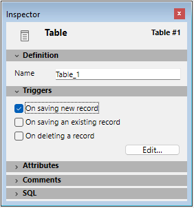

A **trigger** is a method attached to a table. It is a property of a table. You do not call triggers; they are automatically invoked by the 4D database engine each time you manipulate table records (add, delete and modify). You can write very simple triggers, and then make them more sophisticated.

Triggers can prevent "illegal" operations on the records of your database. They are a very powerful tool for restricting operations on a table, as well as preventing accidental data loss or tampering. For example, in an invoicing system, you can prevent anyone from adding an invoice without specifying the customer to whom the invoice is billed.


<!-- INCLUDE triggers.vs-events.Desc -->


## Activating and Creating a Trigger

By default, when you create a table in the Design Environment, it has no trigger.

To use a trigger for a table, you need to:

- Activate the trigger and tell 4D when it has to be invoked.
- Write the code for the trigger.

Activating a trigger that is not yet written or writing a trigger without activating it will not affect the operations performed on a table.

1. To activate a trigger for a table, you must select one of the **Triggers** options (database events) for the table in the Inspector window of the structure:



2. Creating a Trigger.

To create a trigger for a table, click on the **Edit...** button in the Inspector window or press **Alt** (Windows)/**Option** (macOS) and double-click on the table title in the Structure window ans write the code corresponding to the trigger that you want to create. 


## Description of the triggers

### On saving an existing record

If this option is selected, the trigger will be invoked each time a record of the table is modified. This happens when:

- Modifying a record in data entry (Design environment, [`MODIFY RECORD`](../commands/modify-record) command or the SQL `UPDATE` command).
- Saving an already existing record using [`SAVE RECORD`](../commands/save-record).
- Calling any other commands that save existing records (i.e., [`ARRAY TO SELECTION`](../commands/array-to-selection), [`APPLY TO SELECTION`](../commands/apply-to-selection), etc.).
- Using an ORDA function that saves the entity.

:::note

For optimization reasons, the trigger is not called when the record is saved by the user or via the [`SAVE RECORD`](../commands/save-record) command if no field in the table has been modified in the record. If you want to "force" the calling of the trigger in this case, you can simply assign a field to itself:

```4d
[thetable]thefield:=[thetable]thefield
```

:::

### On deleting a record 

If this option is selected, the trigger will be invoked each time a record of the table is deleted. This happens when:

- Deleting a record (Design environment or calling [`DELETE RECORD`](../commands/delete-record), [`DELETE SELECTION`](../commands/delete-selection) or the SQL `DELETE` command).
- Performing any operation that provokes deletion of related records through the deletion control options of a relation.
- Using an ORDA function that deletes the entity.

:::note

The [`TRUNCATE TABLE`](../commands/trucate-table) command does NOT call the trigger.

:::

### On saving a new record  

If this option is selected, the trigger will be invoked each time a record is added to the table. This happens when:

- Adding a record in data entry (Design environment, [`ADD RECORD`](../commands/add-record) command or the SQL `INSERT` command).
- Creating and saving a record with [`CREATE RECORD`](../commands/create-record) and [`SAVE RECORD`](../commands/save-record). Note that the trigger is invoked at the moment you call [`SAVE RECORD`](../commands/save-record), not when it is created.
- Importing records (Design environment or using an import command).
- Calling any other commands that create and/or save new records (i.e., [`ARRAY TO SELECTION`](../commands/array-to-selection), [`SAVE RELATED ONE`](../commands/save-related-one), etc.).
- Using ORDA functions such as [`ds.dataclass.new()`](../API/DataClassClass.md#new) and [`entity.save()`](../API/EntityClass.md#save).


## Database events

A trigger can be invoked for one of the three database events described above. Within the trigger, you detect which event is occurring by calling the [`Trigger event`](../commands/trigger-event) command. This function returns a numeric value that denotes the database event.

Typically, you write a trigger with a [`Case of` structure](../Concepts/flow-control.md#case-ofelseend-case) on the result returned by [`Trigger event`](../commands/trigger-event). 

```4d
  //Trigger for [anyTable]
#DECLARE -> $result : Integer
$result:=0 // Assume the database request will be granted
 Case of
    :(Trigger event=On Saving New Record Event)
  // Perform appropriate actions for the saving of a newly created record
    :(Trigger event=On Saving Existing Record Event)
  // Perform appropriate actions for the saving of an already existing record
    :(Trigger event=On Deleting Record Event)
  // Perform appropriate actions for the deletion of a record
 End case
 ```


## Triggers are Functions  

A trigger has two purposes:

- Performing actions on the record just before it is saved or deleted.
- Granting or rejecting a database operation.


### Performing Actions  

Each time a record is saved (added or modified) to a [Documents] table, you want to "mark" the record with a time stamp for creation and another one for the most recent modification. You can write the following trigger:

```4d
  // Trigger for table [Documents]
 Case of
    :(Trigger event=On Saving New Record Event)
       [Documents]CreationStamp:=myTimeStamp
       [Documents]ModificationStamp:=myTimeStamp
    :(Trigger event=On Saving Existing Record Event)
       [Documents]ModificationStamp:=myTimeStamp
 End case
```

:::note

The *myTimeStamp* function used in this example is a small project method that returns the number of seconds elapsed since a fixed date was chosen arbitrarily.

:::

After this trigger has been written and activated, no matter what way you add or modify a record to the [Documents] table (data entry, import, project method, ORDA function), the fields [Documents]CreationStamp and [Documents]ModificationStamp will automatically be assigned by the trigger before the record is eventually written to the disk.

### Granting or rejecting the database operation  

To grant or reject a database operation, the trigger must **return a trigger error code** in the function result.

#### Example

Let's take the case of an [Employees] table. During data entry, you enforce a rule on the social security number field for the [Employees] table. When you click the validation button, you check the field using the object method of the button:

```4d
  // bAccept button object method
 If(GoodSSnumber([Employees]SSNumber))
    ACCEPT
 Else
    BEEP
    ALERT("Enter a Social Security Number then click OK again.")
 End if
```

If the field value is valid, you accept the data entry; if the field value is not valid, you display an alert and you stay in data entry.

If you also create [Employees] records programmatically, the following piece of code would be programmatically valid, but would violate the rule expressed in the previous object method:

```4d
  // Extract from a project method
  // ...
 CREATE RECORD([Employees])
 [Employees]Name:="DOE"
 SAVE RECORD([Employees]) // <-- DB rule violation! The SS number has not been assigned!
  // ...
```

Using a trigger for the [Employees] table, you can enforce the [Employees]SSNumber rule at all the levels of the database. The trigger would look like this:

```4d
  // Trigger for [Employees]
 #DECLARE -> $result : Integer
 var $dbEvent : Integer
 $result:=0
 $dbEvent:=Trigger event
 Case of
    :(($dbEvent=On Saving New Record Event)|($dbEvent=On Saving Existing Record Event))
       If(Not(GoodSSnumber([Employees]SSNumber)))
          $result:=-15050
       Else
  // ...
       End if
  // ...
 End case
```

Once this trigger is written and activated, the line `SAVE RECORD([Employees])` will generate a database engine error -15050, and the record will NOT be saved.

Similarly, if a 4D Plug-in attempted to save an [Employees] record with an invalid social security number, the trigger will generate the same error and the record will not be saved.

The trigger guarantees that nobody (user, database designer, plug-in) can violate the social security number rule, either deliberately or accidentally.

Note that even if you do not have a trigger for a table, you can get database engine errors while attempting to save or delete a record. For example, if you attempt to save a record with a duplicated value in a unique indexed field, the error -9998 is returned.

Therefore, triggers returning errors add database engine errors to your application:

- 4D manages the "regular" errors: unique index, relational data control, and so on.
- Using triggers, you manage the custom errors unique to your application.

**Important:** You can return an error code value of your choice. However, do NOT use error codes already taken by the 4D database engine. We strongly recommend that you use error codes between -32000 and -15000. We reserve error codes above -15000 for the database engine.

At the process level, you handle trigger errors the same way you handle database engine errors:

- You can let 4D display the standard error dialog box, then the method is halted.
- You can use an [error-handling method](../Concepts/error-handling.md) and recover the error the appropriate way (except for commands acting on a selection of records, see the note below).

:::note Notes

- During data entry, if a trigger error is returned while attempting to validate or delete a record, the error is handled like a unique indexed error. The error dialog is displayed, and you stay in data entry. Even if you use a database in the Design environment (not in the Application environment), you have the benefit of using triggers.
- When an error is generated by a trigger for a record within the framework of a command acting on a selection of records ([`DELETE SELECTION`](../commands/delete-selection), [`APPLY TO SELECTION`](../commands/apply-to-selection), [`ARRAY TO SELECTION`](../commands/array-to-selection)...), the record is not processed but is automatically registered in the [`LockedSet` of the process](../Develop/processes.md#elements-of-a-process). The command continues its execution until the end and no error can be catched. The error-handling method, if any, is not called. To know if errors have been generated in this context, you need to test the `LockedSet` just after the command call. Also, in the trigger, you have to store error codes, for example in a collection, and handle them afterwards. 

:::

Even when a trigger returns no error ($result=0), this does not mean that a database operation will be successful—a unique index violation may occur. If the operation is the update of a record, the record may be locked, an I/O error may occur, and so on. The checking is done after the execution of the trigger. However, at the higher level of the executing process, errors returned by the database engine or a trigger are the same—a trigger error is a database engine error.


## Triggers and the 4D Architecture  

Triggers execute at the database engine level. This is summarized in the following diagram:


Triggers are executed on the machine where the database engine is actually located. This is obvious with a 4D single-user version. On 4D Server, triggers are executed within the acting process on the server machine (in the "twinned" process of the process that set off the trigger), not on the client machine.

When a trigger is invoked, it executes within the context of the process that attempts the database operation. This process, which invokes the trigger execution, is called the **invoking process**. The elements included in this context differ according to whether the database is executed with 4D in local mode or with 4D Server :

- With 4D in local mode, the trigger works with the current selections, current records, table read/write states, record locking operations, etc., of the invoking process.
- With 4D Server, only the context of the database of the invoking client process is preserved (locked records and transactional states). 4D Server also (and only) guarantees that the current record of the table of the trigger is correctly positioned. The other elements of the context (current selections for example) are those of the trigger process.

Be careful about using other database or language objects of the 4D environment, because a trigger may execute on a machine other than that of the invoking process—this is the case with 4D Server!

- **Process variables**: Each trigger has its own table of process variables. A trigger has no access to the process variables of the invoking process.
- **Local variables**: You can use local variables in a trigger. Their scope is the trigger execution; they are created/deleted at each execution.
- **Semaphores**: A trigger can test or set global semaphores as well as local semaphores (on the machine where it executes). However, a trigger must execute quickly, so you must be very careful when testing or setting semaphores from within triggers.
- **Sets and Named selections**: If you use a set or a named selection from within a trigger, you work on the machine where the trigger executes. In client/server mode, "process" sets and named selections (whose names do not begin with a $ nor with \<>) that are created on the client machine are visible in a trigger.
- **User Interface**: Do NOT use user interface elements in a trigger (no alerts, no messages, no dialog boxes). Accordingly, you should limit any tracing of triggers in the [Debugging window](../Debugging/debugger.md). Remember that in Client/Server, triggers execute on the 4D Server machine. An alert message on the server machine does not help a user on a client machine. Let the invoking process handle the user interface.

Note that in client-server mode, if you use 4D's password system, you can execute the [`Current user`](../commands/current-user) command in the trigger in order, for example, to save the name of the user at the origin of the trigger call in a journaled table.


## Triggers and Transactions 

[Transactions](./transactions.md) must be handled at the invoking process level. They must not be managed at the trigger level. During one trigger execution, if you have to add, modify or delete multiple records (see the following case study), you must first use the [`In transaction`](../commands/in-transaction) command from within the trigger to test if the invoking process is currently in transaction. If this is not the case, the trigger may potentially encounter a locked record. Therefore, if the invoking process is not in transaction, do not even start the operations on the records. Just return an error in the trigger $result in order to signal to the invoking process that the database operation it is trying to perform must be executed in a transaction. Otherwise, if locked records are met, the invoking process will have no means to roll back the actions of the trigger.


:::note

In order to optimize the combined operation of triggers and transactions, 4D does not call triggers after the execution of [`VALIDATE TRANSACTION`](../commands/validate-transaction). This prevents the triggers from being executed twice.

:::

## Cascading Triggers  

Given the following example structure:


Note: The tables have been collapsed; they have more fields than shown here.

Let's say that the database "authorizes" the deletion of an invoice. We can examine how such an operation would be handled at the trigger level (because you could also perform deletions at the process level).

In order to maintain the relational integrity of the data, deleting an invoice requires the following actions to be performed in the trigger for [Invoices]:

- In the [Customer] record, decrement the Gross Sales field by the amount of the invoice.
- Delete all the [Line Items] records related to the invoice.
- This also implies that the [Line Items] trigger decrements the Quantity Sold field of the [Products] record related to the line item to be deleted.
- Delete all the [Payments] records related to the deleted invoice.

First, the trigger for [Invoices] must perform these actions only if the invoking process is in transaction, so that a roll-back is possible if a locked record is met.

Second, the trigger for [Line Items] is **cascading** with the trigger for [Invoices]. The [Line Items] trigger executes "within" the execution of the [Invoices] trigger, because the deletion of the list items are consequent to a call to `DELETE SELECTION` from within the [Invoices] trigger.

Consider that all tables in this example have triggers activated for all database events. The cascade of triggers will be:

- [Invoices] trigger is invoked because the invoking process deletes an invoice
   - [Customers] trigger is invoked because the [Invoices] trigger updates the Gross Sales field
   - [Line Items] trigger is invoked because the [Invoices] trigger deletes a line item (repeated)
      - [Products] trigger is invoked because the [Line Items] trigger updates the Quantity Sold fiel
   - [Payments] trigger is invoked because the [Invoices] trigger deletes a payment (repeated)

In this cascade relationship, the [Invoices] trigger is said to be executing at level 1, the [Customers], [Line Items], and [Payments] triggers at level 2, and the [Products] trigger at level 3.

From within the triggers, you can use the [`Trigger level`](../commands/trigger-level) command to detect the level at which a trigger is executed. In addition, you can use the [`TRIGGER PROPERTIES`](../commands/trigger-properties) command to get information about the other levels.

For example, if a [Products] record is being deleted at a process level, the [Products] trigger would be executed at level 1, not at level 3.

Using [`Trigger level`](../commands/trigger-level) and [`TRIGGER PROPERTIES`](../commands/trigger-properties), you can detect the cause of an action. In our example, an invoice is deleted at a process level. If we delete a [Customers] record at a process level, then the [Customers] trigger should attempt to delete all the invoices related to that customer. This means that the [Invoices] trigger will be invoked as above, but for another reason. From within the [Invoices] trigger, you can detect if it executed at level 1 or 2. If it did execute at level 2, you can then check whether or not it is because the [Customers] record is deleted. If this is the case, you do not even need to bother updating the Gross Sales field.


