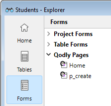
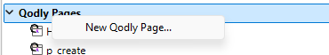
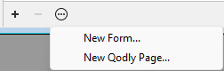
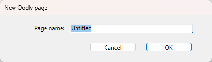
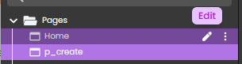
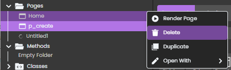

The Explorer is a window in the Design environment that gives you convenient access to tables, forms, methods, built-in 4D commands, constants and plug-ins. It also provides information about these items. You can display the Explorer at any time by choosing one of the pages in the **Design > Explorer** sub-menu or by clicking on the **Explorer** button in the toolbar.

:::note

For a comprehensive description of the Explorer, please refer to the [Explorer chapter on doc.4d.com](https://doc.4d.com/4Dv21/4D/21/Explorer.200-7676561.en.html).

:::

## Forms page

The Forms page contains three lists: **Project Forms**, **Table Forms**, and **Qodly Pages**. 

### Qodly Pages

This section allows you to view the list of Qodly pages defined your project. You can also add or open pages. 

The pages listed in the Qodly Pages section are stored in the [**WebForm** subfolder](../Project/architecture.md#webforms) of the project's Sources folder.

:::note

Qodly pages are not visible in the **Home** page of the Explorer.

:::

### Requirements

Qodly pages are created and edited in [Qodly Studio](https://developer.4d.com/qodly/4DQodlyPro/qodlyStudioInterface), a web-based development tool. Accessing Qodly Studio from 4D requires some [specific configurations](https://developer.4d.com/qodly/4DQodlyPro/gettingStarted#requirements), that you [can set in one click](https://developer.4d.com/qodly/4DQodlyPro/gettingStarted#one-click-configuration). 

### Adding or opening a Qodly page

You can add or open Qodly pages directly from the 4D Explorer. If [requirements](#requirements) are met, the page is opened in the [Page editor of Qodly Studio](https://developer.4d.com/qodly/4DQodlyPro/pageLoaders/pageLoaderOverview). 

To add a page:

- Select **New Qodly page...** in the contextual menu,  

- or click the **+** icon or select **New Qodly page...** in the bottom area of the Explorer. 

Enter the name of the page and click **OK** to open the page in Qodly Studio:

To open a page:

- double-click on a Qodly page name, or
- right-click on a Qodly page name and select **Edit...** in the contextual menu.

### Renaming or deleting a Qodly page

Renaming or deleting a Qodly page can only be done in the [Page editor of Qodly Studio](https://developer.4d.com/qodly/4DQodlyPro/pageLoaders/pageLoaderOverview).

Click on the pen icon to rename the page: 

Click on the options button and select **Delete** to delete a page: 

A confirmation dialog box is displayed. 

