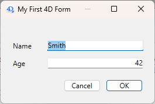
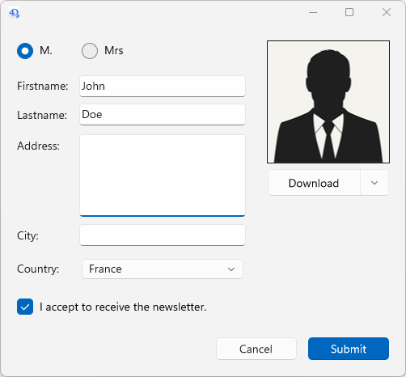
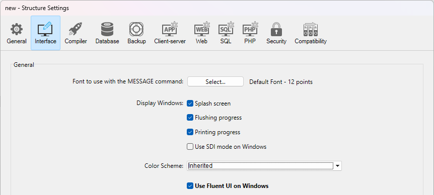

Forms provide the interface through which information is entered, modified, and printed in a desktop application. Users interact with the data in a database using forms and print reports using forms. Forms can be used to create custom dialog boxes, palettes, or any featured custom window.


Forms can also contain other forms through the following features:

- [subform objects](FormObjects/subform_overview.md)
- [inherited forms](./properties_FormProperties.md#inherited-form-name)

## Creating forms

You can add or modify 4D forms using the following elements:

- **4D Developer interface:** Create new forms from the **File** menu or the **Explorer** window.
- **Form Editor**: Modify your forms using the **[Form Editor](FormEditor/formEditor.md)**.
- **JSON code:** Create and design your forms using JSON and save the form files at the [appropriate location](Project/architecture#sources). Example:

```
{
    "windowTitle": "Hello World",
    "windowMinWidth": 220,
    "windowMinHeight": 80,
    "method": "HWexample",
    "pages": [
        null,
        {
            "objects": {
                "text": {
                "type": "text",
                "text": "Hello World!",
                "textAlign": "center",
                "left": 50,
                "top": 120,
                "width": 120,
                "height": 80
                },
                "image": {
                "type": "picture",
                "pictureFormat": "scaled",
                "picture": "/RESOURCES/Images/HW.png",
                "alignment":"center", 
                "left": 70,
                "top": 20, 
                "width":75, 
                "height":75        
                },
                "button": {
                "type": "button",
                "text": "OK",
                "action": "Cancel",
                "left": 60,
                "top": 160,


                "width": 100,
                "height": 20
                }
            }
        }
    ]
}
```


## Using forms

Forms are called using specific commands of the 4D Language. In your 4D desktop applications, forms can be used in various ways, depending on their status within your interface needs. A form can be:

- used in its own window for data viewing, processing, editing, or to display on-screen information to the user,
- used embedded in another form (subform),
- used as template for printing,
- or called by specific features like the Label editor. 


### Using a project form in a window

When you want to use a form as on-screen dialog, you need to (1) create a window and (2) load the form within the window, along with an event loop to process user actions. The straighforward steps to display a form on screen are:

1. Call the [`Open form window`](../commands/open-form-window) command to create and preconfigure a window tailored for your form. Note that the command only draw aan empty window, it does not display anything.
2. In the same method, call the [`DIALOG`](../commands/dialog) command to actually load the form in the opened form window, ready for user interaction. [`DIALOG`](../commands/dialog) loads form data and places your code in listening mode to user events. When you call this command without asterisk (\*), the dialog will stay on screen and the code execution is frozen until an event occurs (see also ["Event listening" paragraph](../Develop/async.md#event-listening)).
3. (optional) Use the [`Form`](../commands/form) command from within the form context to access form data. 


::note Compatibility

All-in-one commands such as [`ADD RECORD`](../commands/add-record) or [`MODIFY RECORD`](../commands/add-record) merge all steps in a single call. These legacy commands can still be used for prototyping or basic developments but are not adapted to modern, fully controlled interfaces. They directly rely on the 4D database and legacy features such as [table forms](#project-form-and-table-form) and do not benefit from the power and flexibility of [ORDA features](../ORDA/overview.md). Unless specific needs, it is recommended to use project forms for your 4D desktop application interfaces. 

:::


#### Simple example

You create the following basic form in the [Form editor](./formEditor.md):


The form is [associated with a "myForm" class](./properties_FormProperties.md#form-class), defined as follow:

```4d
    //cs.myForm
property name : Text
property age : Integer

Class constructor
  This.name:=""
  This.age:=0
```

The form class is automatically instantiated by 4D once the form is loaded. If you execute the following project method:

```4d
    // Instantiate a form object that will host form data and UI logic
var $formObject:=cs.myForm.new()

    //Prepare default value within the form object
$formObject.name:="Smith"
$formObject.age:=42

    // Create an empty window with ad-hoc settings that fits the desired form dimensions, resizing properties,
    // and window type (this does not render the form)
var $win:=Open form window("myForm"; Movable form dialog box; Horizontally centered; Vertically centered)

    //Render the form, and provide $formObject's data. Dialog also activates the form event loop
DIALOG("myForm"; $formObject)

    //Without asterisk to Dialog statement, the form waits for a closing action from the user 
    //before executing the rest of the code. Calling Close window is just a good practice 
CLOSE WINDOW($win) //releases reference

    //Display data modified by the user, if any/
ALERT($formObject.name+" is "+String($formObject.age)+" years old!")

```

4D displays:




### Using forms as subforms

A form can be embedded within another form, in which case it becomes a [subform object](../FormObjects/subform_overview.md) which follows specific rules. A subform is automatically used when its parent form is [displayed in a window](#using-a-project-form-in-a-window).

In the same way that you pass an object to a form with the [`DIALOG`](../commands/dialog) command, you can also pass an object to a subform area using the property list. Then, you can use it in the subform with the [`Form`](../commands/form) command. In this example, the "InvoiceAddress" object is bound to the subform:


### Using forms to be printed

In 4D desktop applications, forms can be printed using the various [commands of the **Printing** theme](../commands/theme/Printing). 

#### Examples

You can use forms to print data, either as page or as list. 

- To simply print some part of a form, use the [`Print form`](../commands/print-form) command. For example:

```4d
var $formData:={}
$formData.lastname:="Smith"
$formData.firstname:="john"
$formData.request:="I need more COFFEE"
var $h:=Print form("Request_var";$formData;Form detail)
```

- To print a form within a printing job to process data during printing, use [`FORM LOAD`](../commands/form-load) and [`Print object`](../commands/print-object) commands. For example:

```4d
 var $formData : Object
 var $over : Boolean
 var $full : Boolean
 
 OPEN PRINTING JOB
 $formData:={}
 $formData.LBcollection:=[]
 ... //fill the collection with data
 
 FORM LOAD("GlobalForm";$formData) 
 $over:=False
 Repeat
    $full:=Print object(*;"LB") // the datasource of this "LB" listbox is Form.LBcollection
    LISTBOX GET PRINT INFORMATION(*;"LB";lk printing is over;$over)
    If(Not($over))
       PAGE BREAK
    End if
 Until($over)
 FORM UNLOAD
 CLOSE PRINTING JOB
 ```
 
 
#### Print rendering engine

4D uses a dedicated print rendering engine to generate outputs with a design adapted for printing. It includes the following main features:

- Interactive widgets such as buttons, toggles, dropdowns, etc. and modern UI effects such as glass, blur, transparency, or shadow effects are converted into adapted static representations and flattened into printable styles, so that the document remains readable and professional once printed.
- Layout structure, spacing, and alignment, are preserved so that the printed document reflects the logical structure of the on-screen form.
- The same output is produced, whether the form is printed from macOS or Windows.

For example, the following form:


... will be printed with this rendering:


:::tip Related blog post

[Printing Modern Interfaces with Clean, Consistent Output](https://blog.4d.com/printing-modern-interfaces-with-clean-consistent-output)

:::

#### Legacy print renderer

In releases prior to 4D 21 R3, another print renderer was used. This legacy renderer simply draws widgets as they appear on the screen. For compatibility, the legacy renderer is **enabled by default** in projects or databases converted from versions prior to 4D 21 R3, so that forms designed with this renderer continue to be printed as expected. 

You can however enable the modern print rendering engine at any moment by:

- unchecking the **Use legacy print rendering** option in the [Compatibility page of the Settings dialog box](../settings/compatibility.md) (permanent setting),
- or executing [`SET DATABASE PARAMETER`](../commands/set-database-parameter) command with `Use legacy print rendering` selector set to 1 (volatile setting).

:::warning Limitation

For technical reasons, the legacy print renderer is not available with forms displayed with [Fluent UI](#fluent-ui-rendering) on Windows or [Liquid Glass](../Notes/updates.md#support-of-liquid-glass-on-macos) on macOS. In these contexts, forms are **always printed with the modern print rendering engine**, whatever the compatibility option. 

:::


### Other form usages

There are several other ways to use forms in the 4D applications, including:

- a form can be [inherited](#inherited-forms) from another form,
- a form can be [associated to a listbox](../FormObjects/properties_ListBox.md#detail-form-name) in response to a user action to display a row using an edit button or a double-click,
- the [label editor can use a form](../Desktop/labels.md#form-to-use) as template to print labels.


## Project form and Table form

There are two categories of forms:

- **Project forms** - Independent forms that are not attached to any table. They are intended more particularly for creating interface dialog boxes as well as components. Project forms can be used to create interfaces that easily comply with OS standards.

- **Table forms** - Attached to specific tables and thus benefit from automatic functions useful for developing applications based on databases. Typically, a table has separate input and output forms.

Typically, you select the form category when you create the form, but you can change it afterwards.

## Form pages

Each form is made of at least two pages:

- a page 1: a main page, displayed by default
- a page 0: a background page, whose contents is displayed on every other page.

You can create multiple pages for an input form. If you have more fields or variables than will fit on one screen, you may want to create additional pages to display them. Multiple pages allow you to do the following:

- Place the most important information on the first page and less important information on other pages.
- Organize each topic on its own page.
- Reduce or eliminate scrolling during data entry by setting the [entry order](formEditor.md#data-entry-order).
- Provide space around the form elements for an attractive screen design.

Multiple pages are a convenience used for input forms only. They are not for printed output. When a multi-page form is printed, only the first page is printed.

There are no restrictions on the number of pages a form can have. The same field can appear any number of times in a form and on as many pages as you want. However, the more pages you have in a form, the longer it will take to display it.

A multi-page form has both a background page and several display pages. Objects that are placed on the background page may be visible on all display pages, but can be selected and edited only on the background page. In multi-page forms, you should put your button palette on the background page. You also need to include one or more objects on the background page that provide page navigation tools for the user.


## Fluent UI rendering

:::caution Developer Preview

Fluent UI support is currently in the Developer Preview phase. It should not be used in production.

:::


On Windows, 4D supports **Fluent UI** form rendering, Microsoft's modern graphical user interface design, based upon **WinUI 3** technology. **WinUI 3** is the foundation of the Windows App SDK and represents the upcoming Windows graphical interfaces.

Fluent UI rendering offers modern and attractive controls, support of dark/light system themes, smoother rendering optimized for high-resolution displays, and consistent user experience aligned with recent Microsoft applications.

|Light theme|Dark theme|
|---|---|
|||


:::info Availability

This feature can be used **in 4D projects on Windows**. It is not available on macOS or in binary 4D databases on Windows.

:::

:::tip Related blog posts

[Modernize your 4D interfaces with Fluent UI](https://blog.4d.com/modernize-your-4d-interfaces-with-fluent-ui)<br/>
[Deploy Fluent UI effortlessly in your 4D applications](https://blog.4d.com/deploy-fluent-ui-effortlessly-in-your-4d-applications)

:::

### Requirements

The Fluent UI rendering requires that the **Windows App SDK** be installed on your machine. You need to make sure this SDK is installed on any Windows machine displaying your forms. 

[If necessary](https://blog.4d.com/deploy-fluent-ui-effortlessly-in-your-4d-applications), you can install the Windows App SDK. For convenience, the 4D installer [provides a link](../GettingStarted/Installation.md#installation-on-disk) to download the Windows App SDK installer. You can also visit the [Microsoft download page](https://learn.microsoft.com/en-us/windows/apps/windows-app-sdk/downloads). We recommend using the version provided by the 4D installer, which offers optimal compatibility. 

If the Windows App SDK is not properly installed, 4D will render all your forms in classic mode with no error and the following warning will be recorded in the [diagnostic log](../Debugging/debugLogFiles.md#4ddiagnosticlogtxt): "Fluent UI is required but not available. The application runs in the Classic Windows look."

### Enabling the Fluent UI rendering

You can enable the Fluent UI rendering mode at the application level or at the form level. Form setting has priority over application setting.

#### Application setting

Check the **Use Fluent UI on Windows** option in the "Interface" page of the Settings dialog box. 



In this case, the Fluent UI rendering mode will be used by default on Windows for all forms.

:::note

If the current configuration is not compliant with the [Fluent UI requirements](#requirements), an error message is displayed next to the check box.

:::

#### Form setting

Each form can define its own rendering via the **Widget appearance** property. The following options are available:

- **Inherited**: inherits the global application setting (default),
- **Classic**: uses the classic Windows style,
- **Fluent UI**: enables the modern rendering based on Fluent UI. <br/>


The corresponding [JSON form property](./properties_JSONref.md) is `fluentUI` with value undefined (i.e. inherited, default value), "true" or "false".

#### CSS

The [**form-theme** CSS media query](./createStylesheet.md#media-queries) allows you to configure several styles depending on the used theme.

### Specific behaviors

When using 4D forms with Fluent UI rendering, you need to pay attention to the following points:

- The [`FORM theme`](../commands/form-theme) command returns the actual display theme of the current form. Possible values: "Classic" or "FluentUI". If there is no current form or if the command is called on macOS, and empty string is returned. 
- The [`Application info`](../commands/application-info) command allows you to know if Fluent UI can be used (`canUseFluentUI` property) or is being used (`useFluentUI` property).  
- If [`GET STYLE SHEET INFO`](../commands/get-style-sheet-info) is called in the context of a form, the information returned relates to the current appearance of the form (Classic or FluentUI). If the command is called outside the context of a form, the information returned relates to the [global project settings](#application-setting).
- [`SET MENU ITEM STYLE`](../commands/set-menu-item-style) with `Underline` *itemStyle* parameter is not supported (ignored) for pop up menus. 
- [Stepper](../FormObjects/stepper.md) form object does not support [double-click event](../Events/onDoubleClicked.md).  
- [Circle buttons](../FormObjects/button_overview.md#circle) are supported (similar as macOS).
- The [`WA ZOOM IN`](../commands/wa-zoom-in) / [`WA ZOOM OUT`](../commands/wa-zoom-out) commands are not supported in Web areas with system rendering engine. 
- A focus ring can be added to picture and text [inputs](../FormObjects/input_overview.md). 


## Inherited Forms

4D forms can use and be used as "inherited forms," meaning that all of the objects from *Form A* can be used in *Form B*. In this case, *Form B* "inherits" the objects from *Form A*.

References to an inherited form are always active: if an element of an inherited form is modified (button styles, for example), all forms using this element will automatically be modified.

All forms (table forms and project forms) can be designated as an inherited form. However, the elements they contain must be compatible with use in different database tables.

When a form is executed, the objects are loaded and combined in the following order:

1. Page zero of the inherited form
2. Page 1 of the inherited form
3. Page zero of the open form
4. Current page of the open form.

This order determines the default [entry order](formEditor.md#data-entry-order) of objects in the form.

> Only pages 0 and 1 of an inherited form can appear in other forms.

The properties and method of a form are not considered when that form is used as an inherited form. On the other hand, the methods of objects that it contains are called.

To define an inherited form, the [Inherited Form Name](properties_FormProperties.md#inherited-form-name) and [Inherited Form Table](properties_FormProperties.md#inherited-form-table) (for table form) properties must be defined in the form that will inherit something from another form.

A form can inherit from a project form, by setting the [Inherited Form Table](properties_FormProperties.md#inherited-form-table) property to `\<None>` in the Property List (or " " in JSON).

To stop inheriting a form, select `\<None>` in the Property List (or " " in JSON) for the [Inherited Form Name](properties_FormProperties.md#inherited-form-name) property.

>It is possible to define an inherited form in a form that will eventually be used as an inherited form for a third form. The combining of objects takes place in a recursive manner. 4D detects recursive loops (for example, if form [table1]form1 is defined as the inherited form of [table1]form1, in other words, itself) and interrupts the form chain.

## Supported Properties

[Associated Menu Bar](properties_Menu.md#associated-menu-bar) - [Fixed Height](properties_WindowSize.md#fixed-height) - [Fixed Width](properties_WindowSize.md#fixed-width) - [Form Break](properties_Markers.md#form-break) - [Form Detail](properties_Markers.md#form-detail) - [Form Footer](properties_Markers.md#form-footer) - [Form Header](properties_Markers.md#form-header) - [Form Name](properties_FormProperties.md#form-name) - [Form Type](properties_FormProperties.md#form-type) - [Inherited Form Name](properties_FormProperties.md#inherited-form-name) - [Inherited Form Table](properties_FormProperties.md#inherited-form-table) - [Maximum Height](properties_WindowSize.md#maximum-height-minimum-height) - [Maximum Width](properties_WindowSize.md#maximum-width-minimum-width) - [Method](properties_Action.md#method) - [Minimum Height](properties_WindowSize.md#maximum-height-minimum-height) - [Minimum Width](properties_WindowSize.md#maximum-width-minimum-width) - [Pages](properties_FormProperties.md#pages) - [Print Settings](properties_Print.md#settings) - [Published as Subform](properties_FormProperties.md#published-as-subform) - [Save Geometry](properties_FormProperties.md#save-geometry) - [Window Title](properties_FormProperties.md#window-title)  
 

## Supported Events


[On Activate](../Events/onActivate.md) - [On After Edit](../Events/onAfterEdit.md) - [On After Keystroke](../Events/onAfterKeystroke.md) - [On Before Keystroke](../Events/onBeforeKeystroke.md) - [On Begin Drag Over](../Events/onBeginDragOver.md) - [On Bound Variable Change](../Events/onBoundVariableChange.md) - [On Clicked](../Events/onClicked.md) - [On Close Box](../Events/onCloseBox.md) - [On Close Detail](../Events/onCloseDetail.md) - [On Data Change](../Events/onDataChange.md) - [On Deactivate](../Events/onDeactivate.md) - [On Display Detail](../Events/onDisplayDetail.md) - [On Double Clicked](../Events/onDoubleClicked.md) - [On Drop](../Events/onDrop.md) - [On Header](../Events/onHeader.md) - [On Load](../Events/onLoad.md) - [On Load Record](../Events/onLoadRecord.md) - [On Losing focus](../Events/onLosingFocus.md) - [On Menu Selected](../Events/onMenuSelected.md) - [On Mouse Enter](../Events/onMouseEnter.md) - [On Mouse Leave](../Events/onMouseLeave.md) - [On Mouse Move](../Events/onMouseMove.md) - [On Open Detail](../Events/onOpenDetail.md) - [On Outside Call](../Events/onOutsideCall.md) - [On Page Change](../Events/onPageChange.md) - [On Plug in Area](../Events/onPlugInArea.md) - [On Printing Break](../Events/onPrintingBreak.md) - [On Printing Detail](../Events/onPrintingDetail.md) - [On Printing Footer](../Events/onPrintingFooter.md) - [On Resize](../Events/onResize.md) - [On Selection Change](../Events/onSelectionChange.md) - [On Timer](../Events/onTimer.md) - [On Unload](../Events/onUnload.md) - [On Validate](../Events/onValidate.md)