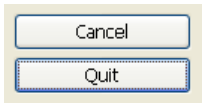
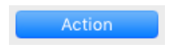

The default button property modifies a button's appearance in order to indicate the recommended choice to the user. The difference in appearance depends on the OS. 

|Operating System|Example|
|---|---|
|**Windows**| The default button has a blue outline. 
 |
|**macOS** |The default buttons are blue.
|

>**Note**  There can only be one default button per form page.

### JSON Grammar

|Name|Data Type|Possible Values|
|:---|:---:|:---:|
defaultButton|boolean|TRUE / FALSE |

### Objects Supported

|Category|Link| 
|---|---|
|Button|[Regular button](../Buttons/button_overview.md#regular)|

