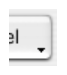

This property allows displaying a symbol that appears as a triangle in the button to indicate the presence of an attached pop-up menu:

The appearance and location of this symbol depends on the button style and the current platform. 

>**Note**  
The “With Pop-up Menu” property only manages the graphic aspect of the button. The display of the pop-up menu and its values must be handled entirely by the developer, more particularly using form events and the **Dynamic pop up menu** and **Pop up menu** commands 

#### Linked and Separated

To attach a pop-up menu symbol to a 3D button, there are two display options available: 

|Linked|Separated|
|:---:|:---:|
|   |  |

>**Note**   
The real availability of a “separated” mode depends on the style of the button and the platform. 

Each option specifies the relation between the button and the attached pop-up menu:

<li>When the pop-up menu is separated, clicking on the left part of the button directly executes the current action of the button; this action can be modified using the pop-up menu accessible in the right part of the button.
<li>When the pop-up menu is linked, a simple click on the button only displays the pop-up menu. Only the selection of the action in the pop-up menu causes its execution.

These options also influence the handling of form events by the button (for more information on this, refer to the [4D Language Reference](https://doc.4d.com/4Dv17R5/4D/17-R5/4D-Language-Reference.100-4127072.en.html) manual).

#### Managing the pop-up menu

It is important to note that the “With Pop-up Menu” property only manages the graphic aspect of the button. The display of the pop-up menu and its values must be handled entirely by the developer, more particularly using form events and the **[Dynamic pop up menu](https://doc.4d.com/4Dv17R5/4D/17-R5/Dynamic-pop-up-menu.301-4128300.en.html)** and **[Pop up menu](https://doc.4d.com/4Dv17R5/4D/17-R5/Pop-up-menu.301-4127438.en.html)** commands.

### JSON Grammar

|Name|Data Type|Possible Values|
|:---|---|---|
|popupPlacement |string |<li>"None"<li> Linked"<li> "Separated" |

### Objects Supported

|Category|Link| | | |  
|---|---|---|---|---|
|Button|[Toolbar button](../Buttons/button_overview.md#toolbar)|[Bevel button](../Buttons/button_overview.md#bevel)|[Rounded Bevel button](../Buttons/button_overview.md#Rounded-bevel)|[OS X Gradient button](../Buttons/button_overview.md#os-x-gradient)|
||[OS X Textured button](../Buttons/button_overview.md#os-x-textured)|[Office XP button](../Buttons/button_overview.md#office-XP)|[Circle button](../Buttons/button_overview.md#circle)|| 

