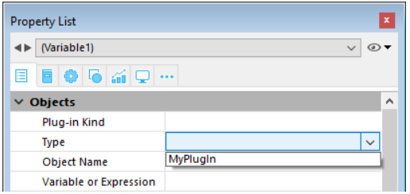

You can customize forms by manipulating the objects on it. You can reposition objects, add objects, enforce business rules by specifying data entry constraints, and write object methods that run automatically when the object is used. 

## Object Types

### Active Objects 

An active object is anything on a form that performs a database task or an interface function. There are many kinds of active objects. Fields are considered active objects. Other active objects — enterable objects (variables), combo boxes, drop-down lists, picture buttons, and so on — store data temporarily in memory or perform some action such as opening a dialog box, printing a report, or starting a background process.

In some cases, you can specify the active object’s action by making selections in the Property List window. For example, you can use built-in automatic button actions to specify the action of a button. In other cases, you specify the object’s action by writing a method that is automatically attached to the object.

#### Native object animations (macOS) 

4D applications running on macOS benefit from native animations that enhance user experience with 4D forms. In particular:

*	Fields and enterable variables, radio buttons and check boxes all display animation whenever they get the focus,
*	Radio buttons and check boxes trigger animation during mouse tracking,
*	Scrollbars have a special animated effect (Yosemite or higher version only),
*	Tabbing in list forms causes columns to slide smoothly.

>Apple has published [guidelines](https://developer.apple.com/design/human-interface-guidelines/macos/overview/themes/#//apple_ref/doc/uid/20000957-CH11-SW1) about how to use animations in your applications.  

### Static Objects

These objects are generally used for setting the appearance of the form and its labels as well as for the graphic interface. They are available in the object bar of the Form editor. You can also set their graphic attributes (size, color, font, etc.) and their resizing properties using the Property List. Static objects do not have associated variables like active objects. However, you can insert dynamic objects into static objects.

### Plug-in Areas, Subforms, Areas

#### Plug-in Areas

A plug-in area is an area on the form that is completely controlled by a 4D plug-in. When opening a database, 4D creates an internal list of the plug-ins installed in your database. Once you have inserted a Plug-in Area in a form, you can assign a plug-in to the area directly in the [Type](properties_Object.md#type) list (“Objects” theme) in the Property List window:

>*	Some plug-ins, such as 4D Internet Commands, cannot be used in forms or external windows. When a plug-in cannot be used in a form, it does not appear in the plug-in list of the Property List.
*	By default, the list does not contain any plug-in.
*	When the object type chosen is Plugin Area, an Advanced button may be enabled if advanced options are provided by the author of the plug-in. In this case, you can click this button to set these options. Because the Advanced options dialog box is under the control of the author of the plug-in, information about these Advanced options is the responsibility of the distributor of the plug-in. 

If you draw a plug-in area that is too small, 4D will display it as a button whose title is the name of the variable associated with the area. During execution, the user can click on this button in order to open a specific window displaying the plug-in.

#### Subforms

A subform is a form included within another form.

There are two main types of subforms:

*	**List subforms** - generally intended to enter, display and modify data coming from other tables,
*	**Page subforms** - which let you use specific sophisticated interface objects, such as 4D widgets for example.

Each type of subform has its own particular mechanisms and properties.

Subforms are covered in detail in the [Subforms and widgets](https://doc.4d.com/4Dv17R5/4D/17-R5/Subforms-and-widgets.200-4163437.en.html) chapter.

#### Web Areas

Web areas can display various types of web content(*) within your forms: HTML pages with static or dynamic contents, files, pictures, Javascript...

(*) The use of Web plug-ins and Java applets is not recommended in web areas because they may lead to instability in the operation of 4D, particularly at the event management level.

The rendering engine of the web area will depend on the execution platform of the application and the selected rendering engine option (see [web area specific properties](https://doc.4d.com/4Dv17R5/4D/17-R5/Web-areas.300-4163663.en.html#1280453)).

It is possible to create several web areas in the same form. Note, however, that the insertion of Web areas is subject to a few limitations (see [web area locations not supported](https://doc.4d.com/4Dv17R5/4D/17-R5/Web-areas.300-4163663.en.html#2602700)).

Several standard actions, numerous language commands as well as generic and specific form events allow the developer to control the functioning of web areas. Specific variables can be used to exchange information between the area and the 4D environment. 

This paragraph details the principles concerning the use and configuration of Web Area type objects in the Form editor. For more information about programmed management of these objects, refer to the [Web Area](https://doc.4d.com/4Dv17R5/4D/17-R5/Web-Area.201-4127095.en.html) commands in the [4D Language Reference](https://doc.4d.com/4Dv17R5/4D/17-R5/4D-Language-Reference.100-4127072.en.html).

Also note that the use of Web areas is subject to several rules which are described in the [Notes about use of Web Areas](https://doc.4d.com/4Dv17R5/4D/17-R5/Programmed-management-of-Web-Areas.300-4127635.en.html#37137) section of the [4D Language Reference](https://doc.4d.com/4Dv17R5/4D/17-R5/4D-Language-Reference.100-4127072.en.html).

#### 4D Write Pro

4D Write Pro offers 4D users an advanced word-processing tool, fully integrated with your 4D database. Using 4D Write Pro, you can write pre-formatted emails and/or letters containing images, a scanned signature, formatted text and placeholders for dynamic variables. You can also create invoices or reports dynamically, including formatted text and images.

The key features of the product are:

*	4D Write compatibility: a 4D Write Pro object can open and convert legacy 4D Write documents while supporting most of their specific properties.
*	Word processing: a 4D Write Pro object embedded in a form provides standard word-processing features, including text and style manipulation, image insertion, import and export, and much more.
*	Database integration:
	*	A 4D Write Pro object can display variable parts which will be filled with data from the database, or data computed by 4D.
	*	4D Write Pro documents can be stored within database fields or on disk.

>For more information on 4D Write Pro, please refer to the [4D Write Pro Reference](https://doc.4d.com/4Dv17R5/4D/17-R5/4D-Write-Pro-Reference.100-4115098.en.html).

#### 4D View Pro

4D View Pro provides a set of advanced features related to spreadsheet capabilities and list presentations. 4D View Pro offers 4D users a modern and integrated alternative to some of the legacy 4D View product features.

4D View Pro is made of two parts:

*	a set of advanced list box features that give full control to the developers over row height,
*	a component and a 4D form area that allow developers to embed a spreadsheet in their forms.

>For more information on 4D View Pro, please refer to the [4D View Pro Reference](https://doc.4d.com/4Dv17R5/4D/17-R5/4D-View-Pro-Reference.100-4166713.en.html).

## Object Properties

In addition to adding objects to your forms, you can also modify their properties (*e.g.*, size, position, label, etc.). The properties available depend on the object. 

There are specific properties covered in the descriptions for each type of object as well as basic generic properties such as data entry control or display formats that are described in the **Properties** chapter.

