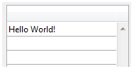
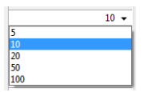
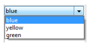
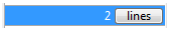

A list box is made of one or more column object(s) which have specific properties. You can select a list box column in the Form editor by clicking on it when the list box object is selected:


You can set standard properties (text, background color, etc.) for each column of the list box; these properties take priority over those of the list box object properties.

>You can define the [Expression type](properties_Object.md#expression-type) for array list box columns (String, Text, Number, Date, Time, Picture, Boolean, or Object).


## Column Specific Properties {#column-specific-properties}

[Alpha Format](properties_Display.md#alpha-format) - [Alternate Background Color](properties_BackgroundAndBorder.md#alternate-background-color) - [Automatic Row Height](properties_CoordinatesAndSizing.md#automatic-row-height) - [Background Color](properties_BackgroundAndBorder.md#background-color--fill-color) - [Background Color Expression](properties_BackgroundAndBorder.md#background-color-expression) - [Bold](properties_Text.md#bold) - [Choice List](properties_DataSource.md#choice-list) - [Class](properties_Object.md#css-class) - [Context Menu](properties_Entry.md#context-menu) - [Data Type (selection and collection list box column)](properties_DataSource.md#data-type-list) - [Date Format](properties_Display.md#date-format) - [Default Values](properties_DataSource.md#default-list-of-values) - [Display Type](properties_Display.md#display-type) - [Enterable](properties_Entry.md#enterable) - [Entry Filter](properties_Entry.md#entry-filter) - [Excluded List](properties_RangeOfValues.md#excluded-list) - [Expression](properties_DataSource.md#expression) - [Expression Type (array list box column)](properties_Object.md#expression-type) - [Font](properties_Text.md#font) - [Font Color](properties_Text.md#font-color) - [Horizontal Alignment](properties_Text.md#horizontal-alignment) - [Horizontal Padding](properties_CoordinatesAndSizing.md#horizontal-padding) - [Italic](properties_Text.md#italic) - [Invisible](properties_Display.md#visibility) - [Maximum Width](properties_CoordinatesAndSizing.md#maximum-width) - [Method](properties_Action.md#method) - [Minimum Width](properties_CoordinatesAndSizing.md#minimum-width) - [Multi-style](properties_Text.md#multi-style) - [Number Format](properties_Display.md#number-format) - [Object Name](properties_Object.md#object-name) - [Picture Format](properties_Display.md#picture-format) - [Resizable](properties_ResizingOptions.md#resizable) - [Required List](properties_RangeOfValues.md#required-list) - [Row Background Color Array](properties_BackgroundAndBorder.md#row-background-color-array) - [Row Font Color Array](properties_Text.md#row-font-color-array) - [Row Style Array](properties_Text.md#row-style-array) - [Save as](properties_DataSource.md#save-as) - [Style Expression](properties_Text.md#style-expression) - [Text when False/Text when True](properties_Display.md#text-when-falsetext-when-true) - [Time Format](properties_Display.md#time-format) - [Truncate with ellipsis](properties_Display.md#truncate-with-ellipsis) - [Underline](properties_Text.md#underline) - [Variable or Expression](properties_Object.md#variable-or-expression) - [Vertical Alignment](properties_Text.md#vertical-alignment) - [Vertical Padding](properties_CoordinatesAndSizing.md#vertical-padding) - [Width](properties_CoordinatesAndSizing.md#width) - [Wordwrap](properties_Display.md#wordwrap)

## Supported Form Events {#supported-form-events}

|Form event|Additional Properties Returned (see [Form event](../commands/form-event.md) for main properties)| Comments|
|---|---|---|
|On After Edit|<ul><li>[column](./listbox-object.md#additional-properties)</li><li>[columnName](./listbox-object.md#additional-properties)</li><li>[row](./listbox-object.md#additional-properties)</li></ul>||
|On After Keystroke|<ul><li>[column](./listbox-object.md#additional-properties)</li><li>[columnName](./listbox-object.md#additional-properties)</li><li>[row](./listbox-object.md#additional-properties)</li></ul>||
|On After Sort|<ul><li>[column](./listbox-object.md#additional-properties)</li><li>[columnName](./listbox-object.md#additional-properties)</li><li>[headerName](./listbox-object.md#additional-properties)</li></ul>|*Compound formulas cannot be sorted. <br/>(e.g., This.firstName + This.lastName)*|
|On Alternative Click|<ul><li>[column](./listbox-object.md#additional-properties)</li><li>[columnName](./listbox-object.md#additional-properties)</li><li>[row](./listbox-object.md#additional-properties)</li></ul>|*Arrays list boxes only*|
|On Before Data Entry|<ul><li>[column](./listbox-object.md#additional-properties)</li><li>[columnName](./listbox-object.md#additional-properties)</li><li>[row](./listbox-object.md#additional-properties)</li></ul>||
|On Before Keystroke|<ul><li>[column](./listbox-object.md#additional-properties)</li><li>[columnName](./listbox-object.md#additional-properties)</li><li>[row](./listbox-object.md#additional-properties)</li></ul>||
|On Begin Drag Over|<ul><li>[column](./listbox-object.md#additional-properties)</li><li>[columnName](./listbox-object.md#additional-properties)</li><li>[row](./listbox-object.md#additional-properties)</li></ul>||
|On Clicked|<ul><li>[column](./listbox-object.md#additional-properties)</li><li>[columnName](./listbox-object.md#additional-properties)</li><li>[row](./listbox-object.md#additional-properties)</li></ul>||
|On Column Moved|<ul><li>[columnName](./listbox-object.md#additional-properties)</li><li>[newPosition](./listbox-object.md#additional-properties)</li><li>[oldPosition](./listbox-object.md#additional-properties)</li></ul>||
|On Column Resize|<ul><li>[column](./listbox-object.md#additional-properties)</li><li>[columnName](./listbox-object.md#additional-properties)</li><li>[newSize](./listbox-object.md#additional-properties)</li><li>[oldSize](./listbox-object.md#additional-properties)</li></ul>||
|On Data Change|<ul><li>[column](./listbox-object.md#additional-properties)</li><li>[columnName](./listbox-object.md#additional-properties)</li><li>[row](./listbox-object.md#additional-properties)</li></ul>||
|On Double Clicked|<ul><li>[column](./listbox-object.md#additional-properties)</li><li>[columnName](./listbox-object.md#additional-properties)</li><li>[row](./listbox-object.md#additional-properties)</li></ul>||
|On Drag Over|<ul><li>[area](./listbox-object.md#additional-properties)</li><li>[areaName](./listbox-object.md#additional-properties)</li><li>[column](./listbox-object.md#additional-properties)</li><li>[columnName](./listbox-object.md#additional-properties)</li><li>[row](./listbox-object.md#additional-properties)</li></ul>||
|On Drop|<ul><li>[column](./listbox-object.md#additional-properties)</li><li>[columnName](./listbox-object.md#additional-properties)</li><li>[row](./listbox-object.md#additional-properties)</li></ul>||
|On Footer Click|<ul><li>[column](./listbox-object.md#additional-properties)</li><li>[columnName](./listbox-object.md#additional-properties)</li><li>[footerName](./listbox-object.md#additional-properties)</li></ul>|*Arrays, Current Selection & Named Selection list boxes only*|
|On Getting Focus|<ul><li>[column](./listbox-object.md#additional-properties)</li><li>[columnName](./listbox-object.md#additional-properties)</li><li>[row](./listbox-object.md#additional-properties)</li></ul>|*Additional properties returned only when editing a cell*|
|On Header Click|<ul><li>[column](./listbox-object.md#additional-properties)</li><li>[columnName](./listbox-object.md#additional-properties)</li><li>[headerName](./listbox-object.md#additional-properties)</li></ul>||
|On Load||
|On Losing Focus|<ul><li>[column](./listbox-object.md#additional-properties)</li><li>[columnName](./listbox-object.md#additional-properties)</li><li>[row](./listbox-object.md#additional-properties)</li></ul>|*Additional properties returned only when editing a cell has been completed*|
|On Row Moved|<ul><li>[newPosition](./listbox-object.md#additional-properties)</li><li>[oldPosition](./listbox-object.md#additional-properties)</li></ul>|*Arrays list boxes only*|
|On Scroll|<ul><li>[horizontalScroll](./listbox-object.md#additional-properties)</li><li>[verticalScroll](./listbox-object.md#additional-properties)</li></ul>||
|On Unload|||


## Object arrays in columns  

List box columns can handle object arrays. Since object arrays can contain different kinds of data, this powerful new feature allows you to mix different input types in the rows of a single column, and display various widgets as well. For example, you could insert a text input in the first row, a check box in the second, and a drop-down list in the third. Object arrays also provide access to new kinds of widgets, such as buttons or color pickers.

The following list box was designed using an object array:


### Configuring an object array column  

To assign an object array to a list box column, you just need to set the object array name in either the Property list ("Variable Name" field), or using the [LISTBOX INSERT COLUMN](../commands-legacy/listbox-insert-column.md) command, like with any array-based column. In the Property list, you can now select Object as a "Expression Type" for the column:


Standard properties related to coordinates, size, and style are available for object columns. You can define them using the Property list, or by programming the style, font color, background color and visibility for each row of an object-type list box column. These types of columns can also be hidden.

However, the Data Source theme is not available for object-type list box columns. In fact, the contents of each column cell are based on attributes found in the corresponding element of the object array. Each array element can define:

the value type (mandatory): text, color, event, etc.
the value itself (optional): used for input/output.
the cell content display (optional): button, list, etc.
additional settings (optional): depend on the value type
To define these properties, you need to set the appropriate attributes in the object (available attributes are listed below). For example, you can write "Hello World!" in an object column using this simple code:

```4d  
ARRAY OBJECT(obColumn;0) //column array
 var $ob : Object //first element
 OB SET($ob;"valueType";"text") //defines the value type (mandatory)
 OB SET($ob;"value";"Hello World!") //defines the value
 APPEND TO ARRAY(obColumn;$ob)  
```



>Display format and entry filters cannot be set for an object column. They automatically depend on the value type.

#### valueType and data display  

When a list box column is associated with an object array, the way a cell is displayed, entered, or edited, is based on the valueType attribute of the array element. Supported valueType values are:

*	"text": for a text value
*	"real": for a numeric value that can include separators like a `\<space>`, `<.>`, or `<,>`
*	"integer": for an integer value
*	"boolean": for a True/False value
*	"color": to define a background color
*	"event": to display a button with a label.

4D uses default widgets with regards to the "valueType" value (i.e., a "text" is displayed as a text input widget, a "boolean" as a check box), but alternate displays are also available through options (*e.g.*, a real can also be represented as a drop-down menu). The following table shows the default display as well as alternatives for each type of value:

|valueType|	Default widget	|Alternative widget(s)|
|---|---|---|
|text|	text input	|drop-down menu (required list) or combo box (choice list)|
|real|	controlled text input (numbers and separators)	|drop-down menu (required list) or combo box (choice list)|
|integer|	controlled text input (numbers only)|	drop-down menu (required list) or combo box (choice list) or three-states check box
|boolean|	check box	|drop-down menu (required list)|
|color|	background color|	text|
|event	|button with label|
|||All widgets can have an additional unit toggle button or ellipsis button attached to the cell.|

You set the cell display and options using specific attributes in each object (see below).

#### Display formats and entry filters  

You cannot set display formats or entry filters for columns of object-type list boxes. They are automatically defined according to the value type. These are listed in the following table:

|Value type	|Default format	|Entry control|
|---|---|---|
|text|	same as defined in object	|any (no control)|
|real|	same as defined in object (using system decimal separator)	|"0-9" and "." and "-"
|||"0-9" and "." if min>=0|
|integer|	same as defined in object	|"0-9" and "-"|
|||"0-9" if min>=0|
|Boolean|	check box|	N/A|
|color	|N/A	|N/A|
|event	|N/A	|N/A|

### Attributes  

Each element of the object array is an object that can contain one or more attributes that will define the cell contents and data display (see example above).

The only mandatory attribute is "valueType" and its supported values are "text", "real", "integer", "boolean", "color", and "event". The following table lists all the attributes supported in list box object arrays, depending on the "valueType" value (any other attributes are ignored). Display formats are detailed and examples are provided below.

| |valueType|	text|	real	|integer|	boolean|	color|	event|
|---|---|---|---|---|---|---|---|
|*Attributes*	|*Description*	| | | | | | |				
|value|	cell value (input or output)|x|	x|	x|	| | |
|min|	minimum value|	|x|	x|	| | |
|max|	maximum value|	|x|	x|	| | |
|behavior|	"threeStates" value |  | |x	|	| | |
|requiredList|	drop-down list defined in object|x|	x|x	|| | |
|choiceList|	combo box defined in object|x|x|x|		| | |
|requiredListReference|	4D list ref, depends on "saveAs" value|x|x|x|		| | |
|requiredListName|	4D list name, depends on "saveAs" value|x|x|x|		| | |
|saveAs|	"reference" or "value"|	x|x|x|		| | |
|choiceListReference|	4D list ref, display combo box|	x|	x|	x|		| | |
|choiceListName|	4D list name, display combo box|x|x|x|		| | |
|unitList|	array of X elements|x|x|x|		| | |
|unitReference|	index of selected element|x|x|	x	|		| | |
|unitsListReference|	4D list ref for units|x	|x|	x	|		| | |
|unitsListName|	4D list name for units|	x|x|	x|		| | |
|alternateButton|	add an alternate button|x|x|x|x|x|	|

#### value  

Cell values are stored in the "value" attribute. This attribute is used for input as well as output. It can also be used to define default values when using lists (see below).

```4d
 ARRAY OBJECT(obColumn;0) //column array
 var $ob1;$ob2;$ob3 : Object
 var $entry:="Hello world!"
 OB SET($ob1;"valueType";"text")
 OB SET($ob1;"value";$entry) // if the user enters a new value, $entry will contain the edited value

 OB SET($ob2;"valueType";"real")
 OB SET($ob2;"value";2/3)

 OB SET($ob3;"valueType";"boolean")
 OB SET($ob3;"value";True)

 APPEND TO ARRAY(obColumn;$ob1)
 APPEND TO ARRAY(obColumn;$ob2)
 APPEND TO ARRAY(obColumn;$ob3)
````


>Null values are supported and result in an empty cell.

#### min and max  

When the "valueType" is "real" or "integer", the object also accepts min and max attributes with appropriate values (values must be of the same type as the valueType).

These attributes can be used to control the range of input values. When a cell is validated (when it loses the focus), if the input value is lower than the min value or greater than the max value, then it is rejected. In this case, the previous value is maintained and a tip displays an explanation.

```4d
 var $ob3 : Object
 var $entry3:=2015
 OB SET($ob3;"valueType";"integer")
 OB SET($ob3;"value";$entry3)
 OB SET($ob3;"min";2000)
 OB SET($ob3;"max";3000)
````


#### behavior  

The behavior attribute provides variations to the regular representation of values. In 4D v15, a single variation is proposed:

|Attribute	|Available value(s)|	valueType(s)|	Description|
|---|---|---|---|
|behavior|	threeStates	|integer|	Represents a numeric value as a three-states check box.<br/> 2=semi-checked, 1=checked, 0=unchecked, -1=invisible, -2=unchecked disabled, -3=checked disabled, -4=semi-checked disabled|

```4d
 var $ob3; $ob4 : Object
 OB SET($ob3;"valueType";"integer")
 OB SET($ob3;"value";-3)
 OB SET($ob4;"valueType";"integer")
 OB SET($ob4;"value";-3)
 OB SET($ob4;"behavior";"threeStates")
```


#### requiredList and choiceList  

When a "choiceList" or a "requiredList" attribute is present inside the object, the text input is replaced by a drop-down list or a combo box, depending of the attribute:

*	If the attribute is "choiceList", the cell is displayed as a combo box. This means that the user can select or type a value.
*	If the attribute is "requiredList" then the cell is displayed as a drop-down list and the user can only select one of the values provided in the list.

In both cases, a "value" attribute can be used to preselect a value in the widget.

>The widget values are defined through an array. If you want to assign an existing 4D list to the widget, you need to use the "requiredListReference", "requiredListName", "choiceListReference", or "choiceListName" attributes.

Examples:

*	You want to display a drop-down list with only two options: "Open" or "Closed". "Closed" must be preselected:

```4d
	ARRAY TEXT($RequiredList;0)
	APPEND TO ARRAY($RequiredList;"Open")
	APPEND TO ARRAY($RequiredList;"Closed")
	var $ob : Object
	OB SET($ob;"valueType";"text")
	OB SET($ob;"value";"Closed")
	OB SET ARRAY($ob;"requiredList";$RequiredList)
```


*	You want to accept any integer value, but display a combo box to suggest the most common values:

```4d
	ARRAY LONGINT($ChoiceList;0)
	APPEND TO ARRAY($ChoiceList;5)
	APPEND TO ARRAY($ChoiceList;10)
	APPEND TO ARRAY($ChoiceList;20)
	APPEND TO ARRAY($ChoiceList;50)
	APPEND TO ARRAY($ChoiceList;100)
	var $ob : Object
	OB SET($ob;"valueType";"integer")
	OB SET($ob;"value";10) //10 as default value
	OB SET ARRAY($ob;"choiceList";$ChoiceList)
```


#### requiredListName and requiredListReference  

The "requiredListName" and "requiredListReference" attributes allow you to use, in a list box cell, a list defined in 4D either in Design mode (in the Lists editor of the Tool box) or by programming (using the New list command). The cell will then be displayed as a drop-down list. This means that the user can only select one of the values provided in the list.

Use "requiredListName" or "requiredListReference" depending on the origin of the list: if the list comes from the Tool box, you pass a name; otherwise, if the list has been defined by programming, you pass a reference. In both cases, a "value" attribute can be used to preselect a value in the widget.

>*	If you want to define these values through a simple array, you need to use the "requiredList" attribute.
>*	If the list contains text items representing real values, the decimal separator must be a period ("."), regardless of the local settings, e.g.: "17.6" "1234.456".

Examples:

*	You want to display a drop-down list based on a "colors" list defined in the Tool box (containing the values "blue", "yellow", and "green"), save it as a value and display "blue" by default:


```4d
	var $ob : Object
	OB SET($ob;"valueType";"text")
	OB SET($ob;"saveAs";"value")
	OB SET($ob;"value";"blue")
	OB SET($ob;"requiredListName";"colors")
```


*	You want to display a drop-down list based on a list defined by programming and save it as a reference:

```4d
	<>List:=New list
	APPEND TO LIST(<>List;"Paris";1)
	APPEND TO LIST(<>List;"London";2)
	APPEND TO LIST(<>List;"Berlin";3)
	APPEND TO LIST(<>List;"Madrid";4)
	var $ob : Object
	OB SET($ob;"valueType";"integer")
	OB SET($ob;"saveAs";"reference")
	OB SET($ob;"value";2) //displays London by default
	OB SET($ob;"requiredListReference";<>List)
```


#### choiceListName and choiceListReference  

The "choiceListName" and "choiceListReference" attributes allow you to use, in a list box cell, a list defined in 4D either in Design mode (in the Tool box) or by programming (using the New list command). The cell is then displayed as a combo box, which means that the user can select or type a value.

Use "choiceListName" or "choiceListReference" depending on the origin of the list: if the list comes from the Tool box, you pass a name; otherwise, if the list has been defined by programming, you pass a reference. In both cases, a "value" attribute can be used to preselect a value in the widget.

>*	If you want to define these values through a simple array, you need to use the "choiceList" attribute.
>*	If the list contains text items representing real values, the decimal separator must be a period ("."), regardless of the local settings, e.g.: "17.6" "1234.456".

Example:

You want to display a combo box based on a "colors" list defined in the Tool box (containing the values "blue", "yellow", and "green") and display "green" by default:


```4d
 var $ob : Object
 OB SET($ob;"valueType";"text")

 OB SET($ob;"value";"blue")
 OB SET($ob;"choiceListName";"colors")
````


#### unitsList, unitsListName, unitsListReference and unitReference  

You can use specific attributes to add units associated with cell values (*e.g.*: "10 cm", "20 pixels", etc.). To define the unit list, you can use one of the following attributes:

*	"unitsList": an array containing the x elements used to define the available units (e.g.: "cm", "inches", "km", "miles", etc.). Use this attribute to define units within the object.
*	"unitsListReference": a reference to a 4D list containing available units. Use this attribute to define units with a 4D list created with the [`New list`](../commands-legacy/new-list.md) command.
*	"unitsListName": a name of a design-based 4D list that contains available units. Use this attribute to define units with a 4D list created in the Tool box.

Regardless of the way the unit list is defined, it can be associated with the following attribute:

*	"unitReference": a single value that contains the index (from 1 to x) of the selected item in the "unitList", "unitsListReference" or "unitsListName" values list.

The current unit is displayed as a button that cycles through the "unitList", "unitsListReference" or "unitsListName" values each time it is clicked (e.g., "pixels" -> "rows" -> "cm" -> "pixels" -> etc.)

Example:

We want to set up a numeric input followed by two possible units: "rows" or "pixels". The current value is "2" + "lines". We use values defined directly in the object ("unitsList" attribute):

```4d
ARRAY TEXT($_units;0)
APPEND TO ARRAY($_units;"lines")
APPEND TO ARRAY($_units;"pixels")
var $ob : Object
OB SET($ob;"valueType";"integer")
OB SET($ob;"value";2) // 2 "units"
OB SET($ob;"unitReference";1) //"lines"
OB SET ARRAY($ob;"unitsList";$_units)
````



#### alternateButton  

If you want to add an ellipsis button [...] to a cell, you just need to pass the "alternateButton" with the True value in the object. The button will be displayed in the cell automatically.

When this button is clicked by a user, an `On Alternate Click` event will be generated, and you will be able to handle it however you want (see the "Event management" paragraph for more information).

Example:

```4d
var $ob1 : Object
var $entry:="Hello world!"
OB SET($ob;"valueType";"text")
OB SET($ob;"alternateButton";True)
OB SET($ob;"value";$entry)
```


#### color valueType  

The "color" valueType allows you to display either a color or a text.

*	If the value is a number, a colored rectangle is drawn inside the cell. Example:

	```4d
	var $ob4 : Object
	OB SET($ob4;"valueType";"color")
	OB SET($ob4;"value";0x00FF0000)
	````


*	If the value is a text, then the text is displayed (*e.g.*: "value";"Automatic").


#### event valueType  

The "event" valueType displays a simple button that generates an `On Clicked` event when clicked. No data or value can be passed or returned.

Optionally, you can pass a "label" attribute.

Example:

```4d
var $ob : Object
OB SET($ob;"valueType";"event")
OB SET($ob;"label";"Edit...")
````


### Event management

Several events can be handled while using an object list box array:

*	**On Data Change**: An `On Data Change` event is triggered when any value has been modified either:
	*	in a text input zone
	*	in a drop-down list
	*	in a combo box area
	*	in a unit button (switch from value x to value x+1)
	*	in a check box (switch between checked/unchecked)
*	**On Clicked**: When the user clicks on a button installed using the "event" *valueType* attribute, an `On Clicked` event will be generated. This event is managed by the programmer.
*	**On Alternative Click**: When the user clicks on an ellipsis button ("alternateButton" attribute), an `On Alternative Click` event will be generated. This event is managed by the programmer.
