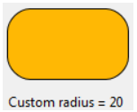

## Left

Positions an object on the left of the form.

#### JSON Grammar

|Name|Data Type|Possible Values|
|:---:|:---:|---|
|left|integer |minimum: 0|

#### Objects Supported

|Category|Link|
|---|---|
|Button|[Regular](button_overview.md#regular) - [Flat](button_overview.md#regular) - [Toolbar](button_overview.md#toolbar) - [Bevel](button_overview.md#bevel) - [Rounded Bevel](button_overview.md#Rounded-bevel) - [OS X Gradient](button_overview.md#os-x-gradient) - [OS X Textured](button_overview.md#os-x-textured) - [Office XP](button_overview.md#office-XP) - [Help](button_overview.md#help) - [Circle](button_overview.md#circle) - [Custom](button_overview.md#custom)|
|Picture Button|[Picture](pictureButton_overview.md)|
|Button Grid|[Button Grid](buttonGrid_overview.md)|
|Radio Button|[Radio Button](radio_overview.md) - [Collapse / Expand](radio_overview.md#collapse) - [Disclosure](radio_overview.md#disclosure)|
|Check Box|[Check Box](checkBox_overview.md) - [Collapse / Expand](checkBox_overview.md#collapse) - [Disclosure](checkBox_overview.md#disclosure)|
|Pop-up menu / Drop-down List|[Pop-up Menu / Drop-down List](popupMenuDropdownList_overview.md)|
|Combo Box|[Combo Box](comboBox_overview.md)|
|Picture Pop-up Menu|[Picture Pop-up Menu](picturePopupMenu_overview.md)|

## Top

Positions an object on the top of the form.  

#### JSON Grammar

|Name|Data Type|Possible Values|
|:---|:---:|:---:|
|Top |integer |minimum:0|

#### Objects Supported

|Category|Link|
|---|---|
|Button|[Regular](button_overview.md#regular) - [Flat](button_overview.md#regular) - [Toolbar](button_overview.md#toolbar) - [Bevel](button_overview.md#bevel) - [Rounded Bevel](button_overview.md#Rounded-bevel) - [OS X Gradient](button_overview.md#os-x-gradient) - [OS X Textured](button_overview.md#os-x-textured) - [Office XP](button_overview.md#office-XP) - [Help](button_overview.md#help) - [Circle](button_overview.md#circle) - [Custom](button_overview.md#custom) |
|Picture Button|[Picture](pictureButton_overview.md)|
|Button Grid|[Button Grid](buttonGrid_overview.md)|
|Radio Button|[Radio Button](radio_overview.md) - [Collapse / Expand](radio_overview.md#collapse) - [Disclosure](radio_overview.md#disclosure)|
|Check Box|[Check Box](checkBox_overview.md) - [Collapse / Expand](checkBox_overview.md#collapse) - [Disclosure](checkBox_overview.md#disclosure)|
|Pop-up menu / Drop-down List|[Pop-up Menu / Drop-down List](popupMenuDropdownList_overview.md)|
|Combo Box|[Combo Box](comboBox_overview.md)|
|Picture Pop-up Menu|[Picture Pop-up Menu](picturePopupMenu_overview.md)|

## Right

Positions an object on the right of the form.

#### JSON Grammar

|Name|Data Type|Possible Values|
|:---:|:---:|---|
|right|integer |minimum: 0|

#### Objects Supported

|Category|Link|
|---|---|
|Button|[Regular](button_overview.md#regular) - [Flat](button_overview.md#regular) - [Toolbar](button_overview.md#toolbar) - [Bevel](button_overview.md#bevel) - [Rounded Bevel](button_overview.md#Rounded-bevel) - [OS X Gradient](button_overview.md#os-x-gradient) - [OS X Textured](button_overview.md#os-x-textured) - [Office XP](button_overview.md#office-XP) - [Help](button_overview.md#help) - [Circle](button_overview.md#circle) - [Custom](button_overview.md#custom)|
|Picture Button|[Picture](pictureButton_overview.md)|
|Button Grid|[Button Grid](buttonGrid_overview.md)|
|Radio Button|[Radio Button](radio_overview.md) - [Collapse / Expand](radio_overview.md#collapse) - [Disclosure](radio_overview.md#disclosure)|
|Check Box|[Check Box](checkBox_overview.md) - [Collapse / Expand](checkBox_overview.md#collapse) - [Disclosure](checkBox_overview.md#disclosure)|
|Pop-up menu / Drop-down List|[Pop-up Menu / Drop-down List](popupMenuDropdownList_overview.md)|
|Combo Box|[Combo Box](comboBox_overview.md)|
|Picture Pop-up Menu|[Picture Pop-up Menu](picturePopupMenu_overview.md)|

## Bottom

Positions the object on the bottom of the form (centered). 

#### JSON Grammar

|Name|Data Type|Possible Values|
|---|:---:|---|
|bottom|integer | minimum: 0|

#### Objects Supported

|Category|Link|
|---|---|
|Button|[Regular](button_overview.md#regular) - [Flat](button_overview.md#regular) - [Toolbar](button_overview.md#toolbar) - [Bevel](button_overview.md#bevel) - [Rounded Bevel](button_overview.md#Rounded-bevel) - [OS X Gradient](button_overview.md#os-x-gradient) - [OS X Textured](button_overview.md#os-x-textured) - [Office XP](button_overview.md#office-XP) - [Help](button_overview.md#help) - [Circle](button_overview.md#circle) - [Custom](button_overview.md#custom) |
|Picture Button|[Picture](pictureButton_overview.md)|
|Button Grid|[Button Grid](buttonGrid_overview.md)|
|Radio Button|[Radio Button](radio_overview.md) - [Collapse / Expand](radio_overview.md#collapse) - [Disclosure](radio_overview.md#disclosure)|
|Check Box|[Check Box](checkBox_overview.md) - [Collapse / Expand](checkBox_overview.md#collapse) - [Disclosure](checkBox_overview.md#disclosure)|
|Pop-up menu / Drop-down List|[Pop-up Menu / Drop-down List](popupMenuDropdownList_overview.md)|
|Combo Box|[Combo Box](comboBox_overview.md)|
|Picture Pop-up Menu|[Picture Pop-up Menu](picturePopupMenu_overview.md)|

## Width

This property designates an object's horizontal size.

You can change the width of an object by:

* dragging a resizing handle (via the Form editor),
* one pixel at a time by using the **Ctrl** key (Windows) or the **Command** key (macOS) and the arrow keys,
* by steps (by default, 20 pixels at a time),
* Manually enter its dimensions in the Property List,
* Defining the width (in pixels) with JSON.

To learn more about setting the size of an object, see the [Setting object display properties](https://doc.4d.com/4Dv17R5/4D/17-R5/Setting-object-display-properties.300-4163736.en.html) page.

>Some objects may have a predefined height that cannot be altered.

#### JSON Grammar

|Name|Data Type|Possible Values|
|:---:|:---:|---|
|width|integer |minimum: 0|

#### Objects Supported

|Category|Link|
|---|---|
|Button|[Regular](button_overview.md#regular) - [Flat](button_overview.md#regular) - [Toolbar](button_overview.md#toolbar) - [Bevel](button_overview.md#bevel) - [Rounded Bevel](button_overview.md#Rounded-bevel) - [OS X Gradient](button_overview.md#os-x-gradient) - [OS X Textured](button_overview.md#os-x-textured) - [Office XP](button_overview.md#office-XP) - [Help](button_overview.md#help) - [Circle](button_overview.md#circle) - [Custom](button_overview.md#custom)|
|Picture Button|[Picture](pictureButton_overview.md)|
|Button Grid|[Button Grid](buttonGrid_overview.md)|
|Radio Button|[Radio Button](radio_overview.md) - [Collapse / Expand](radio_overview.md#collapse) - [Disclosure](radio_overview.md#disclosure)|
|Check Box|[Check Box](checkBox_overview.md) - [Collapse / Expand](checkBox_overview.md#collapse) - [Disclosure](checkBox_overview.md#disclosure)|
|Pop-up menu / Drop-down List|[Pop-up Menu / Drop-down List](popupMenuDropdownList_overview.md)|
|Combo Box|[Combo Box](comboBox_overview.md)|
|Picture Pop-up Menu|[Picture Pop-up Menu](picturePopupMenu_overview.md)|

## Height

This property designates an object's vertical size.

You can change the height of an object by:

* dragging a resizing handle (via the Form editor),
* one pixel at a time by using the **Ctrl** key (Windows) or the **Command** key (macOS) and the arrow keys,
* by steps (by default, 20 pixels at a time),
* Manually enter its dimensions in the Property List,
* Defining the height (in pixels) with JSON.

To learn more about setting the size of an object, see the [Setting object display properties](https://doc.4d.com/4Dv17R5/4D/17-R5/Setting-object-display-properties.300-4163736.en.html) page.

>Some objects may have a predefined height that cannot be altered.

#### JSON Grammar

|Name|Data Type|Possible Values|
|:---:|:---:|---|
|height|integer |minimum: 0|

#### Objects Supported

|Category|Link|
|---|---|
|Button|[Regular](button_overview.md#regular) - [Flat](button_overview.md#regular) - [Toolbar](button_overview.md#toolbar) - [Bevel](button_overview.md#bevel) - [Rounded Bevel](button_overview.md#Rounded-bevel) - [OS X Gradient](button_overview.md#os-x-gradient) - [OS X Textured](button_overview.md#os-x-textured) - [Office XP](button_overview.md#office-XP) - [Help](button_overview.md#help) - [Circle](button_overview.md#circle) - [Custom](button_overview.md#custom)|
|Picture Button|[Picture](pictureButton_overview.md)|
|Button Grid|[Button Grid](buttonGrid_overview.md)|
|Radio Button|[Radio Button](radio_overview.md) - [Collapse / Expand](radio_overview.md#collapse) - [Disclosure](radio_overview.md#disclosure)|
|Check Box|[Check Box](checkBox_overview.md) - [Collapse / Expand](checkBox_overview.md#collapse) - [Disclosure](checkBox_overview.md#disclosure)|
|Pop-up menu / Drop-down List|[Pop-up Menu / Drop-down List](popupMenuDropdownList_overview.md)|
|Combo Box|[Combo Box](comboBox_overview.md)|
|Picture Pop-up Menu|[Picture Pop-up Menu](picturePopupMenu_overview.md)|

## Corner Radius

The Corner radius propriety is for objects of the rectangle type. By default, the radius value for rectangles is 0 pixels. You can change this property to draw rounded rectangles with custom shapes:

Minimum value is 0, in this case a standard non-rounded rectangle is drawn. 
Maximum value depends on the rectangle size (it cannot exceed half the size of the shortest rectangle side) and is calculated dynamically.

You can also set this property using the OBJECT Get corner radius and OBJECT SET CORNER RADIUS commands.

#### JSON Grammar

|Name|Data Type|Possible Values|
|:---:|:---:|---|
|borderRadius|integer |minimum: 0|

#### Objects Supported

|Category|Link|
|---|---|
|Shapes|[Rectangle](shapes_overview.md#rectangle) |

