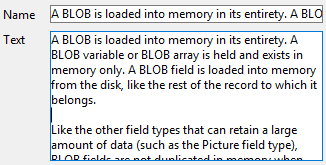
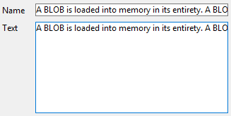
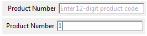
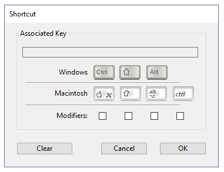
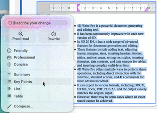

## Auto Spellcheck

4D includes an integrated and customizable spell-check utility. Text type [inputs](input_overview.md) can be checked, as well as [4D Write Pro](writeProArea_overview.md) documents.

The Auto Spellcheck property activates the spell-check for each object. When used, a spell-check is automatically performed during data entry. You can also execute the [`SPELL CHECKING`](../commands/spell-checking) 4D language command for each object to be checked.

:::note Writing Tools (macOS)

On macOS, if you want to provide your users with Apple Intelligence Writing Tools so that they can spellcheck their documents using IA, you might consider using the [Writing Tools](#writing-tools) property.

:::

#### JSON Grammar

|Name|Data Type|Possible Values|
|---|---|---|
|spellcheck|boolean |true, false|

#### Objects Supported

[4D Write Pro area](writeProArea_overview.md) - [Input](input_overview.md)

#### Commands

[`OBJECT Get auto spellcheck`](../commands/object-get-auto-spellcheck) - [`OBJECT SET AUTO SPELLCHECK`](../commands/object-set-auto-spellcheck) - [`WP Get view properties`](../WritePro/commands-legacy/wp-get-view-properties.md) - [`WP SET VIEW PROPERTIES`](../WritePro/commands-legacy/wp-set-view-properties.md)

---

## Context Menu

Allows the user access to a standard context menu in the object when the form is executed.

For a picture type [input](input_overview.md), in addition to standard editing commands (Cut, Copy, Paste and Clear), the menu contains the **Import...** command, which can be used to import a picture stored in a file, as well as the **Save as...** command, which can be used to save the picture to disk. The menu can also be used to modify the display format of the picture: the **Truncated non-centered**, **Scaled to fit** and **Scaled to fit centered prop.** options are provided. The modification of the [display format](properties_Display.md#picture-format) using this menu is temporary; it is not saved with the record.

For a [multi-style](properties_Text.md#multi-style) text type [input](input_overview.md) or [listbox column](listbox-column.md), in addition to standard editing commands, the context menu provides the following commands:

- **Fonts...**: displays the font system dialog box
- **Recent fonts**: displays the names of recent fonts selected during the session. The list can store up to 10 fonts (beyond that, the last font used replaces the oldest). By default, this list is empty and the option is not displayed. You can manage this list using the `SET RECENT FONTS` and `FONT LIST` commands.
- commands for supported style modifications: font, size, style, color and background color.
When the user modifies a style attribute via this pop-up menu, 4D generates the `On After Edit` form event.

For a [Web Area](webArea_overview.md), the contents of the menu depend of the rendering engine of the platform. It is possible to control access to the context menu via the [`WA SET PREFERENCE`](../commands/wa-set-preference) command.

#### JSON Grammar

|Name|Data Type|Possible Values|
|---|---|---|
|contextMenu|string |"automatic" (used if missing), "none"|

#### Objects Supported

[Input](input_overview.md) - [List Box Column](listbox-column.md) - [Web Area](webArea_overview.md) - [4D Write Pro areas](writeProArea_overview.md)

#### Commands

[`OBJECT Get context menu`](../commands/object-get-context-menu) - [`OBJECT SET CONTEXT MENU`](../commands/object-set-context-menu) - [`WA GET PREFERENCE`](../commands/wa-get-preference) - [`WA SET PREFERENCE`](../commands/wa-set-preference)

---

## Enterable

The Enterable attribute indicates whether users can enter values into the object.

Objects are enterable by default. If you want to make a field or an object non-enterable for that form, you can disable the Enterable property for the object. A non-enterable object only displays data. You control the data by methods that use the field or variable name. You can still use the `On Clicked`, `On Double Clicked`, `On Drag Over`, `On Drop`, `On Getting Focus` and `On Losing Focus` form events with non-enterable objects. This makes it easier to manage custom context menus and lets you design interfaces where you can drag-and-drop and select non-enterable variables.

When this property is disabled, any pop-up menus associated with a list box column via a list are disabled.

#### JSON Grammar

|Name|Data Type|Possible Values|
|---|---|---|
|enterable|boolean |true, false|

#### Objects Supported

[4D Write Pro areas](writeProArea_overview.md) - [Check Box](checkbox_overview.md) - [Hierarchical List](list_overview.md) - [Input](input_overview.md) - [List Box Column](listbox-column.md) - [Progress Bar](progressIndicator.md) - [Ruler](ruler.md) - [Stepper](stepper.md)

#### Commands

[`OBJECT Get enterable`](../commands/object-get-enterable) - [`OBJECT SET ENTERABLE`](../commands/object-set-enterable)

#### See also

[`FORM GET ENTRY ORDER`](../commands/form-get-entry-order) - [`FORM SET ENTRY ORDER`](../commands/form-set-entry-order)

---

## Entry Filter

An entry filter controls exactly what the user can type during data entry. Unlike [required lists](properties_RangeOfValues.md#required-list) for example, entry filters operate on a character-by-character basis. For example, if a part number always consists of two letters followed by three digits, you can use an entry filter to restrict the user to that pattern. You can even control the particular letters and numbers.

An entry filter operates only during data entry. It has no effect on data display after the user deselects the object. In general, you use entry filters and [display formats](properties_Display.md) together. The filter constrains data entry and the format ensures proper display of the value after data entry.

During data entry, an entry filter evaluates each character as it is typed. If the user attempts to type an invalid character (a number instead of a letter, for example), 4D simply does not accept it. The null character remains unchanged until the user types a valid character.

Entry filters can also be used to display required formatting characters so that the user need not enter them. For example, an American telephone number consists of a three-digit area code, followed by a seven-digit number that is broken up into two groups of three and four digits, respectively. A display format can be used to enclose the area code in parentheses and display a dash after the third digit of the telephone number. When such a format is used, the user does not need to enter the parentheses or the dashes.

### Defining an entry filter  

Most of the time, you can use one of the [built-in filters](#default-entry-filters) of 4D for what you need; however, you can also create and use custom filters:

- you can directly enter a filter definition string
- or you can enter the name of an entry filter created in the Filters editor in the Toolbox. The names of custom filters you create begin with a vertical bar (|).

### Default entry filters  

Here is a table that explains each of the entry filter choices in the Entry Filter drop-down list:

|Entry Filter|Description|
|---|---|
|~A| Allow any letters, but convert to uppercase.|
|&9| Allow only numbers.|
|&A| Allow only capital letters.|
|&a| Allow only letters (uppercase and lowercase).|
|&@| Allow only alphanumeric characters. No special characters.|
|~a##| State name abbreviation (e.g., CA). Allow any two letters, but convert to uppercase.|
|!0&9##/##/##| Standard date entry format. Display zeros in entry spaces. Allow any numbers.|
|!0&9 Day: ## Month: ## Year: ##| Custom date entry format. Display zeros in entry spaces. Allow any numbers. Two entries after each word.|
|!0&9##:##| Time entry format. Limited to hours and minutes. Display zeros in entry spaces. Allow any four numbers, separated by a colon.|
|!0&9## Hrs ## Mins ## Secs| Time entry format. Display zeros in entry spaces. Allow any two numbers before each word.|
|!0&9Hrs: ## Mins: ## Secs: ## |Time entry format. Display zeros in entry spaces. Allow any two numbers after each word.|
|!0&9##-##-##-##| Local telephone number format. Display zeros in entry spaces. Allow any number. Three entries, hyphen, four entries.|
|!_&9(###)!0###-####| Long distance telephone number. Display underscores in first three entry spaces, zeros in remainder.|
|!0&9###-###-###| Long distance telephone number. Display zeros in entry spaces. Allow any number. Three entries, hyphen, three entries, hyphen, four entries.|
|!0&9###-##-###| Social Security number. Display zeros in entry spaces. Allow any numbers.|
|~"A-Z;0-9; ;,;.;-"| Uppercase letters and punctuation. Allow only capital letters, numbers, spaces, commas, periods, and hyphens.|
|&"a-z;0-9; ;,;.;-"| Upper and lowercase letters and punctuation. Allow lowercase letters, numbers, spaces, commas, periods, and hyphens.|
|&"0-9;.;-"| Numbers. Allow only numbers, decimal points, and hyphens (minus sign).|

#### JSON Grammar

|Name|Data Type|Possible Values|
|---|---|---|
|entryFilter|string |<li>Entry filter code</li> or <li>Entry filter name (filter names start with &#124; )</li>|

#### Objects Supported

[Check Box](checkbox_overview.md) - [Combo Box](comboBox_overview.md) - [Hierarchical List](list_overview.md) - [Input](input_overview.md) - [List Box Column](listbox-column.md)

---

#### Commands

[`OBJECT Get filter`](../commands/object-get-filter) - [`OBJECT SET FILTER`](../commands/object-set-filter)

## Focusable

When the **Focusable** property is enabled for an object, the object can have the focus (and can thus be activated by the keyboard for instance). It is outlined by a gray dotted line when it is selected — except when the [Hide focus rectangle](properties_Appearance.md#hide-focus-rectangle) option has also been selected.

> An [input object](input_overview.md) is always focusable if it has the [Enterable](#enterable) property.

-  Check box shows focus when selected

-  Check box is selected but cannot show focus|

When the **Focusable** property is selected for a non-enterable object, the user can select, copy or even drag-and-drop the contents of the area.

#### JSON Grammar

|Name|Data Type|Possible Values|
|---|---|---|
|focusable|boolean |true, false|

#### Objects Supported

[4D Write Pro areas](writeProArea_overview.md) - [Button](button_overview.md) - [Check Box](checkbox_overview.md) - [Drop-down List](dropdownList_Overview.md) - [Hierarchical List](list_overview.md) - [Input](input_overview.md) - [List Box](listbox_overview.md) - [Plug-in Area](pluginArea_overview.md) - [Radio Button](radio_overview.md) - [Subform](subform_overview.md)

#### Commands

[`OBJECT Get enterable`](../commands/object-get-enterable) - [`OBJECT SET ENTERABLE`](../commands/object-set-enterable)

---

## Keyboard Layout

This property associates a specific keyboard layout to an [input object](input_overview.md). For example, in an international application, if a form contains a field whose contents must be entered in Greek characters, you can associate the "Greek" keyboard layout with this field. This way, during data entry, the keyboard configuration is automatically changed when this field has the focus.

By default, the object uses the current keyboard layout.

> You can also set and get the keyboard dynamically using the `OBJECT SET KEYBOARD LAYOUT` and `OBJECT Get keyboard layout` commands.

#### JSON Grammar

|Name|Data Type|Possible Values|
|---|---|---|
|keyboardDialect|text |Language code, for example "ar-ma" or "cs". See RFC3066, ISO639 and ISO3166|

#### Objects Supported

[4D Write Pro areas](writeProArea_overview.md) - [Input](input_overview.md)

#### Commands

[`OBJECT Get keyboard layout`](../commands/object-get-keyboard-layout) - [`OBJECT SET KEYBOARD LAYOUT`](../commands/object-set-keyboard-layout)

---

## Multiline

This property is available for [inputs objects](input_overview.md) containing expressions of the Text type and fields of the Alpha and Text type. It can have three different values: Yes, No, Automatic (default).

#### Automatic

- In single-line inputs, words located at the end of lines are truncated and there are no line returns.
- In multiline inputs, 4D carries out automatic line returns:  

#### No

- In single-line inputs, words located at the end of lines are truncated and there are no line returns.
- There are never line returns: the text is always displayed on a single row. If the Alpha or Text field or variable contains carriage returns, the text located after the first carriage return is removed as soon as the area is modified:  

#### Yes

When this value is selected, the property is managed by the [Wordwrap](properties_Display.md#wordwrap) option.

#### JSON Grammar

|Name|Data Type|Possible Values|
|---|---|---|
|multiline|text |"yes", "no", "automatic" (default if not defined)|

#### Objects Supported

[Input](input_overview.md)

#### Commands

[`OBJECT Get multiline`](../commands/object-get-multiline) - [`OBJECT SET MULTILINE`](../commands/object-set-multiline)

---

## Placeholder

4D can display placeholder text in the fields of your forms.

Placeholder text appears as watermark text in a field, supplying a help tip, indication or example for the data to be entered. This text disappears as soon as the user enters a character in the area:

The placeholder text is displayed again if the contents of the field is erased.

A placeholder can be displayed for the following types of data:

- string (text or alpha)
- date and time when the **Blank if null** property is enabled.

You can use an XLIFF reference in the ":xliff:resname" form as a placeholder, for example:

 :xliff:PH_Lastname

You only pass the reference in the "Placeholder" field; it is not possible to combine a reference with static text.

>You can also set and get the placeholder text by programming using the [`OBJECT SET PLACEHOLDER`](../commands/object-set-placeholder) and [`OBJECT Get placeholder`](../commands/object-get-placeholder) commands.

#### JSON Grammar

|Name|Data Type|Possible Values|
|---|---|---|
|placeholder |string |Text to be displayed (grayed out) when the object does not contain any value|

#### Objects Supported

[Combo Box](comboBox_overview.md) - [Input](input_overview.md)

#### See also

[Help tip](properties_Help.md)

#### Commands

[`OBJECT Get placeholder`](../commands/object-get-placeholder) - [`OBJECT SET PLACEHOLDER`](../commands/object-set-placeholder)

---

## Selection always visible

This property keeps the selection visible within the object after it has lost the focus. This makes it easier to implement interfaces that allow the text style to be modified (see [Multi-style](properties_Text.md#multi-style)).

#### JSON Grammar

|Name|Data Type|Possible Values|
|---|---|---|
|showSelection|boolean |true, false|

#### Objects Supported

[4D Write Pro areas](writeProArea_overview.md) - [Input](input_overview.md)

---

## Shortcut

This property allows setting special meaning keys (keyboard shortcuts) for [buttons](button_overview.md), [radio buttons](radio_overview.md), and [checkboxes](checkbox_overview.md). They allow the user to use the control using the keyboard instead of having to use the mouse.

You can configure this option by clicking the [...] button in the Shortcuts property in the Property List.

>You can also assign a shortcut to a custom menu command. If there is a conflict between two shortcuts, the active object has priority. For more information about associating shortcuts with menus, refer to [Setting menu properties](../Menus/properties.md).

To view a list of all the shortcuts used in the 4D Design environment, see the [Shortcuts Page](../Preferences/shortcuts.md) in the Preferences dialog box.

#### JSON Grammar

|Name|Data Type|Possible Values|
|---|---|---|
|shortcutAccel |boolean|true, false (Ctrl Windows/Command macOS)|
|shortcutAlt |boolean|true, false|
|shortcutControl |boolean |true, false (macOS Control)|
|shortcutShift |boolean |true, false|  
||||
|shortcutKey |string |<li>any character key: "a", "b"...</li><li>"[F1]" -> "[F15]", "[Return]", "[Enter]", "[Backspace]", "[Tab]", "[Esc]", "[Del]", "[Home]", "[End]", "[Help]", "[Page up]", "[Page down]", "[left arrow]", "[right arrow]", "[up arrow]", "[down arrow]"</li>|

#### Objects Supported

[Button](button_overview.md) - [Check Box](checkbox_overview.md) - [Picture Button](pictureButton_overview.md) - [Radio Button](radio_overview.md)

#### Commands

[`OBJECT GET SHORTCUT`](../commands/object-get-shortcut) - [`OBJECT SET SHORTCUT`](../commands/object-set-shortcut)

---

## Single-Click Edit

Enables direct passage to edit mode in list boxes.

When this option is enabled, list box cells switch to edit mode after a single user click, regardless of whether or not this area of the list box was selected beforehand. Note that this option allows cells to be edited even when the list box [selection mode](properties_ListBox.md#selection-mode) is set to "None".

When this option is not enabled, users must first select the cell row and then click on a cell in order to edit its contents.

#### JSON Grammar

|Name|Data Type|Possible Values|
|---|---|---|
|singleClickEdit|boolean |true, false|

#### Objects Supported

[List Box](listbox_overview.md)

#### Commands

[LISTBOX Get property](../commands/listbox-get-property) - [LISTBOX SET PROPERTY](../commands/listbox-set-property)

---

## Writing Tools

On macOS, this property lets end users apply [Apple Intelligence **Writing Tools**](https://support.apple.com/guide/mac-help/find-the-right-words-with-writing-tools-mchldcd6c260/mac) to the text of [4D Write Pro](writeProArea_overview.md) and [input](input_overview.md) (with [multiline](#multiline) support) form objects. Writing Tools use AI to proofread, rewrite, summarize, or change the tone of text directly within your 4D application.

:::tip Related blog post

Refer to [Apple Writing Tools – Now Available in 4D Write Pro and Text Input](https://blog.4d.com/apple-writing-tools-now-available-in-4d-write-pro-and-text-input) blog post to **see Writing Tools in action**. 

:::

When the property is enabled and the form is executed, a **Show Writing Tools** menu item is added to the [context menu](#context-menu) of the object. When the user selects an action in the Writing Tools, the text is replaced with the returned modification:

- if some text is selected, only the selection is replaced,
- if there is no selection, the whole contents of the area is used (for a [4D Write Pro](writeProArea_overview.md) area, the whole contents of the current container). The context used by the Writing Tools is the container in which the cursor is located (header, footer, body, or text box) along with the current selection.

:::note

Styles are usually preserved when using Writing Tools, however with some AI features they might be replaced.  

:::

The Writing Tools can also be displayed through the **writingTools** [standard action](properties_Action.md#standard-action), which can be assigned to a button or a menu item.

:::note

The Writing Tools feature relies on **Apple Intelligence** and is only available on compatible macOS computers when *Apple Intelligence & Siri* is enabled in the System Settings. On Windows, or when Apple Intelligence is not enabled, the property remains available in the Property List but the feature and the associated **WritingTools** standard action are deactivated at runtime (if the action is invoked by programming, it does nothing).

:::

The availability and default value of the property depend on the object type:

|Object|Availability in the Property List|Default value|
|---|---|---|
|[Input](input_overview.md)|Only when the [Multiline](#multiline) property is set to "Yes" or "Automatic"|False|
|[4D Write Pro area](writeProArea_overview.md)|Always displayed|True|

#### JSON Grammar

|Name|Data Type|Possible Values|
|---|---|---|
|writingTools|boolean |true, false|

#### Objects Supported

[4D Write Pro area](writeProArea_overview.md) - [Input](input_overview.md) ([multiline](#multiline))

