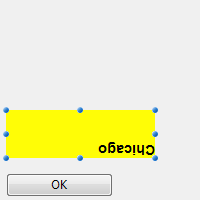

---

## Allow font/color picker

When this property is enabled, the [OPEN FONT PICKER](../commands/open-font-picker) and [OPEN COLOR PICKER](../commands/open-color-picker) commands can be called to display the system font and color picker windows. Using these windows, the users can change the font or color of a form object that has the focus directly by clicking. When this property is disabled (default), the open picker commands have no effect.

#### JSON Grammar

|Property|Data Type|Possible Values|
|---|---|---|
|allowFontColorPicker|boolean |false (default), true|

#### Objects Supported

[Input](input_overview.md)

---

## Bold

Sets the selected text to appear darker and heavier.

You can set this property using the [**OBJECT SET FONT STYLE**](../commands/object-set-font-style) command.

>This is normal text.<br/>
**This is bold text.**

#### JSON Grammar

|Property|Data Type|Possible Values|
|---|---|---|
|fontWeight|text |"normal", "bold"|

#### Objects Supported

[Button](button_overview.md) - [Check Box](checkbox_overview.md) - [Combo Box](comboBox_overview.md) - [Drop-down List](dropdownList_Overview.md) - [Group Box](groupBox.md) - [Hierarchical List](list_overview.md) - [Input](input_overview.md) - [List Box](listbox_overview.md) - [List Box Column](listbox-column.md) - [List Box Footer](listbox-header-footer.md#footers) - [List Box Header](listbox-header-footer.md#headers) - [Radio Button](radio_overview.md) - [Text Area](text.md)

#### Commands

[OBJECT Get font style](../commands/object-get-font-style) - [OBJECT SET FONT STYLE](../commands/object-set-font-style)

---

## Italic

Sets the selected text to slant slightly to the right.

You can also set this property via the [**OBJECT SET FONT STYLE**](../commands/object-set-font-style) command.

>This is normal text.<br/>
*This is text in italics.*

#### JSON Grammar

|Name|Data Type|Possible Values|
|---|---|---|
|fontStyle|string |"normal", "italic"|

#### Objects Supported

[Button](button_overview.md) - [Check Box](checkbox_overview.md) - [Combo Box](comboBox_overview.md) - [Drop-down List](dropdownList_Overview.md) - [Group Box](groupBox.md) - [Hierarchical List](list_overview.md) - [Input](input_overview.md) - [List Box](listbox_overview.md) - [List Box Column](listbox-column.md) - [List Box Footer](listbox-header-footer.md#footers) - [List Box Header](listbox-header-footer.md#headers) - [Radio Button](radio_overview.md) - [Text Area](text.md)

#### Commands

[OBJECT Get font style](../commands/object-get-font-style) - [OBJECT SET FONT STYLE](../commands/object-set-font-style)

---

## Underline

Sets the text to have a line running beneath it.

#### JSON Grammar

|Name|Data Type|Possible Values|
|---|---|---|
|textDecoration|string|"normal", "underline"|

#### Objects Supported

[Button](button_overview.md) - [Check Box](checkbox_overview.md) - [Combo Box](comboBox_overview.md) - [Drop-down List](dropdownList_Overview.md) - [Group Box](groupBox.md) - [Hierarchical List](list_overview.md) - [Input](input_overview.md) - [List Box](listbox_overview.md) - [List Box Column](listbox-column.md) - [List Box Footer](listbox-header-footer.md#footers) - [List Box Header](listbox-header-footer.md#headers) - [Radio Button](radio_overview.md) - [Text Area](text.md)

#### Commands

[OBJECT Get font style](../commands/object-get-font-style) - [OBJECT SET FONT STYLE](../commands/object-set-font-style)

---

## Font

This property allows you to specify either the **font theme** or the **font family** used in the object.

>**Font theme** and **font family** properties are mutually exclusive. A font theme takes hold of font attributes, including size. A font family allows you to define font name, font size and font color.

### Font Theme

The font theme property designates an automatic style name. Automatic styles determine the font family, font size and font color to be used for the object dynamically according to system parameters. These parameters depend on:

- the platform,
- the system language,
- and the type of form object.

With the font theme, you are guaranteed that titles are always displayed in accordance with the current interface standards of the system. However, their size may vary from one machine to another.

Three font themes are available:

- **normal**: automatic style, applied by default to any new object created in the Form editor.
- **main** and **additional** font themes are only supported by [text areas](text.md) and [inputs](input_overview.md). These themes are primarily intended for designing dialog boxes. They refer to font styles used, respectively, for main text and additional information in your interface windows. Here are typical dialog boxes (macOS and Windows) using these font themes:


> Font themes manage the font as well as its size and color. You can apply custom style properties (Bold, Italic or Underline) without altering its functioning.

#### JSON Grammar

|Name|Data Type|Possible Values|
|---|---|---|
|fontTheme|string |"normal", "main", "additional"|

#### Objects Supported

[Button](button_overview.md) - [Check Box](checkbox_overview.md) - [Combo Box](comboBox_overview.md) - [Drop-down List](dropdownList_Overview.md) - [Group Box](groupBox.md) - [Hierarchical List](list_overview.md) - [Input](input_overview.md) - [List Box](listbox_overview.md) - [List Box Column](listbox-column.md) - [List Box Footer](listbox-header-footer.md#footers) - [List Box Header](listbox-header-footer.md#headers) - [Radio Button](radio_overview.md) - [Text Area](text.md)

#### Commands

[OBJECT Get style sheet](../commands/object-get-style-sheet) - [OBJECT SET STYLE SHEET](../commands/object-set-style-sheet)

### Font Family

There are two types of font family names:

- *family-name:* The name of a font-family, like "times", "courier", "arial", etc.
- *generic-family:* The name of a generic-family, like "serif", "sans-serif", "cursive", "fantasy", "monospace".

You can set this using the [`OBJECT SET FONT`](../commands/object-set-font) command.  

#### JSON Grammar

|Name|Data Type|Possible Values|
|---|---|---|
|fontFamily|string |CSS font family name  |

>4D recommends using only [web safe](https://www.w3schools.com/cssref/css_websafe_fonts.asp) fonts.

#### Objects Supported

[Button](button_overview.md) - [Check Box](checkbox_overview.md) - [Combo Box](comboBox_overview.md) - [Drop-down List](dropdownList_Overview.md) - [Group Box](groupBox.md) - [Hierarchical List](list_overview.md) - [Input](input_overview.md) - [List Box](listbox_overview.md) - [List Box Column](listbox-column.md) - [List Box Footer](listbox-header-footer.md#footers) - [List Box Header](listbox-header-footer.md#headers) - [Radio Button](radio_overview.md) - [Text Area](text.md)

#### Commands

[OBJECT Get font](../commands/object-get-font) - [OBJECT SET FONT](../commands/object-set-font)

## Font Size

Allows defining the object's font size in points.

#### JSON Grammar

|Name|Data Type|Possible Values|
|---|---|---|
|fontSize|integer |Font size in points. Minimum value: 0|

#### Objects Supported

[Button](button_overview.md) - [Check Box](checkbox_overview.md) - [Combo Box](comboBox_overview.md) - [Drop-down List](dropdownList_Overview.md) - [Group Box](groupBox.md) - [Hierarchical List](list_overview.md) - [Input](input_overview.md) - [List Box](listbox_overview.md) - [List Box Column](listbox-column.md) - [List Box Footer](listbox-header-footer.md#footers) - [List Box Header](listbox-header-footer.md#headers) - [Radio Button](radio_overview.md) - [Text Area](text.md)

#### Commands

[OBJECT Get font size](../commands/object-get-font-size) - [OBJECT SET FONT SIZE](../commands/object-set-font-size)

---

## Font Color

Designates the font color.

> This property also sets the color of object's border (if any) when "plain" or "dotted" style is used.

The color can be specified by:

- a color name - like "red"
- a HEX value - like "#ff0000"
- an RGB value - like "rgb(255,0,0)"

You can also set this property using the [**OBJECT SET RGB COLORS**](../commands/object-set-rgb-colors) command.

#### JSON Grammar

|Name|Data Type|Possible Values|
|---|---|---|
|stroke|string | any css value, "transparent", "automatic"|

#### Objects Supported

[Button](button_overview.md) - [Check Box](checkbox_overview.md) - [Combo Box](comboBox_overview.md) - [Drop-down List](dropdownList_Overview.md) - [Group Box](groupBox.md) - [Hierarchical List](list_overview.md) - [Input](input_overview.md) - [List Box](listbox_overview.md) - [List Box Column](listbox-column.md) - [List Box Footer](listbox-header-footer.md#footers) - [List Box Header](listbox-header-footer.md#headers) - [Progress Indicators](progressIndicator.md) - [Ruler](ruler.md) - [Radio Button](radio_overview.md) - [Text Area](text.md)

#### Commands

[OBJECT GET RGB COLORS](../commands/object-get-rgb-colors) - [OBJECT SET RGB COLORS](../commands/object-set-rgb-colors) 


---

## Font Color Expression

`Selection and collection/entity selection type list boxes`

Used to apply a custom font color to each row of the list box. You must use RGB color values. For more information about this, refer to the description of the [`OBJECT SET RGB COLORS`](../commands/object-set-rgb-colors) command.

You must enter an expression or a variable (array type variables cannot be used). The expression or variable will be evaluated for each row displayed. You can use the constants described in the [`OBJECT SET RGB COLORS`](../commands/object-set-rgb-colors) command.

You can also set this property using the [`LISTBOX SET PROPERTY`](../commands/listbox-set-property) command with `lk font color expression` constant.

>This property can also be set using a [Meta Info Expression](properties_Text.md#meta-info-expression).

The following example uses a variable name: enter *CompanyColor* for the **Font Color Expression** and, in the form method, write the following code:

```4d
CompanyColor:=Choose([Companies]ID;Background color;Light shadow color;   
Foreground color;Dark shadow color)
```

#### JSON Grammar

|Name|Data Type|Possible Values|
|---|---|---|
|rowStrokeSource|string |Font color expression|

#### Objects Supported

[List Box](listbox_overview.md)

#### Commands

[LISTBOX Get property](../commands/listbox-get-property) - [LISTBOX SET PROPERTY](../commands/listbox-set-property)

---

## Style Expression {#style-expression}

`Selection and collection/entity selection type list boxes`

Used to apply a custom character style to each row of the list box or each cell of the column.

You must enter an expression or a variable (array type variables cannot be used). The expression or variable will be evaluated for each row displayed (if applied to the list box) or each cell displayed (if applied to a column). You can use the constants listed in the [`LISTBOX SET ROW FONT STYLE`](../commands/listbox-set-row-font-style) command.

Example:

```4d
Choose([Companies]ID;Bold;Plain;Italic;Underline)
```

You can also set this property using the [`LISTBOX SET PROPERTY`](../commands/listbox-set-property) command with `lk font style expression` constant.

>This property can also be set using a [Meta Info Expression](properties_Text.md#meta-info-expression).

#### JSON Grammar

|Name|Data Type|Possible Values|
|---|---|---|
|rowStyleSource|string|Style expression to evaluate for each row/cell.|

#### Objects Supported

[List Box](listbox_overview.md) - [List Box Column](listbox-column.md)

#### Commands

[LISTBOX Get property](../commands/listbox-get-property) - [LISTBOX SET PROPERTY](../commands/listbox-set-property)


---

## Horizontal Alignment

Horizontal location of text within the area that contains it.

#### JSON Grammar

|Name|Data Type|Possible Values|
|---|---|---|
|textAlign|string |"right", "center", "left", "automatic", "justify"|

:::note

- "automatic" is not supported by [check boxes](checkbox_overview.md) and [radio buttons](radio_overview.md)
- "justify" is only supported by [inputs](input_overview.md) and [text areas](text.md)
 
:::

#### Objects Supported

[Button](button_overview.md) - [Check Box](checkbox_overview.md) (all styles except Regular and Flat) - [Combo Box](comboBox_overview.md) - [Drop-down List](dropdownList_Overview.md) - [Group Box](groupBox.md) - [Input](input_overview.md) - [List Box](listbox_overview.md) - [List Box Column](listbox-column.md) - [List Box Header](listbox-header-footer.md#headers) - [List Box Footer](listbox-header-footer.md#footers) - [Radio Button](radio_overview.md) (all styles except Regular and Flat) - [Text Area](text.md)


#### Commands

[OBJECT Get horizontal alignment](../commands/object-get-horizontal-alignment) - [OBJECT SET HORIZONTAL ALIGNMENT](../commands/object-set-horizontal-alignment)

---

## Vertical Alignment

Vertical location of text within the area that contains it.

The **Default** option (`automatic` JSON value) sets the alignment according to the type of data found in each column:

- `bottom` for all data (except pictures) and
- `top` for picture type data.

This property can also be handled by the [`OBJECT Get vertical alignment`](../commands/object-get-vertical-alignment) and [`OBJECT SET VERTICAL ALIGNMENT`](../commands/object-set-vertical-alignment) commands.

#### JSON Grammar

|Name|Data Type|Possible Values|
|---|---|---|
|verticalAlign|string |"automatic", "top", "middle", "bottom"|

#### Objects Supported

[List Box](listbox_overview.md) - [List Box Column](listbox-column.md) - [List Box Footer](listbox-header-footer.md#footers) - [List Box Header](listbox-header-footer.md#headers)

#### Commands

[`OBJECT Get vertical alignment`](../commands/object-get-vertical-alignment) - [`OBJECT SET VERTICAL ALIGNMENT`](../commands/object-set-vertical-alignment)

---

## Meta Info Expression

`Collection or entity selection type list boxes`

Specifies an expression or a variable which will be evaluated for each row displayed. It allows defining a whole set of row text attributes. You must pass an **object variable** or an **expression that returns an object**. The following properties are supported:

|Property name| Type| Description|
|---|----|---|
|stroke |string |Font color. Any CSS color (ex: "#FF00FF"), "automatic", "transparent"|
|fill |string| Background color. Any CSS color (ex: "#F00FFF"), "automatic", "transparent"|
|fontStyle |string| "normal","italic"|
|fontWeight|string |"normal","bold"|
|textDecoration|string| "normal","underline"|
|unselectable|boolean| Designates the corresponding row as not being selectable (*i.e.*, highlighting is not possible). Enterable areas are no longer enterable if this option is enabled unless the "Single-Click Edit" option is also enabled. Controls such as checkboxes and lists remain functional. This setting is ignored if the list box selection mode is "None". Default value: False.|
|disabled |boolean |Disables the corresponding row. Enterable areas are no longer enterable if this option is enabled. Text and controls (checkboxes, lists, etc.) appear dimmed or grayed out. Default value: False.|

The special "cell" property allows you to apply a set of properties to a single column:

|Property name|||Type| Description|
|---|----|---|---|---|
|cell|||object|Properties to apply to single column(s)|
||*columnName*|| object|*columnName* is the object name of the list box column|
|||*propertyName*|string|"stroke", "fill", "fontStyle", "fontWeight", or "textDecoration" property (see above). **Note**: "unselectable" and "disabled" properties can only be defined at row level. They are ignored if passed in the "cell" object|

> Style settings made with this property are ignored if other style settings are already defined through expressions (*i.e.*, [Style Expression](#style-expression), [Font Color Expression](#font-color-expression), [Background Color Expression](./properties_BackgroundAndBorder.md#background-color-expression)).

**Examples**

In a *Color* project method, write the following code:

```4d
//Color method
//Sets font color for certain rows and background color for Col2 and Col3 columns
Form.meta:=New object
If(This.ID>5) //ID is an attribute of collection objects/entities
  Form.meta.stroke:="purple"
  Form.meta.cell:=New object("Col2";New object("fill";"black");\
  	"Col3";New object("fill";"red"))
Else
  Form.meta.stroke:="orange"
End if
```

**Best Practice:** For optimization reasons, it is usually recommended to create the `meta.cell` object once in the form method:

```4d
  //form method
 Case of
    :(Form event code=On Load)
       Form.colStyle:=New object("Col2";New object("fill";"black");\
       	"Col3";New object("fill";"red"))  
 // you can also define other style sets  
       Form.colStyle2:=New object("Col2";New object("fill";"green");\
       	"Col3";New object("fontWeight";"bold"))  
 End case
```

Then, the *Color* method would contain:

```4d
  //Color method
 ...
 If(This.ID>5)
    Form.meta.stroke:="purple"
    Form.meta.cell:=Form.colStyle //reuse the same object for better performance
 Else
 	Form.meta.stroke:="orange"
	Form.meta.cell:=Form.colStyle2
 End if
 ...
```


#### JSON Grammar

|Name|Data Type|Possible Values|
|---|---|---|
|metaSource| string|Object expression to evaluate for each row/cell.|

#### Objects Supported

[List Box](listbox_overview.md)

#### Commands

[LISTBOX Get property](../commands/listbox-get-property) - [LISTBOX SET PROPERTY](../commands/listbox-set-property)


---

## Multi-style

This property enables the possibility of using [specific styles](https://doc.4d.com/4Dv20/4D/20.6/Supported-tags.300-7488021.en.html) in the selected area. When this option is checked, 4D interprets any `<SPAN> HTML` tags found in the area.

By default, this option is not enabled.


#### JSON Grammar

|Name|Data Type|Possible Values|
|---|---|---|
|styledText| boolean|true, false|

#### Objects Supported

[Input](input_overview.md) - [List Box Column](listbox-column.md) 

#### Commands

[LISTBOX Get property](../commands/listbox-get-property) - [LISTBOX SET PROPERTY](../commands/listbox-set-property) - [OBJECT Is styled text](../commands/object-is-styled-text) - ["Styled Text" theme](../ommands/theme/Styled_Text.md)

### Supported tags  

You can use the following tags in 4D multi-style text areas.

#### 4D Expression  

```html
<span style="-d4-ref:'expression'"> </span>
```

This tag inserts a 4D expression (expression, method, field, variable, command, etc.) in the text. The expression is tokenized and evaluated:

- when the expression is inserted
- when the object is loaded
- when the `computeExpressions` standard action is called from an interface object or by the [`INVOKE ACTION`](../commands/invoke-action) command
- when the [`ST COMPUTE EXPRESSIONS`](../commands/st-compute-expressions) command is executed
- when the [`ST FREEZE EXPRESSIONS`](../commands/st-freeze-expressions) command is executed, if the second `*` parameter is passed.

The evaluated value of the expression is not saved in the `<span>` tag, only its reference is.

Note: To ensure that expressions will be evaluated correctly regardless of the 4D language or version used, we recommend using the token syntax for elements whose name might vary between different versions (commands, tables, fields, constants). For example, to insert the `Current time` command, enter `Current time:C178`. For more information about this, refer to *Using tokens in formulas*.

#### URL

```html
<span><a href="url">Visible label</a></span>
```

This tag inserts a URL in the text. Example:

```html
<span><a href="http://www.4d.com/">4D Web Site</a></span>
```

#### User link  

```html
<span style="-d4-ref-user:'myUserLink'">Click here</span>
```

"User links" look the same as URLs, but when you click them, they do not automatically open the source. You can pass any string you want as reference, and it is up to the developer to program any custom actions that occur when it is clicked. This means you can create links which are not URLs but references to files, 4D methods, and so on, that you can open or execute when they are clicked. The [`ST Get content type`](../commands/st-get-content-type) command detects if a user link has been clicked.

User links are defined using the [`ST SET TEXT`](../commands/st-set-text) command. For example:

```4d
ST SET TEXT(txtVar;"This is a user link: <span style=\"-d4-ref-user:'UserLink'\">User Label</span>";$start;$end)
 ```

#### Custom tags  

You can insert any tag in plain text, for example ``. It is stored in the code of the plain text without being interpreted or displayed. This is particularly useful in the context of e-mails in HTML format and including pictures for example.

#### Style tags  

This paragraph lists the attributes of \<SPAN> tags that are supported by 4D in rich text areas. You can use these tags to implement custom style handling. Only the tags listed below are supported by 4D for style variations.

- Font name: `<SPAN STYLE="font-family: DESDEMONA"> ... </SPAN>`
- Font size: `<SPAN STYLE="font-size: 20pt"> ... </SPAN>`
- Font style: 
    - Bold `<SPAN STYLE="font-weight: bold"> ... </SPAN>`
    - Italic `<SPAN STYLE="font-style: italic"> ... </SPAN>`
    - Normal `<SPAN STYLE="font-style: normal"> ... </SPAN>`
    - Underline `<SPAN STYLE="text-decoration: underline"> ... </SPAN>`
    - Strikethrough `<SPAN STYLE="text-decoration:line-through">...</SPAN>`

*Note: The "strikethrough" style is not supported under macOS, but this tag can still be managed by programming.*

- Font colors: `<SPAN STYLE="color:green"> ... </SPAN>` or `<SPAN STYLE="color:#006CCC">...</SPAN>`
- Background colors: `<SPAN STYLE="background-color:green"> ... </SPAN>` or `<SPAN STYLE="background-color:#006CCC">...</SPAN>`

#### Color values

For font color and background color attributes, the color value can be either the hexadecimal code for an RGB color, or the name of one of the 16 HTML colors defined for standard CSS by the W3C: 


### Working with text handling commands  

#### User interface

The commands that can be used to manipulate text objects by programming do not take any style tags integrated into the text into account. They act upon displayed text only. This concerns the following commands:

- [User Interface](../commands/theme/User_Interface.md) theme commands
- [`HIGHLIGHT TEXT`](../commands/highlight-text)
- [`GET HIGHLIGHT`](../commands/get-highlight)

When you use these commands with commands that manipulate character strings, it is necessary to filter the formatting characters using the [`ST Get plain text`](../commands/st-get-plain-text) command:

```4d
 HIGHLIGHT TEXT([Products]Notes;1;Length(ST Get plain text([Products]Notes))+1)
```

#### Objects (Forms)

The commands that can be used to modify the style of objects (for example, [`OBJECT SET FONT`](../commands/object-set-font)) apply to the whole object and not to the selection.

If the object does not have the focus when the command is executed, the modification is applied simultaneously to the object (the text area) and to its associated variable. If the object does have the focus, the modification is carried out on the object but not on the associated variable. The modification is only applied to the variable when the object loses the focus. Keep this principle in mind when programming text areas. 

:::note

If the [**Store with default style tags**](#store-with-default-style-tags) option is checked for the object, the use of these commands will cause a modification of the tags saved with each object.

:::


Note also that only default properties are affected by these commands (as well as any properties saved by means of default tags). Custom style tags remain as they are. For example, given a multi-style area where default tags were saved:


The plain text of the area is as follows:

```html
<span style="text-align:left;font-family:'Segoe UI';font-size:9pt;color:#009900">This is the word <span style="color:#D81E05">red</span></span>
```

If you execute the following code:

```4d
OBJECT SET COLOR(*;"myArea";-(Blue+(256*Yellow)))
```

The red color remains:


and code is:

```html	
<span style="text-align:left;font-family:'Segoe UI';font-size:9pt;color:#0000FF">This is the word <span style="color:#D81E05">red</span></span>
```

The following commands are concerned:

- [`OBJECT SET RGB COLORS`](../commands/object-set-rgb-colors)
- [`OBJECT SET FONT`](../commands/object-set-font)
- [`OBJECT SET FONT STYLE`](../commands/object-set-font-style)
- [`OBJECT SET FONT SIZE`](../commands/object-set-font-size)

In the context of multi-style areas, such commands should be used to set default styles only. To manage styles during database execution, we recommend using the [commands of the "Styled Text" theme](../commands/theme/Styled_Text.md).

#### Get edited text
  
When it is used with a rich text area, the [`Get edited text`](../commands/get-edited-text) command returns the text of the current area including any style tags. 

To retrieve the "plain" text (text without tags) being edited, you must use the [`ST Get plain text`](../commands/st-get-plain-text) command:

```4d
ST Get plain text(Get edited text)
```

#### Query and order by commands 

Queries and sorts carried out among multi-style objects take into account any style tags saved in the object. If a style modification has been made within a word, searching for the word will not be successful. 

To be able to carry out valid searches and sorts, you must use the [`ST Get plain text`](../commands/st-get-plain-text) command. For example:

```4d
QUERY BY FORMULA([MyTable];ST Get plain text([MyTable]MyFieldStyle)="very well")
```


---

## Orientation

Modifies the orientation (rotation) of a text area. Text areas can be rotated by increments of 90°. Each orientation value is applied while keeping the same lower left starting point for the object:

|Orientation value|Result|
|----|---|
|0 (default)||
|90||
|180||
|270||

In addition to [static text areas](text.md), [input](input_overview.md) text objects can be rotated when they are non-[enterable](properties_Entry.md#enterable). When a rotation property is applied to an input object, the enterable property is removed (if any). This object is then excluded from the entry order.

#### JSON Grammar

|Name|Data Type|Possible Values|
|---|---|---|
|textAngle|number |0, 90, 180, 270|

#### Objects Supported

[Input](input_overview.md) (non-enterable) - [Text Area](text.md)

#### Commands

[OBJECT Get text orientation](../commands/object-get-text-orientation) - [OBJECT SET TEXT ORIENTATION](../commands/object-set-text-orientation)

---

## Row Font Color Array {#row-font-color-array}

`Array type list boxes`

Allows setting a custom font color to each row of the list box or cell of the column.

The name of a Longint array must be used. Each element of this array corresponds to a row of the list box (if applied to the list box) or to a cell of the column (if applied to a column), so the array must be the same size as the array associated with the column. You can use the constants described in the [`OBJECT SET RGB COLORS`](../commands/object-set-rgb-colors) command. If you want the cell to inherit the background color defined at the higher level, pass the value -255 to the corresponding array element.

#### JSON Grammar

|Name|Data Type|Possible Values|
|---|---|---|
|rowStrokeSource|string|The name of a longint array|

#### Objects Supported

[List Box](listbox_overview.md) - [List Box Column](listbox-column.md)

#### Commands

[`LISTBOX Get array`](../commands/listbox-get-array) - [`LISTBOX GET ARRAYS`](../commands/listbox-get-arrays) - [`LISTBOX SET ARRAY`](../commands/listbox-set-array)


---

## Row Style Array {#row-style-array}

`Array type list boxes`

Allows setting a custom font style to each row of the list box or each cell of the column.

The name of a Longint array must be used. Each element of this array corresponds to a row of the list box (if applied to the list box) or to a cell of the column (if applied to a column), so the array must be the same size as the array associated with the column. To fill the array (using a method), use the constants listed in the [`LISTBOX SET ROW FONT STYLE`](../commands/listbox-set-row-font-style) command. You can add constants together to combine styles. If you want the cell to inherit the style defined at the higher level, pass the value -255 to the corresponding array element.

#### JSON Grammar

|Name|Data Type|Possible Values|
|---|---|---|
|rowStyleSource|string|The name of a longint array.|

#### Objects Supported

[List Box](listbox_overview.md) - [List Box Column](listbox-column.md)

#### Commands

[`LISTBOX Get array`](../commands/listbox-get-array) - [`LISTBOX GET ARRAYS`](../commands/listbox-get-arrays) - [`LISTBOX SET ARRAY`](../commands/listbox-set-array)


---

## Store with default style tags

This property is only available for a [Multi-style](#multi-style) input area.
When this property is enabled, the area will store the style tags with the text, even if no modification has been made. In this case, the tags correspond to the default style. When this property is disabled, only modified style tags are stored.

For example, here is a text that includes a style modification:


When the property is disabled, the area only stores the modification. The stored contents are therefore:

```
What a <SPAN STYLE="font-size:13.5pt">beautiful</SPAN> day!
```

When the property is enabled, the area stores all the formatting information. The first generic tag describes the default style then each variation is the subject of a pair of nested tags. The contents stored in the area are therefore:

```
<SPAN STYLE="font-family:'Arial';font-size:9pt;text-align:left;font-weight:normal;font-style:normal;text-decoration:none;color:#000000;background-color:#FFFFFF">What a <SPAN STYLE="font-size:13.5pt">beautiful</SPAN> day!</SPAN>
```

#### JSON Grammar

|Name|Data Type|Possible Values|
|---|---|---|
|storeDefaultStyle|boolean|true, false (default).|

#### Objects Supported

[Input](input_overview.md)

