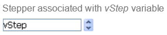

A stepper lets the user scroll through numeric values, durations (times) or dates by predefined steps by clicking on the arrow buttons.

## Using steppers

You can assign the variable associated with the object to an enterable area (field or variable) to store or modify the current value of the object.

A stepper can be associated directly with a number, time or date variable.

* For values of the time type, the Minimum, Maximum and Step properties represent seconds. For example, to set a stepper from 8:00 to 18:00 with 10-minute steps:
    * [minimum](properties_Scale.md#minimum) = 28 800 (8\*60\*60)
    * [maximum](properties_Scale.md#maximum) = 64 800 (18\*60\*60)
    * [step](properties_Scale.md#step) = 600 (10\*60)
* For values of the date type, the value entered in the [step](properties_Scale.md#step) property represents days. The Minimum and Maximum properties are ignored.

>For the stepper to work with a time or date variable, it is imperative to set its type in the form AND to [declare it explicitly](../Concepts/variables.md#declaring-variables) as `Time` or `Date`. 

For more information, please refer to [Using indicators](progressIndicator.md#using-indicators) in the "Progress Indicator" page.

## Supported Properties

[Border Line Style](properties_BackgroundAndBorder.md#border-line-style) - [Bottom](properties_CoordinatesAndSizing.md#bottom) - [Class](properties_Object.md#css-class) - [Enterable](properties_Entry.md#enterable) - [Execute object method](properties_Action.md#execute-object-method) - [Expression Type](properties_Object.md#expression-type) (only "integer", "number", "date", or "time") - [Height](properties_CoordinatesAndSizing.md#height) - [Help Tip](properties_Help.md#help-tip) - [Horizontal Sizing](properties_ResizingOptions.md#horizontal-sizing) - [Left](properties_CoordinatesAndSizing.md#left) - [Maximum](properties_Scale.md#maximum) - [Minimum](properties_Scale.md#minimum) - [Object Name](properties_Object.md#object-name) - [Right](properties_CoordinatesAndSizing.md#right) - [Step](properties_Scale.md#step) - [Top](properties_CoordinatesAndSizing.md#top) - [Type](properties_Object.md#type) - [Variable or Expression](properties_Object.md#variable-or-expression) - [Vertical Sizing](properties_ResizingOptions.md#vertical-sizing) - [Visibility](properties_Display.md#visibility) - [Width](properties_CoordinatesAndSizing.md#width)  

## Supported Events

[On Begin Drag Over](../Events/onBeginDragOver.md) - [On Clicked](../Events/onClicked.md) - [On Data Change](../Events/onDataChange.md) - [On Double Clicked](../Events/onDoubleClicked.md) - [On Drag Over](../Events/onDragOver.md) - [On Drop](../Events/onDrop.md) - [On Getting focus](../Events/onGettingFocus.md) - [On Header](../Events/onHeader.md) - [On Load](../Events/onLoad.md) - [On Losing focus](../Events/onLosingFocus.md) - [On Mouse Enter](../Events/onMouseEnter.md) - [On Mouse Leave](../Events/onMouseLeave.md) - [On Mouse Move](../Events/onMouseMove.md) - [On Printing Break](../Events/onPrintingBreak.md) - [On Printing Detail](../Events/onPrintingDetail.md) - [On Printing Footer](../Events/onPrintingFooter.md) - [On Unload](../Events/onUnload.md) - [On Validate](../Events/onValidate.md)

## See also
- [progress indicators](progressIndicator.md) 
- [rulers](ruler.md)

