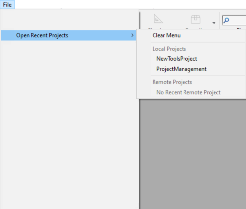

## Creating a project

New 4D application projects can be created from **4D** or **4D Server**. In any case, project files are stored on the local machine.

To create a new project:

1. Launch 4D or 4D Server.
2. Do one of the following:
    * Select **New > Project...** from the **File** menu: 
    * (4D only) Select **Project...** from the **New** toolbar button:
    
    A standard **Save** dialog appears so you can choose the name and location of the 4D project's main folder.

:::note

The **Database...** and **Database From Structure Definition...** items are only available if you have selected the [**Enable binary database creation** option](../Preferences/general.md#enable-binary-database-creation) in your Preferences (disabled by default). 

:::

3. Enter the name of your project folder and click **Save**. This name will be used:

	* as the name of the entire project folder,
	* as the name of the .4DProject file at the first level of the ["Project" folder](../Project/architecture.md#project-folder).

 You can choose any name allowed by your operating system. However, if your project is intended to work on other systems or to be saved via a source control tool, you must take their specific naming recommendations into account.

When you validate the **Save** dialog, 4D closes the current project (if any), creates a project folder at the indicated location, and puts all files needed for the project into it. For more information, refer to [Architecture of a 4D Project](Project/architecture.md).

You can then start developing your project.

## Opening a project

To open an existing project from 4D:

1. Do one of the following:

    * Select **Open/Local Project...** from the **File** menu or the **Open** toolbar button.
    * Select **Open a local application project** in the Welcome Wizard dialog

The standard Open dialog appears.

2. Select the project's `.4dproject` file (located inside the ["Project" folder of the project](../Project/architecture.md#project-folder)) and click **Open**. 

	By default, the project is opened with its current data file. Other file types are suggested:

	* *Packed project files*: `.4dz` extension  - deployment projects
	* *Shortcut files*: `.4DLink` extension - store additional parameters needed for opening projects or applications (addresses, identifiers, etc.)
	* *Binary files*: `.4db` or `.4dc` extension - legacy 4D database formats

:::note

You can also launch 4D projects without any interface thanks to the 4D [CLI (Command Line Interface)](../Admin/cli.md).

:::

### Options

In addition to standard system options, the *Open* dialog in 4D provides two menus with specific options that are available using the **Open** button and the **Data file** menu.

* **Open** - opening mode of the project:
  * **Interpreted** or **Compiled**: These options are available when the selected project contains both [interpreted and compiled code](Concepts/interpreted.md).
  * **[Maintenance Security Center](MSC/overview.md)**: Opening in secure mode allowing access to damaged projects in order to perform any necessary repairs.

* **Data file** - specifies the data file to be used with the project. By default, the **Current data file** option is selected. This menu includes two additional options since 4D allows you to use the same project with different data files. 
  * **Choose another data file**: Opens the project with an existing data file other than the current one. When you select this option and then click on **Open**, the standard Open data file dialog box appears so that you can designate a data file.  
  * **Create a new data file**: Creates a blank data file for the project. When you select this option and then click on **Open**, the standard Save data file dialog box appears.  

:::note

In order to preserve data integrity, 4D does not allow a data file to be opened if it has not been created by the current project file. The program automatically assigns internal link numbers (UUID) to the data and project files when they are created or when the project is converted. These numbers are verified when the data file is opened. 

:::

Once you have changed the current data file, 4D opens it by default subsequently. If you move or rename the data file, you will need to locate it again. It is possible to change the data file using a keyboard shortcut on startup (see below). You can view the current data file at any time on the [Information page of the MSC](../MSC/information.md#data).

### Startup Maintenance Dialog

If you need to interrupt the startup sequence, for example if the project is not launching properly or if you want to switch to a different data file, hold down the **Alt** (Windows) or **Option** (macOS) key during database startup to display the startup maintenance dialog box: 

The following maintenance options are available:

- **Open the application with the default data file**: continues the standard opening process.
- **Select another data file** / **Create a new data file**: allows you to change of data file (see above). 
- **Restore a backup file**: opens standard Open file dialog box, so that you can select a backup file (.4bk) or a log backup file (.4bl) to [restore](../Backup/restore.md#manually-restoring-a-backup-standard-dialog).
- **Open the Maintenance and Security Center**: opens the project in [maintenance mode](../MSC/overview.md#display-in-maintenance-mode).

## Project opening shortcuts

4D offers several ways to open projects directly and bypass the Open dialog:

* via the **Open Recent Projects / {project name}** submenu of the **File** menu or **Open** toolbar button.  
   
* double-click or drag and drop a `.4DLink` file onto the 4D application (see below).
* by setting the **At startup** general preference to [**Open last used project**](../Preferences/general.md#at-startup).

:::note Notes

- On Windows, a 4D Server project can be automatically launched at session startup if it is [registered as a Service](../server/service.md).  
- A [built 4D application](../Desktop/building.md) can be launched by a double-click on the application icon.

:::

## About 4DLink Files

Files with the `.4DLink` extension are XML files that contain parameters intended to automate and simplify opening local or remote 4D projects.

`.4DLink` files can save the address of a 4D project as well as its connection identifiers and opening mode, saving you time when opening projects.

4D automatically generates a `.4DLink` file when a local project is opened for the first time or when connecting to a server for the first time. The file is stored in the local preferences folder at the following location:

* Windows: C:\Users\UserName\AppData\Roaming\4D\Favorites vXX\
* macOS: Users/UserName/Library/Application Support/4D/Favorites vXX/

XX represents the version number of the application. For example, "Favorites v19" for 4D v19.

That folder is divided into two subfolders:

* the **Local** folder contains the `.4DLink` files that can be used to open local projects
* the **Remote** folder contains the `.4DLink` files of recent remote projects

`.4DLink` files can also be created with an XML editor.

4D provides a DTD describing the XML keys that can be used to build a `.4DLink` file. This DTD is named database_link.dtd and is found in the `\Resources\DTD\` subfolder of the 4D application.

