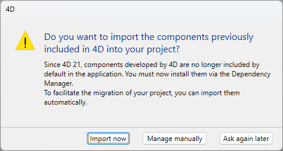

## 4D 21

Read [**What’s new in 4D 21**](https://blog.4d.com/en-whats-new-in-4d-21/), the blog post that lists all new features and enhancements in 4D 21.

#### Highlights

- Support of  AI Vector Searches in the [`query()`](../API/DataClassClass.md#query-by-vector-similarity) function and in the [`$filter`](../REST/$filter.md#vector-similarity) REST API. 
- Support of TLS encryption for the [4D.TCPConnection](../API/TCPConnectionClass.md#4dtcpconnectionnew) class.
- Web Server: 
	- new [HTTP rules](../WebServer/http-rules.md) to customize HTTP response headers,
	- ability to set [HTTP request handlers](../WebServer/http-request-handler.md) using a `handlers` property in the *settings* parameter of the Web server [`start()`](../API/WebServerClass.md#start) function,
	- the Web server object contains new [`rules`](../API/WebServerClass.md#rules) and [`handlers`](../API/WebServerClass.md#handlers) properties. 
- New [ORDA events on data](../ORDA/orda-events.md): validateSave, saving, afterSave, validateDrop, dropping, afterDrop.  
- New option allowing to use certificates from Windows Certificate Store instead of a local certificates folder in [`HTTPRequest`](../API/HTTPRequestClass.md#4dhttprequestnew) and [`HTTPAgent`](../API/HTTPAgentClass.md#4dhttpagentnew) classes. 
- Client/server: 
	- You can display Qodly pages in Web areas and [share the remote client session](../Desktop/clientServer.md#sharing-the-session-with-qodly-pages-in-web-areas). 
	- The [QUIC network layer](../settings/client-server.md#network-layer) has been enhanced to handle network interface changes transparently, for example when you travel with your laptop. See [this blog post](https://blog.4d.com/work-and-move-with-quic-and-network-switching).
- You can now [create components directly from the host project](../Extensions/develop-components.md#creating-components) and [edit their code from a dedicated tab](../Extensions/develop-components.md#editing-all-component-code) in the 4D Explorer without leaving or restarting the project.
- The 4D product activation step has been simplified and automated during [sign-in](../GettingStarted/Installation.md#sign-in). 
- 4D AIKit component: new features to [invoke a specific tool automatically](../aikit/Classes/OpenAIChatHelper.md#registertool) and [specify a response format](../aikit/Classes/OpenAIChatCompletionsParameters.md#response-format). 
- 4D Language:
	- New "trim" commands to remove leading and trailing spaces from a string: [`Trim`](../commands/trim.md), [`Trim start`](../commands/trim-start.md), and [`Trim end`](../commands/trim-end.md).  
	- [`Num`](../commands/num.md) and [`String`](../commands/string.md) commands have been updated to support conversions in different bases (radix).
- [**Fixed bug list**](https://bugs.4d.fr/fixedbugslist?version=21): list of all bugs that have been fixed in 4D 21.

#### Developer Preview

[**Fluent UI** rendering for 4D forms](../FormEditor/forms.md#fluent-ui-rendering-developer-preview) is proposed in Developer Preview during the beta test program. 

#### Behavior changes

:::caution Index rebuild

4D 21 includes an ICU library update ([see below](#library-table)) which will force an automatic rebuild of indexes of type alpha, text, and object. Depending on the size of the data file, this operation can take a while and may require to be planned.

:::

- Web services (SOAP): when [scalable sessions](../WebServer/sessions.md#enabling-web-sessions) are enabled, web services now run in [**preemptive processes**](../Develop/preemptive.md) in compiled mode. Make sure your SOAP code is thread-safe. 
- Web server: the support of deprecated `4DSYNC/` and `4DCGI/` URLs is removed. No specific processing is done on these URLs anymore. 
- Web user sessions are now returned by [`Process activity`](../commands/process-activity.md).
- The [`HIGHLIGHT TEXT`](../commands/highlight-text) command is now supported in the context of subforms.
- **Components no longer embedded**: starting with 4D 21, components developed by 4D (4D NetKit, 4D SVG..., see [this list](../Extensions/overview.md#components-developed-by-4d)) are no longer embedded in the 4D application. When upgrading a project to 4D 21 or higher, a dialog box is displayed:  
 
	  - **Import**: import automatically 4D components as dependencies to the project 
	  - **Ignore**: do not import components and let you [manage components manually](../Project/components.md) 
	  - **Ask later**: do not import components and display the dialog at the next project opening.  

:::note

In binary databases, you need to select the required components in the 4D installer or download them from the [4D Product Download portal](https://product-download.4d.com/?type=components).

:::

#### Developer Preview

[**Fluent UI** rendering for 4D forms](../FormEditor/forms.md#fluent-ui-rendering-developer-preview) is proposed in Developer Preview during the beta test program. 

#### Behavior changes

:::caution Index rebuild

4D 21 includes an ICU library update ([see below](#library-table)) which will force an automatic rebuild of indexes of type alpha, text, and object. Depending on the size of the data file, this operation can take a while and may require to be planned.

:::

- Web services (SOAP): when [scalable sessions](../WebServer/sessions.md#enabling-web-sessions) are enabled, web services now run in [**preemptive processes**](../Develop/preemptive.md) in compiled mode. Make sure your SOAP code is thread-safe. 
- Web server: the support of deprecated `4DSYNC/` and `4DCGI/` URLs is removed. No specific processing is done on these URLs anymore. 
- Web user sessions are now returned by [`Process activity`](../commands/process-activity.md).
- The [`HIGHLIGHT TEXT`](../commands/highlight-text) command is now supported in the context of subforms.
- **Components no longer embedded**: starting with 4D 21, components developed by 4D (4D NetKit, 4D SVG..., see [this list](../Extensions/overview-old.md)) are no longer embedded in the 4D application. When upgrading a project to 4D 21 or higher, a dialog box is displayed:  
 
	  - **Import**: import automatically 4D components as dependencies to the project 
	  - **Ignore**: do not import components and let you [manage components manually](../Project/components.md) 
	  - **Ask later**: do not import components and display the dialog at the next project opening.  

:::note

In binary databases, you need to select the required components in the 4D installer or download them from the [4D Product Download portal](https://product-download.4d.com/?type=components).

:::

#### Developer Preview

[**Fluent UI** rendering for 4D forms](../FormEditor/forms.md#fluent-ui-rendering-developer-preview) is proposed in Developer Preview during the beta test program. 

#### Behavior changes

:::caution Index rebuild

4D 21 includes an ICU library update ([see below](#library-table)) which will force an automatic rebuild of indexes of type alpha, text, and object. Depending on the size of the data file, this operation can take a while and may require to be planned.

:::

- Web services (SOAP): when [scalable sessions](../WebServer/sessions.md#enabling-web-sessions) are enabled, web services now run in [**preemptive processes**](../Develop/preemptive.md) in compiled mode. Make sure your SOAP code is thread-safe. 
- Web server: the support of deprecated `4DSYNC/` and `4DCGI/` URLs is removed. No specific processing is done on these URLs anymore. 
- Web user sessions are now returned by [`Process activity`](../commands/process-activity.md).
- The [`HIGHLIGHT TEXT`](../commands/highlight-text) command is now supported in the context of subforms.
- **Components no longer embedded**: starting with 4D 21, components developed by 4D (4D NetKit, 4D SVG..., see [this list](../Extensions/overview-old.md)) are no longer embedded in the 4D application. When upgrading a project to 4D 21 or higher, a dialog box is displayed:  
 
	  - **Import**: import automatically 4D components as dependencies to the project 
	  - **Ignore**: do not import components and let you [manage components manually](../Project/components.md) 
	  - **Ask later**: do not import components and display the dialog at the next project opening.  

:::note

In binary databases, you need to select the required components in the 4D installer or download them from the [4D Product Download portal](https://product-download.4d.com/?type=components).

:::

#### Developer Preview

[**Fluent UI** rendering for 4D forms](../FormEditor/forms.md#fluent-ui-rendering-developer-preview) is proposed in Developer Preview during the beta test program. 

#### Behavior changes

:::caution Index rebuild

4D 21 includes an ICU library update ([see below](#library-table)) which will force an automatic rebuild of indexes of type alpha, text, and object. Depending on the size of the data file, this operation can take a while and may require to be planned.

:::

- Web services (SOAP): when [scalable sessions](../WebServer/sessions.md#enabling-web-sessions) are enabled, web services now run in [**preemptive processes**](../Develop/preemptive.md) in compiled mode. Make sure your SOAP code is thread-safe. 
- Web server: the support of deprecated `4DSYNC/` and `4DCGI/` URLs is removed. No specific processing is done on these URLs anymore. 
- Web user sessions are now returned by [`Process activity`](../commands/process-activity.md).
- The [`HIGHLIGHT TEXT`](../commands/highlight-text) command is now supported in the context of subforms.
- **Components no longer embedded**: starting with 4D 21, components developed by 4D (4D NetKit, 4D SVG..., see [this list](../Extensions/overview-old.md)) are no longer embedded in the 4D application. When upgrading a project to 4D 21 or higher, a dialog box is displayed:  
 
	  - **Import**: import automatically 4D components as dependencies to the project 
	  - **Ignore**: do not import components and let you [manage components manually](../Project/components.md) 
	  - **Ask later**: do not import components and display the dialog at the next project opening.  

:::note

In binary databases, you need to select the required components in the 4D installer or download them from the [4D Product Download portal](https://product-download.4d.com/?type=components).

:::

## 4D 20 R10

Read [**What’s new in 4D 20 R10**](https://blog.4d.com/en-whats-new-in-4d-20-R10/), the blog post that lists all new features and enhancements in 4D 20 R10.

#### Highlights

- Handling of [ORDA events on data](../ORDA/orda-events.md).  
- New `connectionTimeout` option in the [`options`](../API/TCPConnectionClass.md#options-parameter) parameter of the [`4D.TCPConnection.new()`](../API/TCPConnectionClass.md#4dtcpconnectionnew) function.
- New [`4D.Vector`](../API/VectorClass.md) class to process and compare vectors, usually calculated by AIs. 
- New options to generate UUIDs in **version 7** for [4D automatic fields](../settings/database.md#auto-uuid-version) and [`Generate UUID`](../commands/generate-uuid) command. 
- New [`UDPSocket`](../API/UDPSocketClass.md) and [`UDPEvent`](../API/UDPEventClass.md) classes to send data using UDP sockets. Support of detailed logging for UDP events in the [`4DTCPUDPLog.txt`](../Debugging/debugLogFiles.md#4dtcpudplogtxt) log file (renamed from `4DTCPLog.txt`).
- New [`.promote()`](../API/SessionClass.md#promote) and [`.demote()`](../API/SessionClass.md#demote) functions in the [Session class](../API/SessionClass.md) to dynamically add/remove privileges in a web process. 
- [Automatic selection of licenses to embed](../Desktop/building.md#application-automatically-embedding-available-licenses) in the Build application dialog box, modified [`Create deployment license`](../commands/create-deployment-license.md) command, new [`AutomaticLicenseIntegration`](https://doc.4d.com/4Dv20R10/4D/20-R10/AutomaticLicenseIntegration.300-7611090.en.html) BuildApplication xml key.
- Enhanced security for formula copy/paste in [4D Write Pro](../WritePro/managing-formulas.md) and [styled text areas](../FormObjects/input_overview.md): formulas copied from outside the current 4D application are now always pasted as values only.
- 4D AIKit component: new [OpenAIEmbeddingsAPI class](../aikit/Classes/OpenAIEmbeddingsAPI.md) to create embeddings using OpenAI's API.
- You can now [associate a class](../Develop/field-properties.md) to an object field in the structure editor.
- Automatic handling of [recursive dependencies](../Project/components.md#automatic-dependency-resolution). 
- 4D Language:
	- For consistency, [`Create entity selection`](../commands/create-entity-selection.md) and [`USE ENTITY SELECTION`](../commands/use-entity-selection.md) commands have been moved from the ["4D Environment"](../commands/theme/4D_Environment.md) to the ["Selection"](../commands/theme/Selection.md) themes.
	- New [`OBJECT SET DATA SOURCE FORMULA`](../commands/object-set-data-source-formula.md) and [`OBJECT Get data source formula`](../commands/object-get-data-source-formula.md) commands to assign and read `Formula` objects as data sources for form objects. 
	- [`LISTBOX SET PROPERTY`](../commands/listbox-set-property.md) and [`LISTBOX Get property`](../commands/listbox-get-property.md) support three new constants: `lk current item`, `lk current item position`, and `lk selected items expression`.
- [**Fixed bug list**](https://bugs.4d.fr/fixedbugslist?version=20_R10): list of all bugs that have been fixed in 4D 20 R10.

#### Behavior changes

- On Windows, current printer fonts intended only for printing (i.e. not usable on screen) are no longer loaded by 4D at startup. 
- The *MeCab* library has been removed. This change only affects the processing of Japanese text.
- When an object variable or parameter is declared with a ["cs" class](../Concepts/classes.md#cs) type, assigning it with an object instance of a different class now generates a syntax error.
- [`.hasPrivilege()`](../API/SessionClass.md#hasprivilege) returns True for promoted privileges in the web process.  
- The [`Time`](../commands/time) command now returns a negative time expression when the *timeValue* parameter is negative. For instance, `Time("-01:02:03")` will return **-01:02:03**. In previous releases, the negative sign was ignored. 

## 4D 20 R9

Read [**What’s new in 4D 20 R9**](https://blog.4d.com/en-whats-new-in-4d-20-R9/), the blog post that lists all new features and enhancements in 4D 20 R9.

#### Highlights

- The [*MeCab* library](../settings/database.md#support-of-mecab-japanese-version) is now deprecated and will be removed in the next release. 
- Support of [session tokens](../WebServer/sessions.md#session-token-otp) handled with [`Session.createOTP()`](../API/SessionClass.md#createotp) and [`Session.restore()`](../API/SessionClass.md#restore) new functions.  
- The Label wizard now uses the Formula editor for adding or editing formulas in the [label design area](../Desktop/labels.md#label-preview).  
- New [`TCPListener`](../API/TCPListenerClass.md) class to create TCP server connections; new properties in related classes: `address`, `listener` and `port` in [`TCPConnection`](../API/TCPConnectionClass.md) class, `address` and `port` in [`TCPEvent`](../API/TCPEventClass.md) class.
- Deprecated commands and constants now generate specific warnings in the [live checker and the compiler](../code-editor/write-class-method.md#warnings-and-errors). You can know if a command is deprecated using the [`Command name`](../commands/command-name.md) command. 
- New commands [WA SET CONTEXT](../commands/wa-set-context.md) and [WA Get context](../commands/wa-get-context.md) to control [$4d](../FormObjects/webArea_overview.md#4d-object) contents in web areas.
- New [`RDP optimization` database parameter](../commands-legacy/set-database-parameter.md#rdp-optimization-133) to optimize for instance shared clipboard when using Remote Desktop Protocol with 4D. 
- Interpreted components can now be [edited from the host project](../Extensions/develop-components.md#editing-components-from-the-host). 
- [Licenses](../Admin/licenses.md) are now automatically refreshed at startup. 
- New [4D AIKit component](../aikit/overview.md) enabling interaction with third-party AI APIs.
- The following VP command callbacks now wait for all 4D custom functions to complete their calculations: [VP IMPORT DOCUMENT](../ViewPro/commands/vp-import-document.md), [VP IMPORT FORM BLOB](../ViewPro/commands/vp-import-from-blob.md), [VP IMPORT FROM OBJECT](../ViewPro/commands/vp-import-from-object.md), and [VP FLUSH COMMANDS](../ViewPro/commands/vp-flush-commands.md).
- New [4D Netkit](https://developer.4d.com/4D-NetKit/) features to manage Google and Microsoft 365 calendars; ability to use the host web server for OAuth 2.0 authentication. 
- 4D Write Pro Interface: New [integrated AI](../WritePro/writeprointerface.md#integrated-ai) to interact with **chatGTP** from your 4D Write Pro documents.
- [**Fixed bug list**](https://bugs.4d.fr/fixedbugslist?version=20_R9): list of all bugs that have been fixed in 4D 20 R9.

## 4D 20 R8

Read [**What’s new in 4D 20 R8**](https://blog.4d.com/en-whats-new-in-4d-20-R8/), the blog post that lists all new features and enhancements in 4D 20 R8.

#### Highlights

- Implement your own [**HTTP request handlers**](../WebServer/http-request-handler.md) using the new [`4D.IncomingMessage`](../API/IncomingMessageClass.md) class. 
- Expressions used in [form object properties](../FormObjects/properties_Reference.md) now benefit from syntax checking in the [Property list](../FormEditor/formEditor.md#property-list) and in the [Compiler](../Project/compiler.md#check-syntax).
- You can [associate a class to a form](../FormEditor/properties_FormProperties.md#form-class) to enable code type-ahead and automatic instantiation of form data when using the [`Form`](../commands/form.md) command.  
- Support of [standalone sessions](../API/SessionClass.md) to simplify local coding for client/server applications.
- [4D debugger](../Debugging/debugger.md): new design and auto-save, display mode features.
- [New built component architecture](../Desktop/building.md#build-component) for a better compliance with Apple notarization guidelines.
- You can now easily [build evaluation applications](../Desktop/building.md#evaluation-application) in the Build application dialog box.
- Dependencies: Use the Dependency manager to [check for new versions](../Project/components.md#checking-for-new-versions) and [update](../Project/components.md#updating-dependencies) GitHub components.
- New [`TCPConnection`](../API/TCPConnectionClass.md) and [`TCPEvent`](../API/TCPEventClass.md) classes to manage TCP client connections, handle events, and enhance control over data transmission. Added [`4DTCPLog.txt`](../Debugging/debugLogFiles.md#4dtcpudplogtxt) for detailed logging of TCP events.
- New options in [VP EXPORT DOCUMENT](../ViewPro/commands/vp-export-document.md) and [VP IMPORT DOCUMENT](../ViewPro/commands/vp-import-document.md) to control styles, formulas, data integrity, and password protection.
- 4D Write Pro:
    - The following commands now allow parameters such as objects or collections: [WP SET ATTRIBUTES](../WritePro/commands/wp-set-attributes.md), [WP Get attributes](../WritePro/commands/wp-get-attributes.md), [WP RESET ATTRIBUTES](../WritePro/commands/wp-reset-attributes.md), [WP Table append row](../WritePro/commands/wp-table-append-row.md), [WP Import document](../WritePro/commands/wp-import-document.md), [WP EXPORT DOCUMENT](../WritePro/commands/wp-export-document.md), [WP Add picture](../WritePro/commands/wp-add-picture.md), and [WP Insert picture](../WritePro/commands/wp-insert-picture.md).
    - [WP Insert formula](../WritePro/commands/wp-insert-formula.md), [WP Insert document body](../WritePro/commands/wp-insert-document-body.md), and [WP Insert break](../WritePro/commands/wp-insert-break.md), are now functions that return ranges.
    - New expressions related to document attributes: [This.sectionIndex](../WritePro/managing-formulas.md), [This.sectionName](../WritePro/managing-formulas.md) and [This.pageIndex](../WritePro/managing-formulas.md).
- 4D Language:
	- Modified commands: [`FORM EDIT`](../commands/form-edit.md)
	- [`.sign()`](../API/CryptoKeyClass.md#sign) and [`.verify()`](../API/CryptoKeyClass.md#verify) functions of the [4D.CryptoKey class](../API/CryptoKeyClass.md) support Blob in the *message* parameter. 
- [**Fixed bug list**](https://bugs.4d.fr/fixedbugslist?version=20_R8): list of all bugs that have been fixed in 4D 20 R8.

#### Behavior changes

- After a log file modification using [`SELECT LOG FILE`](../commands/select-log-file.md) or the [Backup settings](../Backup/settings.md#log-management), the [`New log file`](../commands/new-log-file.md) command now validates the change, without waiting for a backup. The error -4447 (backup required) is no longer raised. 
- Because of their [new architecture](../Desktop/building.md#build-component), components built with 4D 20 R8 and higher cannot be installed in previous 4D releases.

## 4D 20 R7

Read [**What’s new in 4D 20 R7**](https://blog.4d.com/en-whats-new-in-4d-20-R7/), the blog post that lists all new features and enhancements in 4D 20 R7.

#### Highlights

- List box columns and headers of type time now support the ["blankIfNull" option](../FormObjects/properties_Display.md#time-format).
- New properties in [`.getBoxInfo()`](../API/IMAPTransporterClass.md#getboxinfo) and [`.getBoxList()`](../API/IMAPTransporterClass.md#getboxlist).
- You can now [add and remove components using the Component manager interface](../Project/components.md#monitoring-project-dependencies).
- New [**direct typing mode**](../Project/compiler.md#enabling-direct-typing) in which you declare all variables and parameters in your code using `var` and `#DECLARE`/`Function` keywords (only mode supported in new projects). [Syntax checking feature](../Project/compiler.md#check-syntax) has been enhanced accordingly. 
- Support of [Session singletons](../Concepts/classes.md#singleton-classes) and new [`.isSessionSingleton`](../API/ClassClass.md#issessionsingleton) Class property. 
- New [`onHTTPGet` function keyword](../ORDA/ordaClasses.md#onhttpget-keyword) to define singleton or ORDA functions that can be called through [HTTP REST GET requests](../REST/ClassFunctions.md#function-calls). 
- New [`4D.OutgoingMessage`](../API/OutgoingMessageClass.md) class for the REST server to return any web contents.
- Qodly Studio: You can now [attach the Qodly debugger to 4D Server](../WebServer/qodly-studio.md#using-qodly-debugger-on-4d-server).
- New Build Application keys for remote 4D applications to validate the server certificate authority [signatures](https://doc.4d.com/4Dv20R7/4D/20-R7/CertificateAuthoritiesCertificates.300-7425900.en.html) and/or [domain](https://doc.4d.com/4Dv20R7/4D/20-R7/CertificateDomainName.300-7425906.en.html).
- Ability to [build standalone applications without embedded licenses](../Desktop/building.md#licenses). 
- 4D Language:
	- New commands: [Process info](../commands/process-info.md), [Session info](../commands/session-info.md), [SET WINDOW DOCUMENT ICON](../commands/set-window-document-icon.md)
	- Modified commands: [Process activity](../commands/process-activity.md), [Process number](../commands/process-number.md)
	- Deprecated commands (replacement): `GET LAST ERROR STACK` ([Last errors](../commands/last-errors.md)), `GET SERIAL INFORMATION` ([License info](../commands/license-info.md)), `PROCESS PROPERTIES` ([Process info](../commands/process-info.md)), `SET SCREEN DEPTH`, `C_XXX` commands ([var](../Concepts/variables.md#declaring-variables) and [#DECLARE/Function](../Concepts/parameters.md#declaring-parameters) declarations). Deprecated commands are prefixed with "\_o\_".
- 4D Write Pro: 
	- New command: [WP DELETE SECTION](../WritePro/commands/wp-delete-section.md)
	- Modified commands: [WP DELETE SUBSECTION](../WritePro/commands/wp-delete-subsection.md) and [WP RESET ATTRIBUTES](../WritePro/commands/wp-reset-attributes.md)
- [**Fixed bug list**](https://bugs.4d.fr/fixedbugslist?version=20_R7): list of all bugs that have been fixed in 4D 20 R7.

#### Behavior changes

- Documentations for [4D Language](../commands/command-index.md) and [4D Write Pro Language](../WritePro/commands/command-index.md) are now fully available on developer.4d.com. Find out about all the new features and changes concerning these documentations in this release note. 
- The [`File`](../commands/file.md) command (as well as [`4D.File.new()`](../API/FileClass.md#4dfilenew)) is stricter when it comes to checking the syntax of the *path* supplied as a parameter. 
- The **describe** action [permission](../ORDA/privileges.md#permission-actions) has been removed from available actions. Access to [`/rest/$catalog`](../REST/$catalog.md) urls is no longer controlled. Session *describe* privileges are now ignored. 

## 4D 20 R6

Read [**What’s new in 4D 20 R6**](https://blog.4d.com/en-whats-new-in-4d-20-R6/), the blog post that lists all new features and enhancements in 4D 20 R6.

#### Highlights

- Support of comparison operators on [object references](../Concepts/dt_object.md#object-operators) and [collection references](../Concepts/dt_collection.md#collection-operators). [`collection.query()`](../API/CollectionClass.md#query) now supports [object and collection references as query values](../API/CollectionClass.md#object-or-collection-reference-as-value).
- When a component has a [declared namespace](../Extensions/develop-components.md#declaring-the-component-namespace), its classes are now automatically shared between all loaded components in the host project via [`cs.<namespace>`](../Concepts/classes.md#cs).
- Component manager: Support of [components stored on GitHub](../Project/components.md#components-stored-on-github).
- New [`entitySelection.clean()`](../API/EntitySelectionClass.md#clean) function and [`$clean`](../REST/$clean.md) REST API to get a new entity selection based upon the original entity selection but without its deleted entities.
- New [`session.getPrivileges()`](../API/SessionClass.md#getprivileges) function and [`$info/privileges`](../REST/$info.md) REST API to inspect session privileges for an easier debugging.
- New [4DCEFParameters.json file](../FormObjects/webArea_overview.md#4dcefparametersjson) to customize 4D embedded web areas.
- New [HTTPAgent](../API/HTTPAgentClass.md) class and new [`agent`](../API/HTTPRequestClass.md#options-parameter) property for HTTPRequest class.
- New [`enableState()`](../API/WebFormClass.md) and [`disableState()`](../API/WebFormClass.md) functions to monitor Qodly page states from the server.
- New [`$singleton` API](../REST/$singleton.md) to call exposed singleton functions from REST and new [associated privileges](../ORDA/privileges.md).
- A [new settings button](../settings/web.md#activate-rest-authentication-through-dsauthentify-function) helps you upgrade your project to use "force login" REST mode (the `On REST Authentication` database method is now deprecated).
- A [new settings tab](../Project/compiler.md#warnings) helps you define warnings generation globally.
- Several commands, mainly from the "4D Environment" theme, are now thread-safe, as well as some selectors of the [`SET DATABASE PARAMETER`](../commands-legacy/set-database-parameter.md)/[`Get database parameter`](../commands-legacy/get-database-parameter.md) commands.   
- New [4D-QPDF component](https://github.com/4d/4D-QPDF) that provides the `PDF Get attachments` command to extract attachments from a PDF/A3 document.
- [**Fixed bug list**](https://bugs.4d.fr/fixedbugslist?version=20_R6): list of all bugs that have been fixed in 4D 20 R6.

#### Behavior changes

- Support of scroll chaining in forms: parent subforms now scroll automatically when embedded scrollable objects ([vertically](../FormObjects/properties_Appearance.md#vertical-scroll-bar) or [horizontally](../FormObjects/properties_Appearance.md#horizontal-scroll-bar)) have reached their boundaries and the user keeps scrolling using the mouse or trackpad (overscrolling).
- The [`$catalog` REST API](../REST/$catalog.md) now returns singletons (if any).

## 4D 20 R5

Read [**What’s new in 4D 20 R5**](https://blog.4d.com/en-whats-new-in-4d-20-R5/), the blog post that lists all new features and enhancements in 4D 20 R5.

#### Highlights

- New [Component manager](../Project/components.md) to handle components through a `dependencies.json` file.
- Support of [`Try...Catch...End try`](../Concepts/error-handling.md#trycatchend-try) error handling structures.
- QUIC network layer now supports [broadcasting](../Desktop/clientServer.md#opening-a-remote-project), [SSO](https://doc.4d.com/4Dv20R5/4D/20-R5/Single-Sign-On-SSO-on-Windows.300-6932709.en.html), and [IPv6](https://doc.4d.com/4Dv20R5/4D/20-R5/IP-Settings.300-6932707.en.html).
- Support of [restricted entity selections](../ORDA/entities.md#restricting-entity-selections).
- Support of [shared classes](../Concepts/classes.md#shared-classes) and [singleton classes](../Concepts/classes.md#singleton-classes). New Class properties: [`isShared`](../API/ClassClass.md#isshared), [`isSingleton`](../API/ClassClass.md#issingleton), [`me`](../API/ClassClass.md#me).
- Support for [initializing a class property in its declaration line](../Concepts/classes.md#initializing-the-property-in-the-declaration-line).
- New [force login mode for REST requests](../REST/authUsers.md#force-login-mode) with a [specific support in Qodly Studio for 4D](../WebServer/qodly-studio.md#force-login).
- New [$format](../REST/$format.md) REST parameter.
- [`Session`](../commands/session.md) object is now available in remote user sessions and stored procedures session.
- [**Fixed bug list**](https://bugs.4d.fr/fixedbugslist?version=20_R5): list of all bugs that have been fixed in 4D 20 R5.

#### Behavior changes

- The plug-ins *4D Internet Commands* and *4D for OCI* are no longer included in 4D installers. To get these plug-ins, you need to connect to the [**4D Product Download portal**](https://product-download.4d.com/).
- Changes made in the Structure editor regarding graphical appearance of tables and fields (color, position, order...) are now saved in a separate file named `catalog_editor.json` stored in the project's [`Sources`](../Project/architecture.md#sources) folder.

## 4D 20 R4

Read [**What’s new in 4D 20 R4**](https://blog.4d.com/en-whats-new-in-4d-v20-R4/), the blog post that lists all new features and enhancements in 4D 20 R4.

#### Highlights

- Support of [`ECDSA` encryption format](../Admin/tls.md#encryption) for TLS certificates.
- Client/server and SQL server TLS connections are now [configured dynamically](../Admin/tls.md#enabling-tls-with-the-other-servers) (no certificate files are required).
- Direct HTML format for [structure definition exports](https://doc.4d.com/4Dv20R4/4D/20-R4/Exporting-and-importing-structure-definitions.300-6654851.en.html).
- New [Code Live Checker](../code-editor/write-class-method.md#warnings-and-errors) that enhances code control during code typing, syntax checking, and compilation steps to prevent execution errors.
- Method parameters declared in `#DECLARE` prototypes are [no longer necessary in "Compiler_" methods](../Concepts/parameters.md).
- Support of [custom date and time formats](../Project/date-time-formats.md)
- New [`Try(expression)` keyword](../Concepts/error-handling.md#tryexpression) to handle simple error cases.
- New [`HTTP Parse message`](../commands/http-parse-message.md) command.
- New [Non-blocking printing](../settings/compatibility.md) compatibility option.
- New [editing mode](../Admin/dataExplorer.md#editing-data) in the Data Explorer.
- [**Fixed bug list**](https://bugs.4d.fr/fixedbugslist?version=20_R4): list of all bugs that have been fixed in 4D 20 R4.

#### Behavior changes

- Using a legacy syntax for declaring parameters (e.g. `C_TEXT($1)` or `var $1 : Text`) is now deprecated and generates warnings at code typing, syntax checking, and compilation steps.
- Selections are now kept consistent after some records have been deleted and others records created (see [this blog post](https://blog.4d.com/4d-keeps-your-selections-of-records-consistent-regarding-deletion-of-records/).
- In the updated [OpenSSL library](#library-table), the default SSL/TLS security level has been changed from 1 to 2. RSA, DSA and DH keys of 1024 bits and above and less than 2048 bits as well as ECC keys of 160 bits and above and less than 224 bits are now no longer allowed. By default, TLS compression was already disabled in previous OpenSSL versions. At security level 2 it cannot be enabled.
- In order to allow password verification when the [4D user directory uses the bcrypt algorithm](https://blog.4d.com/bcrypt-support-for-passwords/), the "password" value in the *connectionInfo* parameter of the [`Open datastore`](../commands/open-datastore.md) command is now sent in clear form by default. Make sure your "On REST authentication" database method can handle passwords in clear form (third parameter is then **False**) and that `Open datastore` encrypts your connection by passing the "tls" option to **True** in *connectionInfo*. In specific cases, a new "passwordAlgorithm" option can also be used for compatibility (see [`Open datastore`](../commands/open-datastore.md) command).

## 4D 20 R3

Read [**What’s new in 4D 20 R3**](https://blog.4d.com/en-whats-new-in-4d-20-vR3/), the blog post that lists all new features and enhancements in 4D 20 R3.

#### Highlights

- New [`collection.multiSort`](../API/CollectionClass.md#multisort) function.
- Support of *context* parameter in [`Formula from string`](../commands/formula-from-string.md).
- Support of `headers` property in *connectionHandler* parameter of [4D.WebSocket.new](../API/WebSocketClass.md#4dwebsocketnew).
- [Global modification stamp](../ORDA/global-stamp.md) to help implementing data synchronization modules. New functions: [`ds.getGlobalStamp`](../API/DataStoreClass.md#getglobalstamp) and [`ds.setGlobalStamp`](../API/DataStoreClass.md#setglobalstamp).
- Assigning file references to picture/blob attributes is [supported in ORDA](../ORDA/entities.md#assigning-files-to-picture-or-blob-attributes).
- Support for [initializing the variable's value and data type in the declaration line](../Concepts/variables/#initializing-variables-in-the-declaration-line).
- Log file settings are now [saved with the current data file](../Backup/settings.md#log-management)
- New syntax for [declaring variadic parameters](../Concepts/parameters.md#declaring-variadic-parameters)
- 4D View Pro: Support for the [import](../ViewPro/commands/vp-import-from-blob) and [export](../ViewPro/commands/vp-export-to-blob) of 4D View Pro documents in Blob format.
- [**Fixed bug list**](https://bugs.4d.fr/fixedbugslist?version=20_R3): list of all bugs that have been fixed in 4D 20 R3.

#### Behavior changes

- Some errors were catchable by your [error handling method](../Concepts/error-handling.md) in interpreted mode only. A fix has been done, so that the following errors will now be caught also in compiled mode: *Indice out of range*, *Type incompatible*, and *Dereferencing a Null pointer*. However, for such errors on Intel processors, the procedure is still interrupted as before, whereas on Apple Silicon processors the procedure is only interrupted if you call the [`ABORT`](../commands-legacy/abort.md) command.
- 4D no longer includes an internal PHP interpreter. You need to [set up and run your own PHP interpreter](https://blog.4d.com/deprecation-of-php-commands-and-removal-of-4d-built-in-php-interpreter) to use PHP commands.

## 4D 20 R2

Read [**What’s new in 4D 20 R2**](https://blog.4d.com/en-whats-new-in-4d-v20-R2/), the blog post that lists all new features and enhancements in 4D 20 R2.

:::warning Security Note

If your 4D applications use TLS connections, it is recommended that you upgrade to 4D 20 R2 HF1 build 100440 or higher. For more information, refer to this [Security bulletin](https://blog.4d.com/security-bulletin-two-cves-and-how-to-stay-secure/).

:::

#### Highlights

- New [WebSocket class](../API/WebSocketClass.md) to create and manage client WebSocket connections from 4D.
- New QUIC network layer [interface setting](../settings/client-server.md#network-layer).
- 4D View Pro: Support of the **.sjs** file format for the [import](../ViewPro/commands/vp-import-document) and [export](../ViewPro/commands/vp-export-document) of documents.
- 4D Write Pro Interface: New [Table Wizard](../WritePro/writeprointerface.md).
- [**Fixed bug list**](https://bugs.4d.fr/fixedbugslist?version=20_R2): list of all bugs that have been fixed in 4D 20 R2.

#### Behavior changes

- **Warning**: The starting [`offset`](../API/FileHandleClass.md#offset) value of [4D.FileHandle](../API/FileHandleClass.md) objects was incorrectly set to 1 instead of 0. A fix has been made in 4D as of versions **20.1 HF1** and **20 R2** and the value is now 0.

## 4D 20.x LTS

See [**Release Notes for 4D 20.x LTS**](../../20/Notes/updates). 

## Library table

|Library|Current version|Updated in 4D|Comment|
|---|---|---|----|
|BoringSSL|fa47b1d|**21**|Used for QUIC|
|CEF|7258|**21**|Chromium 139|
|Hunspell|1.7.2|20|Used for spell checking in 4D forms and 4D Write Pro|
|ICU|77.1|**21**|This upgrade forces an automatic rebuild of alphanumeric, text and object indexes.|
|libldap|2.6.10|**21**||
|libsasl|2.1.28|20||
|Liblsquic|4.2.0|20 R10|Used for QUIC|
|Libuv |1.51.0|**21**|Used for QUIC|
|libZip|1.11.4|**21**|Used by zip class, 4D Write Pro, svg and serverNet components|
|LZMA|5.8.1|**21**||
|ngtcp2|1.16.0|**21**|Used for QUIC|
|OpenSSL|3.5.2|**21**||
|PDFWriter|4.7.0|**21**|Used for [`WP Export document`](../WritePro/commands/wp-export-document.md) and [`WP Export variable`](../WritePro/commands/wp-export-variable.md) |
|PHP|8.2.4|20||
|SpreadJS|17.1.0|20 R7|See [this blog post](https://blog.4d.com/4d-view-pro-whats-new-in-4d-20-r7/) for an overview of the new features|
|webKit|WKWebView|19||
|Xerces|3.3.0|**21**|Used for XML commands|
|Zlib|1.3.1|**21**||
