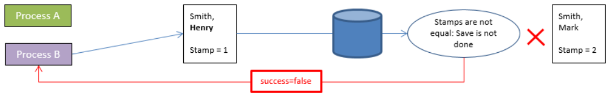
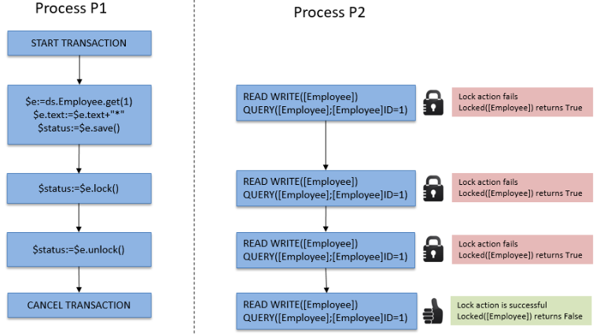

In ORDA, you access data through [entities](dsMapping.md#entity) and [entity selections](dsMapping.md#entity-selection). These objects allow you to create, update, query, or sort the data of the datastore.


## Creating an entity  

There are two ways to create a new entity in a dataclass:

*	Since entities are references to database records, you can create entities by creating records using the 4D language and then reference them with ORDA functions such as [`entity.next()`](../API/EntityClass.md#next) or [`entitySelection.first()`](../API/EntitySelectionClass.md#first).
*	You can also create an entity using the [`dataClass.new()`](../API/DataClassClass.md#new) function.

Keep in mind that the entity is only created in memory. If you want to add it to the datastore, you must call the [`entity.save()`](../API/EntityClass.md#save) function.

Entity attributes are directly available as properties of the entity object. For more information, please refer to [Using entity attributes](#using-entity-attributes).

For example, we want to create a new entity in the "Employee" dataclass in the current datastore with "John" and "Dupont" assigned to the firstname and name attributes:

```4d
var $myEntity : cs.EmployeeEntity
$myEntity:=ds.Employee.new() //Create a new object of the entity type
$myEntity.name:="Dupont" //assign 'Dupont' to the 'name' attribute
$myEntity.firstname:="John" //assign 'John' to the 'firstname' attribute
$myEntity.save() //save the entity
```

>An entity is defined only in the process where it was created. You cannot, for example, store a reference to an entity in an interprocess variable and use it in another process.

## Entities and references

An entity contains a reference to a 4D record. Different entities can reference the same 4D record. Also, since an entity can be stored in a 4D object variable, different variables can contain a reference to the same entity.

If you execute the following code:

```4d
 var $e1; $e2 : cs.EmployeeEntity
 $e1:=ds.Employee.get(1) //access the employee with ID 1
 $e2:=$e1
 $e1.name:="Hammer"
  //both variables $e1 and $e2 share the reference to the same entity
  //$e2.name contains "Hammer"
 If($e1=$e2) //True
```

This is illustrated by the following graphic:


Now if you execute:

```4d
 var $e1; $e2 : cs.EmployeeEntity
 $e1:=ds.Employee.get(1)
 $e2:=ds.Employee.get(1)
 $e1.name:="Hammer"
  //variable $e1 contains a reference to an entity
  //variable $e2 contains another reference to another entity
  //$e2.name contains "smith"
 If($e1=$e2) //False
```

This is illustrated by the following graphic:


Note however that entities refer to the same record. In all cases, if you call the `entity.save( )` method, the record will be updated (except in case of conflict, see [Entity locking](#entity-locking)).

In fact, `$e1` and `$e2` are not the entity itself, but a reference to the entity. It means that you can pass them directly to any function or method, and it will act like a pointer, and faster than a 4D pointer. For example:

```4d
 For each($entity;$selection)
    do_Capitalize($entity)
 End for each
```

And the method is:

```4d
 $entity:=$1
 $name:=$entity.lastname
 If(Not($name=Null))
    $name:=Uppercase(Substring($name;1;1))+Lowercase(Substring($name;2))
 End if
 $entity.lastname:=$name
```

You can handle entities like any other object in 4D and pass their references directly as [parameters](Concepts/parameters.md).

:::info

With the entities, there is no concept of "current record" as in the 4D language. You can use as many entities as you need, at the same time. There is also no automatic lock on an entity (see [Entity locking](#entity-locking)). When an entity is loaded, it uses the [lazy loading](glossary.md#lazy-loading) mechanism, which means that only the needed information is loaded. Nevertheless, in client/server, the entity can be automatically loaded directly if necessary.


:::

## Using entity attributes  

Entity attributes store data and map corresponding fields in the corresponding table.

- attributes of the **storage** kind can be set or get as simple properties of the entity object,
- attributes of the **relatedEntity** kind will return an entity,
- attributes of the **relatedEntities** kind will return an entity selection,
- attributes of the **computed** and **alias** kind can return any type of data, depending on how they are configured.

:::info

For more information on the attribute kind, please refer to the [Storage and Relation attributes](dsMapping.md#storage-and-relation-attributes) paragraph.

:::

For example, to get and set a storage attribute value of type string:

```4d
 $entity:=ds.Employee.get(1) //get employee attribute with ID 1
 $name:=$entity.lastname //get the employee name, e.g. "Smith"
 $entity.lastname:="Jones" //set the employee name
 $entity.save() //save the modifications
```

> Database Blob fields ([scalar blobs](Concepts/dt_blob.md) are automatically converted to and from blob object attributes ([`4D.Blob`](Concepts/dt_blob.md)) when handled through ORDA. When saving a blob object attribute, keep in mind that, unlike blob object size which is only limited by the available memory, Blob field size is limited to 2GB.


Accessing a related attribute depends on the attribute kind. For example, with the following structure:


You can access data through the related object(s):

```4d
 $entity:=ds.Project.all().first().theClient //get the Company entity associated to the project
 $EntitySel:=ds.Company.all().first().companyProjects //get the selection of projects for the company
```

Note that both *theClient* and *companyProjects* in the above example are primary relation attributes and represent a direct relationship between the two dataclasses. However, relation attributes can also be built upon paths through relationships at several levels, including circular references. For example, consider the following structure:


Each employee can be a manager and can have a manager. To get the manager of the manager of an employee, you can simply write:

```4d
 $myEmp:=ds.Employee.get(50)
 $manLev2:=$myEmp.manager.manager.lastname
```

### Assigning files to picture or blob attributes

You can store images in picture attributes; similarly, you can store any binary data in blob attributes.

ORDA lets you assign either the data itself, i.e. an image or a blob object, or a **reference to a file** containing the data to the attribute. Only the file path is saved within the entity.

Thanks to this feature, you can reuse the same picture in multiple entities without duplicating it, organize the files the way you want, or use them outside of 4D. Also, you can control the size of the data file.

The file reference can be:

- a 4D.File object
- a path in POSIX format

Example:

```4d
Function createCompany($name : Text; $logo : 4D.File)

	var $company : cs.CompanyEntity
	$company:=ds.Company.new()

	$company.name:=$name
		//assignment using a file object
	$company.logo:=$logo
		//assignment using a path
	$company.datablob:="/RESOURCES/"+$name+"/data.bin"
	$company.save()
```

Regardless of how the attribute is assigned (data itself or reference to a file), read access to the attribute is transparent from the user's point of view.

The file does not have to exist on disk at the time of assignment (no error is returned in this case). If the referenced file is not found when the attribute is read, a null value is returned.

:::tip

4D loads images and data into a local cache. If the referenced file is modified after it has been loaded, you must reassign the file so that the modification is taken into account in the application.  

:::

:::note

File reference assignment is only supported in local mode (4D Server or 4D single-user). An error is generated if the assignment is made remotely or via a REST request.

:::


### Assigning values to relation attributes  

In the ORDA architecture, relation attributes directly contain data related to entities:

*	An N->1 type relation attribute (**relatedEntity** kind) contains an entity
*	A 1->N type relation attribute (**relatedEntities** kind) contains an entity selection

Let's look at the following (simplified) structure:


In this example, an entity in the "Employee" dataclass contains an object of type Entity in the "employer" attribute (or a null value). An entity in the "Company" dataclass contains an object of type EntitySelection in the "staff" attribute (or a null value).

>In ORDA, the Automatic or Manual property of relations has no effect.

To assign a value directly to the "employer" attribute, you must pass an existing entity from the "Company" dataclass. For example:

```4d
 $emp:=ds.Employee.new() // create an employee
 $emp.lastname:="Smith" // assign a value to an attribute
 $emp.employer:=ds.Company.query("name =:1";"4D")[0]  //assign a company entity
 $emp.save()
```

You can also directly get the "one" related entity through its primary key value (Number or Text). For example:

```4d
 $emp:=ds.Employee.new()
 $emp.lastname:="Wesson"
 $emp.employer:=ds.Company.get(2)
  //gets the Company entity with primary key value 2
  //assigns it to the employee
 $emp.save()
```

This is particularly useful when you are importing large amounts of data from a relational database. This type of import usually contains an "ID" column, which references a primary key that you can then assign directly to a relation attribute.

You can assign or modify the value of a "1" related entity attribute from the "N" dataclass directly through the related attribute. For example, if you want to modify the name attribute of a related Company entity of an Employee entity, you can write:

```code4d
 $emp:=ds.Employee.get(2) // load the Employee entity with primary key 2
 $emp.employer.name:="4D, Inc." //modify the name attribute of the related Company
 $emp.employer.save() //save the related attribute
  //the related entity is updated
```

## Creating an entity selection  

You can create an object of type [entity selection](dsMapping.md#entity-selection) as follows:

*	Querying the entities [in a dataclass](API/DataClassClass.md#query) or in an [existing entity selection](API/EntitySelectionClass.md#query);
*	Using the [`.all()`](API/DataClassClass.md#all) dataclass function to select all the entities in a dataclass;
*	Using the [`Create entity selection`](../commands/create-entity-selection.md) command or the [`.newSelection()`](API/DataClassClass.md#newselection) dataclass function to create a blank entity selection;
*	Using the [`.copy()`](API/EntitySelectionClass.md#copy) function to duplicate an existing entity selection;
*	Using one of the various functions from the [Entity selection class](API/EntitySelectionClass.md) that returns a new entity selection, such as [`.or()`](API/EntitySelectionClass.md#or);
*	Using a relation attribute of type "related entities" (see below).

:::note

You can filter which entities must be included in entity selections for a dataclass depending on any business rules, thanks to the [restricted entity selection](#restricting-entity-selections) feature.

:::

You can simultaneously create and use as many different entity selections as you want for a dataclass. Keep in mind that an entity selection only contains references to entities. Different entity selections can contain references to the same entities.

:::note

When entities are deleted, their references remain in the entity selection with an *undefined* value. In this case, you can call the [`.clean()`](API/EntitySelectionClass.md#clean) function to get a new entity selection but without the deleted entity references.

:::


### Shareable or alterable entity selections

An entity selection can be **shareable** (readable by multiple processes, but not alterable after creation) or **alterable** (supports the [`.add()`](API/EntitySelectionClass.md#add) function, but only usable by the current process).

#### Properties

A **shareable** entity selection has the following characteristics:

- it can be stored in a shared object or shared collection, and can be passed as parameter between several processes or workers;
- it can be stored in several shared objects or collections, or in a shared object or collection which already belongs to a group;
- it does not allow the addition of new entities. Trying to add an entity to a shareable entity selection will trigger an error (1637 - This entity selection cannot be altered). To add an entity to a shareable entity selection, you must first transform it into a non-shareable entity selection using the [`.copy()`](API/EntitySelectionClass.md#copy) function, before calling [`.add()`](API/EntitySelectionClass.md#add).

> Most entity selection functions (such as [`.slice()`](API/EntitySelectionClass.md#slice), [`.and()`](API/EntitySelectionClass.md#and)...) support shareable entity selections since they do not need to alter the original entity selection (they return a new one).

An **alterable** entity selection has the following characteristics:

- it cannot be shared between processes, nor be stored in a shared object or collection. Trying to store a non-shareable entity selection in a shared object or collection will trigger an error (-10721 - Not supported value type in a shared object or shared collection);
- it accepts the addition of new entities, i.e. it is supports the [`.add()`](API/EntitySelectionClass.md#add) function.


#### How are they defined?

The **shareable** or **alterable** nature of an entity selection is defined when the entity selection is created (it cannot be modified afterwards). You can know the nature of an entity selection using the [.isAlterable()](API/EntitySelectionClass.md#isalterable) function or the `OB Is shared` command.


A new entity selection is **shareable** in the following cases:

- the new entity selection results from an ORDA class function applied to a dataClass: [dataClass.all()](API/DataClassClass.md#all), [dataClass.fromCollection()](API/DataClassClass.md#fromcollection), [dataClass.query()](API/DataClassClass.md#query),
- the new entity selection is based upon a relation [entity.*attributeName*](API/EntityClass.md#attributename) (e.g. "company.employees") when *attributeName* is a one-to-many related attribute but the entity does not belong to an entity selection.
- the new entity selection is explicitely copied as shareable with [entitySelection.copy()](API/EntitySelectionClass.md#copy) or `OB Copy` (i.e. with the `ck shared` option).

Example:

```4d
var $myComp : cs.CompanyEntity
var $employees : cs.EmployeeSelection
$myComp:=ds.Company.get(2) //$myComp does not belong to an entity selection
$employees:=$myComp.employees //$employees is shareable
```

A new entity selection is **alterable** in the following cases:

- the new entity selection created blank using the [dataClass.newSelection()](API/DataClassClass.md#newselection) function or `Create entity selection` command,
- the new entity selection is explicitely copied as alterable with [entitySelection.copy()](API/EntitySelectionClass.md#copy) or `OB Copy` (i.e. without the `ck shared` option).

Example:
```4d
var $toModify : cs.CompanySelection
$toModify:=ds.Company.all().copy() //$toModify is alterable
```


A new entity selection **inherits** from the original entity selection nature in the following cases:

- the new entity selection results from one of the various ORDA class functions applied to an existing entity selection ([.query()](API/EntitySelectionClass.md#query), [.slice()](API/EntitySelectionClass.md#slice), etc.) .
- the new entity selection is based upon a relation:
	- [entity.*attributeName*](API/EntityClass.md#attributename) (e.g. "company.employees") when *attributeName* is a one-to-many related attribute and the entity belongs to an entity selection (same nature as [.getSelection()](API/EntityClass.md#getselection) entity selection),
	- [entitySelection.*attributeName*](API/EntitySelectionClass.md#attributename) (e.g. "employees.employer") when *attributeName* is a related attribute (same nature as the entity selection),
	- [.extract()](API/EntitySelectionClass.md#extract) when the resulting collection contains entity selections (same nature as the entity selection).

Examples:

```4d
var $highSal; $lowSal : cs.EmployeeSelection
var $comp; $comp2 : cs.Company

$highSal:=ds.Employee.query("salary >= :1"; 1000000)   

	//$highSal is shareable because of the query on dataClass
$comp:=$highSal.employer //$comp is shareable because $highSal is shareable

$lowSal:=ds.Employee.query("salary <= :1"; 10000).copy()
	//$lowSal is alterable because of the copy()
$comp2:=$lowSal.employer //$comp2 is alterable because $lowSal is alterable
```

:::note Entity selections returned from the server

In client/server architecture, entity selections returned from the server are always shareable on the client, even if [`copy()`](API/EntitySelectionClass.md#copy) was called on the server. To make such an entity selection alterable on the client, you need to execute [`copy()`](API/EntitySelectionClass.md#copy) on the client side. Example:

```4d
	//a function is always executed on the server
exposed Function getSome() : cs.MembersSelection
    return This.query("ID >= :1"; 15).orderBy("ID ASC")

	//in a method, executes on the remote side
var $result : cs.MembersSelection
var $alterable : Boolean
$result:=ds.Members.getSome() //$result is shareable
$alterable:=$result.isAlterable() //False

$result:=ds.Members.getSome().copy() // $result is now alterable
$alterable:=$result.isAlterable() // True
```

:::


#### Sharing an entity selection between processes (example)

You work with two entity selections that you want to pass to a worker process so that it can send mails to appropriate persons:

```4d

var $paid; $unpaid : cs.InvoicesSelection
//We get entity selections for paid and unpaid invoices
$paid:=ds.Invoices.query("status=:1"; "Paid")
$unpaid:=ds.Invoices.query("status=:1"; "Unpaid")

//We pass entity selection references as parameters to the worker
CALL WORKER("mailing"; "sendMails"; $paid; $unpaid)

```

The `sendMails` method:

```4d

 #DECLARE ($paid : cs.InvoicesSelection; $unpaid : cs.InvoicesSelection)
 var $invoice : cs.InvoicesEntity

 var $server; $transporter; $email; $status : Object

  //Prepare emails
 $server:=New object()
 $server.host:="exchange.company.com"
 $server.user:="myName@company.com"
 $server.password:="my!!password"
 $transporter:=SMTP New transporter($server)
 $email:=New object()
 $email.from:="myName@company.com"

  //Loops on entity selections
 For each($invoice;$paid)
    $email.to:=$invoice.customer.address // email address of the customer
    $email.subject:="Payment OK for invoice # "+String($invoice.number)

    $status:=$transporter.send($email)
 End for each

 For each($invoice;$unpaid)
    $email.to:=$invoice.customer.address // email address of the customer
    $email.subject:="Please pay invoice # "+String($invoice.number)
    $status:=$transporter.send($email)
 End for each
```


### Entity selections and Storage attributes  

All storage attributes (text, number, boolean, date) are available as properties of entity selections as well as entities. When used in conjunction with an entity selection, a scalar attribute returns a collection of scalar values. For example:

```4d
var $locals : cs.PersonSelection
var $localEmails : Collection
$locals:=ds.Person.query("city = :1";"San Jose") //entity selection of people
$localEmails:=$locals.emailAddress //collection of email addresses (strings)
```

This code returns in *$localEmails* a collection of email addresses as strings.

### Entity selections and Relation attributes  

In addition to the variety of ways you can query, you can also use relation attributes as properties of entity selections to return new entity selections. For example, consider the following structure:


```4d
var $myParts : cs.PartSelection
var $myInvoices : cs.InvoiceSelection
$myParts:=ds.Part.query("ID < 100") //Return parts with ID less than 100
$myInvoices:=$myParts.invoiceItems.invoice
  //All invoices with at least one line item related to a part in $myParts
```

The last line will return in *$myInvoices* an entity selection of all invoices that have at least one invoice item related to a part in the entity selection myParts. When a relation attribute is used as a property of an entity selection, the result is always another entity selection, even if only one entity is returned. When a relation attribute is used as a property of an entity selection and no entities are returned, the result is an empty entity selection, not null.


## Restricting entity selections

In ORDA, you can create filters to restrict access to entities of any of your dataclasses. Once implemented, a filter is automatically applied whenever the entities of the dataclass are accessed either by **ORDA class functions** such as [`all()`](../API/DataClassClass.md#all) or [`query()`](../API/EntitySelectionClass.md#query), or by the [**REST API**](../category/api-dataclass) (which involves the [Data Explorer](../Admin/dataExplorer.md) and [remote datastores](remoteDatastores.md)).

A filter creates a restricted view of the data, built upon any business rules such as current session user. For example, in an application used by salespersons to make deals with their customers, you can restrict the read customers to those managed by the authenticated salesperson.

:::info

Filters apply to **entities**. If you want restrict access to a **dataclass** itself or to one or more of its **attributes**, you might consider using [session privileges](privileges.md) which are more appropriate in this case.

:::


### How to define a restrict filter

You create a filter for a dataclass by defining an `event restrict` function in the [**dataclass class**](dsMapping.md#dataclass-class) of the dataclass. The filter is then automatically enabled.


### `Function event restrict`

#### Syntax

```4d
Function event restrict() -> $result : cs.*DataClassName*Selection
// code
```

This function is called whenever an entity selection or an entity of the dataclass is requested. The filter is run once, when the entity selection is created.

The filter must return an entity selection of the dataclass. It can be an entity selection built upon a query, stored in the [`Storage`], etc.

:::note

For performance reasons, we recommend to use **indexed attributes** in the definition of the filter.

:::

The function must return a valid entity selection of the dataclass. No filter is applied (all entities corresponding of the initial request are returned) if:

- the function returns **null**,
- the function returns **undefined**,
- the function does not return a valid entity selection.


#### Example

When accessed from a web or REST request, we want the Customers dataclass to only expose customers belonging to the identified sales person. During the authentication phase, the sales person is stored in the `Session` object. Other types of requests are also handled.

```4d
Class extends DataClass


Function event restrict() : cs.CustomersSelection


    	//We work in a web or REST context
    If (Session#Null)

        Case of
                // Only return the customers of the authenticated sales person stored in the session
            : (Session.storage.salesInfo#Null)
                return This.query("sales.internalId = :1"; Session.storage.salesInfo.internalId)

                //Data explorer - No filter is applied
            : (Session.hasPrivilege("WebAdmin"))
                return Null
            Else
                //No customers can be read
                return This.newSelection()

        End case

    Else // We work in client server
        return This.query("sales.userName = :1"; Current user)
    End if
```


### Filter activation details

Filters apply to all ORDA or REST requests executed in your 4D projects (standalone and client/server architectures). A filter is activated as soon as the project is opened, i.e. it can be triggered in the `On Startup` database method.


:::info

Filters do not apply to legacy selections of records handled through the 4D interface or the 4D language (for example when calling `ALL RECORDS`).

:::


|Functions|Comment|
|---|---|
|[dataclass.get()](../API/DataClassClass.md#get)|If the entity does not match the filter, `null` is returned|
|[entity.reload()](../API/EntityClass.md#reload)|Only in client/server and remote datastores|
|[dataclass.all()](../API/DataClassClass.md#all)||
|[dataclass.fromCollection()](../API/DataClassClass.md#fromcollection)|<li>In case of update, only entities matching the filter can be updated. If the collection refers to entities not matching the filter, they are created as new entities (if no duplicate PK error)</li><li>In case of creation, entities not matching the filter are created but will not be read after creation</li>|
|[entitySelection.and()](../API/EntitySelectionClass.md#and)|Only entities matching the filter are returned|
|[entitySelection.or()](../API/EntitySelectionClass.md#or)|Only entities matching the filter are returned|
|[entitySelection.minus()](../API/EntitySelectionClass.md#minus)|Only entities matching the filter are returned|
|[dataclass.query()](../API/DataClassClass.md#query)||
|[entitySelection.query()](../API/EntitySelectionClass.md#query)||
|[entitySelection.attributeName](../API/EntitySelectionClass.md#attributename)|Filter applied if *attributeName* is a related entity or related entities of a filtered dataclass (including alias or computed attribute)|
|[entity.attributeName](../API/EntityClass.md#attributename)|Filter applied if *attributeName* corresponds to related entities of a filtered dataclass (including alias or computed attribute)|
|[Create entity selection](../commands/create-entity-selection.md)||


Other ORDA functions accessing data do not directly trigger the filter, but they nevertheless benefit from it. For example, the [`entity.next()`](../API/EntityClass.md#next) function will return the next entity in the already-filtered entity selection. On the other hand, if the entity selection is not filtered, [`entity.next()`](../API/EntityClass.md#next) will work on non-filtered entities.

:::note

If there is an error in the filter at runtime, it is thrown as if the error came from the ORDA function itself.

:::


## Entity Locking

You often need to manage possible conflicts that might arise when several users or processes load and attempt to modify the same entities at the same time. Record locking is a methodology used in relational databases to avoid inconsistent updates to data. The concept is to either lock a record upon read so that no other process can update it, or alternatively, to check when saving a record to verify that some other process hasn’t modified it since it was read. The former is referred to as **pessimistic record locking** and it ensures that a modified record can be written at the expense of locking records to other users. The latter is referred to as **optimistic record locking** and it trades the guarantee of write privileges to the record for the flexibility of deciding write privileges only if the record needs to be updated. In pessimistic record locking, the record is locked even if there is no need to update it. In optimistic record locking, the validity of a record’s modification is decided at update time.

ORDA provides you with two entity locking modes:

- an automatic "optimistic" mode, suitable for most applications,
- a "pessimistic" mode allowing you to lock entities prior to their access.

### Automatic optimistic lock  

This automatic mechanism is based on the concept of "optimistic locking" which is particularly suited to the issues of web applications. This concept is characterized by the following operating principles:

*	All entities can always be loaded in read-write; there is no *a priori* "locking" of entities.
*	Each entity has an internal locking stamp that is incremented each time it is saved.
*	When a user or process tries to save an entity using the `entity.save( )` method, 4D compares the stamp value of the entity to be saved with that of the entity found in the data (in the case of a modification):
	*	When the values match, the entity is saved and the internal stamp value is incremented.

	*	When the values do not match, it means that another user has modified this entity in the meantime. The save is not performed and an error is returned.

The following diagram illustrates optimistic locking:

1. Two processes load the same entity.<br/><br/>

2. The first process modifies the entity and validates the change. The `entity.save( )` method is called. The 4D engine automatically compares the internal stamp value of the modified entity with that of the entity stored in the data. Since they match, the entity is saved and its stamp value is incremented.<br/><br/>

3. The second process also modifies the loaded entity and validates its changes. The `entity.save( )` method is called. Since the stamp value of the modified entity does not match the one of the entity stored in the data, the save is not performed and an error is returned.<br/><br/>


This can also be illustrated by the following code:

```4d
 $person1:=ds.Person.get(1) //Reference to entity
 $person2:=ds.Person.get(1) //Other reference to same entity
 $person1.name:="Bill"
 $result:=$person1.save() //$result.success=true, change saved
 $person2.name:="William"
 $result:=$person2.save() //$result.success=false, change not saved
```

In this example, we assign to $person1 a reference to the person entity with a key of 1. Then, we assign another reference of the same entity to variable $person2. Using $person1, we change the first name of the person and save the entity. When we attempt to do the same thing with $person2, 4D checks to make sure the entity on disk is the same as when the reference in $person1 was first assigned. Since it isn't the same, it returns false in the success property and doesn’t save the second modification.

When this situation occurs, you can, for example, reload the entity from the disk using the `entity.reload()` method so that you can try to make the modification again. The `entity.save()` method also proposes an "automerge" option to save the entity in case processes modified attributes that were not the same.

> Record stamps are not used in **transactions** because only a single copy of a record exists in this context. Whatever the number of entities that reference a record, the same copy is modified thus `entity.save()` operations will never generate stamp errors.

### Pessimistic lock  

You can lock and unlock entities on demand when accessing data. When an entity is getting locked by a process, it is loaded in read/write in this process but it is locked for all other processes. The entity can only be loaded in read-only mode in these processes; its values cannot be edited or saved.

This feature is based upon two functions of the `Entity` class:

*	[`entity.lock()`](../API/EntityClass.md#lock)
*	[`entity.unlock()`](../API/EntityClass.md#unlock)

For more information, please refer to the descriptions for these functions.

> Pessimistic locks can also be handled through the [REST API](../REST/$lock.md).


### Concurrent use of 4D classic locks and ORDA pessimistic locks  

Using both classic and ORDA commands to lock records is based upon the following principles:

*	A lock set with a classic 4D command on a record prevents ORDA to lock the entity matching the record.
*	A lock set with ORDA on an entity prevents classic 4D commands to lock the record matching the entity.

These principles are shown in the following diagram:


**Transaction locks** also apply to both classic and ORDA commands. In a multiprocess or a multi-user application, a lock set within a transaction on a record by a classic command will result in preventing any other processes to lock entities related to this record (or conversely), until the transaction is validated or canceled.

*	Example with a lock set by a classic command:<br/><br/>
*	Example with a lock set by an ORDA function:<br/><br/>
