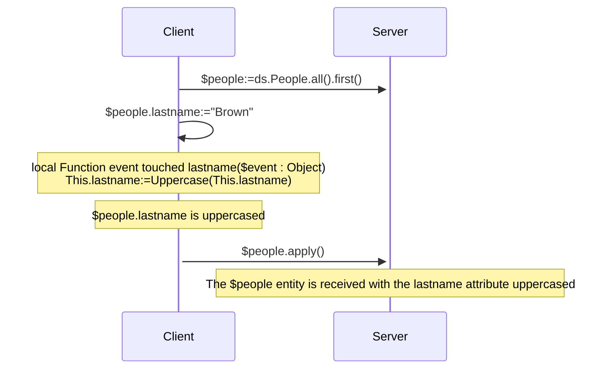
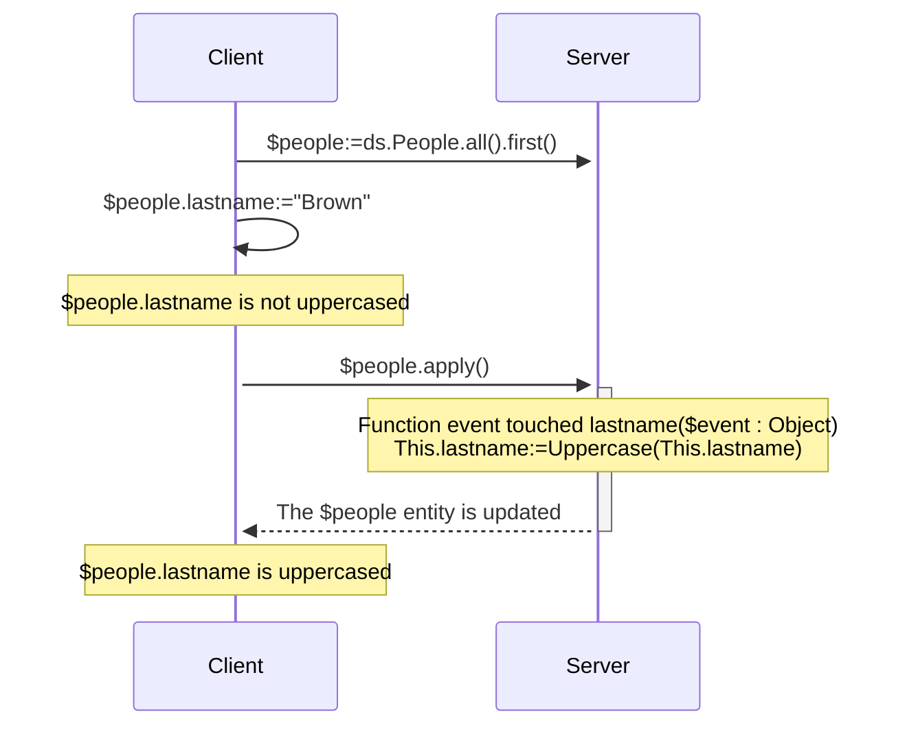
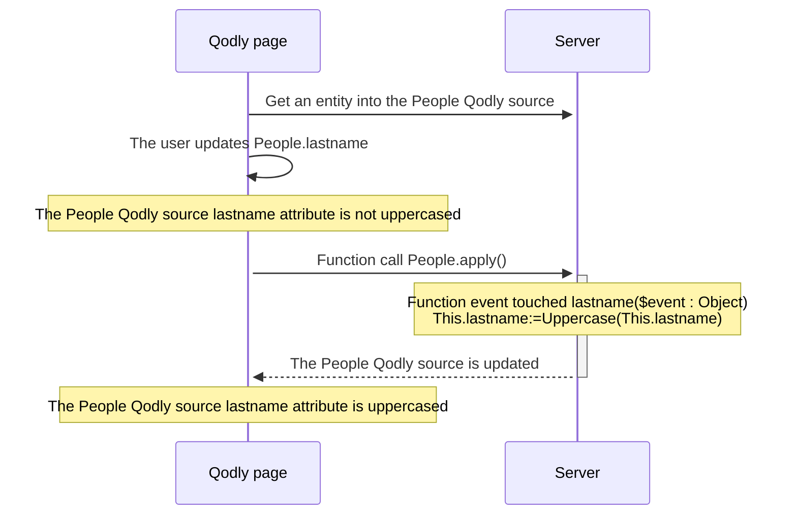

<details><summary>History</summary>

|Release|Changes|
|---|---|
|21|Added events: validateSave / saving / afterSave / validateDrop / dropping / afterDrop
|20 R10|touched event added
</details>


ORDA events are functions that are automatically invoked by ORDA each time entities and entity attributes are manipulated (added, deleted, or modified). You can write very simple events, and then make them more sophisticated.

You cannot directly trigger event function execution. Events are called automatically by ORDA based on user actions or operations performed through code on entities and their attributes.


:::tip Related blog post

[ORDA – Handle an event-driven logic during data persistence actions](https://blog.4d.com/orda-handle-an-event-driven-logic-during-data-persistence-actions)

:::


:::info Compatibility note

ORDA events in the datastore are equivalent to triggers in the 4D database. However, actions triggered at the 4D database level using the 4D classic language commands or standard actions do not trigger ORDA events. 

:::


## Overview

### Event level

A event function is always defined in the [Entity class](../ORDA/ordaClasses.md#entity-class). 

It can be set at the **entity** level and/or the **attribute** level (it includes [**computed attributes**](../ORDA/ordaClasses.md#computed-attributes)). In the first case, it will be triggered for any attributes of the entity; on the other case, it will only be triggered for the targeted attribute. 

For the same event, you can define different functions for different attributes. 

You can also define the same event at both attribute and entity levels. The attribute event is called first and then the entity event.


### Execution in remote configurations

Usually, ORDA events are executed on the server. 

In client/server configuration however, the `touched()` event function can be executed on the **server or the client**, depending on the use of [`local`](./ordaClasses.md#local-functions) keyword. A specific implementation on the client side allows the triggering of the event on the client. 

:::note

ORDA [`constructor()`](./ordaClasses.md#class-constructor) functions are always executed on the client. 

:::

With other remote configurations (i.e. Qodly applications, [REST API requests](../REST/REST_requests.md), or requests through [`Open datastore`](../commands/open-datastore.md)), the `touched()` event function is always executed **server-side**. It means that you have to make sure the server can "see" that an attribute has been touched to trigger the event (see below). 


### Summary table

The following table lists ORDA events along with their rules. 

| Event  | Level    | Function name   |  (C/S) Executed on |Can stop action by returning an error	
| :------- |:------- | :----- | :-----: |---|
| Entity instantiation  | Entity      |   [`constructor()`](./ordaClasses.md#class-constructor-1) |   client | no|
| Attribute touched  | Attribute    |    `event touched <attrName>()`  | Depends on [`local`](../ORDA/ordaClasses.md#local-functions) keyword | no|
| | Entity   |   `event touched()`  | Depends on [`local`](../ORDA/ordaClasses.md#local-functions) keyword | no|
|Before saving an entity|Attribute|`validateSave <attrName>()`|server|yes|
||Entity|`validateSave()`|server|yes|
|When saving an entity|Attribute|`saving <attrName>()`|server|yes|
||Entity|`saving()`|server|yes|
|After saving an entity|Entity|`afterSave()`|server|no|
|Before dropping an entity|Attribute|`validateDrop <attrName>()`|server|yes|
||Entity|`validateDrop()`|server|yes|
|When dropping an entity|Attribute|`dropping <attrName>()`|server|yes|
||Entity|`dropping()`|server|yes|
|After dropping an entity|Entity|`afterDrop()`|server|no|


:::note

The [`constructor()`](./ordaClasses.md#class-constructor-1) function is not actually an event function but is always called when a new entity is instantiated. 

:::

## *event* parameter

Event functions accept a single *event* object as parameter. When the function is called, the parameter is filled with several properties:

| Property name  | Availability  | Type        | Description        | 
| :--------------- |:---------------  |:--------------- | :--------------- | 
| "kind"  | Always   |    String  | Event name: "touched", "validateSave", "saving", "afterSave", "validateDrop", "dropping", "afterDrop"|        |    
| *attributeName*  | Only for events implemented at attribute level ("validateSave", "saving", "validateDrop", "dropping") |    String  |Attribute name (*e.g.* "firstname")  |      
| *dataClassName*  | Always       |    String          |  Dataclass name (*e.g.* "Company")          |  
| "savedAttributes"  | Only in [`afterSave()`](#function-event-aftersave)|Collection of String| Names of attributes properly saved|      
| "droppedAttributes"  |Only in [`afterDrop()`](#function-event-afterdrop)|Collection of String|  Names of attributes properly dropped       |      
| "saveStatus"  | Only in [`afterSave()`](#function-event-aftersave)       |    String          |  "success" if the save was successful, "failed" otherwise |      
| "dropStatus"  | Only in [`afterDrop()`](#function-event-afterdrop) |    String          |   "success" if the drop was successful, "failed" otherwise|      


## Error object

[Some event functions](#summary-table) can return an **error object** to raise an error and stop the running action. 

When an error occurs in an event, the other events are stopped at the first raised error and the action (save or drop) is also stopped. This error is sent before other potential errors like [stamp has changed, entity locked](../API/EntityClass.md#save), etc.

### Error object properties

|Property|Type|Description|Set by the developer|
|---|---|----|----|
|errCode|Integer|Same as for [`Last errors`](../commands/last-errors.md) command|Yes|
|message|Text|Same as for [`Last errors`](../commands/last-errors.md) command|Yes|
|extraDescription|Object|Free information to set up|Yes|
|seriousError|Boolean|Used only with validate events (see below). <li>`True`: creates a [serious (unpredictable) error](../Concepts/error-handling.md#predictable-vs-unpredictable-errors) and triggers an exception. Adds the `dk status serious validation error` status</li><li>creates only a [silent (predictable) error](../Concepts/error-handling.md#predictable-vs-unpredictable-errors). Adds the `dk status validation failed` status</li>|Yes (default is false)|
|componentSignature|Text|Always "DBEV"|No|

- [Serious errors](../Concepts/error-handling.md#predictable-vs-unpredictable-errors) are stacked in the `errors` collection property of the **Result object** returned by the [`save()`](../API/EntityClass.md#save) or [`drop()`](../API/EntityClass.md#drop) functions.
- In case of an error triggered by a **validate** event, the `seriousError` property allows you to choose the level of the error to generate:
    - If **true**: a serious error is thrown and should be handled by the [error processing code](../Concepts/error-handling.md#predictable-vs-unpredictable-errors), such as a [try catch](../Concepts/error-handling.md#trycatchend-try). In the result object of the calling function, `status` gets `dk status serious validation error` and `statusText` gets "Serious Validation Error". The error is raised at the end of the event and reach the client requesting the save/drop action (REST client for example).
    - If **false** (default): a [silent (predictable) error is generated](../Concepts/error-handling.md#predictable-vs-unpredictable-errors). It does not trigger any exception and is not stacked in the errors returned by the [`Last errors`](../commands/last-errors.md) command. In the result object of the calling function, `status` gets `dk status validation failed` and `statusText` gets "Mild Validation Error".
- In case of an error triggered by a **saving/dropping** event, when an error object is returned, the error is always raised as a serious error whatever the `seriousError` property value.


## Event function description


### `Function event touched`

#### Syntax

```4d
{local} Function event touched($event : Object)
{local} Function event touched <attributeName>($event : Object)
// code
```

This event is triggered each time a value is modified in the entity.

- If you defined the function at the entity level (first syntax), it is triggered for modifications on any attribute of the entity. 
- If you defined the function at the attribute level (second syntax), it is triggered only for modifications on this attribute.

This event is triggered as soon as the 4D Server / 4D engine can detect a modification of attribute value which can be due to the following actions:

- in **client/server with the [`local` keyword](../ORDA/ordaClasses.md#local-functions)** or in **4D single-user**:
    - the user sets a value on a 4D form,
    - the 4D code makes an assignment with the `:=` operator. The event is also triggered in case of self-assignment (`$entity.attribute:=$entity.attribute`).
- in **client/server without the `local` keyword**: some 4D code that makes an assignment with the `:=` operator is [executed on the server](../commands-legacy/execute-on-server.md).
- in **client/server without the `local` keyword**, in **[Qodly application](https://developer.qodly.com/docs)** and **[remote datastore](../commands/open-datastore.md)**: the entity is received on 4D Server while calling an ORDA function (on the entity or with the entity as parameter). It means that you might have to implement a *refresh* or *preview* function on the remote application that sends an ORDA request to the server and triggers the event.
- with the REST server: the value is received on the REST server with a [REST request](../REST/$method.md#methodupdate) (`$method=update`)


The function receives an [*event* object](#event-parameter) as parameter. 

If this function [throws](../commands/throw) an error, it will not stop the undergoing action. 

:::note

This event is also triggered:
- when attributes are assigned by the [`constructor()`](./ordaClasses.md#class-constructor-1) event,
- when attributes are edited through the [Data Explorer](../Admin/dataExplorer.md). 

:::


#### Example 1

You want to uppercase all text attributes of an entity when it is updated.


```4d
    //ProductsEntity class
Function event touched($event : Object)
	
	If (Value type(This[$event.attributeName])=Is text)
		This[$event.attributeName]:=Uppercase(This[$event.attributeName])
	End if 
```


#### Example 2

The "touched" event is useful when it is not possible to write indexed query code in [`Function query()`](./ordaClasses.md#function-query-attributename) for a [computed attribute](./ordaClasses.md#computed-attributes). 

This is the case for example, when your [`query`](./ordaClasses.md#function-query-attributename) function has to compare the value of different attributes from the same entity with each other. You must use formulas in the returned ORDA query -- which triggers sequential queries.   

To fully understand this case, let's examine the following two calculated attributes:

```4d
Function get onGoing() : Boolean
        return ((This.departureDate<=Current date) & (This.arrivalDate>=Current date))

Function get sameDay() : Boolean
        return (This.departureDate=This.arrivalDate)
```

Even though they are very similar, these functions cannot be associated with identical queries because they do not compare the same types of values. The first compares attributes to a given value, while the second compares attributes to each other. 

- For the *onGoing* attribute, the [`query`](./ordaClasses.md#function-query-attributename) function is simple to write and uses indexed attributes:

```4d
Function query onGoing($event : Object) : Object
    var $operator : Text
    var $myQuery : Text
    var $onGoingValue : Boolean
    var $parameters : Collection
    $parameters:=New collection()

    $operator:=$event.operator
    Case of 
            : (($operator="=") | ($operator="==") | ($operator="==="))
                $onGoingValue:=Bool($event.value)
            : (($operator="!=") | ($operator="!=="))
                $onGoingValue:=Not(Bool($event.value))
            Else 
                return {query: ""; parameters: $parameters}
    End case 

    $myQuery:=($onGoingValue) ? "departureDate <= :1 AND arrivalDate >= :1" : "departureDate > :1 OR arrivalDate < :1"
        // the ORDA query string uses indexed attributes, it will be indexed
    $parameters.push(Current date)
    return {query: $myQuery; parameters: $parameters}
```

- For the *sameDay* attribute, the [`query`](./ordaClasses.md#function-query-attributename) function requires an ORDA query based on formulas and will be sequential:

```4d
Function query sameDay($event : Object) : Text
    var $operator : Text
    var $sameDayValue : Boolean

    $operator:=$event.operator
    Case of 
        : (($operator="=") | ($operator="==") | ($operator="==="))
            $sameDayValue:=Bool($event.value)
        : (($operator="!=") | ($operator="!=="))
            $sameDayValue:=Not(Bool($event.value))
        Else 
            return ""
        End case 

    return ($sameDayValue) ? "eval(This.departureDate = This.arrivalDate)" : "eval(This.departureDate != This.arrivalDate)"
        // the ORDA query string uses a formula, it will not be indexed

```

- Using a **scalar** *sameDay* attribute updated when other attributes are "touched" will save time:

```4d
    //BookingEntity class

Function event touched departureDate($event : Object) 

    This.sameDay:=(This.departureDate = This.arrivalDate) 
//
//
Function event touched arrivalDate($event : Object) 

    This.sameDay:=(This.departureDate = This.arrivalDate)

```


#### Example 3 (diagram): Client/server with the `local` keyword:




#### Example 4 (diagram): Client/server without the `local` keyword



#### Example 5 (diagram): Qodly application




### `Function event validateSave`

#### Syntax

```4d
Function event validateSave($event : Object)
Function event validateSave <attributeName>($event : Object)
// code
```

This event is triggered each time an entity is about to be saved.

- if you defined the function at the entity level (first syntax), it is called for any attribute of the entity. 
- if you defined the function at the attribute level (second syntax), it is called only for this attribute. This function is **not** executed if the attribute has not been touched in the entity.

The function receives an [*event* object](#event-parameter) as parameter. 


This event is triggered by the following functions:

- [`entity.save()`](../API/EntityClass.md#save)
- [`dataClass.fromCollection()`](../API/DataClassClass.md#fromcollection)

This event is triggered **before** the entity is actually saved and lets you check data consistency so that you can stop the action if needed. For example, you can check in this event that "departure date" < "arrival date". 

To stop the action, the code of the function must return an [error object](#error-object).

:::note

It is not recommended to update the entity within this function (using `This`).

:::

#### Example

In this example, the user is not allowed to save a product with a margin lower than the average. In case of an invalid price attribute, you return an error object and thus, stop the save action. 

```4d
// ProductsEntity class
Function event validateSave margin($event : Object) : Object
	
var $result : Object
var $marginAverage : Real
	
$marginAverage:=ds.Products.query("category= :1"; This.category).average("margin")
		
If (This.margin<$marginAverage)
	$result:={\
    errCode: 1; \
    message: "The margin of this product ("+String(This.margin)+") is under the average"; \
	extraDescription: {\
        info: "For the "+This.category+" category the margin average is: "+String($marginAverage)};\
    fatalError: False}
End if 
	
return $result

```


### `Function event saving`

#### Syntax

```4d
Function event saving($event : Object)
Function event saving <attributeName>($event : Object)
// code
```

This event is triggered each time an entity is being saved. 

- If you defined the function at the entity level (first syntax), it is called for any attribute of the entity. The function is executed even if no attribute has been touched in the entity (e.g. in case of sending data to an external app each time a save is done).
- If you defined the function at the attribute level (second syntax), it is called only for this attribute. The function is **not** executed if the attribute has not been touched in the entity.

The function receives an [*event* object](#event-parameter) as parameter. 

This event is triggered by the following functions:

- [`entity.save()`](../API/EntityClass.md#save)
- [`dataClass.fromCollection()`](../API/DataClassClass.md#fromcollection)

This event is triggered **while** the entity is actually saved. If a [`validateSave()`](#function-event-validatesave) event function was defined, the `saving()` event function is called if no error was triggered by `validateSave()`. For example, you can use this event to create a document on a Google Drive account. 

:::note

The business logic should raise errors which can't be detected during the `validateSave()` events, e.g. a network error

:::

During the save action, 4D engine errors can be raised (index, stamp has changed, not enough space on disk).

To stop the action, the code of the function must return an [error object](#error-object).

#### Example

When a product is saved, some information is logged to an external system which may be unavailable.

```4d
Function event saving($event : Object) : Object
	
var $result; $status : Object
var $log : cs.Entity
var $remote : 4D.DataStoreImplementation
		
Try	 
	$remote:=Open datastore({hostname: "events@acme.com"}; "logs")	
	$log:=$remote.Logs.new()
	$log.productId:=This.ID
	$log.stamp:=Timestamp
	$log.event:="Created by "+Current user()
	$status:=$log.save()
Catch
	$result:={\
    errCode: Last errors.last().errCode;\
    message: Last errors.last().message; \
    extraDescription: {info: "The external Logs can't be reached"}}
End try
	
return $result


```


### `Function event afterSave`

#### Syntax

```4d
Function event afterSave($event : Object)
// code
```

This event is triggered just after an entity is saved in the data file, when at least one attribute was modified. It is not executed if no attribute has been touched in the entity.

This event is useful after saving data to propagate the save action outside the application or to execute administration tasks. For example, it can be used to send a confirmation email after data have been saved. Or, in case of error while saving data, it can make a rollback to restore a consistent state of data. 

The function receives an [*event* object](#event-parameter) as parameter. 

- To avoid infinite loops, calling a [`save()`](../API/EntityClass.md#save) on the current entity (through `This`) in this function is **not allowed**. It will raise an error. 
- Throwing an [error object](#error-object) is **not supported** by this function.


#### Example 1

If an error occurred in the above saving event, the product is recorded in the ProductsInFailure dataclass so an employee can review it later.


```4d
// ProductsEntity class
Function event afterSave($event : Object)
	
var $failure : cs.ProductsInFailureEntity
var $status : Object

    // $event.status.errors is filled if the error comes from a validateSave event
If (($event.status.success=False) && ($event.status.errors=Null))  
	$failure:=ds.ProductsInFailure.new()
	$failure.name:=This.name
	$failure.category:=This.category
	$failure.costPrice:=This.costPrice
	$failure.retailPrice:=This.retailPrice
	$failure.reason:="Error during the save action"
	$failure.stamp:=Timestamp
	$status:=$failure.save()
End if

```


### `Function event validateDrop`

#### Syntax

```4d
Function event validateDrop($event : Object)
Function event validateDrop <attributeName>($event : Object)
// code
```

This event is triggered each time an entity is about to be dropped. 

- If you defined the function at the entity level (first syntax), it is called for any attribute of the entity. 
- If you defined the function at the attribute level (second syntax), it is called only for this attribute. 

The function receives an [*event* object](#event-parameter) as parameter. 


This event is triggered by the following features:

- [`entity.drop()`](../API/EntityClass.md#drop)
- [`entitySelection.drop()`](../API/DataClassClass.md#fromcollection)
- [deletion control rules](https://doc.4d.com/4Dv20/4D/20.2/Relation-properties.300-6750290.en.html#107320) that can be defined at the database structure level. 

This event is triggered **before** the entity is actually dropped, allowing you to check data consistency and if necessary, to stop the drop action. 

To stop the action, the code of the function must return an [error object](#error-object).


#### Example 1

Products can be deleted only if they have been flagged TO DELETE. 

```4d
    //ProductsEntity class
Function event validateDrop status($event : Object) : Object

If (This.status != "TO DELETE")
        
    var $result:= New object()
    $result.errCode:=1
    $result.message:="The record can't be deleted"
    $result.extraDescription:={attribute; $event.attributeName; info: "The status must be TO DELETE"}
    $result.fatalError:=False
    return $result
End if 
```

#### Example 2

The user can delete products if they are flagged as "TO DELETE" and if their creation year is < current year -3.

```4d
    //ProductsEntity class
Function event validateDrop($event : Object) : Object

var $yearOffSet : Integer
$yearOffSet:=Year of(Current date)-3

If ((This.status != "TO DELETE") || (Year of(This.creationDate) >=  $yearOffSet))
    var $result:=New object()
    $result.errCode:=1
    $result.message:="The record can't be deleted"
    $result.extraDescription:={info: "The status must be TO DELETE and the creation year must be lower than " + String($yearOffSet)}
    $result.fatalError:=False
    return $result
End if 
```


### `Function event dropping`

#### Syntax

```4d
Function event dropping($event : Object)
Function event dropping <attributeName>($event : Object)
// code
```

This event is triggered each time an entity is being dropped. 

- If you defined the function at the entity level (first syntax), it is called for any attribute of the entity. 
- If you defined the function at the attribute level (second syntax), it is called only for this attribute. 

The function receives an [*event* object](#event-parameter) as parameter. 

This event is triggered by the following features:

- [`entity.drop()`](../API/EntityClass.md#drop)
- [`entitySelection.drop()`](../API/DataClassClass.md#fromcollection)
- [deletion control rules](https://doc.4d.com/4Dv20/4D/20.2/Relation-properties.300-6750290.en.html#107320) that can be defined at the database structure level. 

This event is triggered **while** the entity is actually dropped. If a [`validateDrop()`](#function-event-validatedrop) event function was defined, the `dropping()` event function is called if no error was triggered by `validateDrop()`. 

:::note

The business logic should raise errors which cannot be detected during the `validateDrop()` events, e.g. a network error.

:::

To stop the action, the code of the function must return an [error object](#error-object).

#### Example 1

When dropping an order with *totalPrice >= 500*, a log file is updated.

```4d
    //OrderEntity class
Function event dropping totalPrice ($event : Object)

var $log : cs.LogEntity
var $status: Object

If (This.totalPrice >= 500)

    $log:=ds.Log.new()
    $log.orderID:=This.ID
    $log.orderPrice:=This.totalPrice
    $log.event:="Drop"
    $log.creationDate:=Current date()
    $status:=$log.save()

    If($status.success=False)
        throw ({errCode: 1; message: "Error while updating the log file"})
    End if
End if

```

#### Example 2

When a product is dropped, a log file is updated.

```4d
    //ProductsEntity class
Function event dropping ($event : Object) 

var $log : cs.LogEntity
var $status: Object

$log:=ds.Log.new()
$log.productID:=This.ID
$log.productPrice:=This.price
$log.event:="Drop"
$log.creationDate:=Current date()
$status:=$log.save()

If($status.success=False)
    throw ({errCode: 1; message:"Error while updating the log file"})
End if
```

### `Function event afterDrop`

#### Syntax

```4d
Function event afterDrop($event : Object)
// code
```

This event is triggered just after an entity is dropped. 

This event is useful after dropping data to propagate the drop action outside the application or to execute administration tasks. For example, it can be used to send a cancellation email after data have been dropped. Or, in case of error while dropping data, it can log an information for the administrator to check data consistency.  

The function receives an [*event* object](#event-parameter) as parameter. 

- To avoid infinite loops, calling a [`drop()`](../API/EntityClass.md#drop) on the current entity (through `This`) in this function is **not allowed**. It will raise an error. 
- Throwing an [error object](#error-object) is **not supported** by this function.

:::note

The dropped entity is referenced by `This` and still exists in memory.

:::

#### Example 1

Send a mail to the customer with the details of the dropped order. 

```4d
    //OrderEntity class
Function event afterDrop ($event : Object) 

var $oAuth2 : cs.NetKit.OAuth2Provider
var $google : cs.NetKit.Google

    //$param contains clientId, secretId...
$oAuth2:=cs.NetKit.OAuth2Provider.new($param)
$google:=cs.NetKit.Google.new($oAuth2; {mailType: "JMAP"})

    //Email creation
$email:=New object
$email.from:="youremail@gmail.com"
$email.to:="destinationmail@mail.com"
$email.subject:="Your order is cancelled"
$email.textBody:="Products numbers: " + This.products.number.join("-")

    //Email sending
$status:=$google.mail.send($email)
```

#### Example 2

Create an action to do because there were errors in the [`dropping()`](#function-event-dropping) event.

```4d
    //ProductEntity class
Function event afterDrop ($event : Object) 

var $action: cs.ActionEntity
var $status: Object

    // The drop action failed   
If($event.dropStatus = "failed")
    $action:=ds.Action.new()
    $action.label:=Last errors.first().message //message is "Error while dropping product XXX"
    $action.status:="TO CHECK"
    $status:=$action.save()
End if

```

