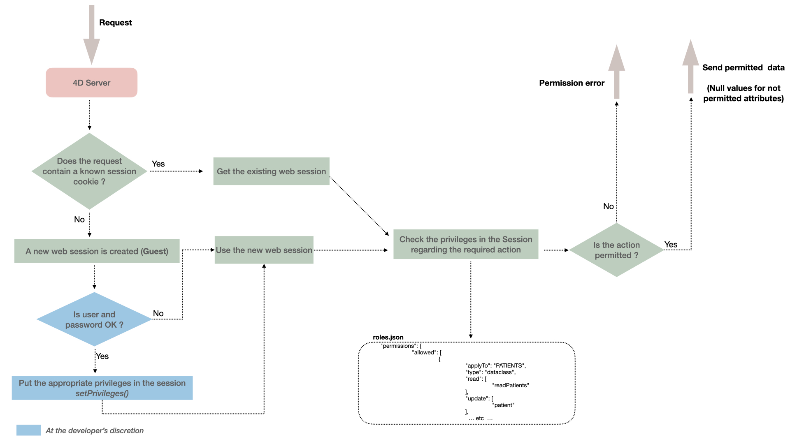
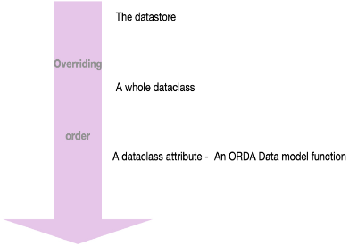
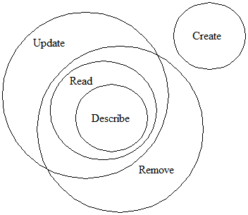

Protecting data while allowing fast and easy access to authorized users is a major challenge for web applications. The ORDA security architecture is implemented at the heart of your datastore and allows you to define specific privileges to all user sessions for the various resources in your project (datastore, dataclasses, functions, etc.).


## Overview

The ORDA security architecture is based upon the concepts of privileges, permission actions (read, create, etc.), and resources. When users get logged, their session is automatically loaded with associated privileges. Every REST request sent within the session is evaluated against privileges defined in the project's `roles.json` file.

If a user attempts to execute an action and does not have the appropriate access rights, a privilege error is generated or, in the case of missing Read privilege on attributes, a null value is sent. 




## Resources

You can assign specific permission actions to the following exposed resources in your project:

- the datastore
- a dataclass
- a dataclass attribute (including computed attribute and alias attribute)
- a data model class function

A permission action defined at a given level is inherited at lower levels and can be overriden. For example, dataclasses attributes inherit from their dataclass permissions but you can override them for one or more attributes. 




## Permission actions

Available actions depend on the target resource.

|Actions|datastore|dataclass|dataclass attribute|data model function|
|---|---|---|---|---|			
|**create**|Create data in any dataclass|Create data in this dataclass|Create a not null value for this attribute (except for alias)|Not applicable|
|**update**|Update data in any dataclass|Update data in this dataclass|Update this attribute content with a not null value (except for alias)|Not applicable|
|**read**|Read data in any dataclass|Read data in this dataclass|Read this attribute content|Not applicable|
|**drop**|Delete data in any dataclass|Delete data in this dataclass|Delete a not null value for this attribute (except for alias and computed attribute)|Not applicable|
|**execute**|Execute any function on the project (datastore, dataclass, entity selection, entity)|Execute any function on the dataclass. Dataclass functions, entity functions, and entity selection functions are handled as dataclass functions|Not applicable|Run this function|
|**describe**|All the dataclasses are available in the /rest/$catalog API|This dataclass is available in the /rest/$catalog API|This dataclass attribute is available in the /rest/$catalog API|This dataclass function is available in the /rest/$catalog API|
|**promote**|Not applicable|Not applicable|Not applicable|Associates a given privilege during the execution of the function. The privilege is temporary added to the session and removed at the end of the function execution. By security, only the process executing the function is added the privilege, not the whole session|

Alias can be read even if there is no permissions on the attributes upon which it is built.
A computed attribute can be accessed even if there are no permissions on the attributes upon which it is built.

Keep in mind that actions are logically embedded, and therefore call a chain of implicit actions:

- Read action is granted Describe action automatically.
- Update and Drop actions are granted Read and Describe actions automatically.
- On the other hand, if Read action is no allowed, Update and Drop actions are not allowed; Execute and Promote actions are also not allowed for an ORDA Data Model function related to an entity or an entity selection.


The following graphic shows the interactions between actions:




## Privileges and Roles

A **privilege** is the technical ability to run **actions** on **resources**, while a **role** is a privilege pusblished to be used by an administrator. Basically, a role gathers several privileges to define a business user profile. For example, "manageInvoices" could be a privilege while "secretary" could be a role that includes "manageInvoices" and other privileges.

A privilege or a role can be associated to several "action + resource" combinations. Several privileges can be associated to an action. A privilege can include other privileges. 

- You **create** privileges and/or roles in the `roles.json` file (see below). You **configure** their scope by assigning them to permission action(s) applied to resource(s).

- You **allow** privileges and/or roles to every user session using the [`.setPrivileges()`](../API/SessionClass.md#setprivileges) function of the `Session` class.


## `roles.json` file


The `roles.json` file describes the whole security settings for the project.  

:::note

In a context other than *Qodly* (cloud), you have to create this file at the following location: `<project folder>/Project/Sources/`. See [Architecture](../Project/architecture.md#sources) section.

:::


The `roles.json` file syntax is the following:

|Property name|||Type|Mandatory|Description|
|---|---|---|---|---|---|
|privileges|||Collection of `privilege` objects|X|List of defined privileges|
||\[].privilege||String||Privilege name|
||\[].includes||Collection of strings||List of included privilege names|
|roles|||Collection of `role` objects||List of defined roles|
||\[].role||String||Role name|
||\[].privileges||Collection of strings||List of included privilege names|
|permissions|||Object|X|List of allowed actions|
||allowed||Collection of `permission` objects||List of allowed permissions|
|||\[].applyTo|String|X|Targeted [resource](#resources)|
|||\[].type|String|X|Resource type: "datastore", "dataclass", "method", "attribute" |
|||\[].read|Collection of strings||List of privileges|
|||\[].create|Collection of strings||List of privileges|
|||\[].update|Collection of strings||List of privileges|
|||\[].drop|Collection of strings||List of privileges|
|||\[].describe|Collection of strings||List of privileges|
|||\[].execute|Collection of strings||List of privileges|
|||\[].promote|Collection of strings||List of privileges|


:::caution Reminder

- The "WebAdmin" privilege name is reserved to the application. It is not recommended to use this name for custom privileges.
- `privileges` and `roles` names are case insensitive.

:::

## Initializing privileges for deployment

By default, if no specific parameters are defined in the roles.json file, accesses are not limited. This configuration allows you to develop the application without having to worry about accesses.

However, when the application is about to be deployed, a good practice is to lock all privileges and then, to configure the file to only open controlled parts to authorized sessions. To lock all privileges on all resources, put the following `roles.json` file in your project folder:
   
```json title="/Project/Sources/roles.json"
{
	"privileges": [
		{
			"privilege": "nobody",
			"includes": []
		}
	],

	"roles": [],

	"permissions": {
		"allowed": [{
			"applyTo": "ds",
			"type": "datastore",
			"read": [
				"nobody"
			],
			"create": [
				"nobody"
			],
			"update": [
				"nobody"
			],
			"drop": [
				"nobody"
			],
			"execute": [
				"nobody"
			],
			"describe": [
				"nobody"
			],
			"promote": [
				"nobody"
			]
		},
		{
			"applyTo": "ds.loginAs",
			"type": "method",
			"execute": [
					"guest"
				]
		},
		{
			"applyTo": "ds.hasPrivilege",
			"type": "method",
			"execute": [
					"guest"
				]
		},
		{
			"applyTo": "ds.clearPrivileges",
			"type": "method",
			"execute": [
					"guest"
				]
		},
		{
			"applyTo": "ds.isGuest",
			"type": "method",
			"execute": [
					"guest"
				]
		},
		{
			"applyTo": "ds.getPrivileges",
			"type": "method",
			"execute": [
					"guest"
				]
		},
		{
			"applyTo": "ds.setAllPrivileges",
			"type": "method",
			"execute": [
				"guest"
			]
	}

		]
	}
}
```

## Roles.json example file

Example of file for an Employee/Company database:

```json title="EmpComp/Project/Sources/roles.json"
{
	"privileges": [
		{
			"privilege": "emp1"
		},
		{
			"privilege": "hr",
			"includes": [
				"emp1"
			]
		},
		{
			"privilege": "ceo",
			"includes": [
				"hr"
			]
		},
		{
			"privilege": "administrator",
			"includes": [
				"ceo"
			]
		}
		
	],
	"roles": [
		{
			"role": "employee",
			"privileges": [
				"emp1"
			]
		},
		{
			"role": "HR",
			"privileges": [
				"hr"
			]
		},
		{
			"role": "admin",
			"privileges": [
				"ceo",
				"administrator"
			]
		}
	],
	"permissions":
	{
		"allowed":[
			{ "type":"dataclass", "applyTo" : "Employee", "read":"emp1", "create":"hr", "update":"hr", "drop":"hr" },
			{ "type":"attribute", "applyTo" : "Employee.salary", "read":"hr" },
			{ "type":"method", "applyTo" : "Employee.getSalary", "execute":"hr" },
			{ "type":"datastore", "applyTo" : "ds", "read":"employee", "create":"staffManager", "update":"staffManager", "drop":"staffManager", "describe":"formManager" }
		]
	}
```