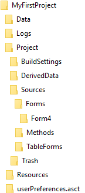

A 4D project is made of several folders and files, stored into a single parent database folder. For example:




## Project

The Project folder typically contains the following hierarchy:

- *databaseName*.4DProject file
- Sources
	+ DatabaseMethods
	+ Methods
	+ Forms
	+ TableForms
	+ Triggers
- BuildSettings
- DerivedData


### *databaseName*.4DProject file

Project file, used to designate the project. You can drop this file to the 4D application to launch the project.  


### Sources

Contents|Description|Format
--------|-------|----
catalog.4DCatalog|Table and field definitions|xml
folders.json|Explorer folder definitions|json
menus.json|Menu definitions|json
settings.4DSettings|Database settings|xml
tips.json|Defined tips|json
lists.json|Defined lists|json
filters.json|Defined filters|json  

#### DatabaseMethods

Contents|Description|Format
--------|-------|----
*databaseMethodName*.4dm|Database methods defined in the database. One file per database method|text

#### Methods

Contents|Description|Format
--------|-------|----
*methodName*.4dm|Project methods defined in the database. One file per method|text

#### Forms

Contents|Description|Format
--------|-------|----
*formName*/form.4DForm|Project form description|json
*formName*/method.4dm|Project form method|text
*formName*/Images/*pictureName*|Project form static picture|picture
*formName*/ObjectMethods/*objectName*.4dm|Object methods. One file per object method|text

#### TableForms

Contents|Description|Format
--------|-------|----
*n*/Input/*formName*/form.4DForm|Input table form description (n is the table number)|json
*n*/Input/*formName*/Images/*pictureName*|Input table form static pictures|picture
*n*/Input/*formName*/method.4dm|Input table form method|text
*n*/Input/*formName*/ObjectMethods/*objectName*.4dm|Input form object methods. One file per object method|text
*n*/Output/*formName*/form.4DForm|Output table form description (n is the table number)|json
*n*/Output/*formName*/Images/*pictureName*|Output table form static pictures|picture
*n*/Output/*formName*/method.4dm|Output table form method|text
*n*/Output/*formName*/ObjectMethods/*objectName*.4dm|Output form object methods. One file per object method|text

#### Triggers

Contents|Description|Format
--------|-------|----
table_*n*.4dm|Trigger methods defined in the database. One trigger file per table (n is the table number)|text

**Note:**
The .4dm file extension is a text-based file format, containing the code of a 4D method. It is compliant with source control tools. 

### BuildSettings

The BuildSettings folder is created automatically when using the application builder dialog box or the ```BUILD APPLICATION``` command. It contains:

Contents|Description|Format
--------|-------|----
BuildApp.xml|Build settings file|xml


### Trash folder

The Trash folder contains methods and forms that were deleted from the project (if any). It can contain the following folders:

- Methods
- Forms
- TableForms

Within these folders, deleted element names are in parentheses, e.g. "(myMethod).4dm". The folder organisation is identical to the [Sources](#sources) folder. 


### DerivedData

The DerivedData folder contains cached data used internally by 4D to optimize processing. It is automatically created or recreated when necessary. You can just ignore this folder. 


## Resources

The Resources folder contains any custom database resource files and folders. In this folder, you can place all the files needed for the translation or customization of the application interface (picture files, text files, XLIFF files, etc.). 4D uses automatic mechanisms to work with the contents of this folder, in particular for the handling of XLIFF files and static pictures.
In the context of use in remote mode, the Resources folder lets you share files between the server machine and all the client machines. See the *4D Server Reference Manual*.

Contents|Description|Format
--------|-------|----
*item*|Database resource files and folders|various
Images/Library/*item*|Pictures from the picture library as separate files(*). Names of picture library items become file names. If a duplicate exists, a number is added to the name.|picture

(*) only if the project was created from a .4db database (see [Exporting a database](exporting.md)).


## Data

The data folder contains the data file and all files il relations to the data.

Contents|Description|Format
--------|-------|----
data.4dd(*)|Data file containing data that are entered in the records and all the data that belong to the records. When you open a 4D project, the application opens the current data file by default. If you change the name or location of this file, the Open data file dialog box will then appear so that you can select the data file that you want to use or create a new one|binary
data.journal|Created only when the database uses a log file. The log file is used to ensure the security of the database data between two backups. All the operations carried out on the data of the database are recorded sequentially in this file. So each operation on the data causes two simultaneous actions: the first on the database data (the statement is executed normally) and the second in the log file (a description of the operation is recorded). The log file is constructed independently, without disturbing or slowing down the user’s work. A database can only work with one log file at a time. The log file records operations such as additions, modifications or deletions of records, transactions, etc. It is generated by default when a database is created.|binary
data.match|(internal) UUID matching table number|xml

(*) When the project is created from a .4db database, the data file is left untouched. Thus, it can be named differently and be located to another location (see [Exporting a database](exporting.md)).


## Logs

The Logs folder contains all log files used by the project. Log files are timestamped. Log files include, in particular:

- database conversion,
- web server requests,
- data verification and repair,
- structure verification and repair,
- backup/restore activities journal,
- command debugging,
- 4D Server requests (generated on client machines and on the server).


## userPreferences.*userName*

This folder contains configuration files specific to the database:

Contents|Description|Format
--------|-------|----
methodPreferences.json|Method editor preferences|json
methodWindowPositions.json|Current user window positions for methods|json
formWindowPositions.json|Current user window positions for forms|json
preferencesv15.4DPreferences|User preferences|json


