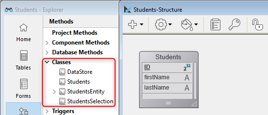
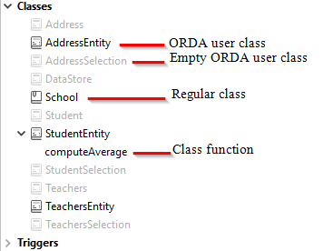
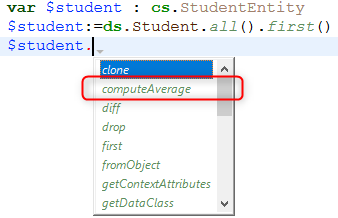

The 4D code used across your project is written in [methods](../Concepts/methods.md) and [classes](../Concepts/classes.md). 

The 4D IDE provides you with various features to create, edit, export, or delete your code. You will usually use the included 4D [code editor](../code-editor/write-class-method.md) to work with your code. You can also use other editors such as **VS Code**, for which the [4D-Analyzer extension](https://github.com/4d/4D-Analyzer-VSCode) is available. 

## Creating methods

A method in 4D is stored in a **.4dm** file located in the appropriate folder of the [`/Project/Sources/`](../Project/architecture.md#sources) folder. 

You can create [several types of methods](../Concepts/methods.md#method-types):

- All types of methods can be created or opened from the **Explorer** window (except Object methods which are managed from the [Form editor](../FormEditor/formEditor.md)).
- Project methods can also be created or opened from the **File** menu or toolbar (**New/Method...** or **Open/Method...**) or using shortcuts in the [Code editor window](../code-editor/write-class-method.md#shortcuts).
- **Triggers** can also be created or opened from the [Structure editor](../Develop-legacy/triggers.md#activating-and-creating-a-trigger).
- Form methods can also be created or opened from the [Form editor](../FormEditor/formEditor.md).

## Creating classes

### User classes

A user class in 4D is defined by a specific method file (**.4dm**), stored in the [`/Project/Sources/Classes/`](../Project/architecture.md#sources) folder. The name of the file is the class name. For example, a class named "Polygon" will be stored in the following file:

```
Project folder
 Project
  Sources
   Classes
    Polygon.4dm
```

You can create a class file from the **File** menu or toolbar (**New > Class...**) or in the **Methods** page of the **Explorer** window. You can also use the **Ctrl+Shift+Alt+k** shortcut.

In the **Methods** page of the Explorer, classes are grouped in the **Classes** category.

To create a new class, you can:

- select the **Classes** category and click on the  button.
- select **New Class...** from the action menu at the bottom of the Explorer window, or from the contexual menu of the Classes group.

- select **New > Class...** from the contexual menu of the Explorer's Home page.

When naming classes, you should keep in mind the following rules:

- A [class name](../Concepts/identifiers.md#classes) must be compliant with [property naming rules](../Concepts/identifiers.md#object-properties).
- Class names are case sensitive.
- Giving the same name to a class and a database table is not recommended, in order to prevent any conflict.


### ORDA classes

[ORDA data model user classes](../ORDA/ordaClasses.md) are high-level class functions created above the data model.

An ORDA data model class is defined by adding, at the same location as regular class files (*i.e.* in the `/Sources/Classes` folder of the project folder), a .4dm file with the name of the class. For example, an entity class for the `Utilities` dataclass will be defined through a `UtilitiesEntity.4dm` file.

4D automatically pre-creates empty classes in memory for each available data model object.




By default, empty ORDA classes are not displayed in the Explorer. To show them you need to select **Show all data classes** from the Explorer's options menu:


ORDA user classes have a different icon from regular classes. Empty classes are dimmed:




To create an ORDA class file, you just need to double-click on the corresponding predefined class in the Explorer. 4D creates the class file and add the [`extends`](../Concepts/classes.md#class-extends-classname) code. For example, for an Entity class:

```
Class extends Entity
```

Once a class is defined, its name is no longer dimmed in the Explorer.

To open a defined ORDA class in the 4D Code Editor, select or double-click on an ORDA class name and use **Edit...** from the contextual menu/options menu of the Explorer window:


For ORDA classes based upon the local datastore (`ds`), you can directly access the class code from the 4D Structure window:


### Support in 4D IDE

In the various 4D windows (code editor, compiler, debugger, runtime explorer), class code is basically handled like a project method with some specificities:

- In the code editor:
  - a class cannot be run
  - a class function is a code block
  - **Goto definition** on an object member searches for class Function declarations; for example, "$o.f()" will find "Function f".
  - **Search references** on class function declaration searches for the function used as object member; for example, "Function f" will find "$o.f()".
  - variables typed as a user or ORDA class automatically benefit from autocompletion features. Example with an Entity class variable:



- In the Runtime explorer and Debugger, class functions are displayed with the `<ClassName>` constructor or `<ClassName>.<FunctionName>` format.


## Deleting methods or classes

To delete an existing method or class, you can:

- on your disk, remove the *.4dm* file from the "Sources" folder,
- in the 4D Explorer, select the method or class and click  or choose **Move to Trash** from the contextual menu. 

> To delete an object method, choose **Clear Object Method** from the [Form editor](../FormEditor/formEditor.md) (**Object** menu or context menu).


## Design Object Access commands

You can access the contents and paths of all methods in your applications by programming, thanks to the [**"Design Object Access" command theme**](../commands/theme/Design_Object_Access.md). This source toolkit facilitates the integration into your applications of code control tools and more particularly version control systems (VCS). It also lets you implement advanced systems for [code documentation](../Project/documentation.md), for building a custom explorer or for organizing scheduled backups of the code saved as disk files.

The following principles are implemented:

- Each method and form in a 4D application has its own address in the form of a pathname. For example, the trigger method for table 1 can be found at "[trigger]/table_1". Each object pathname is unique in an application.
- You can access objects in the 4D application using the commands of the **"Design Object Access"** command theme, for example [`METHOD GET NAMES`](../commands/method-get-names) or [`METHOD GET PATHS`](../commands/method-get-paths).
- Most of the commands in this theme work in both [interpreted and compiled](../Concepts/interpreted.md) mode. However, commands that modify properties or access contents executable from methods can only be used in interpreted mode (see the table below).
- You can use all the commands of this theme with 4D in local or remote mode. However, keep in mind that you cannot use certain commands in compiled mode: the purpose of this theme is to create custom development support tools. You must not use these commands to dynamically change the functioning of a database that is running. For example, you cannot use [`METHOD SET ATTRIBUTE`](../commands/method-set-attribute) to change a method attribute according to the status of the current user.
- When a command of this theme is called from a [component](../Project/components.md), by default it accesses the component objects. In this case, to access objects of the host, you just pass a `*` as the last parameter. 

### Use in compiled mode

For reasons related to the principle of the compilation process, only certain commands in this theme can be used in compiled mode. The following table indicates the available of the commands in compiled mode:

| Command | Can be used in compiled mode |
|---|---|
| [Current method path](../commands/current-method-path) | Yes |
| [FORM GET NAMES](../commands/form-get-names) | Yes |
| [METHOD Get attribute](../commands/method-get-attribute) | Yes |
| [METHOD GET ATTRIBUTES](../commands/method-get-attributes) | Yes |
| [METHOD GET CODE](../commands/method-get-code) | No |
| [METHOD GET COMMENTS](../commands/method-get-comments) | Yes |
| [METHOD GET FOLDERS](../commands/method-get-folders) | Yes |
| [METHOD GET MODIFICATION DATE](../commands/method-get-modification-date) | Yes |
| [METHOD GET NAMES](../commands/method-get-names) | Yes |
| [METHOD Get path](../commands/method-get-path) | Yes |
| [METHOD GET PATHS](../commands/method-get-paths) | Yes |
| [METHOD GET PATHS FORM](../commands/method-get-paths-form) | Yes |
| [METHOD OPEN PATH](../commands/method-open-path) | No  |
| [METHOD RESOLVE PATH](../commands/method-resolve-path) | Yes |
| [METHOD SET ACCESS MODE](../commands/method-set-access-mode) | Yes |
| [METHOD SET ATTRIBUTE](../commands/method-set-attribute) | No  |
| [METHOD SET ATTRIBUTES](../commands/method-set-attributes) | No  |
| [METHOD SET CODE](../commands/method-set-code) | No  |
| [METHOD SET COMMENTS](../commands/method-set-comments) | No  |

:::note

The error -9762 "The command cannot be executed in a compiled database." is generated when the command is executed in compiled mode.

:::

### Creation of pathnames  

Pathnames generated for 4D objects must be compatible with the file management of the operating system. Characters that are forbidden at the OS level such as ":" are automatically encoded in method names, so that generated files may be integrated automatically in a version control system.

Here are the encoded characters:

|Character|	Encoding|
|---|---|
|"|%22|
|*|%2A|
|/|%2F|
|:|%3A|
|\<|%3C|
|\>	|%3E|
|?	|%3F|
|\|	|%7C|
|\\	|%5C|
|%|%25|

#### Examples

`Form?1` is encoded `Form%3F1`  
`Button/1` is encoded `Button%2F1`