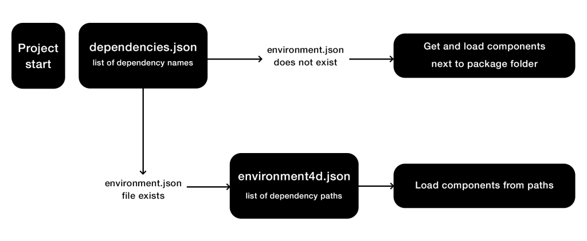

A 4D component is a set of 4D code and/or 4D forms representing one or more functionalities that you can add and use in your projects. For example, the 4D SVG component adds advanced commands and an integrated rendering engine that can be used to display SVG files.

You can [develop](../Extensions/develop-components.md) and [build](../Desktop/building.md) your own 4D components, or download public components shared by the 4D community that [can be found on GitHub](https://github.com/search?q=4d-component&type=Repositories). 


## Loading components

### Basics

To load a component in your 4D project, you just need to:

1. Reference the component name in the **dependencies.json** file of your 4D project. This manifest file must be saved in the **Sources** folder of the 4D project folder, e.g.:
	```
	/MyProjectRoot/Project/Sources/dependencies.json 
	```
2. By default, copy the component's package folder (*i.e.* the project root folder of the component) at the same level as your 4D project, e.g.:
	```
	/MyProjectRoot/
	/MyProjectComponentRoot/ 
	```
Thanks to this architecture, you can easily copy all your components at the same level as your projects and reference them in your **dependencies.json** files. However, you can customize the path of your components, see below. 


### dependencies.json

The **/Sources/dependencies.json** file contents must be like:

```json
{
	"dependencies": {
		"myComponent1" : {},
		"myComponent2" : {}
	}
} 
```

... where "myComponent1" and "myComponent2" are the name of the components located at the same level as you project that you want to be loaded in your project.


## Defining component path

If you want to customize the location of your components, you can use a **environment4d.json** file. This file allows you to declare the paths for the components that are not stored at the same level as the project folder. 

You can use absolute or relative paths. For example:

```json
{
	"dependencies": {
		"myComponent1" : "../MyComponent1",
		"myComponent2" : "./MyComponent2",
        "myComponent3" : "file:///Users/jean/MyComponent3"
    }
}
```
The **environment4d.json** file can be stored in your project package folder or in one of its parent folders, at any level (up to the root). The benefit of this architecture is that you can store this environment file in a parent folder of your projects and decide not to commit it, allowing you to have your local component organization.


## Loading sequence

In the absence of **environment4d.json** for a given dependency, or if this file lacks information on a dependency listed in **dependencies.json**, the package manager then utilizes the name mentioned in **dependencies.json** to retrieve the dependency next to the project package folder.



:::info Compatibility

Components located in the legacy [**Components** folder of your project](architecture.md#components) are loaded after the above sequence if there is no conflict with existing dependencies.

:::


## Interpreted and compiled components

Components can be interpreted or [compiled](../Desktop/building.md). The package folder of a component can contain:

- either a Project folder (interpreted component)
- or a .4DZ file (compiled component)

A 4D project running in interpreted mode can use either interpreted or compiled components. A 4D project running in compiled mode cannot use interpreted components. In this case, only compiled components can be used. 
