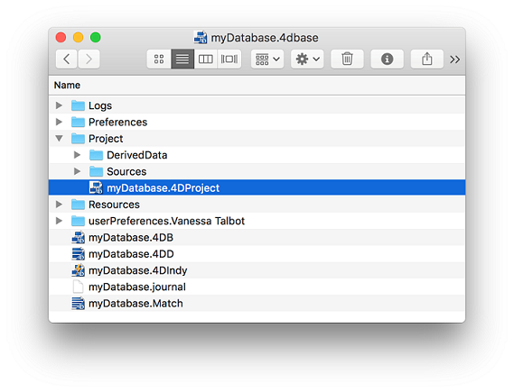

You can convert an existing 4D database (.4db file) into a 4D project. Since the export only creates a new version of the existing database, original files are never touched. Thus, you can convert your database as many times as you need.

Keep in mind that the export is a one-way operation:

- once a 4D database has been exported as a project, both versions become independant. 
- a 4D project cannot be exported to a .4db file


## Converting a database

When you convert an existing 4D database to a project, the .4db file is left untouched: a "Project" folder is created next to your .4db file, and will contain all necessary files.

**Note:** If a "Project" folder already exists at the same level as your .4db file (for example if a conversion has been done already), it will be replaced by the conversion process. 

To convert a database to a project:

1. Open the database to convert.
2. Select **File > Export > Structure to project**.  

**Notes:**   
- This command is only available if the database is open in classic (binary) mode.
- You can also use the **Export structure file** language command.

If the conversion was successful and no blocking errors encountered, the following dialog box is diplayed:


- **Reveal log**: highlights the conversion log file on your disk. Reading this file is highly recommenced in any case since the conversion process could have modified some parts of the application (see [Check the conversion](#check-the-conversion)).

- **Open project**: restarts the 4D application and loads the converted project. 

### About the data file

The data file is left untouched by the conversion. Only development elements are converted. You can open the data file with the .4db structure file after a conversion. 

## Resulting project

During the conversion process, a new "Project" folder is created at the same level as your .4db structure file. It contains all your development as text files: forms, structure, methods, triggers, menus, tips, lists. It also contains a ".4DProject" file, which is your converted 4D project main file:



When you open the "<name>.4DProject" file with your 4D application, the project uses the same resources folder and web folder as the existing "<name>.4db" file, which makes it easier to test your project.

You can still open the "<name>.4db" database, do some modifications if required (see below), then export again, and test. You can repeat this operation until you are satisfied with the conversion.

## Check the conversion

A log file is created by default during the conversion to reference all issues that required an action from the converter. The log file is in JSON format. In the file, messages are classified in three categories ("severity" property), for example:

```codejs
	{
	   "message": "Exporting picture id:1, name:logo.png, types:.png to <...>:Resources:Images:library:logo.png",
	   "severity": "info"
	}
```

- **info**: describes a necessary action executed automatically by the converter and that will not have any impact on the application interface or features. For example, if you have images in the pictures library, 4D exports them to the **resources** folder of the database (see example above).

- **warning**: describes a necessary action executed automatically by the converter that could lead to differences in the application's features or interface, but without preventing the database to run. Warnings usually require that you control the impact of the conversion on your code. For example, warnings are returned when unsupported compatibility settings, such as "Unicode mode" or "Radio buttons grouped by name" are automatically switched. 

- **error**: describes an issue that requires your intervention to be fixed. It can prevent the database to run properly. For example, some old form objects are no longer supported, such as highlight buttons. In this case, you must convert yourself the button to a 3D button in the .4db file before relaunching the consersion. 


When edits are required in the .4db database, just modify the code or the form accordingly and export the structure again, until you are satisfied with the result. 


## Compatibility issues

In 4D projects, we have removed the support of .4db features that were deprecated in order to focus on new, modern implementations. In particular:

- The picture library no longer exists. During conversion, 4D exports all your images to the **resources** folder of the database.
- Legacy style sheets are not converted.
- Groups and users are not converted.
- Form objects and form object properties have been updated (they now use the same grammar as for Dynamic forms). Deprecated parts are not supported (see [Legacy form objects and properties on Doc Center](https://doc.4d.com/4Dv17R4/4D/17-R4/Deprecated-or-removed-features-in-v17-product-range.200-4075256.en.html#4020272))'. In fact, we use the same grammar used for Dynamic forms.
- Compatibility settings are reset as for a new database. See the Conversion log file to verify the status of compatibility settings for your database. 


## And after?

Once your are satisfied with your converted database and want to start working with your project, you can clean up your working directory:

1. Remove your ".4db" and ".4dindy" files from the application folder (you can move them to a backup directory for example).
2. On macOS, remove the ".4dbase" folder extension during the whole development phase. Since you are going to work with text files and put them under a source control tool, you will need to have direct access to them. 