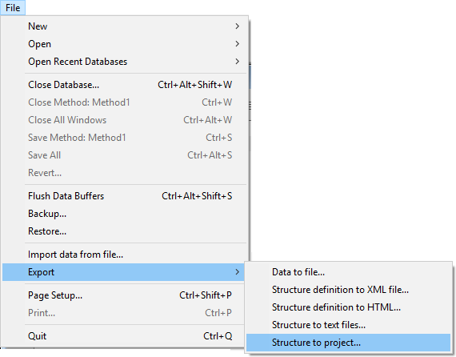
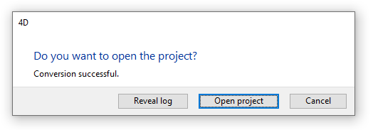

You can convert an existing 4D database (.4db file) into a 4D project. Since the export only creates a new version of the existing database, original files are never touched. Thus, you can convert your database as many times as you need.

Note that the export is a one-way operation:

- once a 4D database has been exported as a project, both versions become independant. 
- a 4D project cannot be exported to a .4db file

## Converting a database

When you convert an existing 4D database to a project, the .4db file is left untouched: a "Project" folder is created next to your .4db file, and will contain all necessary files.

**Note:** If a "Project" folder already exists at the same level as your .4db file (for example if a conversion has been done already), it will be replaced by the conversion process. 

To convert a database to a project:

1. Open the database to convert.
2. Select **File > Export > Structure to project**.  
**Note:** This command is only available if the database is open in classic (binary) mode. 

If the conversion was successful and no blocking errors encountered, the following dialog box is diplayed:

- **Reveal log**: highlights the conversion log file on your disk. Reading this file is highly recommenced in any case since the conversion process could have modified some parts of the application (see XXX).
- **Open project**: restarts the 4D application and loads the converted database as a project. 

## Check your conversion

## Compatibility issues

## And after?
### Copy, merge, 
### Rollback
