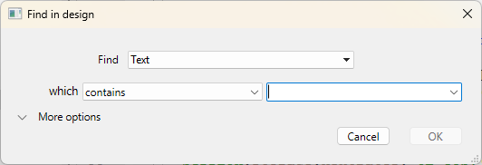
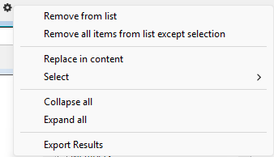
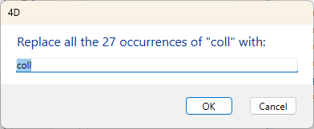
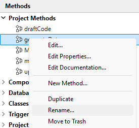

4D provides several search and replace functions for elements in all of the Design environment.

- You can search for a string or a type of object (variable, comment, expression, etc.) in part of or in the entire project on the basis of custom criteria ("starts with", "contains", etc.). You can, for example, search for all the variables containing the string "MyVar", only in methods whose name begins with "HR_".
- The results are displayed in a results window, where it is possible to perform replacements in the contents. You can also export these results in a text file that can be imported into a spreadsheet.
- You can detect variables and methods that are not used in your code and then remove them to free up memory.
- You can rename a project method or a variable throughout the Design environment in a single operation. 

:::note

There are also functions for searching among the methods of your project in the context menu of the Methods Page in the Explorer: **Search Callers** (aussi available in the [Code editor](../code-editor/write-class-method.md#search-callers) and **Search Dependencies**. Both functions display the items found in a [Results window](#results-window). 

:::


## Search Location

When you search the Design environment, the following elements are searched:

- Names of project methods and classes
- Contents of all methods and classes
- Names of tables, fields and forms
- Contents of forms:
    - object names and titles
    - names of help tips, pictures, variables, style sheets,
    - formatting strings
    - expressions
- Menus (names and items) and commands associated with menu items
- Choice lists (names and items)
- Help tips (names and content)
- Formats / filters (names and content)
- Comments in the Explorer and in the code


## Find in Design

### Starting a search

Specify your search criteria in the "Find in design" window:

1. Click on the Search button () in the 4D toolbar.
OR
    Select the **Find in Design...** command from the **Edit** menu.

The "Find in design" window appears:



The areas of the "Find in design" vary dynamically depending on the selections made in the menus. You can expand this window so that all options are visible:


2. Build your search using the different menus and entry areas of the dialog box and if necessary enter the character string to be searched for. These items are described in the following sections.

3. Set the [search options](#search-options) (if necessary).

4. Click **OK** or press the **Enter** key.
When the search is finished, the [Results window](#results-window) appears, listing the elements found.  

:::note 

You can cancel an extensive search that is underway using the **x** button; this does not close the window or remove any results that were found.

::: 

Once you have executed a search, the value entered in the search area is saved in memory. This value, as well as all the other values entered during the same session, can be selected from the combo box.


### Find 

You specify the type of element to look for using the **Find** menu. The following choices are available:

- **Text**: In this case, 4D looks for a character string throughout the Design environment. The search is done in plain text mode, without taking the context into account. For example, you can look for the text "ALERT("Error number:"+" or "button27". In this mode, you cannot use the wildcard character because "@" is considered to be a standard character.
- **Comment**: This search is basically the same as the previous one, but it is restricted to the contents of comments (lines beginning with //) in the code and in the Explorer window. For example, you can search for any comments containing the string "To be verified".   

:::note

The end result of both types of searches depends on the [search mode](#search-mode) selected. 

:::

- **Language expression**: Used to search for any valid 4D expression; the search is performed in the "contains" search mode. Validity is important because 4D must be able to evaluate an expression to be able to search for it. For example, a search for "[clients" (invalid expression) will not return any result whereas "[clients]" is correct. This option is particularly suitable for searches for value assignments and comparisons. For example:
    - Search for "myvar:=" (assignment)
    - Search for "myvar=" (comparison)
- **Language element**: Used to search for a specific language element by its name. 4D can distinguish between the following elements:
    - **Any language element**: Any element from the list below. 
    - **Project method or Class**: Name of a project method or class, for example "M_Add" or "EmployeeEntity".
    - **Form:** Form name, for example "Input". The command searches among project forms and table forms.
    - **Field or Table**: Name of a table or field, for example "Customers".
    - **Variable**: Any variable name, such as "$myvar".
    **4D constant**: Any constant, such as "Is Picture".
    **String in quotes**: Literal text constant; i.e. any value within quotes in the code editor or inserted into text areas of the Form editor (static text or group boxes). For example, a search for "Martin" will return results if your code contains the line: `ds.Customer.query("name = :1"; "Martin")`
    - **4D command**: Any 4D command, for example "Alert".
    - **Plug-in command**: Plug-in command installed in the application.
    - **Properties**: An object property name (includes ORDA attribute names). For example "lastname" will find "$o.lastname" and "ds.Employee.lastname".
- **Any object**: This option searches among all the elements in the Design environment. Only the modification date filter is available. Use this option, for example, to search for "anything modified today".

### Search mode

The search mode menu (i.e. "which", "that is" or "whose name") specifies how to search for the value that is entered. The contents of this menu vary according to the type of element to search for as selected in the **Find** dropdown list. 

- Search options for Text or Comment:
    - **contains**: Searches all text in the Design environment for the specified string. Search results for "var" can include "myvar", "variable1" or "aVariable".
    - **contains whole word**: Searches all text of the Design environment for the string as a whole word. Search results for "var" only include exact occurrences. They will not include "myvar" but will include, for example, "var:=10" or "ID+var" because the symbols : or + are word separators.
    - **begins with / ends with**: Searches for the string at the beginning or end of the word (text search) or at the beginning or end of the comment line (comment search). In "Text ends with" mode, searching for "var" will find "myvar".
- Search options for Language element: The menu offers standard options (matches, contains, begins with, ends with). Note that you can use the search wildcard (@) with the matches option (returns all objects of the type specified).

### Search in components

When your current project references [editable components](../Extensions/develop-components.md#editing-components), you can designate one or all your components as a target for the search. By default, a search is executed in the host only. To modify the target for a search, deploy the **in the project** menu: 


You can select as target:

- the **host project** (default option, top of the list): the search will only be executed within the host project code and forms, excluding components.
- the **host project and all its components**: the search will be executed in the host project and in all its loaded components.
- a **specific component**, among the list of all searchable components: the search will be restricted to this component only, excluding the host and other components.

:::note

When no searchable component is found, no menu is available.   

:::


The **in the folder** menu (see below) is updated when you select a project since the availability of folders depends on the selected search target(s). The menu is hidden when you select the "host project and all its components" option. 


### Folder  

The **in the folder** menu restricts the search to a specific folder of the project. By default ("Top Level" option), the search takes place in all the folders.

:::note

Folders are defined on the Home Page of the Explorer.

:::

### Modification date of the parent 

This menu restricts the search with respect to the creation/modification date of its parent (for example, the method containing the string being searched for). In addition to standard date criteria (is, is before, is after, is not), this menu also contains several options to let you quickly specify a standard search period:

- **is today**: Period beginning at midnight (00:00 h) of the current day.
- **is since yesterday**: Period including the current day and the previous one.
- **is this week**: Period beginning on Monday of the current week.
- **is this month**: Period beginning on the 1st day of the current month.

### Searching options  

You can select options that can help speed up your searches:

- **Search in forms**: When this option is deselected, the search is done throughout the project, except in forms.
- **Search in methods**: When this option is deselected, the search is done throughout the project, except in methods.
- **Case Sensitive**: When this option is selected, the search uses the case of the characters as they have been entered in the Find area.


## Results window

The Results window lists all elements found that match the search criteria set using different types of searches:

- [standard search](#starting-a-search)
- [search for unused elements](#find-unused-methods-and-global-variables)
- [search for callers](../code-editor/write-class-method.md#search-callers)
- search for dependencies
- [renaming of project methods and variables](#renaming-project-methods-and-variables)

It shows the results as a hierarchical list organized by type of elements found. You can expand or collapse all the hierarchical items in the list using the options menu (found at the bottom left of the window) or in the context menu.


You can double-click on a line in this window to view the element in its editor, such as the [code editor](../code-editor/write-class-method.md). If you do several searches, each search opens its own result window, leaving previous result windows open.

When more than one occurrence has been found, the list indicates their **count** next to the element name.

Each line can display a tip that provides additional information, for example the element property that matches the criteria, or the number of the form page that contains the occurrence. 

When an element found belongs to a component, the **component name** is displayed in parenthesis at the right side of the element name:


Once a search is completed, you can use the  button to perform the search again with the same criteria and options.


### Options menu  

You can perform various actions using the options menu:




- **Remove from list**: removes selected item(s) from the results window. More specifically, this lets you keep only items targeted by a replacement operation in the contents or used for drag and drop between applications.
- **Remove all items from list except selection**: clears everything from the results window except for the selected item(s).
- [**Replace in content**](#replace-in-contents): replaces a character string within the selected item(s).
- **Select >**: selects one type of item (project methods, object names, and so on) from among all the items found in the Results window. The hierarchical sub-menu also provides commands to select (All) or deselect (None) all the items at once.
- **Collapse all/Expand all**: expands or collapses all the hierarchical items in the list of results.
- **Export Results**: exports information about the search criteria and elements listed in the Results window. This text file can then be imported into a spreadsheet such as Excel, for example. For each item, the following information is exported as tab-separated values in a text file:
    - Host project or component name
    - Type (method, Class, formObject, trigger...)
    - Path 
    - Property (if accurate): provides the property of the object that matches the criteria. For example, a string could be found in a variable name (variable property) and an object name (name property) within in the same form. This field is empty when the matching element is the object itself.
    - Contents (if accurate): provides the contents that actually matches the criteria; for example, the code line that contains the requested string.
    - Line number (for code) or page number (for form objects)


## Replace in content

The Replace in content function allows you to replace one character string with another within the listed objects in the Results window. It is available in the [options menu](#options-menu) of the window. 

:::note

The **Replace in content** menu item is disabled if you work in a read-only database (e.g. in a .4dz file).  

:::

When you select this command, a dialog box appears where you enter the character string that will replace all the occurrences found by the initial search:




Replacing operations work as follows:

- Replacing is always carried out among all items found in the list and not just for a selection. However, it is possible to narrow the replacing operation by first reducing the contents of the list using the **Remove from list** or **Remove all items from list except selection** commands in the [options menu](#options-menu) or the contextual menu. 
- If the Results window includes elements from components, the replacing will be done in the component(s) also. 
- Only the occurrences shown in the list will be replaced and only after checking the initial search criteria for cases where objects were modified between the initial search and the replacing operation.
- Replacing is done in the code, properties of form objects, contents of help messages, entry filters, menu items (item text and method calls), choice lists, comments. 
- For each object modified, 4D checks whether it is already loaded by another machine or in another window. In the case of conflict, a standard dialog box appears indicating that the object is locked. You can close the object and then try again or cancel its replacement. The replacing operation will then continue with the other objects in the list.
- If a method or form concerned by a "replace in content" operation is currently being edited by the same 4D application, it will be modified directly in the open editor (no warning appears). Forms and methods modified in this way are not saved automatically: you will need to use the **Save** or **Save All** command explicitly to validate the changes.
- After a replacement is made in a list item, it will appear in italics. A count of replacements made in real time appears at the bottom of the window.
- Elements are never renamed themselves by the **Replace in content** feature, except for form objects. Hence it is possible that certain items in the list may not be affected by the replacing operation. This can occur when only the item name corresponds to the initial search criteria. In this case, the list items do not necessarily all appear in italics and the final replacement count may be less than the number of occurrences found by the initial search.


## Renaming project methods and variables

4D provides a dedicated renaming function with distribution throughout the entire project for project methods and variables. 

The **Rename...** command is available from the [Code editor] (for project methods and variables) and the Explorer context menu (for project methods).



When you select this command, a dialog box appears where you enter the new name for the object:


The new name must comply with [naming rules](../Concepts/identifiers.md); otherwise a warning appears when you validate the dialog box. For example, you cannot rename a method with a command name such as "Alert". 

Depending on the type of object you are renaming (project method or variable), the renaming dialog box may also contain a distribution option:

- Project method: The **Update callers in whole database** option renames the method in all the project code that references it. You can also uncheck this option in order, for example, to rename the method only in the Explorer itself.
- Process variable: The **Rename variable in whole database** option renames the variable in all the project code that references it. If you uncheck this option, the variable is only renamed in the current method.
- Local variable: No distribution option for this object; the variable is only renamed in the current method or class.


## Searching for unused elements

Two specific search commands allow you to detect variables and methods that are not used in the code of your host project. You can then remove them to free up memory. These commands are found in the **Edit** menu of the Design environment. 

### Find Unused Methods and Global Variables  

This command looks for project methods as well as "global" variables (process and interprocess variables) that are declared but not used. The search results appear in a standard [Results window](#results-window).

A project method is considered to be unused when:
- it is not in the Trash,
- it is not called anywhere in the 4D code,
- it is not called by a menu command,
- it is not called as a string constant in the 4D code (4D detects a method name in a string even when it is followed by parameters in parentheses).

A process or interprocess variable is considered to be unused when:
- it is [declared](../Concepts/variables.md#declaring-variables) in the 4D code,
- it is not used anywhere else in the 4D code,
- it is not used in any form object.

Note that certain uses cannot be detected by the function - i.e. an element considered unused may in fact be used. This is the case in the following code:

```4d
var v : Text :="method"
EXECUTE FORMULA("my"+v+String(42))
```

This code builds a method name. The *mymethod42* project method is considered unused when in fact it is called. Therefore, it is advisable to check that the elements declared as unused are in fact unnecessary before you remove them.

### Find Unused Local Variables  

This command looks for local variables that are declared but not used. The search results appear in a standard [Results window](#results-window).

A local variable is considered to be unused when:

- it is [declared](../Concepts/variables.md#declaring-variables) in the 4D code,
- it is not used anywhere else within the same method.
