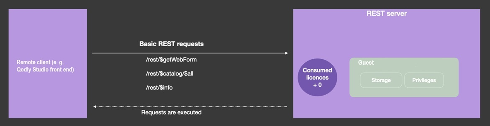
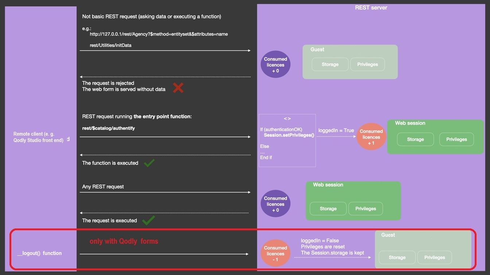
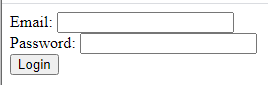

When [scalable sessions are enabled](WebServer/sessions.md#enabling-sessions) (recommended), REST requests can create and use [web user sessions](WebServer/sessions.md), providing extra features such as multiple requests handling, data sharing between web client processes, and control of user privileges. 

When a web user session is opened, you can handle it through the `Session` object and the [Session API](API/SessionClass.md). Subsequent REST requests reuse the same session cookie. 

As a first step to open a REST session on the 4D server, the user sending the request must be logged. 


## User login modes

The user login mode allows you to control how REST requests acquire web sessions. You can choose between two user login modes: "default", or "force login".

:::note

Since non-guest web sessions opened upon REST requests require a license, the user login mode impacts your license usage. 

:::

You set the user login mode through the `forceLogin` property in the [`roles.json` file](../ORDA/privileges.md#rolesjson-file):

- the **default mode** is used if the "forceLogin" property is missing or set to "false",
- the **force login** mode is used if the "forceLogin" property is set to "true".

:::caution

If you modify this property, the server must be restarted to take the change into account. 

:::

:::note

In Qodly Studio in 4D, the mode can be set using the [**Force login** option](../webServer/qodly-studio.md#force-login) in the Privileges panel. 

:::


### Default mode

In the default mode, all REST requests automatically creates a web session on the server (if not already created) and is processed. You can use this simple mode if you don't need to control how many web sessions are opened on the server.
When the default mode is enabled, you can authentify users through the `On REST Authentication` database method (see below).


### Force login mode

In "force login" mode, web user sessions are created only when necessary and are controlled through a login sequence. 

To allow you to set up this sequence, specific REST requests are processed without requiring any registered web session (they are guest sessions). These requests are:

- `/rest/$catalog/$all` - the list of all exposed dataclasses
- `/rest/$catalog/authentify` - the datastore function used to login the user 
- `/rest/$getWebForm` - the rendering of a Qodly form



All other REST requests (asking for data or executing a function) will only be processed if they are executed within an opened web session. Otherwise, they return an error. A web session is only opened when the `setPrivileges()` function is called for that session.

Therefore, the "force login" mode is designed to set up the following sequence:

1. You create an exposed [datastore class function](../ORDA/ordaClasses.md#datastore-class) named  `authentify()`, in which you check the user credentials and call [`Session.setPrivileges()`](../API/SessionClass.md#setprivileges) with appropriate privileges.
2. The `/rest/$catalog/authentify` request is sent to the server along with user credentials. This step only requires a basic login form that do not access data; it can be a Qodly form (called via the `/rest/$getWebForm` request).
3. If the user is successfully authentified, a web session is opened on the server and all REST requests are accepted. 



:::note

The `ds.__logout()` function can only be called [in the context of a Qodly form](../WebServer/qodly-studio.md#logout). 

:::

### `Function authentify`

#### Syntax

```4d
exposed Function authentify({params : type}) {-> result : type}
	// code
```

The `authentify()` function must be implemented in the [DataStore class](../ORDA/ordaClasses.md#datastore-class) of the project and must be called through a REST request. 

This function is the entry point of initial REST requests (i.e. requests not already executed within a web session) when the "force login" mode is enabled: any other function call or data access is rejected until a session is opened.

The function can receive any authentication or contextual information as [parameter(s)](classFunctions.md#parameters) and can return any value. Since this function can only be called from a REST request, parameters must be passed through the body of the POST request. 

This function should contain two parts:

- some code to identify and authenticate the REST request sender,
- if the authentication is successful, a call to [`Session.setPrivileges()`](../API/SessionClass.md#setprivileges) that creates the web session on the server and assigns appropriate privileges to the session.

If the function does not call [`Session.setPrivileges()`](../API/SessionClass.md#setprivileges), no session is created and subsequent REST requests are rejected.

If the function is called from another context than a REST request, it does nothing. 

#### Example

You only want the know users to open a web session on the server. You created the following `authentify()` function in the datastore class:

```4d
exposed Function authentify($credentials : Object)

var $users : cs.UsersSelection
var $user : cs.UsersEntity
	
$users:=ds.Users.query("name = :1"; $credentials.name)
$user:=$users.first()

If ($user#Null) //the user is known
	If (Verify password hash($credentials.password; $user.password))
		Session.setPrivileges("vip")
	Else 
		return "Wrong password"
	End if 
Else 
        return "Wrong user"
End if 
```


To call the `authentify()` function:

**POST** `127.0.0.1:8111/rest/$catalog/authentify`

Body of the request: 

```json
["name":"Henry",
"password":"123"]
```


## Using `On REST Authentication`

When the "force login" mode is disabled (default mode), you can log in a user to your application by calling [`$directory/login`]($directory.md#directorylogin) in a POST request including the user's name and password in the header. This request calls the `On REST Authentication` database method (if it exists), where you can check the user's credentials (see example below). 

If the `On REST Authentication` database method has not been defined, a `guest` session is opened. 


### Example

In this example, the user enters their email and password in an html page that requests [`$directory/login`]($directory.md#directorylogin) in a POST (it is recommended to use an HTTPS connection to send the html page). The `On REST Authentication` database method is called to validate the credentials and to set the session. 

The HTML login page:




```html
<html><body bgcolor="#ffffff">

<div id="demo">
	<FORM name="myForm">
Email: <INPUT TYPE=TEXT NAME=userId VALUE=""><br/>
Password: <INPUT TYPE=TEXT NAME=password VALUE=""><br/>
<button type="button" onclick="onClick()">
Login
</button>
<div id="authenticationFailed" style="visibility:hidden;">Authentication failed</div>
</FORM>
</div>

<script>
function sendData(data) {
  var XHR = new XMLHttpRequest();
  
  XHR.onreadystatechange = function() {
    if (this.status == 200) {      
      window.location = "authenticationOK.shtml"; 
      }
      else {
      document.getElementById("authenticationFailed").style.visibility = "visible";
      }
  };
  
  XHR.open('POST', 'http://127.0.0.1:8044/rest/$directory/login'); //rest server address
  
  XHR.setRequestHeader('username-4D', data.userId);
  XHR.setRequestHeader('password-4D', data.password);
  XHR.setRequestHeader('session-4D-length', data.timeout);
  
  XHR.send();
};
function onClick()
{
sendData({userId:document.forms['myForm'].elements['userId'].value , password:document.forms['myForm'].elements['password'].value , timeout:120})
}
</script></body></html>

```

When the login page is sent to the server, the `On REST Authentication` database method is called:

```4d
	//On REST Authentication

#DECLARE($userId : Text; $password : Text) -> $Accepted : Boolean
var $sales : cs.SalesPersonsEntity

$Accepted:=False

	//A '/rest' URL has been called with headers username-4D and password-4D
If ($userId#"")
    $sales:=ds.SalesPersons.query("email = :1"; $userId).first()
    If ($sales#Null)
        If (Verify password hash($password; $sales.password))
            fillSession($sales)
            $Accepted:=True
        End if 
    End if 
End if 
```

> As soon as it has been called and returned `True`, the `On REST Authentication` database method is no longer called in the session. 

The `fillSession` project method initializes the user session, for example:

```4d
#DECLARE($sales : cs.SalesPersonsEntity)
var $info : Object

$info:=New object()
$info.userName:=$sales.firstname+" "+$sales.lastname

Session.setPrivileges($info)

Use (Session.storage)
    If (Session.storage.myTop3=Null)
        Session.storage.myTop3:=$sales.customers.orderBy("totalPurchase desc").slice(0; 3)
    End if 
End use
```


## Preemptive mode

On 4D Server, REST requests are automatically handled through preemptive processes, **even in interpreted mode**. You need to make sure that your code is [compliant with a preemptive execution](../WebServer/preemptiveWeb.md#writing-thread-safe-web-server-code).

> To debug interpreted web code on the server machine, make sure the debugger is [attached to the server](../Debugging/debugging-remote.md) or [to a remote machine](../Debugging/debugging-remote.md#attaching-the-debugger-to-a-remote-4d-client). Web processes then switch to cooperative mode and the web server code can be debugged.

With 4D single-user, interpreted code always runs in cooperative mode.


