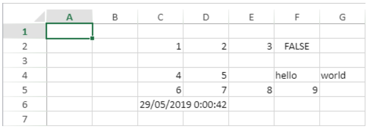

> **Warning**: The commands on this page are not thread-safe.


### VP Get active cell

<!-- REF #_method_.VP Get active cell.Syntax -->
**VP Get active cell** (  *vpAreaName* : Text { ; *sheet* : Integer } ) : Object<!-- END REF -->

<!-- REF #_method_.VP Get active cell.Params -->

|Parameter|Type| |Description|
|---|---|---|---|
|vpAreaName  |Text|->|4D View Pro area form object name|
|sheet  |Integer|->|Sheet index (current sheet if omitted)|
|Result  |Object|<-|Range object of single cell|<!-- END REF -->

#### Description

The `VP Get active cell` command <!-- REF #_method_.VP Get active cell.Summary -->returns a new range object referencing the cell which has the focus and where new data will be entered (the active cell)<!-- END REF -->.

In *vpAreaName*, pass the name of the 4D View Pro area. If you pass a name that does not exist, an error is returned.

In the optional *sheet* parameter, you can designate a specific spreadsheet where the range will be defined (counting begins at 0). If omitted or if you pass `vk current sheet`, the current spreadsheet is used.

#### Example


The following code will retrieve the coordinates of the active cell:

```4d
$activeCell:=VP Get active cell("myVPArea")
 
  //returns a range object containing: 
  //$activeCell.ranges[0].column=3
  //$activeCell.ranges[0].row=4
  //$activeCell.ranges[0].sheet=0
```

#### See also

[VP ADD SELECTION](#vp-add-selection)<br/>[VP Get selection](#vp-get-selection)<br/>[VP RESET SELECTION](#vp-reset-selection)<br/>[VP SET ACTIVE CELL](#vp-set-active-cell)<br/>[VP SET SELECTION](#vp-set-selection)<br/>[VP SHOW CELL](#vp-show-cell)

### VP Get binding path

<details><summary>History</summary>

|Version|Changes|
|---|---|
|v19 R5|Added|

</details>

<!-- REF #_method_.VP Get binding path.Syntax -->
**VP Get binding path** ( *rangeObj* : Object ) : Text<!-- END REF -->

<!-- REF #_method_.VP Get binding path.Params -->

|Parameter|Type||Description|
|---|---|---|---|
| rangeObj | Object | -> | Range object |
| Result  | Text | <- | Name of the attribute bound to the cell |<!-- END REF -->

#### Description

The `VP Get binding path` command <!-- REF #_method_.VP Get binding path.Summary -->returns the name of the attribute bound to the cell specified in *rangeObj*<!-- END REF -->.

In *rangeObj*, pass an object that is either a cell range or a combined range of cells. Note that:

* If *rangeObj* is a range with several cells, the command returns the attribute name linked to the first cell in the range.
* If *rangeObj* contains several ranges of cells, the command returns the attribute name linked to the first cell of the first range.

#### Example


```4d
var $p; $options : Object
var $myAttribute : Text

$p:=New object
$p.firstName:="Freehafer"
$p.lastName:="Nancy"

VP SET DATA CONTEXT("ViewProArea"; $p)

VP SET BINDING PATH(VP Cell("ViewProArea"; 0; 0); "firstName")
VP SET BINDING PATH(VP Cell("ViewProArea"; 1; 0); "lastName")

$myAttribute:=VP Get binding path(VP Cell("ViewProArea"; 1; 0)) // "lastName"
```

#### See also

[VP SET BINDING PATH](#vp-set-binding-path)<br/>[VP Get data context](#vp-get-data-context)<br/>[VP SET DATA CONTEXT](#vp-get-data-context)

### VP Get cell style

<!-- REF #_method_.VP Get cell style.Syntax -->
**VP Get cell style** (  *rangeObj* : Object ) : Object<!-- END REF -->

<!-- REF #_method_.VP Get cell style.Params -->

|Parameter|Type| |Description|
|---|---|---|---|
|rangeObj  |Object|->|Range object|
|Result  |Object|<-|Style object|<!-- END REF -->

#### Description

The `VP Get cell style` command <!-- REF #_method_.VP Get cell style.Summary -->returns a [style object](configuring.md#style-objects) for the first cell in the *rangeObj*<!-- END REF -->.

In *rangeObj*, pass a range containing the style to retrieve.

* If *rangeObj* contains a cell range, the cell style is returned.
* If *rangeObj* contains a range that is not a cell range, the style of the first cell in the range is returned.
* If *rangeObj* contains several ranges, only the style of the first cell in the first range is returned.

#### Example

To get the details about the style in the selected cell (B2):


This code:

```4d
$cellStyle:=VP Get cell style(VP Get selection("myDoc"))
```

... will return this object:

```4d
{
  "backColor":"Azure",
  "borderBottom":
   {
     "color":#800080,
     "style":5
   }
  "font":"8pt Arial",
  "foreColor":"red",
  "hAlign":1,
  "isVerticalText":"true",
  "vAlign":0
}
```

#### See also

[VP GET DEFAULT STYLE](#vp-get-default-style)<br/>[VP SET CELL STYLE](#vp-set-cell-style)

### VP Get column attributes

<!-- REF #_method_.VP Get column attributes.Syntax -->
**VP Get column attributes** (  *rangeObj* : Object ) : Collection<!-- END REF -->

<!-- REF #_method_.VP Get column attributes.Params -->

|Parameter|Type| |Description|
|---|---|---|---|
|rangeObj  |Object|->|Range object|
|Result  |Collection|<-|Collection of column properties|<!-- END REF -->

#### Description

The `VP Get column attributes` command <!-- REF #_method_.VP Get column attributes.Summary -->returns a collection of properties for any column in the *rangeObj*<!-- END REF -->.

In *rangeObj*, pass an object containing a range of the columns whose attributes will be retrieved.

The returned collection contains any properties for the columns, whether or not they have been set by the [VP SET COLUMN ATTRIBUTES](#vp-set-column-attributes) command.

#### Example

The following code:

```4d
C_OBJECT($range)
C_COLLECTION($attr)
 
$range:=VP Column("ViewProArea";1;2)
$attr:=VP Get column attributes($range)
```

... will return a collection of the attributes within the given range:


#### See also

[VP Get row attributes](#vp-get-row-attributes)<br/>[VP SET COLUMN ATTRIBUTES](#vp-set-column-attributes)<br/>[VP SET ROW ATTRIBUTES](#vp-set-row-attributes)

### VP Get column count

<!-- REF #_method_.VP Get column count.Syntax -->
**VP Get column count** ( *vpAreaName* : Text { ; *sheet* :  Integer } ) : Integer<!-- END REF -->

<!-- REF #_method_.VP Get column count.Params -->

|Parameter|Type| |Description|
|---|---|---|---|
|vpAreaName  |Text|->|4D View Pro area from object name|
|sheet  |Integer|->|Sheet index (current sheet if omitted)|
|Result  |Integer|<-|Total number of columns |<!-- END REF -->

#### Description

The `VP Get column count` command <!-- REF #_method_.VP Get column count.Summary -->returns the total number of columns from the designated *sheet*<!-- END REF -->.

In *vpAreaName*, pass the name property of the 4D View Pro area. If you pass a name that does not exist, an error is returned.

You can define where to get the column count in the optional *sheet* parameter using the sheet index (counting begins at 0). If omitted or if you pass `vk current sheet`, the current spreadsheet is used.

#### Example

The following code returns the number of columns in the 4D View Pro area:

```4d
C_INTEGER($colCount)
$colCount:=VP Get column count("ViewProarea")
```

#### See also

[VP Get row count](#vp-get-row-count)<br/>[VP SET COLUMN COUNT](#vp-set-column-count)<br/>[VP SET ROW COUNT](#vp-set-row-count)

### VP Get current sheet

<!-- REF #_method_.VP Get current sheet.Syntax -->
**VP Get current sheet** ( *vpAreaName* : Text )<!-- END REF -->

<!-- REF #_method_.VP Get current sheet.Params -->

|Parameter|Type| |Description|
|---|---|---|---|
|vpAreaName| Text|->|4D View Pro area form object name|
|Function result|Integer|<-|Index of the current sheet|<!-- END REF -->

#### Description

The `VP Get current sheet` command <!-- REF #_method_.VP Get current sheet.Summary -->returns the index of the current sheet in *vpAreaName*. The current sheet is the selected sheet in the document.<!-- END REF -->

In *vpAreaName*, pass the name of the 4D View Pro area.

> Indexing starts at 0.

#### Example

When the third sheet is selected:


The command returns 2:

```4d
$index:=VP Get current sheet("ViewProArea")
```

#### See also

[VP SET CURRENT SHEET](#vp-set-current-sheet)

### VP Get data context

<details><summary>History</summary>

|Version|Changes|
|---|---|
|v19 R5|Added|

</details>

<!-- REF #_method_.VP Get data context.Syntax -->
**VP Get data context** ( *vpAreaName* : Text {; *sheet* : Integer } ) : Object<br/>**VP Get data context** ( *vpAreaName* : Text {; *sheet* : Integer } ) : Collection<!-- END REF -->

<!-- REF #_method_.VP Get data context.Params -->

|Parameter|Type||Description|
|---|---|---|---|
|vpAreaName |Object|->|4D View Pro area form object name|
|sheet|Integer|->|Index of the sheet to get the data context from|
|Result |Object &#124; Collection |<-|Data context|<!-- END REF -->

#### Description

The `VP Get data context` command <!-- REF #_method_.VP Get data context.Summary -->returns the current data context of a worksheet<!-- END REF -->. The returned context includes any modifications made to the contents of the data context.

In *sheet*, pass the index of the sheet to get the data context from. If no index is passed, the command returns the data context of the current worksheet. If there is no context for the worksheet, the command returns `Null`.

The function returns an object or a collection depending on the type of data context set with [VP SET DATA CONTEXT](#vp-set-data-context).

#### Example

To get the data context bound to the following cells:


```4d
var $dataContext : Object

$dataContext:=VP Get data context("ViewProArea") // {firstName:Freehafer,lastName:Nancy}
```

#### See also

[VP SET DATA CONTEXT](#vp-set-data-context)<br/>[VP Get binding path](#vp-get-binding-path)<br/>[VP SET BINDING PATH](#vp-set-binding-path)

### VP Get default style


<!-- REF #_method_.VP Get default style.Syntax -->
**VP Get default style** ( *vpAreaName* : Text { ; *sheet* :  Integer } ) : Object<!-- END REF -->

<!-- REF #_method_.VP Get default style.Params -->

|Parameter|Type| |Description|
|---|---|---|---|
|vpAreaName  |Text|->|4D View Pro area from object name|
|sheet  |Integer|->|Sheet index (current sheet if omitted)|
|Result  |Object|<-|Default style settings |<!-- END REF -->

#### Description

The `VP Get default style` command <!-- REF #_method_.VP Get default style.Summary -->returns a default style object for a sheet<!-- END REF -->. The returned object contains basic document rendering properties as well as the default style settings (if any) previously set by the [VP SET DEFAULT STYLE](#vp-set-default-style) method. For more information about style properties, see [Style Objects & Style Sheets](configuring.md#style-objects--style-sheets).

In *vpAreaName*, pass the name property of the 4D View Pro area. If you pass a name that does not exist, an error is returned.

You can define where to get the column count in the optional *sheet* parameter using the sheet index (counting begins at 0). If omitted or if you pass `vk current sheet`, the current spreadsheet is used.

#### Example

To get the details about the default style for this document:


This code:

```4d
$defaultStyle:=VP Get default style("myDoc")
```

will return this information in the *$defaultStyle* object:

```4d
{
 backColor:#E6E6FA,
 hAlign:0,
 vAlign:0,
 font:12pt papyrus
}
```

#### See also

[VP Get cell style](#vp-get-cell-style)<br/>[VP SET DEFAULT STYLE](#vp-set-default-style)

### VP Get formula

<!-- REF #_method_.VP Get formula.Syntax -->
**VP Get formula** ( *rangeObj* : Object) : Text<!-- END REF -->

<!-- REF #_method_.VP Get formula.Params -->

|Parameter|Type| |Description|
|---|---|---|---|
|rangeObj  |Object|->|Range object|
|Result  |Text|<-|Formula|<!-- END REF -->


#### Description

The `VP Get formula` command <!-- REF #_method_.VP Get formula.Summary -->retrieves the formula from a designated cell range<!-- END REF -->.

In *rangeObj*, pass a range whose formula you want to retrieve. If *rangeObj* designates multiple cells or multiple ranges, the formula of the first cell is returned. If *rangeObj* is a cell that does not contain a formula, the method returns an empty string.

#### Example

```4d
  //set a formula
VP SET FORMULA(VP Cell("ViewProArea";5;2);"SUM($A$1:$C$10)")
 
$result:=VP Get formula(VP Cell("ViewProArea";5;2)) // $result="SUM($A$1:$C$10)"
```

#### See also

[VP Get formulas](#vp-get-formulas)<br/>[VP SET FORMULA](#vp-set-formula)<br/>[VP SET ROW COUNT](#vp-set-row-count)

### VP Get formula by name

<!-- REF #_method_.VP Get formula by name.Syntax -->
**VP Get formula by name** ( *vpAreaName* : Text ; *name* : Text { ; *scope* : Number } ) : Object<!-- END REF -->

<!-- REF #_method_.VP Get formula by name.Params -->

|Parameter|Type| |Description|
|---|---|---|---|
|vpAreaName  |Text|->|4D View Pro area form object name|
|name  |Text|->|Name of the named range|
|scope  |Number|->|Target scope (default=current sheet)|
|Result  |Object|<-|Named formula or named range definition|<!-- END REF -->

#### Description

The `VP Get formula by name` command <!-- REF #_method_.VP Get formula by name.Summary --> returns the formula and comment corresponding to the named range or named formula passed in the *name* parameter, or **null** if it does not exist in the defined scope<!-- END REF -->.

In *vpAreaName*, pass the name of the 4D View Pro area. If you pass a name that does not exist, an error is returned.

Pass the named range or named formula that you want to get in *name*. Note that named ranges are returned as formulas containing absolute cell references.

You can define where to get the formula in *scope* using either the sheet index (counting begins at 0) or the following constants:

* `vk current sheet`
* `vk workbook`  

##### Returned Object

The returned object contains the following properties:

|Property| Type| Description|
|---|---|---|
|formula |Text |Text of the formula corresponding to the named formula or named range. For named ranges, the formula is a sequence of absolute coordinates.|
|comment| Text| Comment corresponding to the named formula or named range |

#### Example

```4d
$range:=VP Cell("ViewProArea";0;0)
VP ADD RANGE NAME("Total1";$range)
 
$formula:=VP Get formula by name("ViewProArea";"Total1")
  //$formula.formula=Sheet1!$A$1
 
$formula:=VP Get formula by name("ViewProArea";"Total")
  //$formula=null (if not existing)
```

#### See also

[VP ADD FORMULA NAME](#vp-add-formula-name)<br/>[VP Get names](#vp-get-names)

### VP Get formulas

<!-- REF #_method_.VP Get formulas.Syntax -->
**VP Get formulas** ( *rangeObj* : Object ) : Collection<!-- END REF -->

<!-- REF #_method_.VP Get formulas.Params -->

|Parameter|Type| |Description|
|---|---|---|---|
|rangeObj  |Object|->|Range object|
|Result  |Collection|<-|Collection of formula values|<!-- END REF -->

#### Description

The `VP Get formulas` command <!-- REF #_method_.VP Get formulas.Summary -->retrieves the formulas from a designated *rangeObj*<!-- END REF -->.

In *rangeObj*, pass a range whose formulas you want to retrieve. If *rangeObj* designates multiple ranges, the formula of the first range is returned. If *rangeObj* does not contain any formulas, the command returns an empty string.

The returned collection is two-dimensional:

* The first-level collection contains subcollections of formulas. Each subcollection reprensents a row.
* Each subcollection defines cell values for the row. Values are text elements containing the cell formulas.

#### Example

You want to retrieve the formulas in the Sum and Average columns from this document:


You can use this code:

```4d
$formulas:=VP Get formulas(VP Cells("ViewProArea";5;1;2;3))
//$formulas[0]=[Sum(B2:D2),Average(B2:D2)]
//$formulas[1]=[Sum(B3:D3),Average(B3:D3)]
//$formulas[2]=[Sum(B4:D4),Average(C4:D4)]
```

#### See also

[VP Get formula](#vp-get-formula)<br/>[VP Get values](#vp-get-values)<br/>[VP SET FORMULAS](#vp-set-formulas)<br/>[VP SET VALUES](#vp-set-values)

### VP Get frozen panes

<!-- REF #_method_.VP Get frozen panes.Syntax -->
**VP Get frozen panes** ( vpAreaName : Text { ; sheet : Integer } ) : Object<!-- END REF -->

<!-- REF #_method_.VP Get frozen panes.Params -->

|Parameter|Type| |Description|
|---|---|---|---|
|vpAreaName  |Text|->|4D View Pro area form object name|
|sheet  |Integer|->|Sheet index (current sheet if omitted)|
|Result  |Object|<-|Object containing frozen column and row information|<!-- END REF -->

#### Description

The `VP Get frozen panes` command <!-- REF #_method_.VP Get frozen panes.Summary -->returns an object with information about the frozen columns and rows in *vpAreaName*<!-- END REF -->.

In *vpAreaName*, pass the name of the 4D View Pro area. If you pass a name that does not exist, an error is returned.

In the optional *sheet* parameter, you can designate a specific spreadsheet where the range will be defined (counting begins at 0). If omitted or if you pass `vk current sheet`, the current spreadsheet is used.

##### Returned object

The command returns an object describing the frozen columns and rows. This object can contain the following properties:

|Property|  Type|  Description|
|---|---|---|
|columnCount|  Integer|  The number of frozen columns on the left of the sheet|
|trailingColumnCount| Integer|  The number of frozen columns on the right of the sheet|
|rowCount|  Integer|   The number of frozen rows on the top of the sheet|
|trailingRowCount|  Integer|   The number of frozen rows on the bottom of the sheet|

#### Example

You want to retrieve information about the number of frozen columns and rows:

```4d
var $panesObj : Object

 
$panesObj:=VP Get frozen panes("ViewProArea")
```

The returned object contains, for example:


#### See also

[VP SET FROZEN PANES](#vp-set-frozen-panes)

### VP Get names

<!-- REF #_method_.VP Get names.Syntax -->
**VP Get names** ( vpAreaName : Text { ; scope : Number } ) : Collection<!-- END REF -->

<!-- REF #_method_.VP Get names.Params -->

|Parameter|Type| |Description|
|---|---|---|---|
|vpAreaName  |Text|->|4D View Pro area form object name|
|scope  |Number|->|Target scope (default= current sheet)|
|Result  |Collection|<-|Existing names in the defined scope|<!-- END REF -->

#### Description

The `VP Get names` command <!-- REF #_method_.VP Get names.Summary -->returns a collection of all defined "names" in the current sheet or in the scope designated by the *scope* parameter<!-- END REF -->.

In *vpAreaName*, pass the name of the 4D View Pro area. If you pass a name that does not exist, an error is returned.

You can define where to get the names in *scope* using either the sheet index (counting begins at 0) or the following constants:

* `vk current sheet`
* `vk workbook`

##### Returned collection

The returned collection contains one object per name. The following object properties can be returned:

|Property| Type| Description|
|---|---|---|
|result\[ ].name| Text| cell or range name|
|result\[ ].formula| Text| formula|
|result\[ ].comment| Text| Comment associated to the name|

Available properties depend on the type of the named element (named cell, named range, or named formula).

#### Example

```4d
var $list : Collection


$list:=VP Get names("ViewProArea";2) //names in 3rd sheet
```

#### See also

[VP ADD FORMULA NAME](#vp-get-formula)<br/>[VP ADD RANGE NAME](#vp-add-range-name)<br/>[VP Get formula by name](#vp-get-formula-by-name)<br/>[VP Name](#vp-name)

### VP Get print info

<!-- REF #_method_.VP Get print info.Syntax -->
**VP Get print info** ( vpAreaName : Text { ; sheet : Integer } ) : Object<!-- END REF -->

<!-- REF #_method_.VP Get print info.Params -->

|Parameter|Type| |Description|
|---|---|---|---|
|vpAreaName  |Text|->|4D View Pro area form object name|
|sheet  |Integer|->|Sheet index (current sheet if omitted)|
|Result  |Object|<-|Object of printing information|<!-- END REF -->

#### Description

The `VP Get print info` command <!-- REF #_method_.VP Get print info.Summary -->returns an object containing the print attributes of the *vpAreaName*<!-- END REF -->.

Pass the the name of the 4D View Pro area in *vpAreaName*. If you pass a name that does not exist, an error is returned.

In the optional *sheet* parameter, you can designate a specific spreadsheet (counting begins at 0) whose printing attributes you want returned.  If omitted or if you pass `vk current sheet`, the current spreadsheet is used.

#### Example

This code:

```4d
$pinfo:=VP Get print info("ViewProArea")
```

... returns the print attributes of the 4D View Pro area set in the [VP SET PRINT INFO](#vp-set-print-info) command:

```4d
{
bestFitColumns:false,
bestFitRows:false,
blackAndWhite:false,
centering:0,
columnEnd:8,
columnStart:0,
firstPageNumber:1,
fitPagesTall:1,
fitPagesWide:1,
footerCenter:"&BS.H.I.E.L.D. &A Sales Per Region",
footerCenterImage:,
footerLeft:,
footerLeftImage:,
footerRight:"page &P of &N",
footerRightImage:,
headerCenter:,
headerCenterImage:,
headerLeft:"&G",
headerLeftImage:logo.png,
headerRight:,
headerRightImage:,
margin:{top:75,bottom:75,left:70,right:70,header:30,footer:30},
orientation:2,
pageOrder:0,
pageRange:,
paperSize:{width:850,height:1100,kind:1},
qualityFactor:2,
repeatColumnEnd:-1,
repeatColumnStart:-1,
repeatRowEnd:-1,
repeatRowStart:-1,
rowEnd:24,
rowStart:0,
showBorder:false,
showColumnHeader:0,
showGridLine:false,
showRowHeader:0,
useMax:true,
watermark:[],
zoomFactor:1
}
```

#### See also

[4D View Pro Print Attributes](configuring.md#print-attributes)<br/>[VP SET PRINT INFO](#vp-set-print-info)

### VP Get row attributes

<!-- REF #_method_.VP Get row attributes.Syntax -->
**VP Get row attributes** ( rangeObj : Object ) : Collection<!-- END REF -->

<!-- REF #_method_.VP Get row attributes.Params -->

|Parameter|Type| |Description|
|---|---|---|---|
|rangeObj  |Object|->|Range object|
|Result  |Collection|<-|Collection of row properties|<!-- END REF -->

#### Description

The `VP Get row attributes` command <!-- REF #_method_.VP Get row attributes.Summary -->returns a collection of properties for any row in the *rangeObj*<!-- END REF -->.

In *rangeObj*, pass an object containing a range of the rows whose attributes will be retrieved.

The returned collection contains any properties for the rows, whether or not they have been set by the [VP SET ROW ATTRIBUTES](#vp-set-row-attributes) method.

#### Example

The following code returns a collection of the attributes within the given range:

```4d
var $range : Object
var $attr : Collection
 
$range:=VP Column("ViewProArea";1;2)
$attr:=VP Get row attributes($range)
```


#### See also

[VP Get column attributes](#vp-get-column-attributes)<br/>[VP SET COLUMN ATTRIBUTES](#vp-set-column-attributes)<br/>[VP SET ROW ATTRIBUTES](#vp-set-row-attributes)

### VP Get row count

<!-- REF #_method_.VP Get row count.Syntax -->
**VP Get row count** ( *vpAreaName* : Text {; *sheet* : Integer } ) : Integer<!-- END REF -->

<!-- REF #_method_.VP Get row count.Params -->

|Parameter|Type| |Description|
|---|---|---|---|
|vpAreaName  |Text|->|4D View Pro area from object name|
|sheet  |Integer|->|Sheet index (current sheet if omitted)|
|Result  |Integer|<-|Total number of rows|<!-- END REF -->

#### Description

The `VP Get row count` command <!-- REF #_method_.VP Get row count.Summary -->returns the total number of rows from the designated *sheet*<!-- END REF -->.

In *vpAreaName*, pass the name property of the 4D View Pro area. If you pass a name that does not exist, an error is returned.

You can define where to get the row count in the optional *sheet* parameter using the sheet index (counting begins at 0). If omitted or if you pass `vk current sheet`, the current spreadsheet is used.

#### Example

The following code returns the number of rows in the 4D View Pro area:

```4d
var $rowCount : Integer
$rowCount:=VP Get row count("ViewProarea")
```

#### See also

[VP Get column count](#vp-get-column-count)<br/>[VP SET COLUMN COUNT](#vp-set-column-count)<br/>[VP SET ROW COUNT](#vp-set-row-count)

### VP Get selection

<!-- REF #_method_.VP Get selection.Syntax -->
**VP Get selection** ( *vpAreaName* : Text {; *sheet* : Integer } ) ) : Object<!-- END REF -->

<!-- REF #_method_.VP Get selection.Params -->

|Parameter|Type| |Description|
|---|---|---|---|
|vpAreaName  |Text|->|4D View Pro area from object name|
|sheet  |Integer|->|Sheet index (current sheet if omitted)|
|Result  |Object|<-|Range object of cells|<!-- END REF -->

#### Description

The `VP Get selection` command <!-- REF #_method_.VP Get selection.Summary -->returns a new range object referencing the current selected cells<!-- END REF -->.

In *vpAreaName*, pass the name of the 4D View Pro area. If you pass a name that does not exist, an error is returned.

In the optional *sheet* parameter, you can designate a specific spreadsheet where the range will be defined (counting begins at 0). If omitted or if you pass `vk current sheet`, the current spreadsheet is used.

#### Example


The following code will retrieve the coordinates of all the cells in the current selection:

```4d
$currentSelection:=VP Get selection("myVPArea")

 
//returns a range object containing:  
//$currentSelection.ranges[0].column=5
//$currentSelection.ranges[0].columnCount=2
//$currentSelection.ranges[0].row=8
//$currentSelection.ranges[0].rowCount=6
```

#### See also

[VP ADD SELECTION](#vp-add-selection)<br/>[VP Get active cell](#vp-reset-selection)<br/>[VP SET ACTIVE CELL](#vp-set-active-cell)<br/>[VP SET SELECTION](#vp-set-selection)<br/>[VP SHOW CELL](#vp-show-cell)

### VP Get sheet count

<!-- REF #_method_.VP Get sheet count.Syntax -->
**VP Get sheet count** ( *vpAreaName* : Text ) : Integer<!-- END REF -->

<!-- REF #_method_.VP Get sheet count.Params -->

|Parameter|Type| |Description|
|---|---|---|---|
|vpAreaName| Text|->|4D View Pro area form object name|
|Function result|Integer|<-|Number of sheets|<!-- END REF -->

#### Description

The `VP Get sheet count` command <!-- REF #_method_.VP Get sheet count.Summary -->returns the number of sheets in the document loaded in *vpAreaName*.<!-- END REF -->

In *vpAreaName*, pass the name of the 4D View Pro area.

#### Example

In the following document:


Get the sheet count and set the current sheet to the last sheet:

```4d
 $count:=VP Get sheet count("ViewProArea")
  //set the current sheet to the last sheet (indexing starts at 0)
 VP SET CURRENT SHEET("ViewProArea";$count-1)
```


#### See also

[VP Get sheet index](#vp-get-sheet-index)<br/>[VP SET SHEET COUNT](#vp-set-sheet-count)

### VP Get sheet index

<!-- REF #_method_.VP Get sheet index.Syntax -->
**VP Get sheet index** ( *vpAreaName* : Text ; *name* : Text ) : Integer<!-- END REF -->

<!-- REF #_method_.VP Get sheet index.Params -->

|Parameter|Type| |Description|
|---|---|---|---|
|vpAreaName| Text|->|4D View Pro area form object name|
|name| Text|->|Sheet name|
|Function result|Integer|<-|Sheet index|<!-- END REF -->

#### Description

The `VP Get sheet index` command <!-- REF #_method_.VP Get sheet index.Summary -->returns the index of a sheet based on its name in *vpAreaName*.<!-- END REF -->

In *vpAreaName*, pass the name of the 4D View Pro area.

In *name*, pass the name of the sheet whose index will be returned. If no sheet named *name* is found in the document, the method returns -1.

>Indexing starts at 0.

#### Example

In the following document:


Get the index of the sheet called "Total first quarter":

```4d
$index:=VP Get sheet index("ViewProArea";"Total first quarter") //returns 2
```

#### See also

[VP Get sheet count](#vp-get-sheet-count)<br/>[VP Get sheet name](#vp-get-sheet-name)

### VP Get sheet name

<!-- REF #_method_.VP Get sheet name.Syntax -->
**VP Get sheet name** ( *vpAreaName* : Text ; *sheet* : Integer ) : Text<!-- END REF -->

<!-- REF #_method_.VP Get sheet name.Params -->

|Parameter|Type| |Description|
|---|---|---|---|
|vpAreaName| Text|->|4D View Pro area form object name|
|sheet| Integer|->|Sheet index|
|Function result|Text|<-|Sheet name|<!-- END REF -->

#### Description

The `VP Get sheet name` command <!-- REF #_method_.VP Get sheet name.Summary -->returns the name of a sheet based on its index in *vpAreaName*.<!-- END REF -->

In *vpAreaName*, pass the name of the 4D View Pro area.

In *sheet*, pass the index of the sheet whose name will be returned.

If the passed sheet index does not exist, the method returns an empty name.

>Indexing starts at 0.

#### Example

Get the name of the third sheet in the document:

```4d
$sheetName:=VP Get sheet name("ViewProArea";2)
```


#### See also

[VP Get sheet index](#vp-get-sheet-index)

### VP Get sheet options

<!-- REF #_method_.VP Get sheet options.Syntax -->
**VP Get sheet options** ( *vpAreaName* : Text {; *sheet* : Integer } ) ) : Object<!-- END REF -->

<!-- REF #_method_.VP Get sheet options.Params -->

|Parameter|Type| |Description|
|---|---|---|---|
|vpAreaName  |Text|->|4D View Pro area from object name|
|sheet  |Integer|->|Sheet index (current sheet if omitted)|
|Result  |Object|<-|Sheet options object|<!-- END REF -->

#### Description

The `VP Get sheet options` command <!-- REF #_method_.VP Get sheet options.Summary -->returns an object containing the current sheet options of the *vpAreaName* area<!-- END REF -->.

Pass the name of the 4D View Pro area in *vpAreaName*. If you pass a name that does not exist, an error is returned.

In the optional *sheet* parameter, you can designate a specific spreadsheet (counting begins at 0). If omitted or if you pass `vk current sheet`, the current spreadsheet is used.

#### Returned object

The method returns an object containing the current values for all available sheet options. An option value may have been modified by the user or by the [VP SET SHEET OPTIONS](#vp-set-sheet-options) method.

To view the full list of the options, see [Sheet Options](configuring.md#sheet-options).  

#### Example

```4d
$options:=VP Get sheet options("ViewProArea")
If($options.colHeaderVisible) //column headers are visible
    ... //do something
End if
```

#### See also

[4D VIEW PRO SHEET OPTIONS](configuring.md#sheet-options)<br/>[VP SET SHEET OPTIONS](#vp-set-sheet-options)

### VP Get show print lines

<!-- REF #_method_.VP Get show print lines.Syntax -->
**VP Get show print lines** ( *vpAreaName* : Text {; *sheet* : Integer } ) : Boolean<!-- END REF -->

<!-- REF #_method_.VP Get show print lines.Params -->

|Parameter|Type| |Description|
|---|---|---|---|
|vpAreaName| Text|->|4D View Pro area form object name|
|sheet|Integer|<-|Sheet index|
|Function result|Boolean|<-|True if print lines are visible, False otherwise|<!-- END REF -->

#### Description

The `VP Get show print lines` command <!-- REF #_method_.VP Get show print lines.Summary -->returns `True` if the print preview lines are visible and `False` if they are hidden.<!-- END REF -->

In *vpAreaName*, pass the name of the 4D View Pro area.

In *sheet*, pass the index of the target sheet. If *sheet* is omitted, the command applies to the current sheet.

> Indexing starts at 0.

#### Example

The following code checks if preview lines are displayed or hidden in the document:

```4d
 var $result : Boolean
 $result:=VP Get show print lines("ViewProArea";1)
```

#### See also

[VP SET SHOW PRINT LINES](#vp-set-show-print-lines)

### VP Get spans

<!-- REF #_method_.VP Get spans.Syntax -->
**VP Get spans** ( *rangeObj* : Object ) : Object<!-- END REF -->

<!-- REF #_method_.VP Get spans.Params -->

|Parameter|Type| |Description|
|---|---|---|---|
|rangeObj  |Object|->|Range object|
|Result  |Object|<-|Object of cell spans in the defined range|<!-- END REF -->

#### Description

The `VP Get spans` command <!-- REF #_method_.VP Get spans.Summary -->retrieves the cell spans in the designated *rangeObj*<!-- END REF -->.

In *rangeObj*, pass a range of cell spans you want to retrieve. If *rangeObj* does not contain a cell span, an empty range is returned.

#### Example

You want to center the text for the spanned cells in this document:


```4d
// Search for all cell spans 
$range:=VP Get spans(VP All("ViewProArea"))
 
//center text
$style:=New object("vAlign";vk vertical align center;"hAlign";vk horizontal align center)
VP SET CELL STYLE($range;$style)
```

#### See also

[VP ADD SPAN](configuring.md#sheet-options)<br/>[VP REMOVE SPAN](#vp-remove-span)

### VP Get stylesheet

<!-- REF #_method_.VP Get stylesheet.Syntax -->
**VP Get stylesheet** ( *vpAreaName* : Text ; *styleName* : Text { ; *sheet* : Integer } ) : Object<!-- END REF -->

<!-- REF #_method_.VP Get stylesheet.Params -->

|Parameter|Type| |Description|
|---|---|---|---|
|vpAreaName|Text|->|4D View Pro area form object name|
|styleName|Text|->|Name of style|
|sheet|Integer|->|Sheet index (current sheet if omitted)|
|Result|Object|<-|Style sheet object|<!-- END REF -->

#### Description

The `VP Get stylesheet` command <!-- REF #_method_.VP Get stylesheet.Summary -->returns the *styleName* style sheet object containing the property values which have been defined<!-- END REF -->.

In *vpAreaName*, pass the name of the 4D View Pro area. If you pass a name that does not exist, an error is returned.

In *styleName*, pass the name of the style sheet to get.


You can define where to get the style sheet in the optional *sheet* parameter using the sheet index (counting begins at 0) or with the following constants:

* `vk current sheet`
* `vk workbook`  

#### Example

The following code:

```4d
$style:=VP Get stylesheet("ViewProArea";"GreenDashDotStyle")
```

... will return the *GreenDashDotStyle* style object from the current sheet:

```4d
{
backColor:green,
borderBottom:{color:green,style:10},
borderLeft:{color:green,style:10},
borderRight:{color:green,style:10},
borderTop:{color:green,style:10}
}
```

#### See also

[4D View Pro Style Objects and Style Sheets](configuring.md#style-objects--style-sheets)<br/>[VP ADD STYLESHEET](#vp-set-sheet-options)<br/>[VP Get stylesheets](#vp-get-stylesheets)<br/>[VP REMOVE STYLESHEET](#vp-remove-stylesheet)

### VP Get stylesheets

<!-- REF #_method_.VP Get stylesheets.Syntax -->
**VP Get stylesheets** ( *vpAreaName* : Text { ; *sheet* : Integer } ) : Collection<!-- END REF -->

<!-- REF #_method_.VP Get stylesheets.Params -->

|Parameter|Type| |Description|
|---|---|---|---|
|vpAreaName  |Text|->|4D View Pro area form object name|
|sheet|Integer|->|Target scope (default = current sheet)|
|Result  |Collection|<-|Collection of style sheet objects|<!-- END REF -->

#### Description

The `VP Get stylesheets` command <!-- REF #_method_.VP Get stylesheets.Summary -->returns the collection of defined style sheet objects from the designated *sheet*<!-- END REF -->.

In *vpAreaName*, pass the name property of the 4D View Pro area. If you pass a name that does not exist, an error is returned.

You can define where to get the style sheets in the optional *sheet* parameter using the sheet index (counting begins at 0) or with the following constants:

* `vk current sheet`
* `vk workbook`  

#### Example

The following code will return a collection of all the style objects in the current sheet:

```4d
$styles:=VP Get stylesheets("ViewProArea")
```

In this case, the current sheet uses two style objects:


```4d
[
   {
     backColor:green,
     borderLeft:{color:green,style:10}, 
     borderTop:{color:green,style:10}, 
     borderRight:{color:green,style:10}, 
     borderBottom:{color:green,style:10}, 
     name:GreenDashDotStyle
   },
   {
     backColor:red,
     textIndent:10,
     name:RedIndent
   }
]
```

#### See also

[VP ADD STYLESHEET](#vp-add-stylesheet)<br/>[VP Get stylesheet](#vp-get-stylesheet)<br/>[VP REMOVE STYLESHEET](#vp-remove-stylesheet)


### VP Get table column attributes

<details><summary>History</summary>

|Version|Changes|
|---|---|
|v19 R7|Added
</details>

<!-- REF #_method_.VP Get table column attributes.Syntax -->
**VP Get table column attributes** ( *vpAreaName* : Text ; *tableName* : Text ; *column* : Integer {; *sheet* : Integer } ) : Object<!-- END REF -->

<!-- REF #_method_.VP Get table column attributes.Params -->

|Parameter|Type| |Description|
|---|---|---|---|
|vpAreaName |Text|->|4D View Pro area form object name|
|tableName|Text|->|Table name|
|column|Integer|->|Index of the column in the table|
|sheet   |Integer|->|Sheet index (current sheet if omitted)|
|Result |Object|<-|Attributes of the *column*|<!-- END REF -->


#### Description

The `VP Get table column attributes` command <!-- REF #_method_.VP Get table column attributes.Summary -->returns the current attributes of the specified *column* in the *tableName*<!-- END REF -->.

In *vpAreaName*, pass the name of the 4D View Pro area.

In *sheet*, pass the index of the target sheet. If no index is specified or if you pass -1, the command applies to the current sheet.

>Indexing starts at 0.

The command returns an object describing the current attributes of the *column*:

|Property|Type|Description|
|---|---|---|
|dataField|text|Table column's property name in the data context. Not returned if the table is displayed automatically |
|name|text|Table column's name.|
|footerText|text|Column footer value.|
|footerFormula|text|Column footer formula.|
|filterButtonVisible|boolean|True if the table column's filter button is displayed, False otherwise. |

If *tableName* is not found or if *column* index is higher than the number of columns, the command returns **null**. 

#### Example

```4d
var $attributes : Object
$attributes:=VP Get table column attributes("ViewProArea"; $tableName; 1)
If ($attributes.dataField#"")
     ...
End if
```

#### See also

[VP CREATE TABLE](#vp-create-table)<br/>[VP Find table](#vp-find-table)<br/>[VP SET TABLE COLUMN ATTRIBUTES](#vp-set-table-column-attributes)<br/>[VP RESIZE TABLE](#vp-resize-table)


### VP Get table column index

<details><summary>History</summary>

|Version|Changes|
|---|---|
|v19 R7|Added
</details>

<!-- REF #_method_.VP Get table column index.Syntax -->
**VP Get table column index** ( *vpAreaName* : Text ; *tableName* : Text ; *columnName* : Text {; *sheet* : Integer } ) : Integer<!-- END REF -->

<!-- REF #_method_.VP Get table column index.Params -->

|Parameter|Type| |Description|
|---|---|---|---|
|vpAreaName |Text|->|4D View Pro area form object name|
|tableName|Text|->|Table name|
|columnName|Text|->|Name of the table column|
|sheet   |Integer|->|Sheet index (current sheet if omitted)|
|Result |Integer|<-|Index of *columnName*|<!-- END REF -->


#### Description

The `VP Get table column index` command <!-- REF #_method_.VP Get table column index.Summary -->returns the index of the *columnName* in the *tableName*<!-- END REF -->.

In *vpAreaName*, pass the name of the 4D View Pro area.

In *columnName*, pass the name of the table column for which you want to get the index. 

In *sheet*, pass the index of the target sheet. If no index is specified or if you pass -1, the command applies to the current sheet.

>Indexing starts at 0.

If *tableName* or *columnName* is not found, the command returns -1. 

#### Example

```4d
	// Search the column id according the column name
var $id : Integer
$id:=VP Get table column index($area; $tableName; "Weight price")
	// Remove the column by id
VP REMOVE TABLE COLUMNS($area; $tableName; $id)
```


#### See also

[VP CREATE TABLE](#vp-create-table)<br/>[VP Find table](#vp-find-table)<br/>[VP Get table column attributes](#vp-get-table-column-attributes)<br/>[VP SET TABLE COLUMN ATTRIBUTES](#vp-set-table-column-attributes)


### VP Get table dirty rows

<details><summary>History</summary>

|Version|Changes|
|---|---|
|v19 R8|Added
</details>

<!-- REF #_method_.VP Get table dirty rows.Syntax -->
**VP Get table dirty rows** ( *vpAreaName* : Text ; *tableName* : Text { ; *reset* : Boolean {; *sheet* : Integer }} ) : Collection<!-- END REF -->

<!-- REF #_method_.VP Get table dirty rows.Params -->

|Parameter|Type| |Description|
|---|---|---|---|
|vpAreaName |Text|->|4D View Pro area form object name|
|tableName|Text|->|Table name|
|reset|Boolean|->|True to clear the dirty status from the current table, False to keep it untouched. Default=True|
|sheet   |Integer|->|Sheet index (current sheet if omitted)|
|Result |Collection|<-|Collection of objects with all the items modified since the last reset|<!-- END REF -->


#### Description

The `VP Get table dirty rows` command <!-- REF #_method_.VP Get table dirty rows.Summary -->returns a collection of *dirty row* objects, containing items that were modified since the last reset in the specified *tableName*<!-- END REF -->.

In *vpAreaName*, pass the name of the 4D View Pro area.

In *tableName*, pass the name of the table for which you want to get the dirty rows. Only modified columns bound to a [data context](#vp-set-data-context) will be taken into account.

By default, calling the command will clear the *dirty* status from the current table. To keep this status untouched, pass `False` in the *reset* parameter. 

In *sheet*, pass the index of the target sheet. If no index is specified or if you pass -1, the command applies to the current sheet.

> Indexing starts at 0.

Each *dirty row* object in the returned collection contains the following properties:

|Property|Type|Description|
|---|---|---|
|item|object|Modified object of the modified row |
|originalItem|object|Object before modification|
|row|integer|Index of the modified row|

If *tableName* is not found or if it does not contain a modified column, the command returns an empty collection. 

#### Example

You want to count the number of edited rows:

```4d
var $dirty : Collection
$dirty:=VP Get table dirty rows("ViewProArea"; "ContextTable"; False)
VP SET NUM VALUE(VP Cell("ViewProArea"; 0; 0); $dirty.length)
```

#### See also

[VP CREATE TABLE](#vp-create-table)<br/>[VP Find table](#vp-find-table)<br/>[VP SET TABLE COLUMN ATTRIBUTES](#vp-set-table-column-attributes)<br/>[VP RESIZE TABLE](#vp-resize-table)


### VP Get table range

<details><summary>History</summary>

|Version|Changes|
|---|---|
|v19 R7|Added
</details>

<!-- REF #_method_.VP Get table range.Syntax -->
**VP Get table range** ( *vpAreaName* : Text ; *tableName* : Text {; *onlyData* : Integer {; *sheet* : Integer }} ) : Object<!-- END REF -->

<!-- REF #_method_.VP Get table range.Params -->

|Parameter|Type| |Description|
|---|---|---|---|
|vpAreaName |Text|->|4D View Pro area form object name|
|tableName|Text|->|Table name|
|onlyData|Integer|->|`vk table full range` (default) or `vk table data range`|
|sheet   |Integer|->|Sheet index (current sheet if omitted)|
|Result  |Object|<-|Range that contains the table|<!-- END REF -->

#### Description

The `VP Get table range` command <!-- REF #_method_.VP Get table range.Summary -->returns the range of *tableName*<!-- END REF -->.

In *vpAreaName*, pass the name of the 4D View Pro area.

In the *onlyData* parameter, you can pass one of the following constants to indicate if you want to get the data only:

|Constant|Value|Description|
|---|---|---|
|`vk table full range`|0|Get the cell range for the table area with footer and header (default if omitted)|
|`vk table data range`|1|Get the cell range for the table data area only|

In *sheet*, pass the index of the target sheet. If no index is specified, the command applies to the current sheet.

>Indexing starts at 0.

If *tableName* is not found, the command returns **null**. 

#### See also

[VP RESIZE TABLE](#vp-resize-table)<br/>
[VP Find table](#vp-find-table)


### VP Get table theme

<details><summary>History</summary>

|Version|Changes|
|---|---|
|v19 R8|Added
</details>

<!-- REF #_method_.VP Get table theme.Syntax -->

**VP Get table theme** ( *vpAreaName* : Text ; *tableName* : Text ) : cs.ViewPro.TableTheme<!-- END REF -->

<!-- REF #_method_.VP Get table theme.Params -->

|Parameter|Type| |Description|
|---|---|---|---|
|vpAreaName |Text|->|4D View Pro area form object name|
|tableName|Text|->|Table name|
|Result|[cs.ViewPro.TableTheme](classes.md#tabletheme)|<-|Current table theme property values|<!-- END REF -->


#### Description

The `VP Get table theme` command <!-- REF #_method_.VP Get table theme.Summary -->returns the current theme propertie values of the *tableName*<!-- END REF -->. A table theme can be set using the [`VP CREATE TABLE`](#vp-create-table) or [`VP SET TABLE THEME`](#vp-set-table-theme) commands, or through the interface. 

In *vpAreaName*, pass the name of the 4D View Pro area and in *tableName*, the name of the table. 

The command returns an object of the [cs.ViewPro.TableTheme](classes.md#tabletheme) class with properties and values that describe the current table theme. 


#### Example

The command returns a full `theme` object even if a [native SpreadJS theme](https://developer.mescius.com/spreadjs/api/classes/GC.Spread.Sheets.Tables.TableThemes) name was used to define the theme.

```4d
var $param : cs.ViewPro.TableTheme
$param:=cs.ViewPro.TableTheme.new()
$param.theme:="dark10" //use of a native theme name

VP SET TABLE THEME("ViewProArea"; "ContextTable"; $param)
$vTheme:=VP Get table theme("ViewProArea"; "ContextTable")
$result:=Asserted(Value type($vTheme.theme)=Is object) //true
```


#### See also

[VP CREATE TABLE](#vp-create-table)<br/>[VP SET TABLE THEME](#vp-set-table-theme)


### VP Get tables

<details><summary>History</summary>

|Version|Changes|
|---|---|
|v19 R7|Added
</details>

<!-- REF #_method_.VP Get tables.Syntax -->
**VP Get tables** ( *vpAreaName* : Text { ; *sheet* : Integer } ) : Collection<!-- END REF -->

<!-- REF #_method_.VP Get tables.Params -->

|Parameter|Type| |Description|
|---|---|---|---|
|vpAreaName |Text|->|4D View Pro area form object name|
|sheet   |Integer|->|Sheet index (current sheet if omitted)|
|Result  |Collection|<-|Text collection with all table names|<!-- END REF -->

#### Description

The `VP Get tables` command <!-- REF #_method_.VP Get tables.Summary -->returns a collection of all table names defined in the *sheet*<!-- END REF -->.

In *vpAreaName*, pass the name of the 4D View Pro area.

In *sheet*, pass the index of the target sheet. If no index is specified, the command applies to the current sheet.

>Indexing starts at 0.


#### Example

The following code will return a collection of all the table names in the current sheet:


```4d
$tables:=VP Get tables("ViewProArea")
//$tables contains for example ["contextTable","emailTable"]

```

#### See also

[VP CREATE TABLE](#vp-create-table)


### VP Get value

<!-- REF #_method_.VP Get value.Syntax -->
**VP Get value** ( *rangeObj* : Object ) : Object<!-- END REF -->

<!-- REF #_method_.VP Get value.Params -->

|Parameter|Type| |Description|
|---|---|---|---|
|rangeObj   |Object|->|Range object|
|Result  |Object|<-|Object containing a cell value|<!-- END REF -->

#### Description

The `VP Get value` command <!-- REF #_method_.VP Get value.Summary -->retrieves a cell value from a designated cell range<!-- END REF -->.

In *rangeObj*, pass a range whose value you want to retrieve.

#### Returned object

The object returned will contain the `value` property, and, in case of a js date value, a `time` property:

|Property |Type |Description|
|---|---|---|
|value |Integer, Real, Boolean, Text, Date |Value in the *rangeObj* (except- time)|
|time |Real |Time value (in seconds) if the value is of the js date type|

If the object returned includes a date or time, it is treated as a datetime and completed as follows:

* time value - the date portion is completed as December 30, 1899 in dd/MM/yyyy format (30/12/1899)
* date value - the time portion is completed as midnight in HH:mm:ss format (00:00:00)

If *rangeObj* contains multiple cells or multiple ranges, the value of the first cell is returned. The command returns a null object if the cell is empty.


#### Example

```4d
$cell:=VP Cell("ViewProArea";5;2)
$value:=VP Get value($cell)
If(Value type($value.value)=Is text)
    VP SET VALUE($cell;New object("value";Uppercase($value.value)))
End if
```

#### See also

[VP Get values](#vp-get-values)<br/>[VP SET VALUE](#vp-set-value)<br/>[VP SET VALUES](#vp-set-values)

### VP Get values

<!-- REF #_method_.VP Get values.Syntax -->
**VP Get values** ( *rangeObj* : Object ) : Collection<!-- END REF -->

<!-- REF #_method_.VP Get values.Params -->

|Parameter|Type| |Description|
|---|---|---|---|
|rangeObj   |Object|->|Range object|
|Result  |Collection|<-|Collection of values|<!-- END REF -->

#### Description

The `VP Get values` command <!-- REF #_method_.VP Get values.Summary --> retrieves the values from the designated *rangeObj*<!-- END REF -->.

In *rangeObj*, pass a range whose values you want to retrieve. If *rangeObj* includes multiple ranges, only the first range is used.

The collection returned by `VP Get values` contains a two-dimensional collection:

* Each element of the first-level collection represents a row and contains a subcollection of values
* Each subcollection contains cell values for the row. Values can be Integer, Real, Boolean, Text, Null. If a value is a date or time, it is returned in an object with the following properties:

 |Property |Type| Description|
 |---|---|---|
 |value |Date| Value in the cell (except- time)|
 |time |Real| Time value (in seconds) if the value is of the js date type|

Dates or times are treated as a datetime and completed as follows:

* time value - the date portion is completed as December 30, 1899
* date value - the time portion is completed as midnight (00:00:00:000)

#### Example

You want to get values from C4 to G6:



```4d
$result:=VP Get values(VP Cells("ViewProArea";2;3;5;3))
// $result[0]=[4,5,null,hello,world]
// $result[1]=[6,7,8,9,null]
// $result[2]=[null,{time:42,value:2019-05-29T00:00:00.000Z},null,null,null]
```

#### See also

[VP Get formulas](#vp-get-formulas)<br/>[VP Get value](#vp-get-value)<br/>[VP SET FORMULAS](#vp-set-formulas)<br/>[VP SET VALUES](#vp-set-values)

### VP Get workbook options

<!-- REF #_method_.VP Get workbook options.Syntax -->

**VP Get workbook options** ( *vpAreaName* : Text ) : Object<!-- END REF -->

<!-- REF #_method_.VP Get workbook options.Params -->

|Parameter|Type||Description|
|---|---|---|---|
|vpAreaName  |Text|->|4D View Pro area form object name|
|Result |Object|<-|Object containing the workbook options|<!-- END REF -->

#### Description

`VP Get workbook options` <!-- REF #_method_.Get workbook options.Summary -->
returns an object containing all the workbook options in *vpAreaName*<!-- END REF -->

In *vpAreaName*, pass the name of the 4D View Pro area.

The returned object contains all the workbook options (default and modified ones), in the workbook.

The list of workbook options is referenced in [`VP SET WORKBOOK OPTIONS`'s description](#vp-set-workbook-options).

#### Example

```4d
var $workbookOptions : Object

$workbookOptions:=VP Get workbook options("ViewProArea")
```

#### See also

[VP SET WORKBOOK OPTIONS](#vp-set-workbook-options)
