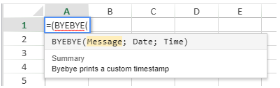
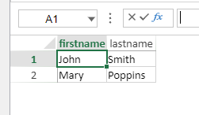
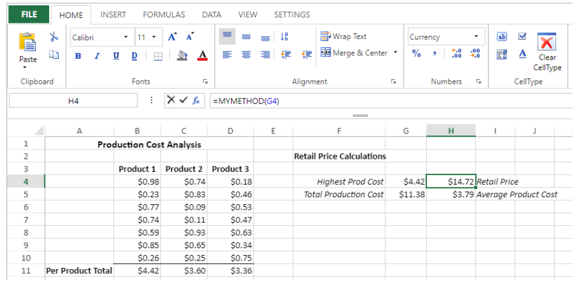

> **Warning**: The commands on this page are not thread-safe.


### VP SET ACTIVE CELL

<!-- REF #_method_.VP SET ACTIVE CELL.Syntax -->
**VP SET ACTIVE CELL** ( *rangeObj* : Object) <!-- END REF -->

<!-- REF #_method_.VP SET ACTIVE CELL.Params -->

|Parameter|Type||Description|
|---|---|---|---|
|rangeObj   |Object|->|Range object|<!-- END REF -->

#### Description

The `VP SET ACTIVE CELL` command <!-- REF #_method_.VP SET ACTIVE CELL.Summary -->defines a specified cell as active<!-- END REF -->.

In *rangeObj*, pass a range containing a single cell as an object (see [VP Cell](#vp-cell)). If *rangeObj* is not a cell range or contains multiple ranges, the first cell of the first range is used.
  
#### Example

To set the cell in column D, row 5 as the active cell:

```4d
$activeCell:=VP Cell("myVPArea";3;4)
VP SET ACTIVE CELL($activeCell)
```


#### See also

[VP ADD SELECTION](#vp-add-selection)<br/>[VP Get active cell](#vp-get-active-cell)<br/>[VP Get selection](#vp-get-selection)<br/>[VP RESET SELECTION](#vp-reset-selection)<br/>[VP SET SELECTION](#vp-set-selection)<br/>[VP SHOW CELL](#vp-show-cell)

### VP SET ALLOWED METHODS

<!-- REF #_method_.VP SET ALLOWED METHODS.Syntax -->
**VP SET ALLOWED METHODS** ( *methodObj* : Object) <!-- END REF -->

<!-- REF #_method_.VP SET ALLOWED METHODS.Params -->


|Parameter|Type||Description|
|---|---|---|---|
|methodObj   |Object|->|Allowed methods in the 4D View Pro areas|<!-- END REF -->

>**Compatibility**  

>
>For greater flexiblity, it is recommended to use the [`VP SET CUSTOM FUNCTIONS`](#vp-set-custom-functions) command which allows you to designate 4D formulas that can be called from 4D View Pro areas. As soon as `VP SET CUSTOM FUNCTIONS` is called, `VP SET ALLOWED METHODS` calls are ignored. 4D View Pro also supports 4D's generic `SET ALLOWED METHODS` command if neither `VP SET CUSTOM FUNCTIONS` nor `VP SET ALLOWED METHODS` are called, however using the generic command is not recommended.


#### Description

The `VP SET ALLOWED METHODS` command <!-- REF #_method_.VP SET ALLOWED METHODS.Summary -->designates the project methods that can be called in 4D View Pro formulas<!-- END REF -->. This command applies to all 4D View Pro areas initialized after its call during the session. It can be called multiple times in the same session to initialize different configurations.

By default for security reasons, if you do not execute the `VP SET ALLOWED METHODS` command, no method call is allowed in 4D View Pro areas -- except if 4D's generic `SET ALLOWED METHODS` command was used (see compatibility note). Using an unauthorized method in a formula prints a #NAME? error in the 4D View Pro area.

In the *methodObj* parameter, pass an object in which each property is the name of a function to define in the 4D View Pro areas:

|Property | | |Type |Description|
|---|---|---|---|---|
|`<functionName>` ||  |Object |Custom function definition. The `<functionName>` property name defines the name of the custom function to display in 4D View Pro formulas (no spaces allowed)|
||method|  |Text |(mandatory) Name of the existing 4D project method to allow|
||parameters|  |Collection of objects |Collection of parameters (in the order they are defined in the method).|
|||\[ ].name| Text| Name of a parameter to display for the `<functionName>`.**Note**: Parameter names must not contain space characters.|
|||\[ ].type| Number| Type of the parameter. Supported types:<li>`Is Boolean`</li><li>`Is date`</li><li>`Is Integer`</li><li>`Is object`</li><li>`Is real`</li><li>`Is text`</li><li>`Is time`</li>If omitted, by default the value is automatically sent with its type, except date or time values which are sent as an object (see [Parameters](formulas.md#parameters) section). If type is `Is object`, the object has the same structure as the object returned by [`VP Get value`](#vp-get-value).
||summary | |Text |Function description to display in 4D View Pro|
||minParams|  |Number |Minimum number of parameters|
||maxParams|  |Number |Maximum number of parameters. Passing a number higher than the length of parameters allows declaring "optional" parameters with default type|

#### Example

You want to allow two methods in your 4D View Pro areas:

```4d
C_OBJECT($allowed)
$allowed:=New object //parameter for the command
 
$allowed.Hello:=New object //create a first simple function named "Hello"
$allowed.Hello.method:="My_Hello_Method" //sets the 4D method
$allowed.Hello.summary:="Hello prints hello world"
 
$allowed.Byebye:=New object //create a second function with parameters named "Byebye"
$allowed.Byebye.method:="My_ByeBye_Method"
$allowed.Byebye.parameters:=New collection
$allowed.Byebye.parameters.push(New object("name";"Message";"type";Is text))
$allowed.Byebye.parameters.push(New object("name";"Date";"type";Is date))
$allowed.Byebye.parameters.push(New object("name";"Time";"type";Is time))
$allowed.Byebye.summary:="Byebye prints a custom timestamp"
$allowed.Byebye.minParams:=3
$allowed.Byebye.maxParams:=3
 
VP SET ALLOWED METHODS($allowed)
```

After this code is executed, the defined functions can be used in 4D View Pro formulas:



> In 4D View Pro formulas, function names are automatically displayed in uppercase.

#### See also

[4D functions](formulas.md#4d-functions)<br/>[VP SET CUSTOM FUNCTIONS](#vp-set-custom-functions)

### VP SET BINDING PATH

<details><summary>History</summary>

|Version|Changes|
|---|---|
|v19 R5|Added|

</details>

<!-- REF #_method_.VP SET BINDING PATH.Syntax -->
**VP SET BINDING PATH** ( *rangeObj* : Object  ; *dataContextAttribute*  : Text) <!-- END REF -->

<!-- REF #_method_.VP SET BINDING PATH.Params -->

|Parameter|Type||Description|
|---|---|---|---|
| rangeObj | Object | -> | Range object |
| dataContextAttribute  | Text | -> | Name of the attribute to bind to *rangeObj* |<!-- END REF -->

#### Description

The `VP SET BINDING PATH` command <!-- REF #_method_.VP SET BINDING PATH.Summary -->binds an attribute from a sheet's data context to *rangeObj*<!-- END REF -->. After you set a data context using the [SET DATA CONTEXT](#vp-set-data-context) method. When loaded, if the data context contains the attribute, the value of *dataContextAttribute* is automatically displayed in the cells in *rangeObj*.

In *rangeObj*, pass an object that is either a cell range or a combined range of cells.

* If *rangeObj* is a range with several cells, the command binds the attribute to the first cell of the range.
* If *rangeObj* contains several ranges of cells, the command binds the attribute to the first cell of each range.

In *dataContextAttribute*, pass the name of the attribute to bind to *rangeObj*. If *dataContextAttribute* is an empty string, the function removes the current binding.

> Attributes of type collection are not supported. When you pass the name of a collection attribute, the command does nothing.

#### Example

Set a data context and bind the `firstName` and `lastName` attribute to cells:

```4d
var $p : Object

$p:=New object
$p.firstName:="Freehafer"
$p.lastName:="Nancy"

VP SET DATA CONTEXT("ViewProArea"; $p)

VP SET BINDING PATH(VP Cell("ViewProArea"; 0; 0); "firstName")
VP SET BINDING PATH(VP Cell("ViewProArea"; 1; 0); "lastName")
```


#### See also

[VP Get binding path](#vp-get-binding-path)<br/>[VP Get data context](#vp-get-data-context)<br/>[VP SET DATA CONTEXT](#vp-get-data-context)

### VP SET BOOLEAN VALUE

<!-- REF #_method_.VP SET BOOLEAN VALUE.Syntax -->
**VP SET BOOLEAN VALUE** ( *rangeObj* : Object  ; *boolValue* : Boolean) <!-- END REF -->

<!-- REF #_method_.VP SET BOOLEAN VALUE.Params -->

|Parameter|Type||Description|
|---|---|---|---|
|rangeObj   |Object|->|Range object|
|boolValue    |Boolean|->|Boolean value to set|<!-- END REF -->

#### Description

The `VP SET BOOLEAN VALUE` command <!-- REF #_method_.VP SET BOOLEAN VALUE.Summary -->assigns a specified boolean value to a designated cell range<!-- END REF -->.

In *rangeObj*, pass a range of the cell(s) (created for example with [`VP Cell`](#vp-cell) or [`VP Column`](#vp-column)) whose value you want to specify. If *rangeObj* includes multiple cells, the value specified will be repeated in each cell.


The *boolValue* parameter allows you to pass the boolean value (**True** or **False**) that will be assigned to the *rangeObj*.
  
#### Example

```4d
//Set the cell value as False
VP SET BOOLEAN VALUE(VP Cell("ViewProArea";3;2);False)
```

#### See also

[VP SET VALUE](#vp-set-value)

### VP SET BORDER

<!-- REF #_method_.VP SET BORDER.Syntax -->
**VP SET BORDER** ( *rangeObj* : Object ; *borderStyleObj* : Object  ; *borderPosObj* : Object ) <!-- END REF -->

<!-- REF #_method_.VP SET BORDER.Params -->

|Parameter|Type||Description|
|---|---|---|---|
|rangeObj   |Object|->|Range object|
|borderStyleObj    |Object|->|Object containing border line style|
|borderPosObj    |Object|->|Object containing border placement|<!-- END REF -->

#### Description

The `VP SET BORDER` command <!-- REF #_method_.VP SET BORDER.Summary -->applies the border style(s) defined in *borderStyleObj* and *borderPosObj* to the range defined in the *rangeObj*<!-- END REF -->.

In *rangeObj*, pass a range of cells where the border style will be applied. If the *rangeObj* contains multiple cells, borders applied with `VP SET BORDER` will be applied to the *rangeObj* as a whole (as opposed to the [`VP SET CELL STYLE`](#vp-set-cell-style) command which applies borders to each cell of the *rangeObj*). If a style sheet has already been applied, `VP SET BORDER` will override the previously applied border settings for the *rangeObj*.

The *borderStyleObj* parameter allows you to define the style for the lines of the border. The *borderStyleObj* supports the following properties:

|Property| Type| Description |Possible values|
|---|---|---|---|
|color| text| Defines the color of the border. Default = black.| CSS color "#rrggbb" syntax (preferred syntax), CSS color "rgb(r,g,b)" syntax (alternate syntax), CSS color name (alternate syntax)|
|style| Integer| Defines the style of the border. Default = empty.|<li>`vk line style dash dot`</li><li>`vk line style dash dot dot`</li><li>`vk line style dashed`</li> <li>`vk line style dotted`</li><li>`vk line style double`</li><li>`vk line style empty`</li><li>`vk line style hair`</li> <li>`vk line style medium`</li><li>`vk line style medium dash dot`</li><li>`vk line style medium dash dot dot`</li><li>`vk line style medium dashed`</li><li>`vk line style slanted dash dot`</li><li>`vk line style thick`</li><li>`vk line style thin`</li>|

You can define the position of the *borderStyleObj* (i.e., where the line is applied) with the *borderPosObj*:

|Property| Type| Description|
|---|---|---|
|all|boolean|Border line style applied to all borders.|
|left|boolean|Border line style applied to left border. |
|top|boolean|Border line style applied to top border. |
|right |boolean|Border line style applied to right border.|
|bottom |boolean|Border line style applied to bottom border.|
|outline|boolean|Border line style applied to outer borders only.|
|inside |boolean|Border line style applied to inner borders only. |
|innerHorizontal|boolean|Border line style applied to inner horizontal borders only. |
|innerVertical| boolean|Border line style applied to inner vertical borders only.|
  
#### Example 1

This code produces a border around the entire range:

```4d
$border:=New object("color";"red";"style";vk line style thick)
$option:=New object("outline";True)
VP SET BORDER(VP Cells("ViewProArea";1;1;3;3);$border;$option)
```


#### Example 2

This code demonstrates the difference between `VP SET BORDER` and setting borders with the [`VP SET CELL STYLE`](#vp-set-cell-style) command:

```4d
// Set borders using VP SET BORDER
$border:=New object("color";"red";"style";vk line style thick)
$option:=New object("outline";True)
VP SET BORDER(VP Cells("ViewProArea";1;1;3;3);$border;$option)
 
// // Set borders using VP SET CELL STYLE
$cellStyle:=New object
$cellStyle.borderBottom:=New object("color";"blue";"style";vk line style thick)
$cellStyle.borderRight:=New object("color";"blue";"style";vk line style thick)
VP SET CELL STYLE(VP Cells("ViewProArea";4;4;3;3);$cellStyle)
```


#### See also

[VP SET CELL STYLE](#vp-set-cell-style)

### VP SET CELL STYLE


<!-- REF #_method_.VP SET CELL STYLE.Syntax -->

**VP SET CELL STYLE** ( *rangeObj* : Object  ; *styleObj*  : Object) <!-- END REF -->

<!-- REF #_method_.VP SET CELL STYLE.Params -->

|Parameter|Type||Description|
|---|---|---|---|
|rangeObj   |Object|->|Range object|
|styleObj    |Object|->|Style object|<!-- END REF -->

#### Description

The `VP SET CELL STYLE` command <!-- REF #_method_.VP SET CELL STYLE.Summary -->applies the style(s) defined in the *styleObj* to the cells defined in the *rangeObj*<!-- END REF -->.

In *rangeObj*, pass a range of cells where the style will be applied. If the *rangeObj* contains multiple cells, the style is applied to each cell.

>Borders applied with `VP SET CELL STYLE` will be applied to each cell of the *rangeObj*, as opposed to the [VP SET BORDER](#vp-set-border) command which applies borders to the *rangeObj* as a whole.

The *styleObj* parameter lets you pass an object containing style settings. You can use an existing style sheet or create a new style. If the *styleObj* contains both an existing style sheet and additional style settings, the existing style sheet is applied first, followed by the additional settings.

To remove a style and revert to the default style settings (if any), pass a NULL value:

* giving the *styleObj* parameter a NULL value will remove any style settings from the *rangeObj*,
* giving an attribute a NULL value will remove this specific attribute from the *rangeObj*.

For more information about style objects and style sheets, see the [Style Objects](configuring.md#style-objects) paragraph.

#### Example

```4d
$style:=New object
$style.font:="8pt Arial"
$style.backColor:="Azure"
$style.foreColor:="red"
$style.hAlign:=1
$style.isVerticalText:=True
$style.borderBottom:=New object("color";"#800080";"style";vk line style thick)
$style.backgroundImage:=Null //remove a specific attribute
 
VP SET CELL STYLE(VP Cell("ViewProArea";1;1);$style)
```


#### See also

[VP ADD STYLESHEET](#vp-add-stylesheet)<br/>[VP Font to object](#vp-font-to-object)<br/>[VP Get cell style](#vp-get-cell-style)<br/>[VP Object to font](#vp-object-to-font)<br/>[VP SET BORDER](#vp-set-border)<br/>[VP SET DEFAULT STYLE](#vp-set-default-style)

### VP SET COLUMN ATTRIBUTES

<!-- REF #_method_.VP SET COLUMN ATTRIBUTES.Syntax -->
**VP SET COLUMN ATTRIBUTES** ( *rangeObj* : Object  ; *propertyObj* : Object) <!-- END REF -->

<!-- REF #_method_.VP SET COLUMN ATTRIBUTES.Params -->

|Parameter|Type||Description|
|---|---|---|---|
|rangeObj   |Object|->|Range object|
|propertyObj |Object|->|Object containing column properties|<!-- END REF -->

#### Description

The `VP SET COLUMN ATTRIBUTES` command <!-- REF #_method_.VP SET COLUMN ATTRIBUTES.Summary --> applies the attributes defined in the *propertyObj* to the columns in the *rangeObj*<!-- END REF -->.

In *rangeObj*, pass an object containing a range. If the range contains both columns and rows, attributes are applied only to the columns.

The *propertyObj* parameter lets you specify the attributes to apply to the columns in the *rangeObj*. These attributes are:

|Property|  Type  |Description |
|---|---|---|
|width  |number| Column width expressed in pixels |
|pageBreak  |boolean|  True to insert a page break before the first column of the range, else false |
|visible| boolean | True if the column is visible, else false |
|resizable | boolean | True if the column can be resized, else false |
|header|  text | Column header text|
  
#### Example

To change the size of the second column and set the header, you write:

```4d
C_OBJECT($column;$properties)
 
$column:=VP Column("ViewProArea";1) //column B
$properties:=New object("width";100;"header";"Hello World")
 
VP SET COLUMN ATTRIBUTES($column;$properties)
```


#### See also

[VP Column](#vp-column)<br/>[VP Get column attributes](#vp-get-column-attributes)<br/>[VP Get row attributes](#vp-get-row-attributes)<br/>[VP SET ROW ATTRIBUTES](#vp-set-row-attributes)

### VP SET COLUMN COUNT

<!-- REF #_method_.VP SET COLUMN COUNT.Syntax -->
**VP SET COLUMN COUNT** ( *vpAreaName* : Text , *columnCount* : Integer { , *sheet* : Integer } ) <!-- END REF -->

<!-- REF #_method_.VP SET COLUMN COUNT.Params -->

|Parameter|Type||Description|
|---|---|---|---|
|vpAreaName|Text|->|4D View Pro area form object name|
|columnCount|Integer|->|Number of columns|
|sheet|Integer|->|Sheet index (current sheet if omitted)|<!-- END REF -->

#### Description

The `VP SET COLUMN COUNT` command <!-- REF #_method_.VP SET COLUMN COUNT.Summary -->defines the total number of columns in *vpAreaName*<!-- END REF -->.


In *vpAreaName*, pass the name of the 4D View Pro area. If you pass a name that does not exist, an error is returned.

Pass the total number of columns in the *columnCount* parameter. *columnCount* must be greater than 0.

In the optional *sheet* parameter, you can designate a specific spreadsheet where the *columnCount* will be applied (counting begins at 0). If omitted, the current spreadsheet is used by default. You can explicitly select the current spreadsheet with the following constant:

* `vk current sheet`

#### Example

The following code defines five columns in the 4D View Pro area:

```4d
VP SET COLUMN COUNT("ViewProArea";5)
```


#### See also

[VP Get column count](#vp-get-column-count)<br/>[VP Get row count](#vp-get-row-count)<br/>[VP SET ROW COUNT](#vp-set-row-count)

### VP SET CURRENT SHEET

<!-- REF #_method_.VP SET CURRENT SHEET.Syntax -->
**VP SET CURRENT SHEET** ( *vpAreaName* : Text ; *sheet* : Integer)<!-- END REF -->

<!-- REF #_method_.VP SET CURRENT SHEET.Params -->

|Parameter|Type| |Description|
|---|---|---|---|
|vpAreaName| Text|->|4D View Pro area form object name|
|sheet|Integer|<-|Index of the new current sheet|<!-- END REF -->

#### Description

The `VP SET CURRENT SHEET` command <!-- REF #_method_.VP SET CURRENT SHEET.Summary -->sets the current sheet in *vpAreaName*<!-- END REF --> . The current sheet is the selected sheet in the document.


In *vpAreaName*, pass the name of the 4D View Pro area.

In *sheet*, pass the index of the sheet to be set as current sheet. If the index passed is inferior to 0 or exceeds the number of sheets, the command does nothing.

> Indexing starts at 0.

#### Example

The document's current sheet is the first sheet:


Set the current sheet to the third sheet:

```4d
VP SET CURRENT SHEET("ViewProArea";2)
```


#### See also

[VP Get current sheet](#vp-get-current-sheet)

### VP SET CUSTOM FUNCTIONS

<!-- REF #_method_.VP SET CUSTOM FUNCTIONS.Syntax -->
**VP SET CUSTOM FUNCTIONS** ( *vpAreaName* : Text ; *formulaObj* : Object  ) <!-- END REF -->

<!-- REF #_method_.VP SET CUSTOM FUNCTIONS.Params -->

|Parameter|Type||Description|
|---|---|---|---|
|vpAreaName |Text|->|4D View Pro area form object name|
|formulaObj |Object|->|Formula object|<!-- END REF -->

#### Description

The `VP SET CUSTOM FUNCTIONS` command <!-- REF #_method_.VP SET CUSTOM FUNCTIONS.Summary -->designates the 4D formulas that can be called directly from 4D View Pro formulas<!-- END REF -->. Because custom functions are not stored in the document,`VP SET CUSTOM FUNCTIONS` must be executed in the `On Load` form event.

The formulas specified by `VP SET CUSTOM FUNCTIONS` appear in a pop-up menu when the first letter of their name is entered. See the [Formulas and Functions](formulas.md) page.

> If `VP SET CUSTOM FUNCTIONS` is called multiple times for the same area, in the same session, only the last call is taken into account.

Pass the name of the 4D View Pro area in *vpAreaName*. If you pass a name that does not exist, an error is returned.

In the *formulaObj* parameter, pass an object containing the 4D formulas that can be called from 4D View Pro formulas as well as additional properties. Each `customFunction` property passed in *formulaObj* becomes the name of a function in the 4D View Pro area.

|Property |   |  |Type | Description |
|---|---|---|---|---|
|`<customFunction>`| |   |Object| Custom function definition. `<customFunction>` defines the name of the custom function to display in 4D View Pro formulas (no spaces allowed)|
| | formula | |Object|4D formula object (mandatory). See the `Formula` command.|
| |parameters|  |Collection of objects |Collection of parameters (in the order they are defined in the formula)|
 | | |  \[ ].name| Text| Name of parameter to display in 4D View Pro|
 | |  | \[ ].type| Number| Type of the parameter. Supported types:<li>`Is Boolean`</li><li>`Is date`</li><li>`Is Integer`</li><li>`Is object`</li><li>`Is real`</li><li>`Is text`</li><li>`Is time`</li>If *type* is omitted or if the default value (-1) is passed, the value is automatically sent with its type, except date or time values which are sent as an object (see [Parameters](formulas.md#parameters) section).If *type* is `Is object`, the object has the same structure as the object returned by [VP Get value](#vp-get-value).|
| |  summary |   |Text | Formula description to display in 4D View Pro|
| |  minParams|   |Number|  Minimum number of parameters |
| |  maxParams |   |Number | Maximum number of parameters. Passing a number higher than the length of *parameters* allows declaring "optional" parameters with default type |

>**WARNING**
>

>* As soon as `VP SET CUSTOM FUNCTIONS` is called, the methods allowed by the [VP SET ALLOWED METHODS](#vp-set-allowed-methods) command (if any) are ignored in the 4D View Pro area.
>* As soon as `VP SET CUSTOM FUNCTIONS` is called, the functions based upon `SET TABLE TITLES` and `SET FIELD TITLES` commands are ignored in the 4D View Pro area.

#### Example

You want to use formula objects in a 4D View Pro area to add numbers, retrieve a customer's last name and gender:

```4d
Case of
    :(FORM Event.code=On Load)
 
       var $o : Object
       $o:=New object
 
// Define "addnum" function from a method named "addnum"
       $o.addnum:=New object
       $o.addnum.formula:=Formula(addnum)
       $o.addnum.parameters:=New collection
       $o.addnum.parameters.push(New object("name";"num1";"type";Is Integer))
       $o.addnum.parameters.push(New object("name";"num2";"type";Is Integer))
 
// Define "ClientLastName" function from a database field
       $o.ClientLastName:=New object
       $o.ClientLastName.formula:=Formula([Customers]lastname)
       $o.ClientLastName.summary:="Lastname of the current client"
 
// Define "label" function from a 4D expression with one parameter
       $o.label:=New object
       $o.label.formula:=Formula(ds.Customers.get($1).label)
       $o.label.parameters:=New collection
       $o.label.parameters.push(New object("name";"ID";"type";Is Integer))
 
// Define "Title" function from a variable named "Title"
       $o.Title:=New object
       $o.Title.formula:=Formula(Title)
 
       VP SET CUSTOM FUNCTIONS("ViewProArea";$o)
 
End case
```

#### See also

[VP SET ALLOWED METHODS](#vp-set-allowed-methods)

### VP SET DATA CONTEXT

<details><summary>History</summary>

|Version|Changes|
|---|---|
|v19 R5|Added|

</details>

<!-- REF #_method_.VP SET DATA CONTEXT.Syntax -->
**VP SET DATA CONTEXT** ( *vpAreaName* : Text ; *dataObj* : Object {; *options* : Object } {; *sheet* : Integer} )<br/>**VP SET DATA CONTEXT** ( *vpAreaName* : Text ; *dataColl* : Collection ; {*options* : Object } {; *sheet* : Integer} )<!-- END REF -->

<!-- REF #_method_.VP SET DATA CONTEXT.Params -->

|Parameter|Type||Description|
|---|---|---|---|
|vpAreaName |Object|->|4D View Pro area form object name|
|dataObj|Object|->|Data object to load in the data context|
|dataColl|Collection|->|Data collection to load in the data context|
|options |Object|->|Additional options|
|sheet|Integer|->|Sheet index|<!-- END REF -->

#### Description

The `VP SET DATA CONTEXT` command <!-- REF #_method_.VP SET DATA CONTEXT.Summary -->sets the data context of a sheet<!-- END REF -->. A data context is an object or a collection bound to a worksheet, and whose contents can be used to automatically fill the sheet cells, either by using an autogenerate option or the [VP SET BINDING PATH](#vp-set-binding-path) method. On the other hand, the [VP Get data context](#vp-get-data-context) command can return a context containing user modifications.

In *vpAreaName*, pass the name of the 4D View Pro area. If you pass a name that does not exist, an error is returned.

In *dataObj* or *dataColl*, pass an object or a collection containing the data to load in the data context. Images are converted to data URI schemes.

To pass a time value in *dataObj* or *dataColl*, encapsulate it in an object with the following properties (see [example 4](#example-4---date-and-time-syntax)):

|Property|Type|Description|
|---|---|---|
|value| Integer, Real, Boolean, Text, Date, Null| Value to put in the context|
|time |Real |Time value (in seconds) to put in the context|

In *options*, you can pass an object that specifies additional options. Possible properties are:

|Property|Type|Description|
|---|---|---|
|reset |Object|True to reset the sheet's contents before loading the new context, False (default) otherwise.|
|autoGenerateColumns|Object| Only used when data is a collection. True (default) to specify that columns must be generated automatically when the data context is bound. In this case, the following rules apply: <ul><li>If *dataColl* is a collection of objects, attribute names are used as column titles (see example 2).</li><li>If *dataColl* contains subcollections of scalar values, each subcollection defines the values in a row (see example 3). The first subcollection determines how many columns are created.</li></ul>|

In *sheet*, pass the index of the sheet that will receive the data context. If no index is passed, the context is applied to the current sheet.

If you export your document to an object using [VP Export to object](#vp-export-to-object), or to a 4DVP document using [VP EXPORT DOCUMENT](#vp-export-document), the `includeBindingSource` option lets you copy the contents of the current contexts as cell values in the exported object or document. For more details, refer to the description of those methods.

#### Example

Pass an object and bind the context data to cells in the first row:

```4d
var $data : Object

$data:=New object

$data.firstName:="Freehafer"
$data.lastName:="Nancy"

VP SET DATA CONTEXT("ViewProArea"; $data)

VP SET BINDING PATH(VP Cell("ViewProArea"; 0; 0); "firstName")
VP SET BINDING PATH(VP Cell("ViewProArea"; 1; 0); "lastName")

```


#### Example 2

Pass a collection of objects and generate columns automatically:


```4d
var $options : Object
var $data : Collection

$data:=New collection()
$data.push(New object("firstname"; "John"; "lastname"; "Smith"))
$data.push(New object("firstname"; "Mary"; "lastname"; "Poppins"))

$options:=New object("autoGenerateColumns"; True)

VP SET DATA CONTEXT("ViewProArea"; $data; $options)
```



#### Example 3

The *data* passed as a parameter is a collection that contains subcollections. Each subcollection defines the contents of a row:

```4d
var $data : Collection
var $options : Object

$data:=New collection
$data.push(New collection(1; 2; 3; False; ""))  // 5 columns are created
$data.push(New collection)  // Second row is empty
$data.push(New collection(4; 5; Null; "hello"; "world"))  // Third row has 5 values
$data.push(New collection(6; 7; 8; 9))  // Fourth row has 4 values

$options:=New object("autoGenerateColumns"; True)

VP SET DATA CONTEXT("ViewProArea"; $data; $options)
```


#### Example 4 - Date and time syntax

```4d
var $data : Collection
var $options : Object

$data:= New collection()

// Dates can be passed as scalar values
$data.push(New collection("Date"; Current date)) 

// Time values must be passed as object attributes
$data.push(New collection("Time"; New object("time"; 5140)))

// Date + time example
$data.push(New collection("Date + Time"; New object("value"; Current date; "time"; 5140))) 

$options:=New object("autoGenerateColumns"; True)

VP SET DATA CONTEXT("ViewProArea"; $data; $options)
```

Here's the result once the columns are generated:


#### See also

[VP SET BINDING PATH](#vp-set-binding-path)<br/>[VP Get binding path](#vp-get-binding-path)<br/>[VP Get data context](#vp-get-data-context)

### VP SET DATE TIME VALUE

<!-- REF #_method_.VP SET DATE TIME VALUE.Syntax -->
**VP SET DATE TIME VALUE** ( *rangeObj* : Object ; *dateValue* : Date ; *timeValue* : Time {; *formatPattern* : Text } ) <!-- END REF -->

<!-- REF #_method_.VP SET DATE TIME VALUE.Params -->


|Parameter|Type||Description|
|---|---|---|---|
|rangeObj |Object|->|Range object|
|dateValue |Date|->|Date value to set|
|timeValue |Time|->|Time value to set|
|formatPattern |Text|->|Format of value|<!-- END REF -->

#### Description

The `VP SET DATE TIME VALUE` command <!-- REF #_method_.VP SET DATE TIME VALUE.Summary -->assigns a specified date and time value to a designated cell range<!-- END REF -->.

In *rangeObj*, pass a range of the cell(s) (created for example with [`VP Cell`](#vp-cell) or [`VP Column`](#vp-column)) whose value you want to specify. If *rangeObj* includes multiple cells, the value specified will be repeated in each cell.

The *dateValue* parameter specifies a date value to be assigned to the *rangeObj*.

The *timeValue* parameter specifies a time value (expressed in seconds) to be assigned to the *rangeObj*.

The optional *formatPattern* defines a pattern for the *dateValue* and *timeValue* parameters. For information on patterns and formatting characters, please refer to the [Date and time formats](configuring.md#date-and-time-formats) section.

#### Example

```4d
//Set the cell value as the current date and time
VP SET DATE TIME VALUE(VP Cell("ViewProArea";6;2);Current time;Current date;vk pattern full date time)
 
//Set the cell value as the 18th of December
VP SET DATE TIME VALUE(VP Cell("ViewProArea";3;9);!2024-12-18!;?14:30:10?;vk pattern sortable date time)
```

#### See also

[4D View Pro cell format](configuring.md#cell-format)<br/>[VP SET DATE VALUE](#vp-set-date-value)<br/>[VP SET TIME VALUE](#vp-set-time-value)<br/>[VP SET VALUE](#vp-set-value)


### VP SET DATE VALUE

<!-- REF #_method_.VP SET DATE VALUE.Syntax -->
**VP SET DATE VALUE** ( *rangeObj* : Object ; *dateValue* : Date { ; *formatPattern* : Text } ) <!-- END REF -->

<!-- REF #_method_.VP SET DATE VALUE.Params -->

|Parameter|Type||Description|
|---|---|---|---|
|rangeObj |Object|->|Range object|
|dateValue |Date|->|Date value to set|
|formatPattern |Text|->|Format of value|<!-- END REF -->

#### Description

The `VP SET DATE VALUE` command <!-- REF #_method_.VP SET DATE VALUE.Summary -->assigns a specified date value to a designated cell range<!-- END REF -->.

In *rangeObj*, pass a range of the cell(s) whose value you want to specify. If *rangeObj* includes multiple cells, the value specified will be repeated in each cell.

The *dateValue* parameter specifies a date value to be assigned to the *rangeObj*.

The optional *formatPattern* defines a pattern for the *dateValue* parameter. Pass any custom format or you can use one of the following constants:

|Constant|Description|Default US pattern|
|---|---|---|
|`vk pattern long date`|ISO 8601 format for the full date|"dddd, dd MMMM yyyy"|
|`vk pattern month day`|ISO 8601 format for the month and day|"MMMM dd"|
|`vk pattern short date`|Abbreviated ISO 8601 format for the date|"MM/dd/yyyy"|
|`vk pattern year month`|ISO 8601 format for the month and year|"yyyy MMMM"|

For information on patterns and formatting characters, please refer to the [Date and time formats](configuring.md#date-and-time-formats) section.

#### Example

```4d
//Set the cell value to the current date
VP SET DATE VALUE(VP Cell("ViewProArea";4;2);Current date))
 
//Set the cell value to a specific date with a designated format
VP SET DATE VALUE(VP Cell("ViewProArea";4;4);Date("12/25/94");"d/m/yy ")
VP SET DATE VALUE(VP Cell("ViewProArea";4;6);!2005-01-15!;vk pattern month day)
```

#### See also

[4D View Pro cell format](configuring.md#cell-format)<br/>[VP SET DATE TIME VALUE](#vp-set-date-time-value)<br/>[VP SET VALUE](#vp-set-value)

### VP SET DEFAULT STYLE

<!-- REF #_method_.VP SET DEFAULT STYLE.Syntax -->
**VP SET DEFAULT STYLE** ( *vpAreaName* : Text ; *styleObj* : Object { ; *sheet* : Integer } ) <!-- END REF -->

<!-- REF #_method_.VP SET DEFAULT STYLE.Params -->

|Parameter|Type||Description|
|---|---|---|---|
|vpAreaName |Text|->|4D View Pro area form object name|
|styleObj |Object|->|Style object|
|sheet|Integer|->|Sheet index (default = current sheet)|<!-- END REF -->

#### Description

The `VP SET DEFAULT STYLE` command <!-- REF #_method_.VP SET DEFAULT STYLE.Summary -->defines the style in the *styleObj* as the default style for a *sheet*<!-- END REF -->.

In *vpAreaName*, pass the name of the 4D View Pro area. If you pass a name that does not exist, an error is returned.

The *styleObj* lets you pass an object containing style settings. You can use an existing style sheet or you can create a new style. For more information, see the [Style objects](configuring.md#style-objects) paragraph.

In the optional *sheet* parameter, you can designate a specific spreadsheet where the style will be defined. If omitted, the current spreadsheet is used by default. You can explicitly select the current spreadsheet with the following constant:

* `vk current sheet`

#### Example

```4d
$style:=New object
$style.hAlign:=vk horizontal align left
$style.font:="12pt papyrus"
$style.backColor:="#E6E6FA" //light purple color
 
VP SET DEFAULT STYLE("myDoc";$style)
```


#### See also

[VP ADD STYLESHEET](#vp-add-stylesheet)<br/>[VP Font to object](#vp-font-to-object)<br/>[VP Get default style](#vp-get-default-style)<br/>[VP Object to font](#vp-object-to-font)<br/>[VP SET BORDER](#vp-set-border)<br/>[VP SET CELL STYLE](#vp-set-cell-style)

### VP SET FIELD

<!-- REF #_method_.VP SET FIELD.Syntax -->
**VP SET FIELD** ( *rangeObj* : Object ; *field* : Pointer { ; *formatPattern* : Text } ) <!-- END REF -->

<!-- REF #_method_.VP SET FIELD.Params -->

|Parameter|Type||Description|
|---|---|---|---|
|rangeObj |Object|->|Range object|
|field |Pointer|->|Reference to field in virtual structure|
|formatPattern |Text|->|Format of field|<!-- END REF -->

#### Description

The `VP SET FIELD` command <!-- REF #_method_.VP SET FIELD.Summary -->assigns a 4D database virtual field to a designated cell range<!-- END REF -->.

In *rangeObj*, pass a range of the cell(s) whose value you want to specify. If *rangeObj* includes multiple cells, the specified field will be linked in each cell.

The *field* parameter specifies a 4D database [virtual field](formulas.md#referencing-fields-using-the-virtual-structure) to be assigned to the *rangeObj*. The virtual structure name for *field* can be viewed in the formula bar. If any of the cells in *rangeObj* have existing content, it will be replaced by *field*.

The optional *formatPattern* defines a pattern for the *field* parameter. You can pass any valid [custom format](configuring.md#cell-format).

#### Example

```4d
VP SET FIELD(VP Cell("ViewProArea";5;2);->[TableName]Field)
```

#### See also

[VP SET VALUE](#vp-set-value)

### VP SET FORMULA

<!-- REF #_method_.VP SET FORMULA.Syntax -->
**VP SET FORMULA** ( *rangeObj* : Object ; *formula* : Text { ; *formatPattern* : Text } ) <!-- END REF -->

<!-- REF #_method_.VP SET FORMULA.Params -->

|Parameter|Type||Description|
|---|---|---|---|
|rangeObj |Object|->|Range object|
|formula |Text|->|Formula or 4D method|
|formatPattern |Text|->|Format of field|<!-- END REF -->

#### Description

The `VP SET FORMULA` command <!-- REF #_method_.VP SET FORMULA.Summary -->assigns a specified formula or 4D method to a designated cell range<!-- END REF -->.

In *rangeObj*, pass a range of the cell(s) (created for example with [`VP Cell`](#vp-cell) or [`VP Column`](#vp-column)) whose value you want to specify. If *rangeObj* includes multiple cells, the formula specified will be linked in each cell.

The *formula* parameter specifies a formula or 4D method name to be assigned to the *rangeObj*. 

> If the *formula* is a string, use the period `.` as numerical separator and the comma `,` as parameter separator.
> If a 4D method is used, it must be allowed with the [`VP SET ALLOWED METHODS`](#vp-set-allowed-method) command.

The optional *formatPattern* defines a [pattern](configuring.md#cell-format) for the *formula*.

You remove the formula in *rangeObj* by replacing it with an empty string ("").

#### Example 1

```4d
VP SET FORMULA(VP Cell("ViewProArea";5;2);"SUM($A$1:$C$10)")
```

#### Example 2

To remove the formula:

```4d
VP SET FORMULA(VP Cell("ViewProArea";5;2);"")
```

#### Example 3

```4d
VP SET FORMULA($range;"SUM(A1,B7,C11)") //"," to separate parameters
```

#### See also

[Cell format](configuring.md#cell-format)<br/>[VP Get Formula](#vp-get-formula)<br/>[VP SET FORMULAS](#vp-set-formulas)<br/>[VP SET VALUE](#vp-set-value)

### VP SET FORMULAS

<!-- REF #_method_.VP SET FORMULAS.Syntax -->
**VP SET FORMULAS** ( *rangeObj* : Object ; *formulasCol* : Collection ) <!-- END REF -->

<!-- REF #_method_.VP SET FORMULAS.Params -->

|Parameter|Type||Description|
|---|---|---|---|
|rangeObj |Object|->|Cell range object|
|formulasCol |Collection|->|Collection of formulas|<!-- END REF -->

#### Description

The `VP SET FORMULAS` command <!-- REF #_method_.VP SET FORMULAS.Summary -->assigns a collection of formulas starting at the specified cell range<!-- END REF -->.

In *rangeObj*, pass a range of the cell (created with [VP Cell](#vp-cell)) whose formula you want to specify. If *rangeObj* includes multiple ranges, only the first range is used.

The *formulasCol* is a two-dimensional collection:

* The first-level collection contains subcollections of formulas. Each subcollection defines a row.
* Each subcollection defines cell values for the row. Values must be text elements containing the formulas to assign to the cells.

> If the formula is a string, use the period `.` as numerical separator and the comma `,` as parameter separator.
> If a 4D method is used, it must be allowed with the [`VP SET ALLOWED METHODS`](#vp-set-allowed-method) command.

You remove the formulas in *rangeObj* by replacing them with an empty string ("").

#### Example 1

```4d
$formulas:=New collection
$formulas.push(New collection("MAX(B11,C11,D11)";"myMethod(G4)")) // First row
$formulas.push(New collection("SUM(B11:D11)";"AVERAGE(B11:D11)")) // Second row

 
VP SET FORMULAS(VP Cell("ViewProArea";6;3);$formulas) // Set the cells with the formulas
```

*myMethod*:

```4d
$0:=$1*3.33
```



#### Example 2

To remove formulas:

```4d
$formulas:=New collection
$formulas.push(New collection("";"")) // first collection
$formulas.push(New collection("";"")) // second collection
 
VP SET FORMULAS(VP Cell("ViewProArea";0;0);$formulas) // Assign to cells
```

#### See also

[VP Get Formulas](#vp-get-formulas)<br/>[VP GET VALUES](#vp-get-values)[VP SET FORMULA](#vp-set-formula)<br/>[VP SET VALUES](#vp-set-values)

### VP SET FROZEN PANES

<!-- REF #_method_.VP SET FROZEN PANES.Syntax -->
**VP SET FROZEN PANES** ( *vpAreaName* : Text ; *paneObj* : Object { ; *sheet* : Integer } ) <!-- END REF -->

<!-- REF #_method_.VP SET FROZEN PANES.Params -->

|Parameter|Type||Description|
|---|---|---|---|
|vpAreaName |Text|->|4D View Pro area form object name|
|paneObj |Object|->|Object containing frozen column and row information|
|sheet|Integer|->|Sheet index (current sheet if omitted)|
<!-- END REF -->

#### Description

The `VP SET FROZEN PANES` command <!-- REF #_method_.VP SET FROZEN PANES.Summary -->sets the frozen status of the columns and rows in the *paneObj* so they are always displayed in the *vpAreaName*<!-- END REF -->. Frozen columns and rows are fixed in place and do not move when the rest of the document is scrolled. A solid line is displayed to indicate that columns and rows are frozen. The location of the line depends on where the frozen column or row is on the sheet:

* **Columns on the left or right**: For columns on the left of the sheet, the line is displayed on the right side of the last frozen column. For columns on the right side of the sheet, the line is displayed on the left side of the first frozen column.
* **Rows on the top or bottom**: For rows at the top of the sheet, the line is displayed below the last frozen row. For rows at the bottom of the sheet, the line is displayed above the first frozen row.

In *vpAreaName*, pass the name of the 4D View Pro area. If you pass a name that does not exist, an error is returned.

You can pass an object defining the columns and rows to freeze in the *paneObj* parameter. Setting the value of any of the column or row properties equal to zero resets (unfreezes) the property. If a property is set to less than zero, the command does nothing. You can pass:

|Property | Type|  Description|
|---|---|---|
|columnCount | Integer | The number of frozen columns on the left of the sheet|
|trailingColumnCount |Integer | The number of frozen columns on the right of the sheet
|rowCount | Integer |  The number of frozen rows on the top of the sheet |
|trailingRowCount | Integer |  The number of frozen rows on the bottom of the sheet|

In the optional *sheet* parameter, you can designate a specific spreadsheet where the range will be defined (counting begins at 0). If omitted, the current spreadsheet is used by default. You can explicitly select the current spreadsheet with the following constant:

* `vk current sheet`

#### Example


You want to freeze the first three columns on the left, two columns on the right, and the first row:  

```4d
C_OBJECT($panes)
 
$panes:=New object
$panes.columnCount:=3
$panes.trailingColumnCount:=2
$panes.rowCount:=1
 
VP SET FROZEN PANES("ViewProArea";$panes)
```


#### See also

[VP Get frozen panes](#vp-get-frozen-panes)

### VP SET NUM VALUE

<!-- REF #_method_.VP SET NUM VALUE.Syntax -->
**VP SET NUM VALUE** ( *rangeObj* : Object ; *numberValue* : Number { ; *formatPattern* : Text } ) <!-- END REF -->

<!-- REF #_method_.VP SET NUM VALUE.Params -->

|Parameter|Type||Description|
|---|---|---|---|
|rangeObj |Object|->|Range object|
|numberValue |Number|->|Number value to set|
|formatPattern |Text|->|Format of value|<!-- END REF -->

#### Description

The `VP SET NUM VALUE` command <!-- REF #_method_.VP SET NUM VALUE.Summary -->assigns a specified numeric value to a designated cell range<!-- END REF -->.

In *rangeObj*, pass a range of the cell(s) (created for example with [`VP Cell`](#vp-cell) or [`VP Column`](#vp-column)) whose value you want to specify. If *rangeObj* includes multiple cells, the value specified will be repeated in each cell.

The *numberValue* parameter specifies a numeric value to be assigned to the *rangeObj*.

The optional *formatPattern* defines a [pattern](configuring.md#cell-format) for the *numberValue* parameter.

#### Example

```4d
//Set the cell value to 2
VP SET NUM VALUE(VP Cell("ViewProArea";3;2);2)
 
//Set the cell value and format it in dollars
VP SET NUM VALUE(VP Cell("ViewProArea";3;2);12.356;"_($* #,##0.00_)")
```

#### See also

[Cell format](configuring.md#cell-format)<br/>[VP SET VALUE](#vp-set-value)

### VP SET PRINT INFO

<!-- REF #_method_.VP SET PRINT INFO.Syntax -->
**VP SET PRINT INFO** ( *vpAreaName* : Text ; *printInfo* : Object { ; *sheet* : Integer }  ) <!-- END REF -->

<!-- REF #_method_.VP SET PRINT INFO.Params -->

|Parameter|Type||Description|
|---|---|---|---|
|vpAreaName |Text|->|4D View Pro area name|
|printInfo |Object|->|Object containing printing attributes|
|sheet|Integer|->|Sheet index (current sheet if omitted)|<!-- END REF -->

#### Description

The `VP SET PRINT INFO` command <!-- REF #_method_.VP SET PRINT INFO.Summary -->defines the attributes to use when printing the *vpAreaName*<!-- END REF -->.

Pass the name of the 4D View Pro area to print in *vpAreaName*. If you pass a name that does not exist, an error is returned.

You can pass an object containing definitions for various printing attributes in the *printInfo* parameter. To view the full list of the available attributes, see [Print Attributes](configuring.md#print-attributes).

In the optional *sheet* parameter, you can designate a specific spreadsheet to print (counting begins at 0). If omitted, the current spreadsheet is used by default. You can explicitly select the current spreadsheet with the following constant:

* `vk current sheet`

#### Example

The following code will print a 4D View Pro area to a PDF document:


```4d
var $printInfo : Object

//declare print attributes object
$printInfo:=New object

//define print attributes
$printInfo.headerCenter:="&BS.H.I.E.L.D. &A Sales Per Region"
$printInfo.firstPageNumber:=1
$printInfo.footerRight:="page &P of &N"
$printInfo.orientation:=vk print page orientation landscape
$printInfo.centering:=vk print centering horizontal
$printInfo.columnStart:=0
$printInfo.columnEnd:=8
$printInfo.rowStart:=0
$printInfo.rowEnd:=24

$printInfo.showGridLine:=True

//Add corporate logo
$printInfo.headerLeftImage:=logo.png
$printInfo.headerLeft:="&G"

$printInfo.showRowHeader:=vk print visibility hide
$printInfo.showColumnHeader:=vk print visibility hide
$printInfo.fitPagesWide:=1
$printInfo.fitPagesTall:=1

//print PDF document
VP SET PRINT INFO ("ViewProArea";$printInfo)

//export the PDF
VP EXPORT DOCUMENT("ViewProArea";"Sales2018.pdf";New object("formula";Formula(ALERT("PDF ready!"))))
```

The PDF:


#### See also

[4D View Pro print attributes](configuring.md#print-attributes)<br/>[VP Convert to picture](#vp-convert-to-picture)<br/>[VP Get print info](#vp-get-print-info)<br/>[VP PRINT](#vp-print)

### VP SET ROW ATTRIBUTES

<!-- REF #_method_.VP SET ROW ATTRIBUTES.Syntax -->
**VP SET ROW ATTRIBUTES** ( *rangeObj* : Object ; *propertyObj* : Object  ) <!-- END REF -->


<!-- REF #_method_.VP SET ROW ATTRIBUTES.Params -->

|Parameter|Type||Description|
|---|---|---|---|
|rangeObj |Object|->|Range of rows|
|propertyObj |Object|->|Object containing row properties|<!-- END REF -->

#### Description

The `VP SET ROW ATTRIBUTES` command <!-- REF #_method_.VP SET ROW ATTRIBUTES.Summary -->applies the attributes defined in the *propertyObj* to the rows in the *rangeObj*<!-- END REF -->.

In the *rangeObj*, pass an object containing a range. If the range contains both columns and rows, attributes are applied only to the rows.

The *propertyObj* parameter lets you specify the attributes to apply to the rows in the *rangeObj*. These attributes are:

|Property | Type|  Description |
|---|---|---|
|height| number| Row height expressed in pixels |
|pageBreak|  boolean|  True to insert a page break before the first row of the range, else false|
|visible| boolean|  True if the row is visible, else false |
|resizable|  boolean|  True if the row can be resized, else false |
|header | text | Row header text|

#### Example

You want to change the size of the second row and set the header:

```4d
var $row; $properties : Object
 
$row:=VP Row("ViewProArea";1)
$properties:=New object("height";75;"header";"June")
 
VP SET ROW ATTRIBUTES($row;$properties)
```


#### See also

[VP Get row attributes](#vp-get-row-attributes)<br/>[VP get column attributes](#vp-get-column-attributes)<br/>[VP SET ROW ATTRIBUTES](#vp-set-row-attributes)

### VP SET ROW COUNT

<!-- REF #_method_.VP SET ROW COUNT.Syntax -->
**VP SET ROW COUNT** ( *vpAreaName* : Text ; *rowCount* : Integer { ; *sheet* : Integer }  ) <!-- END REF -->

<!-- REF #_method_.VP SET ROW COUNT.Params -->

|Parameter|Type||Description|
|---|---|---|---|
|vpAreaName |Text|->|4D View Pro area form object name|
|rowCount |Integer|->|Number of rows|
|sheet|Integer|->|Sheet index (current sheet if omitted)|<!-- END REF -->

#### Description

The `VP SET ROW COUNT` command <!-- REF #_method_.VP SET ROW COUNT.Summary -->defines the total number of rows in *vpAreaName*<!-- END REF -->.

In *vpAreaName*, pass the name of the 4D View Pro area. If you pass a name that does not exist, an error is returned.

Pass the total number of rows in the *rowCount* parameter. *rowCount* must be greater than 0.

In the optional *sheet* parameter, you can designate a specific spreadsheet where the *rowCount* will be applied (counting begins at 0). If omitted, the current spreadsheet is used by default. You can explicitly select the current spreadsheet with the following constant:

* `vk current sheet`

#### Example

The following code defines five rows in the 4D View Pro area:

```4d
VP SET ROW COUNT("ViewProArea";5)
```


#### See also

[VP Get column count](#vp-get-column-count)<br/>[VP get row-count](#vp-get-row-count)<br/>[VP SET COLUMN COUNT](#vp-set-column-count)

### VP SET SELECTION

<!-- REF #_method_.VP SET SELECTION.Syntax -->
**VP SET SELECTION** ( *rangeObj* : Object  ) <!-- END REF -->

<!-- REF #_method_.VP SET SELECTION.Params -->

|Parameter|Type||Description|
|---|---|---|---|
|rangeObj |Object|->|Range object of cells|<!-- END REF -->

#### Description

The `VP SET SELECTION` command <!-- REF #_method_.VP SET SELECTION.Summary -->defines the specified cells as the selection and the first cell as the active cell<!-- END REF -->.

In *rangeObj*, pass a range object of cells to designate as the current selection.

#### Example

```4d
$currentSelection:=VP Combine ranges(VP Cells("myVPArea";3;2;1;6);VP Cells("myVPArea";5;7;1;7))
VP SET SELECTION($currentSelection)
```


#### See also

[VP Get active cell](#vp-get-active-cell)<br/>[VP Get selection](#vp-get-selection)<br/>[VP RESET SELECTION](#vp-reset-selection)<br/>[VP SET ACTIVE CELL](#vp-set-active-cell)<br/>[VP ADD SELECTION](#vp-add-selection)<br/>[VP SHOW CELL](#vp-show-cell)

### VP SET SHEET COUNT

<!-- REF #_method_.VP SET SHEET COUNT.Syntax -->
**VP SET SHEET COUNT** ( *vpAreaName* : Text ; *number* : Integer  ) <!-- END REF -->

<!-- REF #_method_.VP SET SHEET COUNT.Params -->

|Parameter|Type||Description|
|---|---|---|---|
|vpAreaName |Text|->|4D View Pro area form object name|
|number |Integer|->|Number of sheets|<!-- END REF -->

#### Description

The `VP SET SHEET COUNT` command <!-- REF #_method_.VP SET SHEET COUNT.Summary -->sets the number of sheets in *vpAreaName*<!-- END REF -->.

In `number`, pass a number corresponding to how many sheets the document will contain after the command is executed.

>**Warning**: The command will delete sheets if the previous amount of sheets in your document is superior to the number passed. For example, if there are 5 sheets in your document and you set the sheet count to 3, the command will delete sheets number 4 and 5.

#### Example

The document currently has one sheet:


To set the number of sheets to 3:

```4d
VP SET SHEET COUNT("ViewProArea";3)
```


#### See also

[VP Get sheet count](#vp-get-sheet-count)

### VP SET SHEET NAME

<!-- REF #_method_.VP SET SHEET NAME.Syntax -->
**VP SET SHEET NAME** ( *vpAreaName* : Text ; *name* : Text {; *sheet*: Integer} )<!-- END REF -->

<!-- REF #_method_.VP SET SHEET NAME.Params -->

|Parameter|Type||Description|
|---|---|---|---|
|vpAreaName |Text|->|4D View Pro area form object name|
|name|Text|->|New name for the sheet|
|sheet|Integer|->|Index of the sheet to be renamed|<!-- END REF -->

#### Description

The `VP SET SHEET NAME` command <!-- REF #_method_.VP SET SHEET NAME.Summary -->renames a sheet in the document loaded in *vpAreaName*<!-- END REF -->.

In *vpAreaName*, pass the name of the 4D View Pro area.

In *name*, pass a new name for the sheet.

In *sheet*, pass the index of the sheet to rename.

> Indexing starts at 0.

If no *sheet* is passed, the command renames the current sheet.

The new name cannot contain the following characters: `*, :, [, ], ?,\,/`

The command does nothing if:

* the new name contains forbidden characters
* the new name's value is blank
* the new name already exists
* the passed *sheet* index does not exist

#### Example

Set the third sheet's name to "Total first quarter":

```4d
VP SET SHEET NAME("ViewProArea";"Total first quarter";2)
```


### VP SET SHEET OPTIONS

<!-- REF #_method_.VP SET SHEET OPTIONS.Syntax -->
**VP SET SHEET OPTIONS** ( *vpAreaName* : Text; *sheetOptions* : Object { ; *sheet* : Integer}  ) <!-- END REF -->

<!-- REF #_method_.VP SET SHEET OPTIONS.Params -->

|Parameter|Type||Description|
|---|---|---|---|
|vpAreaName |Object|->|4D View Pro area name|
|sheetOptions |Object|->|Sheet option(s) to set|
|sheet |Object|->|Sheet index (current sheet if omitted)|<!-- END REF -->

#### Description

The `VP SET SHEET OPTIONS` command <!-- REF #_method_.VP SET SHEET OPTIONS.Summary -->allows defining various sheet options of the *vpAreaName* area<!-- END REF -->.

Pass the name of the 4D View Pro area in *vpAreaName*. If you pass a name that does not exist, an error is returned.

Pass an object containing definitions for the options to set in the *sheetOptions* parameter. To view the full list of the available options, see the [Sheet Options](configuring.md#sheet-options) paragraph.

In the optional *sheet* parameter, you can designate a specific spreadsheet (counting begins at 0). If omitted, the current spreadsheet is used by default. You can explicitly select the current spreadsheet with the following constant:

* `vk current sheet`

#### Example 1

You want to protect all cells except the range C5:D10:

```4d
// Activate protection on the current sheet
var $options : Object
  
$options:=New object
$options.isProtected:=True
VP SET SHEET OPTIONS("ViewProArea";$options)
  
// mark cells C5:D10 as 'unlocked'
VP SET CELL STYLE(VP Cells("ViewProArea";2;4;2;6);New object("locked";False))
```

#### Example 2

You need to protect your document while your users can resize rows and columns:

```4d
var $options : Object
  
$options:=New object
// Activate protection
$options.isProtected:=True
$options.protectionOptions:=New object
// Allow user to resize rows
$options.protectionOptions.allowResizeRows=True;
// Allow user to resize columns
$options.protectionOptions.allowResizeColumns=True;
    
// Apply protection on the current sheet
VP SET SHEET OPTIONS("ViewProArea";$options)
```

#### Example 3

You want to customize the colors of your sheet tabs, frozen lines, grid lines, selection background and selection border:

```4d
var $options : Object
   
$options:=New object
// Customize color of Sheet 1 tab
$options.sheetTabColor:="Black"
$options.gridline:=New object("color";"Purple")
$options.selectionBackColor:="rgb(255,128,0,0.4)"
$options.selectionBorderColor:="Yellow"
$options.frozenlineColor:="Gold"
   
VP SET SHEET OPTIONS("ViewProArea";$options;0)
 
// Customize color of Sheet 2 tab
$options.sheetTabColor:="red"
   
VP SET SHEET OPTIONS("ViewProArea";$options;1)
 
// Customize color of Sheet 3 tab
$options.sheetTabColor:="blue"
  
VP SET SHEET OPTIONS("ViewProArea";$options;2)
```

Result:


#### Example 4

You want to hide the grid lines as well as the row and column headers.

```4d
var $options : Object
  
$options:=New object
$options.gridline:=New object()
$options.gridline.showVerticalGridline:=False
$options.gridline.showHorizontalGridline:=False
$options.rowHeaderVisible:=False
$options.colHeaderVisible:=False
  
VP SET SHEET OPTIONS("ViewProArea";$options)
```

Result:


#### See also

[4D View Pro sheet options](configuring.md#sheet-options)<br/>[VP Get sheet options](#vp-get-sheet-options)


### VP SET SHOW PRINT LINES

<!-- REF #_method_.VP SET SHOW PRINT LINES.Syntax -->
**VP SET SHOW PRINT LINES** ( *vpAreaName* : Text {; visible : Boolean}{; *sheet* : Integer} )<!-- END REF -->

<!-- REF #_method_.VP SET SHOW PRINT LINES.Params -->

|Parameter|Type||Description|
|---|---|---|---|
|vpAreaName |Text|->|4D View Pro area form object name|
|visible|Boolean|->|Print lines displayed if True (default), hidden if False|
|sheet|Integer|->|Sheet index (current sheet if omitted)|<!-- END REF -->

#### Description

The `VP SET SHOW PRINT LINES` command <!-- REF #_method_.VP SET SHOW PRINT LINES.Summary --> sets whether to display print preview lines in a spreadsheet.<!-- END REF -->.

In *vpAreaName*, pass the name of the 4D View Pro area.

In *visible*, pass `True` to display the print lines, and `False` to hide them. `True` is passed by default.

In *sheet*, pass the index of the target sheet. If no index is specified, the command applies to the current sheet.


> Indexing starts at 0.

The position of a spreadsheet's print lines varies according to that spreadsheet's page breaks.

#### Example

The following code displays print lines in a document's second sheet:

```4d
VP SET SHOW PRINT LINES("ViewProArea";True;1)

```


With a page break:


#### See also

[4D Get show print lines](#vp-get-show-print-lines)


### VP SET TABLE COLUMN ATTRIBUTES


<details><summary>History</summary>

|Version|Changes|
|---|---|
|v19 R7|Added
</details>

<!-- REF #_method_.VP SET TABLE COLUMN ATTRIBUTES.Syntax -->
**VP SET TABLE COLUMN ATTRIBUTES** ( *vpAreaName* : Text ; *tableName* : Text ; *column* : Integer ; *attributes* : Object {; *sheet* : Integer } )<!-- END REF -->

<!-- REF #_method_.VP SET TABLE COLUMN ATTRIBUTES.Params -->

|Parameter|Type| |Description|
|---|---|---|---|
|vpAreaName |Text|->|4D View Pro area form object name|
|tableName|Text|->|Table name|
|column|Integer|->|Index of the column in the table|
|attributes |Object|->|Attribute(s) to apply to the *column*|
|sheet   |Integer|->|Sheet index (current sheet if omitted)|<!-- END REF -->

#### Description

The `VP SET TABLE COLUMN ATTRIBUTES` command <!-- REF #_method_.VP SET TABLE COLUMN ATTRIBUTES.Summary -->applies the defined *attributes* to the *column* in the *tableName*<!-- END REF -->.

In *vpAreaName*, pass the name of the 4D View Pro area.

In the *attributes* parameter, pass an object that contains the properties to set:

|Property|Type|Description|
|---|---|---|
|dataField|text|Table column's property name in the data context.|
|name|text|Table column's name. Must be unique in the table. If this name already used by another column, it is not applied and a default name is automaticaly used.|
|formula|text|Sets the formula for each column cell. See [Structured Reference Formulas in the SpreadJS documentation](https://developer.mescius.com/spreadjs/docs/features/tablegen/structref)|
|footerText|text|Column footer value.|
|footerFormula|text|Column footer formula.|
|filterButtonVisible|boolean|Sets whether the table column's filter button is displayed (default is `True` when the table is created). |

In *sheet*, pass the index of the target sheet. If no index is specified or if you pass -1, the command applies to the current sheet.


>Indexing starts at 0.

If *tableName* is not found or if *column* is higher than the number of columns, the command does nothing. 


#### Example

You create a table with a data context: 

```4d
var $context;$options : Object

$context:=New object()
$context.col:=New collection()
$context.col.push(New object("name"; "Smith"; "firstname"; "John"; "salary"; 10000))
$context.col.push(New object("name"; "Wesson"; "firstname"; "Jim"; "salary"; 50000))
$context.col.push(New object("name"; "Gross"; "firstname"; "Maria"; "salary"; 10500))
VP SET DATA CONTEXT("ViewProArea"; $context)

	//Define the columns for the table
$options:=New object()
$options.tableColumns:=New collection()
$options.tableColumns.push(New object("name"; "Last Name"; "dataField"; "name"))
$options.tableColumns.push(New object("name"; "Salary"; "dataField"; "salary"))

VP CREATE TABLE(VP Cells("ViewProArea"; 1; 1; 2; 3); "PeopleTable"; "col"; $options)
```


Then you want to insert a column with data from the data context and hide some filter buttons:

```4d
	//insert a column
VP INSERT TABLE COLUMNS("ViewProArea"; "PeopleTable"; 1; 1)

var $param : Object
$param:=New object()
	// Bind the column to the firstname field from the datacontext
$param.dataField:="firstname"
	// Change the default name of the column to "First name"
	// and hide the filter button
$param.name:="First Name"
$param.filterButtonVisible:=False

VP SET TABLE COLUMN ATTRIBUTES("ViewProArea"; "PeopleTable"; 1; $param)

	// Hide the filter button of the first column
VP SET TABLE COLUMN ATTRIBUTES("ViewProArea"; "PeopleTable"; 0; \
	New object("filterButtonVisible"; False))

```


#### See also

[VP CREATE TABLE](#vp-create-table)<br/>[VP Find table](#vp-find-table)<br/>[VP Get table column attributes](#vp-get-table-column-attributes)<br/>[VP RESIZE TABLE](#vp-resize-table)


### VP SET TABLE THEME

<details><summary>History</summary>

|Version|Changes|
|---|---|
|v19 R8|Added
</details>

<!-- REF #_method_.VP SET TABLE THEME.Syntax -->
**VP SET TABLE THEME** ( *vpAreaName* : Text ; *tableName* : Text ; *options* : cs.ViewPro.TableTheme )<!-- END REF -->

<!-- REF #_method_.VP SET TABLE THEME.Params -->

|Parameter|Type| |Description|
|---|---|---|---|
|vpAreaName |Text|->|4D View Pro area form object name|
|tableName|Text|->|Table name|
|options|[cs.ViewPro.TableTheme](classes.md#tabletheme)|->|Table theme properties to modify|<!-- END REF -->


#### Description

The `VP SET TABLE THEME` command <!-- REF #_method_.VP SET TABLE THEME.Summary -->modifies the current theme of the *tableName*<!-- END REF -->.

In *vpAreaName*, pass the name of the 4D View Pro area and in *tableName*, the name of the table to modify. 

In the *options* parameter, pass an object of the [`cs.ViewPro.TableTheme` class](classes.md#tabletheme) that contains the theme properties to modify. 


#### Example 1

You want to set a predefined theme to a table:

```4d
var $param : cs.ViewPro.TableTheme
$param:=cs.ViewPro.TableTheme.new()
$param.theme:="medium2"
VP SET TABLE THEME("ViewProArea"; "myTable"; $param)
```

#### Example 2

You want to have this alternate column rendering:


```4d
var $param : cs.ViewPro.TableTheme
$param:=cs.ViewPro.TableTheme.new()

// Enable the band column rendering
$param.bandColumns:=True
$param.bandRows:=False

// Create the theme object with header and column styles
$param.theme:=cs.ViewPro.TableThemeOptions.new()

var $styleHeader; $styleColumn; $styleColumn2 : cs.ViewPro.TableStyle

$styleHeader:=cs.ViewPro.TableStyle.new()
$styleHeader.backColor:="Gold"
$styleHeader.foreColor:="#03045E"
$param.theme.headerRowStyle:=$styleHeader

$styleColumn1:=cs.ViewPro.TableStyle.new()
$styleColumn1.backColor:="SkyBlue"
$styleColumn1.foreColor:="#03045E"
$param.theme.firstColumnStripStyle:=$styleColumn1

$styleColumn2:=cs.ViewPro.TableStyle.new()
$styleColumn2.backColor:="LightCyan"
$styleColumn2.foreColor:="#03045E"
$param.theme.secondColumnStripStyle:=$styleColumn2

VP SET TABLE THEME("ViewProArea"; "myTable"; $param)

```


#### See also

[VP CREATE TABLE](#vp-create-table)<br/>[VP Get table theme](#vp-get-table-theme)


### VP SET TEXT VALUE

<!-- REF #_method_.VP SET TEXT VALUE.Syntax -->
**VP SET TEXT VALUE** ( *rangeObj* : Object ; *textValue* : Text { ; *formatPattern* : Text }  ) <!-- END REF -->

<!-- REF #_method_.VP SET TEXT VALUE.Params -->

|Parameter|Type||Description|
|---|---|---|---|
|rangeObj |Object|->|Range object|
|textValue |Text|->|Text value to set|
|formatPattern |Text|->|Format of value|<!-- END REF -->

#### Description

The `VP SET TEXT VALUE` command <!-- REF #_method_.VP SET TEXT VALUE.Summary -->assigns a specified text value to a designated cell range<!-- END REF -->.

In *rangeObj*, pass a range of the cell(s) (created for example with [`VP Cell`](#vp-cell) or [`VP Column`](#vp-column)) whose value you want to specify. If *rangeObj* includes multiple cells, the value specified will be repeated in each cell.

The *textValue* parameter specifies a text value to be assigned to the *rangeObj*.


The optional *formatPattern* defines a [pattern](configuring.md#cell-format) for the *textValue* parameter.

#### Example

```4d
VP SET TEXT VALUE(VP Cell("ViewProArea";3;2);"Test 4D View Pro")
```

#### See also

[Cell Format](configuring.md#cell-format)<br/>[VP SET VALUE](#vp-set-value)

### VP SET TIME VALUE

<!-- REF #_method_.VP SET TIME VALUE.Syntax -->
**VP SET TIME VALUE** ( *rangeObj* : Object ; *timeValue* : Text { ; *formatPattern* : Text }  ) <!-- END REF -->

<!-- REF #_method_.VP SET TIME VALUE.Params -->

|Parameter|Type||Description|
|---|---|---|---|
|rangeObj |Object|->|Range object|
|timeValue |Text|->|Time value to set|
|formatPattern |Text|->|Format of value|<!-- END REF -->

#### Description

The `VP SET TIME VALUE` command <!-- REF #_method_.VP SET TIME VALUE.Summary -->assigns a specified time value to a designated cell range<!-- END REF -->.

In *rangeObj*, pass a range of the cell(s) (created for example with [`VP Cell`](#vp-cell) or [`VP Column`](#vp-column)) whose value you want to specify. If *rangeObj* includes multiple cells, the value specified will be repeated in each cell.

The *timeValue* parameter specifies a time expressed in seconds to be assigned to the *rangeObj*.

The optional *formatPattern* defines a [pattern](configuring.md#cell-format) for the *timeValue* parameter.


#### Example

```4d
//Set the value to the current time
VP SET TIME VALUE(VP Cell("ViewProArea";5;2);Current time)
 
//Set the value to a specific time with a designated format
VP SET TIME VALUE(VP Cell("ViewProArea";5;2);?12:15:06?;vk pattern long time)
```

#### See also

[Cell Format](configuring.md#cell-format)<br/>[VP SET DATE TIME VALUE](#vp-set-date-time-value)<br/>[VP SET VALUE](#vp-set-value)

### VP SET VALUE

<!-- REF #_method_.VP SET VALUE.Syntax -->
**VP SET VALUE** ( *rangeObj* : Object ; *valueObj* : Object ) <!-- END REF -->

<!-- REF #_method_.VP SET VALUE.Params -->

|Parameter|Type||Description|
|---|---|---|---|
|rangeObj |Object|->|Range object|
|valueObj  |Object|->|Cell values and format options|<!-- END REF -->

#### Description

The `VP SET VALUE` command <!-- REF #_method_.VP SET VALUE.Summary -->assigns a specified value to a designated cell range<!-- END REF -->.

The command allows you to use a generic code to set and format the types of values in *rangeObj*, whereas other commands, such as [`VP SET TEXT VALUE`](#vp-set-text-value) and [`VP SET NUM VALUE`](#vp-set-num-value), reduce the values to specific types.

In *rangeObj*, pass a range of the cell(s) (created for example with [`VP Cell`](#vp-cell) or [`VP Column`](#vp-column)) whose value you want to specify. If *rangeObj* includes multiple cells, the value specified will be repeated in each cell.

The parameter *valueObj* is an object that includes properties for the value and the [format](configuring.md#cell-format) to assign to *rangeObj*. It can include the following properties :

|Property| Type |Description|
|---|---|---|
|value| Integer, Real, Boolean, Text, Date, Null| Value to assign to *rangeObj* (except- time). Pass null to erase the content of the cell.|
|time |Real |Time value (in seconds) to assign to *rangeObj*|
|format |Text| Pattern for value/time property. For information on patterns and formatting characters, please refer to the [Cell Format](configuring.md#cell-format) paragraph.

#### Example

```4d
//Set the cell value as False
VP SET VALUE(VP Cell("ViewProArea";3;2);New object("value";False))
 
//Set the cell value as 2
VP SET VALUE(VP Cell("ViewProArea";3;2);New object("value";2))
 
//Set the cell value as $125,571.35
VP SET VALUE(VP Cell("ViewProArea";3;2);New object("value";125571.35;"format";"_($* #,##0.00_)"))
 
//Set the cell value as Hello World!
VP SET VALUE(VP Cell("ViewProArea";3;2);New object("value";"Hello World!"))
 
//Set the cell value as current date
VP SET VALUE(VP Cell("ViewProArea";4;2);New object("value";Current date))
 
//Set the cell value as current hour
VP SET VALUE(VP Cell("ViewProArea";5;2);New object("time";Current hour))
 
//Set the cell value as specific date and time
VP SET VALUE(VP Cell("ViewProArea";3;9);New object("value";!2024-12-18!);"time";?14:30:10?;"format";vk pattern full date time))
 
//Erase cell content
VP SET VALUE(VP Cell("ViewProArea";3;9);New object("value";Null))
```

#### See also

[Cell Format](configuring.md#cell-format)<br/>[VP Get values](#vp-get-value)<br/>[VP SET VALUE](#vp-set-value)<br/>[VP SET BOOLEAN VALUE](#vp-set-boolean-value)<br/>[VP SET DATE TIME VALUE](#vp-set-date-time-value)<br/>[VP SET FIELD](#vp-set-field)<br/>[VP SET FORMULA](#vp-set-formula)<br/>[VP SET NUM VALUE](#vp-set-num-value)<br/>[VP SET TEXT VALUE](#vp-set-text-value)<br/>[VP SET TIME VALUE](#vp-set-time-value)

### VP SET VALUES


<!-- REF #_method_.VP SET VALUES.Syntax -->
**VP SET VALUES** ( *rangeObj* : Object ; *valuesCol* : Collection ) <!-- END REF -->

<!-- REF #_method_.VP SET VALUES.Params -->

|Parameter|Type||Description|
|---|---|---|---|
|rangeObj |Object|->|Range object|
|valuesCol  |Collection|->|Collection of values|<!-- END REF -->

#### Description

The `VP SET VALUES` command <!-- REF #_method_.VP SET VALUES.Summary -->assigns a collection of values starting at the specified cell range<!-- END REF -->.

In *rangeObj*, pass a range for the cell (created with [`VP Cell`](#vp-cell)) whose value you want to specify. The cell defined in the *rangeObj* is used to determine the starting point.

>* If *rangeObj* is not a cell range, only the first cell of the range is used.
>* If *rangeObj* includes multiple ranges, only the first cell of the first range is used.

The *valuesCol* parameter is two-dimensional:


* The first-level collection contains subcollections of values. Each subcollection defines a row. Pass an empty collection to skip a row.
* Each subcollection defines cell values for the row. Values can be Integer, Real, Boolean, Text, Date, Null, or Object. If the value is an object, it can have the following properties:

 |Property| Type |Description|
 |---|---|---|
 |value| Integer, Real, Boolean, Text, Date, Null|  Value in the cell (except- time)|
 |time| Real| Time value (in seconds)|

#### Example

```4d
$param:=New collection
$param.push(New collection(1;2;3;False)) //first row, 4 values
$param.push(New collection) //second row, untouched
$param.push(New collection(4;5;Null;"hello";"world")) // third row, 5 values
$param.push(New collection(6;7;8;9)) // fourth row, 4 values
$param.push(New collection(Null;New object("value";Current date;"time";42))) //fifth row, 1 value
   
VP SET VALUES(VP Cell("ViewProArea";2;1);$param)
```


#### See also

[VP Get formulas](configuring.md#vp-get-formulas)<br/>[VP Get value](#vp-get-value)<br/>[VP Get Values](#vp-get-values)<br/>[VP SET FORMULAS](#vp-set-formulas)<br/>[VP SET VALUE](#vp-set-value)

### VP SET WORKBOOK OPTIONS

<!-- REF #_method_.VP SET WORKBOOK OPTIONS.Syntax -->
**VP SET WORKBOOK OPTIONS** ( *vpAreaName* : Text ; *optionObj* : Object)<!-- END REF -->

<!-- REF #_method_.VP SET WORKBOOK OPTIONS.Params -->
|Parameter|Type||Description|
|---|---|---|---|
|vpAreaName  |Text|->|4D View Pro area form object name|
|optionObj |Object|->|Object containing the workbook options to be set|<!-- END REF -->

#### Description

`VP SET WORKBOOK OPTIONS` <!-- REF #_method_.VP SET WORKBOOK OPTIONS.Summary -->
sets the workbook options in *vpAreaName*<!-- END REF -->.

In *vpAreaName*, pass the name of the 4D View Pro area.

In *optionObj*, pass the workbook options to apply to *vpAreaName*.

If *optionObj* is empty, the command does nothing.

Modified workbook options are saved with the document.

The following table lists the available workbook options:

|Property|Type|Description|
|---|---|---|
| allowUserDragMerge | boolean | The drag merge operation is allowed (select cells and drag the selection to merge cells)
| allowAutoCreateHyperlink | boolean | Enables automatic creation of hyperlinks in the spreadsheet. |
| allowContextMenu | boolean | The built-in context menu can be opened. |
| allowCopyPasteExcelStyle | boolean | Styles from a spreadsheet can be copied and pasted to Excel, and vice-versa.|
| allowDynamicArray|boolean| Enables dynamic arrays in worksheets|
| allowExtendPasteRange| boolean | Extends the pasted range if the pasted range is not enough for the pasted data |
| allowSheetReorder | boolean | Sheet reordering is allowed |
| allowUndo | boolean | Undoing edits is allowed. |
| allowUserDeselect | boolean | Deselecting specific cells from a selection is allowed. |
| allowUserDragDrop | boolean | Drag and drop of range data is allowed |
| allowUserDragFill | boolean | Drag fill is allowed |
| allowUserEditFormula | boolean | Formulas can be entered in cells  |
| allowUserResize | boolean | Columns and rows can be resized |
| allowUserZoom | boolean | Zooming (ctrl + mouse wheel) is allowed |
| autoFitType | number | Content is formatted to fit in cells, or cells and headers. Available values: <table><tr><th>Constant</th><th>Value</th><th>Description</th></tr><tr><td> vk auto fit type cell </td><td>0</td><td> The content autofits cells</td></tr><tr><td> vk auto fit type cell with header </td><td>1</td><td> The content autofits cells and headers</td></tr></table> |
| backColor | string | A color string used to represent the background color of the area, such as "red", "#FFFF00", "rgb(255,0,0)", "Accent 5". The initial backgroundcolor is hidden when a backgroundImage is set. |
| backgroundImage | string / picture / file | Background image for the area. |
| backgroundImageLayout | number | How the background image is displayed. Available values: <table><tr><th>Constant</th><th>Value</th><th>Description</th></tr><tr><td> vk image layout center </td><td>1</td><td> In the center of the area.</td></tr><tr><td> vk image layout none </td><td>3</td><td> In the upper left corner of the area with its original size.</td></tr><tr><td> vk image layout stretch </td><td>0</td><td> Fills the area.</td></tr><tr><td> vk image layout zoom </td><td>2</td><td> Displayed with its original aspect ratio.</td></tr></table> |
| calcOnDemand | boolean | Formulas are calculated only when they are demanded. |
| columnResizeMode | number | Resize mode for columns. Available values: <table><tr><th>Constant</th><th>Value</th><th>Description</th></tr><tr><td> vk resize mode normal </td><td>0</td><td> Use normal resize mode (i.e remaining columns are affected)</td></tr><tr><td> vk resize mode split </td><td>1</td><td> Use split mode (i.e remaining columns are not affected)</td></tr></table>|
| copyPasteHeaderOptions | number | Headers to include when data is copied to or pasted. Available values: <table><tr><th>Constant</th><th>Value</th><th>Description</th></tr><tr><td> vk copy paste header options all headers</td><td>3</td><td> Includes selected headers when data is copied; overwrites selected headers when data is pasted.</td></tr><tr><td> vk copy paste header options column headers </td><td>2</td><td> Includes selected column headers when data is copied; overwrites selected column headers when data is pasted.</td></tr><tr><td> vk copy paste header options no headers</td><td>0</td><td> Column and row headers are not included when data is copied; does not overwrite selected column or row headers when data is pasted.</td></tr><tr><td> vk copy paste header options row headers</td><td>1</td><td>  Includes selected row headers when data is copied; overwrites selected row headers when data is pasted.</td></tr></table> |
| customList | collection | The list for users to customize drag fill, prioritize matching this list in each fill. Each collection item is a collection of strings. See on [SpreadJS docs](https://developer.mescius.com/spreadjs/docs/features/cells/AutoFillData/AutoFillLists).|
| cutCopyIndicatorBorderColor | string | Border color for the indicator displayed when the user cuts or copies the selection. |
| cutCopyIndicatorVisible | boolean | Display an indicator when copying or cutting the selected item. |
| defaultDragFillType | number | The default drag fill type. Available values : <table><tr><th>Constant</th><th>Value</th><th>Description</th></tr><tr><td> vk auto fill type auto </td><td>5</td><td> Automatically fills cells. </td></tr><tr><td> vk auto fill type clear values </td><td>4</td><td> Clears cell values.</td></tr><tr><td> vk auto fill type copycells </td><td>0</td><td> Fills cells with all data objects, including values, formatting, and formulas.</td></tr><tr><td> vk auto fill type fill formatting only </td><td>2</td><td> Fills cells only with formatting.</td></tr><tr><td> vk auto fill type fill series </td><td>1</td><td> Fills cells with series. </td></tr><tr><td> vk auto fill type fill without formatting </td><td>3</td><td> Fills cells with values and not formatting. </td></tr></table> |
| enableAccessibility | boolean | Accessibility support is enabled in the spreadsheet. |
| enableFormulaTextbox | boolean | The formula text box is enabled. |
| grayAreaBackColor | string | A color string used to represent the background color of the gray area , such as "red", "#FFFF00", "rgb(255,0,0)", "Accent 5", and so on. |
| highlightInvalidData | boolean | Invalid data is highlighted. |
| iterativeCalculation | boolean | Enables iterative calculation. See on [SpreadJS docs](https://developer.mescius.com/spreadjs/docs/formulareference/formulaoverview/calculating-iterative). |
| iterativeCalculationMaximumChange | numeric | Maximum amount of change between two calculation values. |
| iterativeCalculationMaximumIterations | numeric | Number of times the formula should recalculate. |
| newTabVisible | boolean | Display a special tab to let users insert new sheets. |
| numbersFitMode | number | Changes display mode when date/number data width is longer than column width. Available values: <table><tr><th>Constant</th><th>Value</th><th>Description</th></tr><tr><td> vk numbers fit mode mask</td><td>0</td><td> Replace data content with "###" and shows tip</td></tr><tr><td> vk numbers fit mode overflow </td><td>1</td><td> Display data content as a string. If next cell is empty, overflow the content.</td></tr></table>|
| pasteSkipInvisibleRange | boolean | Paste or skip pasting data in invisible ranges: <ul><li>False (default): paste data</li><li>True: Skip pasting in invisible ranges</li></ul>See [SpreadJS docs](https://developer.mescius.com/spreadjs/docs/features/rows-columns/paste-skip-data-invisible-range) for more information on invisible ranges.|
| referenceStyle | number | Style for cell and range references in cell formulas. Available values: <table><tr><th>Constant</th><th>Value</th><th>Description</th></tr><tr><td> vk reference style A1 </td><td>0</td><td> Use A1 style.</td></tr><tr><td> vk reference style R1C1 </td><td>1</td><td> Use R1C1 style</td></tr></table> |
| resizeZeroIndicator | number | Drawing policy when the row or column is resized to zero. Available values: <table><tr><th>Constant</th><th>Value</th><th>Description</th></tr><tr><td> vk resize zero indicator default </td><td>0</td><td> Uses the current drawing policy when the row or column is resized to zero.</td></tr><tr><td> vk resize zero indicator enhanced </td><td>1</td><td> Draws two short lines when the row or column is resized to zero.</td></tr></table> |
| rowResizeMode | number | The way rows are resized. Available values are the same as columnResizeMode |
| scrollbarAppearance | number | Scrollbar appearance. Available values: <table><tr><th>Constant</th><th>Value</th><th>Description</th></tr><tr><td> vk scrollbar appearance mobile</td><td>1</td><td> Mobile scrollbar appearance.</td></tr><tr><td> vk scrollbar appearance skin (default)</td><td>0</td><td> Excel-like classic scrollbar appearance.</td></tr></table>|
| scrollbarMaxAlign | boolean | The scroll bar aligns with the last row and column of the active sheet. |
| scrollbarShowMax | boolean | The displayed scroll bars are based on the entire number of columns and rows in the sheet. |
| scrollByPixel | boolean | Enable precision scrolling by pixel. |
| scrollIgnoreHidden | boolean | The scroll bar ignores hidden rows or columns. |
| scrollPixel | integer | Decides scrolling by that number of pixels at a time when scrollByPixel is true. The final scrolling pixels are the result of `scrolling delta * scrollPixel`. For example: scrolling delta is 3, scrollPixel is 5, the final scrolling pixels are 15. |
| showDragDropTip | boolean | Display the drag-drop tip. |
| showDragFillSmartTag | boolean | Display the drag fill dialog. |
| showDragFillTip | boolean | Display the drag-fill tip. |
| showHorizontalScrollbar | boolean | Display the horizontal scroll bar. |
| showResizeTip | number | How to display the resize tip. Available values: <table><tr><th>Constant</th><th>Value</th><th>Description</th></tr><tr><td> vk show resize tip both </td><td>3</td><td> Horizontal and vertical resize tips are displayed.</td></tr><tr><td> vk show resize tip column </td><td>1</td><td> Only the horizontal resize tip is displayed.</td></tr><tr><td> vk show resize tip none </td><td>0</td><td> No resize tip is displayed.</td></tr><tr><td> vk show resize tip row </td><td>2</td><td> Only the vertical resize tip is displayed.</td></tr></table>|
| showScrollTip | number | How to display the scroll tip. Available values: <table><tr><th>Constant</th><th>Value</th><th>Description</th></tr><tr><td> vk show scroll tip both </td><td>3</td><td> Horizontal and vertical scroll tips are displayed.</td></tr><tr><td> vk show scroll tip horizontal </td><td>1</td><td> Only the horizontal scroll tip is displayed.</td></tr><tr><td> vk show scroll tip none </td><td> No scroll tip is displayed.</td></tr><tr><td> vk show scroll tip vertical </td><td>2</td><td> Only the vertical scroll tip is displayed.</td></tr></table> |
| showVerticalScrollbar | boolean | Display the vertical scroll bar. |
| tabEditable | boolean | The sheet tab strip can be edited. |
| tabNavigationVisible | boolean | Display the sheet tab navigation. |
| tabStripPosition | number | Position of the tab strip. Available values: <table><tr><th>Constant</th><th>Value</th><th>Description</th></tr><tr><td> vk tab strip position bottom </td><td>0</td><td> Tab strip position is relative to the bottom of the workbook.</td></tr><tr><td> vk tab strip position left </td><td>2</td><td> Tab strip position is relative to the left of the workbook.</td></tr><tr><td> vk tab strip position right </td><td>3</td><td> Tab strip position is relative to the right of the workbook.</td></tr><tr><td> vk tab strip position top </td><td>1</td><td> Tab strip position is relative to the top of the workbook.</td></tr></table>|
| tabStripRatio | number | Percentage value (0.x) that specifies how much of the horizontal space will be allocated to the tab strip. The rest of the horizontal area (1 - 0.x) will allocated to the horizontal scrollbar. |
| tabStripVisible | boolean | Display the sheet tab strip. |
| tabStripWidth | number | Width of the tab strip when position is left or right. Default and minimum is 80. |
| useTouchLayout | boolean | Whether to use touch layout to present the Spread component. |

#### Example

To set the allowExtendpasteRange option in "ViewProArea":

```4d
var $workbookOptions : Object

$workbookOptions:= New Object
$workbookOptions.allowExtendPasteRange:=True

VP SET WORKBOOK OPTIONS("ViewProArea";$workbookOptions)
```

#### See also

[VP Get workbook options](#vp-get-workbook-options)

### VP SHOW CELL

<!-- REF #_method_.VP SHOW CELL.Syntax -->
**VP SHOW CELL** ( *rangeObj* : Object { ; *vPos* : Integer; *hPos* : Integer } ) <!-- END REF -->

<!-- REF #_method_.VP SHOW CELL.Params -->

|Parameter|Type||Description|
|---|---|---|---|
|rangeObj |Object|->|Range object|
|vPos  |Integer|->|Vertical view position of cell or row|
|hPos  |Integer|->|Horizontal view position of cell or row|<!-- END REF -->


#### Description


The `VP SHOW CELL` command <!-- REF #_method_.VP SHOW CELL.Summary -->vertically and horizontally repositions the view of the *rangeObj*<!-- END REF -->.

In *rangeObj*, pass a range of cells as an object to designate the cells to be viewed. The view of the *rangeObj* will be positioned vertically or horizontally (i.e., where *rangeObj* appears) based on the *vPos* and *hPos* parameters. The *vPos* parameter defines the desired vertical position to display the *rangeObj*, and the *hPos* parameter defines the desired horizontal position to display the *rangeObj*.

The following selectors are available:

|Selector|Description|Available with *vPos*|Available with *hPos*|
|----|---|----|----|
|`vk position bottom`|Vertical alignment to the bottom of cell or row.|X||
|`vk position center`|Alignment to the center. The alignment will be to the cell, row, or column limit according to the view position indicated:<li>Vertical view position - cell or row</li><li>Horizontal view position - cell or column</li>|X|X|
|`vk position left`|Horizontal alignment to the left of the cell or column||X|
|`vk position nearest`|Alignment to the closest limit (top, bottom, left, right, center). The alignment will be to the cell, row, or column limit according to the view position indicated:<li>Vertical view position (top, center, bottom) - cell or row </li><li>Horizontal view position (left, center, right) - cell or column</li>|X|X|
|`vk position right`|Horizontal alignment to the right of the cell or column||X|
|`vk position top`|Vertical alignment to the top of cell or row|X||

>This command is only effective if repositioning the view is possible. For example, if the *rangeObj* is in cell A1 (the first column and the first row) of the current sheet, repositioning the view will make no difference because the vertical and horizontal limits have already been reached (i.e., it is not possible to scroll any higher or any more to the left). The same is true if *rangeObj* is in cell C3 and the view is repositioned to the center or the bottom right. The view remains unaltered.

#### Example

You want to view the cell in column AY, row 51 in the center of the 4D View Pro area:

```4d
$displayCell:=VP Cell("myVPArea";50;50)
// Move the view to show the cell
VP SHOW CELL($displayCell;vk position center;vk position center)
```

Result:


The same code with the vertical and horizontal selectors changed to show the same cell positioned at the top right of the 4D View Pro area:

```4d
$displayCell:=VP Cell("myVPArea";50;50)
  // Move the view to show the cell
VP SHOW CELL($displayCell;vk position top;vk position right)
```

Result:


#### See also

[VP ADD CELL](#vp-add-cell)<br/>[VP Get active cell](#vp-get-active-cell)<br/>[VP Get selection](#vp-get-selection)<br/>[VP RESET SELECTION](#vp-reset-selection)<br/>[VP SET ACTIVE CELL](#vp-set-active-cell)<br/>[VP SET SELECTION](#vp-set-selection)

### VP SUSPEND COMPUTING

<!-- REF #_method_.VP SUSPEND COMPUTING.Syntax -->
**VP SUSPEND COMPUTING** ( *vpAreaName* : Text ) <!-- END REF -->

<!-- REF #_method_.VP SUSPEND COMPUTING.Params -->

|Parameter|Type||Description|
|---|---|---|---|
|vpAreaName |Text|->|4D View Pro area form object name|<!-- END REF -->

#### Description

The `VP SUSPEND COMPUTING` command <!-- REF #_method_.VP SUSPEND COMPUTING.Summary -->stops the calculation of all formulas in *vpAreaName*<!-- END REF -->. This command is useful when you want to suspend calculations in this 4D View Pro area so you can manually make modifications to formulas without encountering errors before you've finished making the changes.

The command pauses the calculation service in 4D View Pro. Formulas that have already been calculated remain unchanged, however any formulas added after `VP SUSPEND COMPUTING` command  is executed are not calculated.

In *vpAreaName*, pass the name of the 4D View Pro area. If you pass a name that does not exist, an error is returned.

>The 4D View Pro calculation service maintains a counter of suspend/resume actions. Therefore, each execution of `VP SUSPEND COMPUTING` command  must be balanced by a corresponding execution of the `VP RESUME COMPUTING` command. Any formula impacted by modifications made while calculations are suspended will be recalculated when the command is executed.

#### Example

You've added two buttons to the form so that the user can suspend/resume calculations:


The Suspend Computing button code:

```4d
 //pause calculations while users enter information
 If(FORM Event.code=On Clicked)
 
    VP SUSPEND COMPUTING("ViewProArea")
 
 End if
```

```4d
If(FORM Event.code=On Clicked)
 
    VP RESUME COMPUTING("ViewProArea")
 
End if
```

#### See also

[VP RECOMPUTE FORMULAS](#vp-recompute-formulas)<br/>[VP RESUME COMPUTING](#vp-resume-computing)


