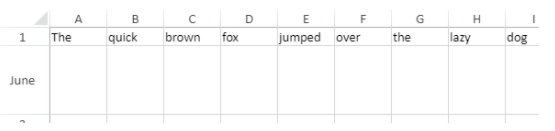

<!-- REF #_method_.VP SET ROW ATTRIBUTES.Syntax -->
**VP SET ROW ATTRIBUTES** ( *rangeObj* : Object ; *propertyObj* : Object  ) <!-- END REF -->


<!-- REF #_method_.VP SET ROW ATTRIBUTES.Params -->

|Parameter|Type||Description|
|---|---|---|---|
|rangeObj |Object|->|Range of rows|
|propertyObj |Object|->|Object containing row properties|<!-- END REF -->

#### Description

The `VP SET ROW ATTRIBUTES` command <!-- REF #_method_.VP SET ROW ATTRIBUTES.Summary -->applies the attributes defined in the *propertyObj* to the rows in the *rangeObj*<!-- END REF -->.

In the *rangeObj*, pass an object containing a range. If the range contains both columns and rows, attributes are applied only to the rows.

The *propertyObj* parameter lets you specify the attributes to apply to the rows in the *rangeObj*. These attributes are:

|Property | Type|  Description |
|---|---|---|
|height| number| Row height expressed in pixels |
|pageBreak|  boolean|  True to insert a page break before the first row of the range, else false|
|visible| boolean|  True if the row is visible, else false |
|resizable|  boolean|  True if the row can be resized, else false |
|header | text | Row header text|

#### Example

You want to change the size of the second row and set the header:

```4d
var $row; $properties : Object
 
$row:=VP Row("ViewProArea";1)
$properties:=New object("height";75;"header";"June")
 
VP SET ROW ATTRIBUTES($row;$properties)
```



#### See also

[VP Get row attributes](vp-get-row-attributes.md)<br/>
[VP get column attributes](vp-get-column-attributes.md)<br/>
[VP SET ROW ATTRIBUTES](vp-set-row-attributes.md)
