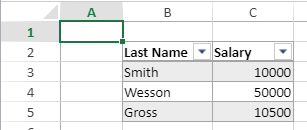

<details><summary>History</summary>

|Release|Changes|
|---|---|
|19 R7|Added
</details>

<!-- REF #_method_.VP SET TABLE COLUMN ATTRIBUTES.Syntax -->
**VP SET TABLE COLUMN ATTRIBUTES** ( *vpAreaName* : Text ; *tableName* : Text ; *column* : Integer ; *attributes* : Object {; *sheet* : Integer } )<!-- END REF -->

<!-- REF #_method_.VP SET TABLE COLUMN ATTRIBUTES.Params -->

|Parameter|Type| |Description|
|---|---|---|---|
|vpAreaName |Text|->|4D View Pro area form object name|
|tableName|Text|->|Table name|
|column|Integer|->|Index of the column in the table|
|attributes |Object|->|Attribute(s) to apply to the *column*|
|sheet   |Integer|->|Sheet index (current sheet if omitted)|<!-- END REF -->

#### Description

The `VP SET TABLE COLUMN ATTRIBUTES` command <!-- REF #_method_.VP SET TABLE COLUMN ATTRIBUTES.Summary -->applies the defined *attributes* to the *column* in the *tableName*<!-- END REF -->.

In *vpAreaName*, pass the name of the 4D View Pro area.

In the *attributes* parameter, pass an object that contains the properties to set:

|Property|Type|Description|
|---|---|---|
|dataField|text|Table column's property name in the data context.|
|name|text|Table column's name. Must be unique in the table. If this name already used by another column, it is not applied and a default name is automaticaly used.|
|formula|text|Sets the formula for each column cell. See [Structured Reference Formulas in the SpreadJS documentation](https://developer.mescius.com/spreadjs/docs/features/tablegen/structref)|
|footerText|text|Column footer value.|
|footerFormula|text|Column footer formula.|
|filterButtonVisible|boolean|Sets whether the table column's filter button is displayed (default is `True` when the table is created). |

In *sheet*, pass the index of the target sheet. If no index is specified or if you pass -1, the command applies to the current sheet.


>Indexing starts at 0.

If *tableName* is not found or if *column* is higher than the number of columns, the command does nothing. 


#### Example

You create a table with a data context: 

```4d
var $context;$options : Object

$context:=New object()
$context.col:=New collection()
$context.col.push(New object("name"; "Smith"; "firstname"; "John"; "salary"; 10000))
$context.col.push(New object("name"; "Wesson"; "firstname"; "Jim"; "salary"; 50000))
$context.col.push(New object("name"; "Gross"; "firstname"; "Maria"; "salary"; 10500))
VP SET DATA CONTEXT("ViewProArea"; $context)

	//Define the columns for the table
$options:=New object()
$options.tableColumns:=New collection()
$options.tableColumns.push(New object("name"; "Last Name"; "dataField"; "name"))
$options.tableColumns.push(New object("name"; "Salary"; "dataField"; "salary"))

VP CREATE TABLE(VP Cells("ViewProArea"; 1; 1; 2; 3); "PeopleTable"; "col"; $options)
```



Then you want to insert a column with data from the data context and hide some filter buttons:

```4d
	//insert a column
VP INSERT TABLE COLUMNS("ViewProArea"; "PeopleTable"; 1; 1)

var $param : Object
$param:=New object()
	// Bind the column to the firstname field from the datacontext
$param.dataField:="firstname"
	// Change the default name of the column to "First name"
	// and hide the filter button
$param.name:="First Name"
$param.filterButtonVisible:=False

VP SET TABLE COLUMN ATTRIBUTES("ViewProArea"; "PeopleTable"; 1; $param)

	// Hide the filter button of the first column
VP SET TABLE COLUMN ATTRIBUTES("ViewProArea"; "PeopleTable"; 0; \
	New object("filterButtonVisible"; False))

```


#### See also

[VP CREATE TABLE](vp-create-table.md)<br/>
[VP Find table](vp-find-table.md)<br/>
[VP Get table column attributes](vp-get-table-column-attributes.md)<br/>
[VP RESIZE TABLE](vp-resize-table.md)


