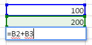
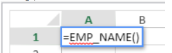

   
## Using formulas

A spreadsheet formula is an expression that calculates the value of a cell.

### Entering formulas

To enter a formula in a 4D View Pro area:

1.	Select the cell into which you will enter the formula or function.
2.	Enter = (the equal sign).
3.	Type the formula and hit the **Enter** key.
	
When writing a formula, you can use different shortcuts:

- click on a cell to enter its reference in the formula:

   

- type the first letter of a function to enter. A pop-up menu listing the available functions and references appears, allowing you to select the desired elements:

   

You can also create named formulas that can be called via their name. To do so, enter these formulas using the [VP ADD FORMULA NAME](commands/vp-add-formula-name.md) command. 

### Operators and Operands

All formulas have operands and operators:

*	**Operators**: see [Values and operators](#values-and-operators) below.
*	**Operands** include several categories:
	*	[values](#values-and-operators) (5 data types are supported)
	*	[references to other cells](#cell-references) (relative, absolute, mixed or by name)
	*	[standard spreadsheet functions](#using-functions)
	*	[4D functions](#4d-functions) based upon 4D formulas and providing access to 4D variables, fields, methods, commands, or expressions. 
 
## Values and operators

4D View Pro supports five types of data. For each data type, specific literal values and operators are supported.

|Data types	|Values|	Operators|
|---|---|---|
|[Number](Concepts/dt_number.md)	|1.2<br/>1.2 E3<br/>1.2E-3<br/>10.3x|+ (addition)<br/>- (subtraction)<br/>* (multiplication)<br/>/ (division)<br/>^ (exponent, the number of times to multiply a number by itself)<br/>% (percentage -- divide the number before the operator by one hundred)|
|[Date](Concepts/dt_date.md)|	10/24/2017	|+ (date + number of days -> date)<br/>+ (date + time -> date + time of day)<br/>- (date - number of days -> date)<br/>- (date - date -> number of days between the two)|
|[Time](Concepts/dt_time.md)|	10:12:10	|Duration operators:<br/>+ (addition)<br/>- (subtraction)<br/>* (duration * number -> duration)<br/>/ (duration / number -> duration)|
|[String](Concepts/dt_string.md)|	'Sophie' or "Sophie"	|& (concatenation)|
|[Boolean](Concepts/dt_boolean.md)|	TRUE or FALSE|	-|


### Comparison operators 
 
The following operators can be used with two operands of the same type:

|Operator	|Comparison|
|---|---|
|=	|equal to|
|`<>`	|different than|
|>	|greater than|
|<	|less than|
|>=	|greater than or equal to|
|<=	|less than or equal to|


### Operator precedence  

List of operators from most to least important:

|Operator|	Description|
|---|---|
|()|	Parenthesis (for grouping)|
|-	|Negate|
|+	|Plus|
|%|	Percent|
|^	|Exponent|
|* and /|	Multiply and divide|
|+ and -|	Add and Subtract|
|&|	Concatenate
|`=`  `>` `<` `>=` `<=` `<>`|	Compare|


## Cell references 
 
Formulas often refer to other cells by cell addresses. You can copy these formulas into other cells. For example, the following formula, entered in cell C8, adds the values in the two cells above it and displays the result.

```
= C6 + C7
```

This formula refers to cells C6 and C7. That is, 4D View Pro is instructed to refer to these other cells for values to use in the formula.

When you copy or move these formulas to new locations, each cell address in that formula will either change or stay the same, depending on how it is typed.

*	A reference that changes is called a **relative reference**, and refers to a cell by how far left/right and up/down it is from the cell with the formula.
*	A reference that always points to a particular cell is called an **absolute reference**.
*	You can also create a mixed reference which always points to a fixed row or column.


### Reference Notation  

If you use only cell coordinates, for example, `C5`, 4D View Pro interprets the reference as relative. You may make the reference an absolute reference by putting a dollar sign in front of the letter and the number, as in `$C$5`.

You can mix absolute and relative references by inserting a dollar sign in front of the letter or the number alone, for example, `$C5` or `C$5`. A mixed reference allows you to specify either the row or the column as absolute, while allowing the other portion of the address to refer relatively.

A convenient, fast and accurate way to specify an absolute reference is to name the cell and use that name in place of the cell address. A reference to a named cell is always absolute. You can create or modify named cells or named cell ranges using the [`VP ADD RANGE NAME`](commands/vp-add-range-name.md) command.

The following table shows the effect of the different notations:

|Example	|Type of reference	|Description|
|---|---|---|
|C5	|Relative	|Reference is to the relative location of cell C5, depending on the location of the cell in which the reference is first used
|$C$5	|Absolute	|Reference is absolute. Will always refer to cell C5 no matter where it is used.|
|$C5	|Mixed	|Reference is always to column C, but the row reference is relative to the location of the cell in which the reference is first used.|
|C$5	|Mixed	|Reference is always to row 5, but the column reference is relative to the location of the cell in which the reference is first used|
|Cell name	|Absolute	|Reference is absolute. Will always refer to the [named cell or range](commands/vp-add-range-name.md) no matter where the reference is used.|


## Built-in functions

Spreadsheet functions are preset formulas used to calculate cell values. When you type the first letter of the function to enter, a pop-up menu listing the available functions and references appears, allowing you to select the desired elements:  


See [**SpreadJS's extented list of functions**](https://developer.mescius.com/spreadjs/docs/formulareference/FormulaFunctions) for details and examples.


## 4D functions

4D View Pro allows you to define and call **4D custom functions**, which execute [4D formulas](API/FunctionClass.md). Using 4D custom functions extends the possibilities of your 4D View Pro documents and allows powerful interactions with the 4D database. 

4D custom functions provide access, from within your 4D View Pro formulas, to:

- 4D process variables,
- fields,
- project methods,
- 4D language commands,
- or any valid 4D expression.

4D custom functions can receive [parameters](#parameters) from the 4D View Pro area, and return values.

You declare all your functions using the [`VP SET CUSTOM FUNCTIONS`](commands/vp-set-custom-functions) command. Examples:

```4d
$o:=New object

//Name of the function in 4D View Pro: "DRIVERS_LICENCE"
$o.DRIVERS_LICENCE:=New object

//process variable
$o.DRIVERS_LICENCE.formula:=Formula(DriverLicence)

//table field
$o.DRIVERS_LICENCE.formula:=Formula([Users]DriverLicence)

//project method
$o.DRIVERS_LICENCE.formula:=Formula(DriverLicenceState)

//4D command
$o.DRIVERS_LICENCE:=Formula(Choose(DriverLicence; "Obtained"; "Failed"))

//4D expression and parameter
$o.DRIVERS_LICENCE.formula:=Formula(ds.Users.get($1).DriverLicence)
$o.DRIVERS_LICENCE.parameters:=New collection
$o.DRIVERS_LICENCE.parameters.push(New object("name"; "ID"; "type"; Is longint))
```
 
> **See also** [4D View Pro: Use 4D formulas in your spreadsheet (blog post)](https://blog.4d.com/4d-view-pro-use-4d-formulas-in-your-spreadsheet/)


### Hello World example

We want to print "Hello World" in a 4D View Pro area cell using a 4D project method:

1.	Create a "myMethod" project method with the following code:  

```4d
 #DECLARE->$hw :Text
 $hw:="Hello World"

```

2.	Execute the following code before opening any form that contains a 4D View Pro area:
 	  
```4d
  Case of
    :(Form event code=On Load)
       var $o : Object
       $o:=New object
  // Define "vpHello" function from the "myMethod" method
       $o.vpHello:=New object
       $o.vpHello.formula:=Formula(myMethod)
       VP SET CUSTOM FUNCTIONS("ViewProArea";$o)
 End case
```
 	
3.	Edit the content of a cell in a 4D View Pro area and type:  
	
		

	"myMethod" is then called by 4D and the cell displays:
	
		


	
### Parameters  

Parameters can be passed to 4D functions that call project methods using the following syntax:

```
=METHODNAME(param1,param2,...,paramN)
```

These parameters are received in *methodName* in $1, $2...$N.

Note that the ( ) are mandatory, even if no parameters are passed:

```
=METHODWITHOUTNAME()
```

You can declare the name, type, and number of parameters through the *parameters* collection of the function you declared using the [VP SET CUSTOM FUNCTIONS](commands/vp-set-custom-functions.md) command. Optionally, you can control the number of parameters passed by the user through *minParams* and *maxParams* properties. 

For more information on supported incoming parameter types, please refer to the [VP SET CUSTOM FUNCTIONS](commands/vp-set-custom-functions) command description. 

If you do not declare parameters, values can be sequentially passed to methods (they will be received in $1, $2...) and their type will be automatically converted. 

Date and Object parameters are handled in the following way:

* Dates in *jstype* will be passed as [object](Concepts/dt_object.md) in 4D code with two properties:  
    
|Property|	Type|	Description|
|---|---|---|
|value|	Date|	Date value|
|time	|Real|	Time in seconds|

* Objects will be passed as [object](Concepts/dt_object.md) with a  `.value` property containing the parameter:

|Property|	Type|	Description|
|---|---|---|
|value|	Object|	Object parameter|

### Returned values

4D project methods can also return values in the 4D View Pro cell formula via $0. The following data types are supported for returned parameters:

* [text](Concepts/dt_string.md) (converted to string in 4D View Pro)
* [real](Concepts/dt_number.md)/[longint](Concepts/dt_number.md) (converted to number in 4D View Pro)
* [date](Concepts/dt_date.md) (converted to JS Date type in 4D View Pro - hour, minute, sec = 0)
* [time](Concepts/dt_time.md) (converted to JS Date type in 4D View Pro - date in base date, i.e. 12/30/1899)
* [boolean](Concepts/dt_boolean.md) (converted to bool in 4D View Pro)
* [picture](Concepts/dt_picture.md) (jpg,png,gif,bmp,svg other types converted into png) creates a URI (data:image/png;base64,xxxx) and then used as the background in 4D View Pro in the cell where the formula is executed
* [object](Concepts/dt_object.md) with the following two properties (allowing passing a date and time):
	  
	|Property|	Type|	Description|
	|---|---|---|
	|value|	Date|	Date value|
	|time	|Real|	Time in seconds|

If the 4D method returns nothing, an empty string is automatically returned.

An error is returned in the 4D View Pro cell if:

*	the 4D method returns another type other than those listed above,
*	an error occurred during 4D method execution (when user clicks on "abort" button).

#### Example

```4d
var $o : Object

$o.BIRTH_INFORMATION:=New object
$o.BIRTH_INFORMATION.formula:=Formula(BirthInformation)
$o.BIRTH_INFORMATION.parameters:=New collection
$o.BIRTH_INFORMATION.parameters.push(New object("name";"First name";"type";Is text))
$o.BIRTH_INFORMATION.parameters.push(New object("name";"Birthday";"type";Is date))
$o.BIRTH_INFORMATION.parameters.push(New object("name";"Time of birth";"type";Is time))
$o.BIRTH_INFORMATION.summary:="Returns a formatted string from given information"

VP SET CUSTOM FUNCTIONS("ViewProArea"; $o)
```


## Compatibility

Alternate solutions are available to declare fields or methods as functions in your 4D View Pro areas. These solutions are maintained for compatibility reasons and can be used in specific cases. However, using the [`VP SET CUSTOM FUNCTIONS`](commands/vp-set-custom-functions.md) command is recommended. 

### Referencing fields using the virtual structure 
  

4D View Pro allows you to reference 4D fields using the virtual structure of the database, i.e. declared through the [`SET TABLE TITLES`](https://doc.4d.com/4dv19/help/command/en/page601.html) and/or [`SET FIELD TITLES`](https://doc.4d.com/4dv19/help/command/en/page602.html) commands with the \* parameter. This alternate solution could be useful if your application already relies on a virtual structure (otherwise, [using `VP SET CUSTOM FUNCTIONS`](#4d-functions) is recommended).

> **WARNING:** You cannot use the virtual structure and `VP SET CUSTOM FUNCTIONS` simultaneously. As soon as `VP SET CUSTOM FUNCTIONS` is called, the functions based upon `SET TABLE TITLES` and `SET FIELD TITLES` commands are ignored in the 4D View Pro area.

#### Requirements  

*	The field must belong to the virtual structure of the database, i.e. it must be declared through the [`SET TABLE TITLES`](https://doc.4d.com/4dv19/help/command/en/page601.html) and/or [`SET FIELD TITLES`](https://doc.4d.com/4dv19/help/command/en/page602.html) commands with the \* parameter (see example),
*	Table and field names must be ECMA compliant (see [ECMA Script standard](https://www.ecma-international.org/ecma-262/5.1/#sec-7.6)),
*	The field type must be supported by 4D View Pro (see above).

An error is returned in the 4D View Pro cell if the formula calls a field which is not compliant.

#### Calling a virtual field in a formula  

To insert a reference to a virtual field in a formula, enter the field with the following syntax:

```
TABLENAME_FIELDNAME()
```

For example, if you declared the "Name" field of the "People" table in the virtual structure, you can call the following functions:

```
=PEOPLE_NAME()
=LEN(PEOPLE_NAME())
```

> If a field has the same name as a [4D method](../Concepts/methods.md), it takes priority over the method. 

#### Example  

We want to print the name of a person in a 4D View Pro area cell using a 4D virtual field:

1.	Create an "Employee" table with a "L_Name" field:  


2.	Execute the following code to initialize a virtual structure:
	  
	```4d
	ARRAY TEXT($tableTitles;1)
	ARRAY LONGINT($tableNum;1)
	$tableTitles{1}:="Emp"
	$tableNum{1}:=2
	SET TABLE TITLES($tableTitles;$tableNum;*)
	 
	ARRAY TEXT($fieldTitles;1)
	ARRAY LONGINT($fieldNum;1)
	$fieldTitles{1}:="Name"
	$fieldNum{1}:=2 //last name
	SET FIELD TITLES([Employee];$fieldTitles;$fieldNum;*)
	```

3.	Edit the content of a cell in the 4D View Pro area and enter "=e":
	


4.	Select EMP_NAME (use the Tab key) and enter the closing ).




5.	Validate the field to display the name of the current employee:


>The \[Employee] table must have a current record.


### Declaring allowed methods 

You can call directly 4D project methods from within your 4D View Pro formulas. For security reasons, you must declare explicitly methods that can be called by the user with the [VP SET ALLOWED METHODS](commands/vp-set-allowed-methods.md) command. 


#### Requirements  

To be called in a 4D View Pro formula, a project method must be:

*	**Allowed**: it was explicitly declared using the [VP SET ALLOWED METHODS](commands/vp-set-allowed-methods.md) command.
*	**Runnable**: it belongs to the host project or a loaded component with the "Shared by components and host project" option enabled (see [Sharing of project methods](../Concepts/components.md#sharing-of-project-methods)).
*	**Not in conflict** with an existing 4D View Pro spreadsheet function: if you call a project method with the same name as a 4D View Pro built-in function, the function is called.

>If neither the [VP SET CUSTOM FUNCTIONS](commands/vp-set-custom-functions.md) nor the [VP SET ALLOWED METHODS](commands/vp-set-allowed-methods.md) command has been executed during the session, 4D View Pro custom functions rely on allowed methods defined by 4D's generic `SET ALLOWED METHODS` command. In this case, the project method names must comply with JavaScript Identifier Grammar (see [ECMA Script standard](https://www.ecma-international.org/ecma-262/5.1/#sec-7.6)). The global filtering option in the Settings dialog box (see *Data Access*) is ignored in all cases.

