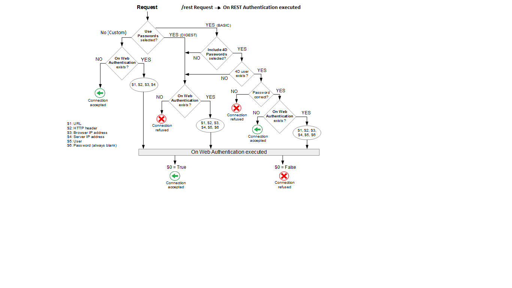

Authenticating users is necessary when you want to provide specific access rights to web users. Authentication designates the way the information concerning the user credentials (usually name and password) are collected and processed.


## Authentication modes

The 4D web server proposes three authentication modes, that you can select in the **Web**/**Options (I)** page of the Settings dialog box:


> Using a **custom** authentication is recommended.

### Overview 

The operation of the 4D web server's access system is summarized in the following diagram:



> Requests starting with `rest/` are directly handled by the [REST server](REST/configuration.md).


### Custom (default)

Basically in this mode, it's up to the developer to define how to authenticate users. 4D only evaluates HTTP requests [that require an authentication](#method-calls).

This authentication mode is the most flexible because it allows you to:

- either, delegate the user authentication to a third-party application (e.g. a social network, SSO);
- or, provide an interface to the user (e.g. a web form) so that they can create their account in your customer database; then, you can authenticate users with any custom algorithm (see [this example](sessions.md#example) from the "User sessions" chapter). The important thing is that you never store the password in clear, using such code:

```4d
//... user account creation
ds.webUser.password:=Generate password hash($password)  
ds.webUser.save()
```  

See also [this example](gettingStarted.md#authenticating-users) from the "Getting started" chapter. 

If no custom authentication is provided, 4D calls the [`On Web Authentication`](#on-web-authentication) database method (if it exists). In addition to $urll and $content, only the IP addresses of the browser and the server ($IPClient and $IPServer) are provided, the user name and password ($user and $password) are empty. The method must return **True** in $0 if the user is successfully authenticated, then the resquested resource is served, or **False** in $0 if the authentication failed.  

> **Warning:** If the `On Web Authentication` database method does not exist, connections are automatically accepted (test mode). 


### Basic protocol

When a user connects to the server, a standard dialog box appears on their browser in order for them to enter their user name and password. 

> The name and password entered by the user are sent unencrypted in the HTTP request header. This mode typically requires HTTPS to provide confidentiality. 

Entered values are then evaluated:

- If the **Include 4D passwords** option is checked, user credentials will be first evaluated against the [internal 4D users table](Users/overview.md). 
	- If the user name sent by the browser exists in the table of 4D users and the password is correct, the connection is accepted. If the password is incorrect, the connection is refused.
	- If the user name does not exist in the table of 4D users, the [`On Web Authentication`](#on-web-authentication) database method is called. If the `On Web Authentication` database method does not exist, connections are rejected.
	
- If the **Include 4D passwords** option is not checked, user credentials are sent to the [`On Web Authentication`](#on-web-authentication) database method along with the other connection parameters (IP address and port, URL...) so that you can process them. If the `On Web Authentication` database method does not exist, connections are rejected. 

>With the 4D Client web server, keep in mind that all the sites published by the 4D Client machines will share the same table of users. Validation of users/passwords is carried out by the 4D Server application.

### DIGEST protocol  

This mode provides a greater level of security since the authentication information is processed by a one-way process called hashing which makes their contents impossible to decipher. 

As in BASIC mode, users must enter their name and password when they connect. The [`On Web Authentication`](#on-web-authentication) database method is then called. When the DIGEST mode is activated, the $password parameter (password) is always returned empty. In fact, when using this mode, this information does not pass by the network as clear text (unencrypted). It is therefore imperative in this case to evaluate connection requests using the `WEB Validate digest` command.

>You must restart the web server in order for the changes made to these parameters to be taken into account. 


## On Web Authentication 

The `On Web Authentication` database method is in charge of managing web server engine access. It is called by 4D or 4D Server when a dynamic HTTP request is received.

### Database method calls 

The `On Web Authentication` database method is automatically called when a request or processing requires the execution of some 4D code (except for REST calls). It is also called when the web server receives an invalid static URL (for example, if the static page requested does not exist).

The `On Web Authentication` database method is therefore called:

- when the web server receives a URL requesting a resource that does not exist
- when the web server receives a URL beginning with `4DACTION/`, `4DCGI/`...
- when the web server receives a root access URL and no home page has been set in the Settings or by means of the [`WEB SET HOME PAGE`](../commands-legacy/web-set-home-page.md) command
- when the web server processes a tag executing code (e.g `4DSCRIPT`) in a semi-dynamic page.

The `On Web Authentication` database method is NOT called:

- when the web server receives a URL requesting a valid static page.
- when the web server receives a URL beginning with `rest/` and the REST server is launched (in this case, the authentication is handled through the [`ds.authentify` function](../REST/authUsers#force-login-mode) or (deprecated) the [`On REST Authentication` database method](REST/configuration.md#using-the-on-rest-authentication-database-method) or [Structure settings](REST/configuration.md#using-the-structure-settings)).
- when the web server receives a URL with a pattern triggering a [custom HTTP Request Handler](http-request-handler.md). 


### Syntax

**On Web Authentication**( *$url* : Text ; *$content* : Text ; *$IPClient* : Text ; *$IPServer* : Text ; *$user* : Text ; *$password* : Text ) -> $accept : Boolean

|Parameters|Type||Description|
|---|---|:---:|---|
|$url|Text|<-|URL |
|$content|Text|<-|HTTP headers + HTTP body (up to 32 kb limit) |
|$IPClient|Text|<-|IP address of the web client (browser) |
|$IPServer|Text|<-|IP address of the server |
|$user|Text|<-|User name |
|$password|Text|<-|Password |
|$accept|Boolean|->|True = request accepted, False = request rejected|

You must declare these parameters as follows:

```4d
// On Web Authentication database method
#DECLARE ($url : Text; $content : Text; \
  $IPClient : Text; $IPServer : Text; \
  $user : Text; $password : Text) \
  -> $accept : Boolean

//Code for the method

```

:::note

All the `On Web Authentication` database method's parameters are not necessarily filled in. The information received by the database method depends on the selected [authentication mode](#authentication-mode)).

:::

#### $url - URL

The first parameter (`$url`) is the URL received by the server, from which the host address has been removed.

Let’s take the example of an Intranet connection. Suppose that the IP address of your 4D Web Server machine is 123.45.67.89. The following table shows the values of $urll depending on the URL entered in the Web browser:

|URL entered in web browser|Value of parameter $urll|
|---|---|
|123.45.67.89|/ |
|http://123.45.67.89|/ |
|123.45.67.89/Customers|/Customers |
|http://123.45.67.89/Customers/Add|/Customers/Add |
|123.45.67.89/Do_This/If_OK/Do_That|/Do_This/If_OK/Do_That |

#### $content - Header and Body of the HTTP request

The second parameter (`$content`) is the header and the body of the HTTP request sent by the web browser. Note that this information is passed to your `On Web Authentication` database method as it is. Its contents will vary depending on the nature of the web browser which is attempting the connection.

If your application uses this information, it is up to you to parse the header and the body. You can use the `WEB GET HTTP HEADER` and the `WEB GET HTTP BODY` commands.

>For performance reasons, the size of data passing through the $content parameter must not exceed 32 KB. Beyond this size, they are truncated by the 4D HTTP server.

#### $IPClient - Web client IP address

The `$IPClient` parameter receives the IP address of the browser’s machine. This information can allow you to distinguish between intranet and internet connections.

>4D returns IPv4 addresses in a hybrid IPv6/IPv4 format written with a 96-bit prefix, for example ::ffff:192.168.2.34 for the IPv4 address 192.168.2.34. For more information, refer to the [IPv6 Support](webServerConfig.md#about-ipv6-support) section.


#### $IPServer - Server IP address

The `$IPServer` parameter receives the IP address used to call the web server. 4D allows for multi-homing, which allows you to exploit machines with more than one IP address. For more information, please refer to the [Configuration page](webServerConfig.md#ip-address-to-listen).


#### $user and $password - User Name and Password

The `$user` and `$password` parameters receive the user name and password entered by the user in the standard identification dialog box displayed by the browser. This dialog box appears for each connection, if [basic](#basic-protocol) or [digest](#digest-protocol) authentication is selected.

>If the user name sent by the browser exists in 4D, the $password parameter (the user’s password) is not returned for security reasons.

#### $accept - Function return

The `On Web Authentication` database method returns a boolean:

*	If it is True, the connection is accepted.

*	If it is False, the connection is refused.

The `On Web Connection` database method is only executed if the connection has been accepted by `On Web Authentication`.

:::warning

- If no value is returned, the connection is considered as **accepted** and the `On Web Connection` database method is executed.
- Do not call any interface elements in the `On Web Authentication` database method (`ALERT`, `DIALOG`, etc.) because otherwise its execution will be interrupted and the connection refused. The same thing will happen if an error occurs during its processing.

:::

### Example

Example of the `On Web Authentication` database method in [DIGEST mode](#digest-protocol):

```4d
 // On Web Authentication Database Method
 #DECLARE ($url : Text; $header : Text; $ipB : Text; $ipS : Text; \
 	$user : Text; $pw : Text) -> $valid : Boolean
  
 var $found : cs.WebUserSelection
 $valid:=False

 $found:=ds.WebUser.query("User === :1";$user)
 If($found.length=1) // User is found
 	$valid:=WEB Validate digest($user;[WebUser]password)
 Else
    $valid:=False // User does not exist
 End if
```
