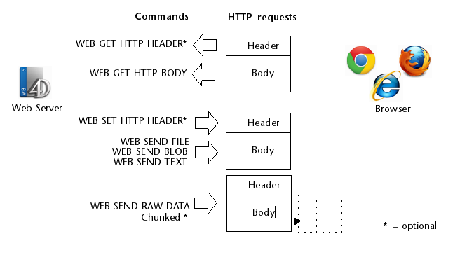

The 4D web server provides several built-in features to handle HTTP requests:

- the `On Web Connection` database method, a router for your web application,
- the `/4DACTION` URL to call server-side code
- `WEB GET VARIABLES` to get values from HTML objects sent to the server
- other commands such as `WEB GET HTTP BODY`, `WEB GET HTTP HEADER`, or `WEB GET BODY PART` allow to customize the request processing, including cookies.
- the *COMPILER_WEB* project method, to declare your variables.

:::info

You can also implement your own HTTP request handlers for a customized control over incoming requests and outgoing responses. When a custom HTTP request handler is triggered, no database method is called. See [**HTTP Request Handler**](http-request-handler.md) section.

:::

## On Web Connection

The `On Web Connection` database method can be used as the entry point for the 4D Web server.

### Database method calls

The `On Web Connection` database method is automatically called when the server receives any URL that is not a valid path to an existing page on the server. The database method is called with the URL.

For example, the URL "*a/b/c*" will call the database method, but "*a/b/c.html*" will not call the database method if the page "c.html" exists in the "a/b" subfolder of the [WebFolder](webServerConfig.md#root-folder).

> The request should have previously been accepted by the [`On Web Authentication`](authentication.md#on-web-authentication) database method (if it exists) and the web server must be launched.

### Syntax

**On Web Connection**( *$url* : Text; *$header* : Text; *$BrowserIP* : Text; *$ServerIP* : Text; *$user* : Text; *$password* : Text )

|Parameters|Type||Description|
|---|---|:---:|---|
|$url|Text|<-|URL |
|$header|Text|<-|HTTP headers + HTTP body (up to 32 kb limit) |
|$BrowserIP|Text|<-|IP address of the web client (browser) |
|$ServerIP|Text|<-|IP address of the server |
|$user|Text|<-|User name |
|$password|Text|<-|Password |


You must declare these parameters:

```4d
// On Web Connection database method
#DECLARE ($url : Text; $header : Text; \
  $BrowserIP : Text; $ServerIP : Text; \
  $user : Text; $password : Text)

```


> Calling a 4D command that displays an interface element (`DIALOG`, `ALERT`, etc.) is not allowed and ends the method processing.


### $url - URL extra data

The first parameter ($url) is the URL entered by users in the address area of their web browser, without the host address.

Let’s use an intranet connection as an example. Suppose that the IP address of your 4D Web Server machine is 123.4.567.89. The following table shows the values of $url depending on the URL entered in the web browser:

|URL entered in web browser|Value of parameter $url|
|---|---|
|123.4.567.89|/ |
|http://123.45.67.89|/ |
|123.4.567.89/Customers|/Customers |
|http://123.45.67.89/Customers/Add|/Customers/Add |
|123.4.567.89/Do_This/If_OK/Do_That|/Do_This/If_OK/Do_That |

Note that you are free to use this parameter at your convenience. 4D simply ignores the value passed beyond the host part of the URL. For example, you can establish a convention where the value "*/Customers/Add*" means “go directly to add a new record in the `[Customers]` table.” By supplying the web users with a list of possible values and/or default bookmarks, you can provide shortcuts to different parts of your application. This way, web users can quickly access resources of your website without going through the entire navigation path each time they make a new connection.


### $header - Header and Body of the HTTP request

The second parameter ($header) is the header and the body of the HTTP request sent by the web browser. Note that this information is passed to your `On Web Connection` database method "as is". Its contents will vary depending on the nature of the web browser attempting the connection.

If your application uses this information, it is up to you to parse the header and the body. You can use the `WEB GET HTTP HEADER` and the `WEB GET HTTP BODY` commands.

>For performance reasons, the size of data passing through the $header parameter must not exceed 32 KB. Beyond this size, they are truncated by the 4D HTTP server.


### $BrowserIP - Web client IP address

The $BrowserIP parameter receives the IP address of the browser’s machine. This information can allow you to distinguish between intranet and internet connections.

>4D returns IPv4 addresses in a hybrid IPv6/IPv4 format written with a 96-bit prefix, for example ::ffff:192.168.2.34 for the IPv4 address 192.168.2.34. For more information, refer to the [IPv6 Support](webServerConfig.md#about-ipv6-support) section.

### $ServerIP - Server IP address

The $ServerIP parameter receives the IP address requested by the 4D Web Server. 4D allows for multi-homing, which allows you to use machines with more than one IP address. For more information, please refer to the [Configuration page](webServerConfig.html#ip-address-to-listen).

### $user and $password - User Name and Password

The $user and $password parameters receive the user name and password entered by the user in the standard identification dialog box displayed by the browser, if applicable (see the [authentication page](authentication.md)).

>If the user name sent by the browser exists in 4D, the $password parameter (the user’s password) is not returned for security reasons.


## /4DACTION

**/4DACTION/***MethodName*<br/>
**/4DACTION/***MethodName/Param*

|Parameters|Type||Description|
|---|---|:---:|---|
|MethodName|Text|->|Name of the 4D project method to be executed |
|Param|Text|->|Text parameter to pass to the project method|

**Usage:** URL or Form action.

This URL allows you to call the *MethodName* 4D project method with an optional *Param* text parameter. The method will receive this parameter.

- The 4D project method must have been [allowed for web requests](allowProject.md): the “Available through 4D tags and URLs (4DACTION...)” attribute value must have been checked in the properties of the method. If the attribute is not checked, the web request is rejected.
- When 4D receives a `/4DACTION/MethodName/Param` request, the `On Web Authentication` database method (if it exists) is called.

`4DACTION/` can be associated with a URL in a static Web page:

```html
<A HREF="/4DACTION/MyMethod/hello">Do Something</A>
```

The `MyMethod` project method should generally return a "reply" (sending of an HTML page using `WEB SEND FILE` or `WEB SEND TEXT`, etc.). Be sure to make the processing as short as possible in order not to block the browser.

> A method called by `/4DACTION` must not call interface elements (`DIALOG`, `ALERT`, etc.).

#### Example

This example describes the association of the `/4DACTION` URL with an HTML picture object in order to dynamically display a picture in the page. You insert the following instructions in a static HTML page:

```html

```

The `getPhoto` method is as follows:

```4d
#DECLARE ($url : Text) // This parameter must always be declared
var $path : Text
var $PictVar : Picture
var $BlobVar : Blob

 //find the picture in the Images folder within the Resources folder
$path:=Get 4D folder(Current resources folder)+"Images"+Folder separator+$url+".psd"

READ PICTURE FILE($path;$PictVar) //put the picture in the picture variable
PICTURE TO BLOB($PictVar;$BLOB;".png") //convert the picture to ".png" format
WEB SEND BLOB($BLOB;"image/png")
```

### 4DACTION to post forms

The 4D Web server also allows you to use “posted” forms, which are static HTML pages that send data to the Web server, and to easily retrieve all the values. The POST type must be associated to them and the form’s action must imperatively start with /4DACTION/MethodName.

A form can be submitted through two methods (both can be used with 4D):
- POST, usually used to send data to the Web server,
- GET, usually used to request data from the Web server.

> When the Web server receives a posted form, it calls the `On Web Authentication` database method (if it exists).

In the called method, you must call the `WEB GET VARIABLES` command in order to [retrieve the names and values](#getting-values-from-the-requests) of all the fields included in an HTML page submitted to the server.

Example to define the action of a form:

```html
<FORM ACTION="/4DACTION/MethodName" METHOD=POST>
```

#### Example

In a Web application, we would like for the browsers to be able to search among the records by using a static HTML page. This page is called “search.htm”. The application contains other static pages that allow you to, for example, display the search result (“results.htm”). The POST type has been associated to the page, as well as the `/4DACTION/SEARCH` action.

Here is the HTML code that corresponds to this page:

```html
<form action="/4daction/processForm" method=POST>
<input type=text name=vName value=""><br/>
<input type=checkbox name=vExact value="Word">Whole word<br/>
<input type=submit name=OK value="Search">
</FORM>
```

During data entry, type “ABCD” in the data entry area, check the "Whole word" option and validate it by clicking the **Search** button. In the request sent to the Web server:

```
vName="ABCD"
vExact="Word"
OK="Search"
```

4D calls the `On Web Authentication` database method (if it exists), then the `processForm` project method is called, which is as follows:

```4d
 #DECLARE ($url : Text) //mandatory for compiled mode
 var $vName : Integer
 var vName;vLIST : Text
 ARRAY TEXT($arrNames;0)
 ARRAY TEXT($arrVals;0)
 WEB GET VARIABLES($arrNames;$arrVals) //we retrieve all the variables of the form
 $vName:=Find in array($arrNames;"vName")
 vName:=$arrVals{$vName}
 If(Find in array($arrNames;"vExact")=-1) //If the option has not been checked
    vName:=vName+"@"
 End if
 QUERY([Jockeys];[Jockeys]Name=vName)
 FIRST RECORD([Jockeys])
 While(Not(End selection([Jockeys])))
    vLIST:=vLIST+[Jockeys]Name+" "+[Jockeys]Tel+"<br/>"
    NEXT RECORD([Jockeys])
 End while
 WEB SEND FILE("results.htm") //Send the list to the results.htm form
  //which contains a reference to the variable vLIST,
  //for example <!--4DHTML vLIST-->
  //...
End if
```


## Getting values from HTTP requests

4D's Web server lets you recover data sent through POST or GET requests, using Web forms or URLs.

When the Web server receives a request with data in the header or in the URL, 4D can retrieve the values of any HTML objects it contains. This principle can be implemented in the case of a Web form, sent for example using [`WEB SEND FILE`](../commands-legacy/web-send-file.md) or [`WEB SEND BLOB`](../commands-legacy/web-send-blob.md), where the user enters or modifies values, then clicks on the validation button.

In this case, 4D can retrieve the values of the HTML objects found in the request using the [`WEB GET VARIABLES`](../commands-legacy/web-get-variables.md) command. The `WEB GET VARIABLES` command retrieves the values as text.

Consider the following HTML page source code:

```html
<html>
<head>
  <title>Welcome</title>
  <script language="JavaScript"><!--
function GetBrowserInformation(formObj){
formObj.vtNav_appName.value = navigator.appName
formObj.vtNav_appVersion.value = navigator.appVersion
formObj.vtNav_appCodeName.value = navigator.appCodeName
formObj.vtNav_userAgent.value = navigator.userAgent
return true
}
function LogOn(formObj){
if(formObj.vtUserName.value!=""){
return true
} else {
alert("Enter your name, then try again.")
return false
}
}
//--></script>
</head>
<body>
<form action="/4DACTION/WWW_STD_FORM_POST" method="post"
 name="frmWelcome"
 onsubmit="return GetBrowserInformation(frmWelcome)">
  <h1>Welcome to Spiders United</h1>
  <p><b>Please enter your name:</b>
  <input name="vtUserName" value="" size="30" type="text"></p>
  <p>
<input name="vsbLogOn" value="Log On" onclick="return LogOn(frmWelcome)" type="submit">
<input name="vsbRegister" value="Register" type="submit">
<input name="vsbInformation" value="Information" type="submit"></p>
<p>
<input name="vtNav_appName" value="" type="hidden">
<input name="vtNav_appVersion" value="" type="hidden">
<input name="vtNav_appCodeName" value="" type="hidden">
<input name="vtNav_userAgent" value="" type="hidden"></p>
</form>
</body>
</html>
```

When 4D sends the page to a Web Browser, it looks like this:


The main features of this page are:

- It includes three **Submit** buttons: `vsbLogOn`, `vsbRegister` and `vsbInformation`.
- When you click **Log On**, the submission of the form is first processed by the JavaScript function `LogOn`. If no name is entered, the form is not even submitted to 4D, and a JavaScript alert is displayed.
- The form has a POST 4D method as well as a Submit script (*GetBrowserInformation*) that copies the browser properties to the four hidden objects whose names starts with *vtNav_App*.
It also includes the `vtUserName` object.

Let’s examine the 4D method `WWW_STD_FORM_POST` that is called when the user clicks on one of the buttons on the HTML form.

```4d
  // Retrieval of value of variables
 ARRAY TEXT($arrNames;0)
 ARRAY TEXT($arrValues;0)
 WEB GET VARIABLES($arrNames;$arrValues)
 var $user : Integer

 Case of

  // The Log On button was clicked
    :(Find in array($arrNames;"vsbLogOn")#-1)
       $user :=Find in array($arrNames;"vtUserName")
       QUERY([WWW Users];[WWW Users]UserName=$arrValues{$user})
       $0:=(Records in selection([WWW Users])>0)
       If($0)
          WWW POST EVENT("Log On";WWW Log information)
  // The WWW POST EVENT method saves the information in a database table
       Else

          $0:=WWW Register
  // The WWW Register method lets a new Web user register
       End if

  // The Register button was clicked
    :(Find in array($arrNames;"vsbRegister")#-1)
       $0:=WWW Register

  // The Information button was clicked
    :(Find in array($arrNames;"vsbInformation")#-1)
       WEB SEND FILE("userinfos.html")
 End case
```

The features of this method are:

- The values of the variables *vtNav_appName*, *vtNav_appVersion*, *vtNav_appCodeName*, and *vtNav_userAgent* (bound to the HTML objects having the same names) are retrieved using the `WEB GET VARIABLES` command from HTML objects created by the *GetBrowserInformation* JavaScript script.
- Out of the *vsbLogOn*, *vsbRegister* and *vsbInformation* variables bound to the three Submit buttons, only the one corresponding to the button that was clicked will be retrieved by the `WEB GET VARIABLES` command. When the submit is performed by one of these buttons, the browser returns the value of the clicked button to 4D. This tells you which button was clicked.

Keep in main that with HTML, all objects are text objects. If you use a SELECT object, it is the value of the highlighted element in the object that is returned in the `WEB GET VARIABLES` command, and not the position of the element in the array as in 4D. `WEB GET VARIABLES` always returns values of the Text type.


## Other Web Server Commands

The 4D web server provides several low-level web commands allowing you to develop custom processing of requests:

- the [`WEB GET HTTP BODY`](../commands-legacy/web-get-http-body.md) command returns the body as raw text, allowing any parsing you may need
- the [`WEB GET HTTP HEADER`](../commands-legacy/web-get-http-header.md) command return the headers of the request. It is useful to handle custom cookies, for example (along with the `WEB SET HTTP HEADER` command).
- the [`WEB GET BODY PART`](../commands-legacy/web-get-body-part.md) and [`WEB Get body part count`](../commands-legacy/web-get-body-part-count.md) commands to parse the body part of a multi-part request and retrieve text values, but also files posted, using BLOBs.

These commands are summarized in the following graphic:



The 4D web server supports files uploaded in chunked transfer encoding from any Web client. Chunked transfer encoding is a data transfer mechanism specified in HTTP/1.1. It allows data to be transferred in a series of "chunks" (parts) without knowing the final data size. The 4D Web Server also supports chunked transfer encoding from the server to Web clients (using [`WEB SEND RAW DATA`](../commands-legacy/web-send-raw-data.md)).

## COMPILER_WEB Project Method  

The COMPILER\_WEB method, if it exists, is systematically called when the HTTP server receives a dynamic request and calls the 4D engine. This is the case, for example, when the 4D Web server receives a posted form or a URL to process in [`On Web Connection`](#on-web-connection). This method is intended to contain typing and/or variable initialization directives used during Web exchanges. It is used by the compiler when the application is compiled. The COMPILER\_WEB method is common to all the Web forms. By default, the COMPILER_WEB method does not exist. You must explicitly create it.

> The COMPILER_WEB project method is also called, if it exists, for each SOAP request accepted.
