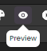
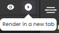

**Qodly Studio** is part of the **Qodly platform**, dedicated to the development of web business applications designed, tested and published entirely in the 4D Cloud.

As of 4D v20 R2, you can use Qodly Studio directly from 4D to build modern and sophisticated web interfaces that you can easily integrate to your existing 4D projects and deploy **on premise**. 

With Qodly Studio, you will discover a totally new web UI, get familiar with the concept of datasources, and learn how to:

- create webforms by placing components on a page
- map components to data
- trigger 4D code by configuring events
- and much more. 

:::info

The use of Qodly Studio in 4D requires a specific license. Qodly Studio options and menu items won't appear if the license is not activated.

:::

## Configuration

### Requirements

#### Browser 

Qodly Studio supports the following web browsers:

- Chrome
- Edge
- FireFox

The recommended resolution is 1920x1080.

#### 4D application

Qodly Studio only works with 4D projects (binary databases are not supported).


### Enabling access to Qodly Studio

By default, access to Qodly Studio is not granted. 

Qodly Studio is served by the [WebAdmin web server](../Admin/webAdmin.md) and displays data from 4D projects handled by the [4D web server](webServer.md). 

To enable access to Qodly Studio, you must explicitly allow it at two levels: 

* at 4D level (4D or 4D Server)
* at project level

If one of the two levels (or both) are not enabled, access to Qodly Studio is denied (a 403 page is returned).

#### At 4D level

As a first security level, you need to [allow access to Qodly Studio on the WebAdmin web server](../Admin/webAdmin.md#enable-access-to-qodly-studio).

This setting applies to the 4D application (4D or 4D Server) on the host machine. All projects opened with that 4D application take this setting into account.

Keep this option unchecked if you want to make sure no access to Qodly Studio is allowed on the application. 

Check this option to make it possible to access Qodly Studio. However, you still need to enable it at every project level.

Additionally, you can [configure the WebAdmin web server's HTTP/HTTPS port used](../Admin/webAdmin.md#accept-http-connections-on-localhost). 

:::note 

After any change to these settings, you must [restart the WebAdmin web server](../Admin/webAdmin.md#start-and-stop) for the new configuration to be effective.

:::

#### At project level

After you have enabled access to Qodly Studio at the 4D level, you need to explicitly designate every project that can be accessed. The **Enable access to Qodly Studio** option must be enabled on the [Web Features page of the 4D application's Settings](../settings/web.md#enable-access-to-qodly-studio). 

Keep in mind that [user settings](../settings/overview.md) can be defined at several levels, and that priorities apply.


### Activating authentication

Authentication on the WebAdmin web server is granted using an access key. For more details, see [Access key](../Admin/webAdmin.md#access-key).

### Enabling rendering

To enable the rendering of webforms that are created in Qodly Studio, the following options must be set.

* The 4D project's **Settings** > **Web** > **Web Features** > [**Expose as REST server**](../settings/web.md#exposed-as-rest-server) option must be activated 
* The [4D web server](webServer.md) must be running

When rendering webforms in the Web Studio, the renderer will connect to the 4D web server through HTTP or HTTPS, depending on the settings, following the same HTTP/HTTPS connection pattern as for the [WebAdmin web server](../Admin/webAdmin.md#accept-http-connections-on-localhost).

:::info

See [this page](https://docs.qodly.com/docs/studio/rendering) for information on how to render webforms in Qodly.

:::

Note that when you click on the "Render in a new tab" button, a tab will open at `IP:port/$lib/renderer/?w=WebFormName` on your machine.

Keep in mind that the Qodly Web Studio runs through the 4D WebAdmin web server. When you use Qodly Web Studio as a developer, even when you preview a webform in the studio, you're using the 4D WebAdmin web server. This allows you to see dataclasses, functions and attributes that are not exposed as REST resources for example (they are greyed out). 

However, webform rendering happens outside 4D Web Studio, and is served by the standard 4D web server. In this situation, your web application cannot access assets that are not exposed as REST resources. See [Exposed vs non-exposed functions](../ORDA/ordaClasses.md#exposed-vs-non-exposed-functions) and [Exposing tables](../REST/configuration.md#exposing-tables) for more information on how to expose assets.

:::note

Renderer buttons are hidden if the configuration options are not activated.

::: 

### WebAdmin server and deployment 

For deployment, the WebAdmin server is not necessary. End-user access to your web application made with Qodly Studio is based on the 4D REST protocol, and as such, it works as through a conventional 4D remote application.


### Using project methods

We recommend using class functions over methods, but you can still use your project methods as REST functions in the studio.

To be used in Qodly Studio, project methods must be defined as Datastore, Dataclass, Entity or Entity selection class functions. 

To check if a method is available as REST function: 
1. In the Explorer of your 4D application, **right-click a project method** > **Edit Properties...** to open the Method Properties dialog. 
2. Check that the **REST Server** option is checked.

Selecting **Scope** > **Catalog** designates the project method as a function of the Datastore class. No table (dataclass) is assigned in this case.


## Opening Qodly Studio

The Qodly Studio page is available when the [WebAdmin web server is running](../Admin/webAdmin.md#start-and-stop) and authentication is activated (see above). 

There are two ways to access Qodly Studio:

* from your 4D single-user application, go to **Design** > **Qodly Studio...**. 
If the WebAdmin web server is already running, depending on its configuration, your default browser opens at `IPaddress:HTTPPort/studio` or `IPaddress:HTTPSPort/studio`. Otherwise, you will be prompted if you want to start the WebAdmin web server first.

* on a browser, with the WebAdmin web server running (launched from 4D or 4D Server), enter the following address:
 	
`IPaddress:HTTPPort/studio`
		
or:
	
`IPaddress:HTTPSPort/studio`

For example, after launching a local web server on port 7080, type this address in your browser: 

`localhost:7080/studio`

You will then be prompted to enter the [access key](../Admin/webAdmin.md#access-key) to access Qodly Studio.

## Rendering webforms

Webforms can be rendered from the Qodly Studio IDE or from a browser window.

- From the Qodly Studio IDE: in the webform editor, click on the preview button (. 
In this case, the webform is rendered by the WebAdmin web server with access to all database resources. 

- Form a browser window: in the webform editor, click on the Render in a new tab button (.
A tab will open at `IP:port/$lib/renderer/?w=WebFormName`.
In this case, the webform is rendered by Qodly web renderer engine. The renderer engine applies the REST resource restrictions defined in your 4D project's database. This means that only exposed datasources are rendered in the browser. The renderer engine applies as well the permission actions that might have been configured in your 4D project's database.

You can also render the whole website using the Qodly web renderer engine by clicking on the **Preview** button of the toolbar (. The home page [defined in the Settings](https://docqodly.github.io/docs/studio/settings/#application) is then displayed. 

:::note

Renderer buttons are displayed only when the [configuration options](#enabling-rendering) are activated.

::: 


## Using Qodly Studio

The official Qodly Studio documentation is available on the [Qodly documentation website](developer.qodly.com/docs/studio).

You can rely on this documentation and its associated resources for developing web applications powered by webforms. However, depending on implementation stage, 4D developers will either use Qodly Studio or 4D IDE.

:::info

There is no direct compatibility between apps implemented with 4D and apps implemented with Qodly.

:::

### Feature comparison

||Qodly Studio for 4D developers using 4D IDE|Qodly Studio for Qodly developers|
|---|---|---|
|View and edit tables (dataclasses), attributes and relations|4D Structure Editor|Qodly Studio Model Editor| 
|Webforms|Qodly Studio Webform Editor|Qodly Studio Webform Editor| 
|Desktop forms|4D IDE|*not supported*| 
|Programming language|4D Language featuring ORDA|QodlyScript featuring ORDA| 
|Coding IDE|4D IDE code editor/VS Code with 4D extension|Qodly Studio code editor| 
|Debugger|4D IDE debugger|Qodly Studio debugger| 
|REST/Web roles and privileges|roles.json direct edit/Qodly Studio roles and privileges editor|Qodly Studio role and privileges editor| 


### From QodlyScript to 4D Language

4D developers can use the [Qodly Studio documentation](developer.qodly.com/docs/studio) to learn how to design their webforms in Qodly Studio. Code examples are provided in QodlyScript, but since QodlyScript inherits from the 4D Language, you won't be lost. Converting QodlyScript code to 4D language is easy, it only requires some adaptations:

#### Variable names

QodlyScript only support local variables, so variables in QodlyScript examples are not prefixed with `$`. In the 4D code, make sure to **prefix variable names with `$`** so that they are identifed as local variables by 4D. 

#### Symbols and keywords

Some basic symbols, operators, and keywords differ in QodlyScript and must be adapted to the 4D Language. They are listed below:

|QodlyScript|4D Language|Comment|
|---|---|---|
|, |;|argument separator|
|= |:=|assignment operator|
|== |=|comparison operator|
|declare|#Declare||
|switch|Case of||
|constructor|Class constructor||
|extends|Class extends||
|end|End for, End For each, End if, End case, End use, End while||
|forEach|For each||
|string|Text|var type|
|number|Real|var type|

Some other items have a different case (ex: `this` vs `This`) but can be pasted directly in 4D code. 


#### Command names

QodlyScript command names are written in camel case without spaces. You might need to adapt these commands to the 4D Language.

- Usually, you will only have to simply convert names. For example, `newCollection` in QodlyScript is `New collection` in 4D Language.
- However, some command have been renamed for a better compliance. They are listed below: 

|QodlyScript|4D Language|
|---|---|
|`atan` |`Arctan`|
|`highestProcessNumber` |`Count tasks`|
|`callChain`|`Get call chain`|
|`objectClass`|`OB Class`|
|`objectCopy`|`OB Copy`|
|`objectEntries`|`OB Entries`|
|`instanceOf`|`OB Instance of`|
|`objectIsDefined`|`OB Is defined`|
|`objectIsEmpty`|`OB Is empty`|
|`objectIsShared`|`OB Is shared`|
|`objectKeys`|`OB Keys`|
|`objectRemove`|`OB REMOVE`|
|`objectValues`|`OB Values`|
|`sqrt`|`Square root`|


#### Example

- QodlyScript code:

```qs
 declare(entitySelection : 4D.EntitySelection)  
 var dataClass : 4D.DataClass
 var entity, duplicate : 4D.Entity
 var status : object
 dataClass=entitySelection.getDataClass()
 forEach(entity,entitySelection)
    duplicate=dataClass.new()
    duplicate.fromObject(entity.toObject())
    duplicate[dataClass.getInfo().primaryKey]=null
    status=duplicate.save()
 end
```


- 4D Language equivalent code: 

```4d
 #DECLARE ( $entitySelection : 4D.EntitySelection )  
 var $dataClass : 4D.DataClass
 var $entity; $duplicate : 4D.Entity
 var $status : Object
 $dataClass:=$entitySelection.getDataClass()
 For each($entity;$entitySelection)
    $duplicate:=$dataClass.new()
    $duplicate.fromObject($entity.toObject())
    $duplicate[$dataClass.getInfo().primaryKey]:=Null
    $status:=$duplicate.save()
 End for each

```
