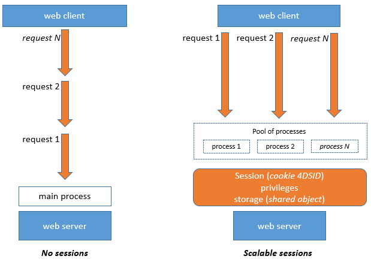
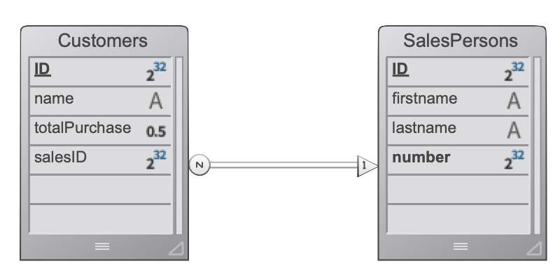
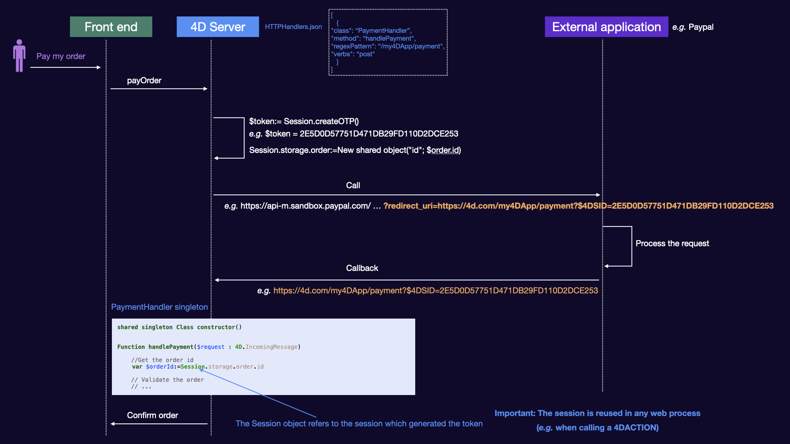

The 4D web server provides built-in features for managing **web sessions**. Creating and maintaining web sessions allows you to control and improve the user experience on your web application. When web sessions are enabled, web clients can reuse the same server context from one request to another.

Web sessions allow to:

- handle multiple requests simultaneously from the same web client through an unlimited number of preemptive processes (web sessions are **scalable**),
- manage session through a `Session` object and the [Session API](API/SessionClass.md),
- store and share data between processes of a web client using the [.storage](../API/SessionClass.md#storage) of the session,
- associate privileges to the user running the session.

## Usages

Web sessions are used for:

- [Web applications](gettingStarted.md) sending http requests,
- calls to the [REST API](../REST/authUsers.md), which are used by [remote datastores](../ORDA/remoteDatastores.md) and [Qodly forms](qodly-studio.md). 


## Enabling web sessions

The session management feature can be enabled and disabled on your 4D web server. There are different ways to enable session management:

- Using the **Scalable sessions** option on the "Web/Options (I)" page of the Settings (permanent setting):


This option is selected by default in new projects. It can however be disabled by selecting the **No sessions** option, in which case the web session features are disabled (no `Session` object is available).

- Using the [`.scalableSession`](API/WebServerClass.md#scalablesession) property of the Web Server object (to pass in the *settings* parameter of the [`.start()`](API/WebServerClass.md#start) function). In this case, this setting overrides the option defined in the Settings dialog box for the Web Server object (it is not stored on disk).

> The [`WEB SET OPTION`](../commands-legacy/web-set-option.md) command can also set the session mode for the main Web server.

In any cases, the setting is local to the machine; so it can be different on the 4D Server Web server and the Web servers of remote 4D machines.

> **Compatibility**: A **Legacy sessions** option is available in projects created with a 4D version prior to 4D v18 R6 (for more information, please refer to the [doc.4d.com](https://doc.4d.com) web site).


## Session implementation

When [sessions are enabled](#enabling-web-sessions), automatic mechanisms are implemented, based upon a private cookie set by 4D itself: "4DSID_*AppName*", where *AppName* is the name of the application project. This cookie references the current web session for the application.

:::info

The cookie name can be get using the [`.sessionCookieName`](API/WebServerClass.md#sessioncookiename) property.

:::

1. In each web client request, the Web server checks for the presence and the value of the private "4DSID_*AppName*" cookie.

2. If the cookie has a value, 4D looks for the session that created this cookie among the existing sessions; if this session is found, it is reused for the call.

2. If the client request does not correspond to an already opened session:

- a new session with a private "4DSID_*AppName*" cookie is created on the web server
- a new Guest `Session` object is created and is dedicated to the scalable web session.

:::note

Creating a web session for a REST request may require that a licence is available, see [this page](../REST/authUsers.md).

:::

The `Session` object of the current session can then be accessed through the [`Session`](commands/session.md) command in the code of any web processes.



:::info

Web processes usually do not end, they are recycled in a pool for efficiency. When a process finishes executing a request, it is put back in the pool and made available for the next request. Since a web process can be reused by any session, [process variables](Concepts/variables.md#process-variables) must be cleared by your code at the end of its execution (using [`CLEAR VARIABLE`](https://doc.4d.com/4dv20/help/command/en/page89.html) for example). This cleanup is necessary for any process related information, such as a reference to an opened file. This is the reason why **it is recommended** to use the [Session](API/SessionClass.md) object when you want to keep session related information.

:::

## Storing and sharing session information

Each `Session` object provides a [`.storage`](API/SessionClass.md#storage) property which is a [shared object](Concepts/shared.md). This property allows you to share information between all processes handled by the session.

## Session lifetime

A scalable web session is closed when:

- the web server is stopped,
- the timeout of the session cookie has been reached.

The lifespan of an inactive cookie is 60 minutes by default, which means that the web server will automatically close inactive sessions after 60 minutes. 

This timeout can be set using the [`.idleTimeout`](API/SessionClass.md#idletimeout) property of the `Session` object (the timeout cannot be less than 60 minutes) or the *connectionInfo* parameter of the [`Open datastore`](../commands/open-datastore.md) command. 

When a web session is closed, if the [`Session`](commands/session.md) command is called afterwards:

- the `Session` object does not contain privileges (it is a Guest session)
- the [`.storage`](API/SessionClass.md#storage) property is empty
- a new session cookie is associated to the session

:::info

You can close a session from a Qodly form using the [**logout**](qodly-studio.md#logout) feature.  

:::


## Privileges

Privileges can be associated to web user sessions. On the web server, you can provide specific access or features depending on the privileges of the session.

You assign privileges using the [`.setPrivileges()`](API/SessionClass.md#setprivileges) function. In your code, you can check the session's privileges to allow or deny access using the [`.hasPrivilege()`](API/SessionClass.md#hasprivilege) function. By default, new sessions do not have any privilege: they are **Guest** sessions ([`.isGuest()`](API/SessionClass.md#isguest) function returns true).

Example:

```4d
If (Session.hasPrivilege("WebAdmin"))
	//Access is granted, do nothing
Else
	//Display an authentication page
End if
```

:::info

Privileges are implemented at the heart of the ORDA architecture to provide developers with a powerful technology for controlling access to the datastore and dataclas functions. For more information, please refer to the [**Privileges**](../ORDA/privileges.md) page of the ORDA chapter. 

:::


## Example

In a CRM application, each salesperson manages their own client portfolio. The datastore contains at least two linked dataclasses: Customers and SalesPersons (a salesperson has several customers).



We want a salesperson to authenticate, open a session on the web server, and have the top 3 customers be loaded in the session.


1. We run this URL to open a session:

```
http://localhost:8044/authenticate.shtml
```

> In a production environment, it it necessary to use a [HTTPS connection](API/WebServerClass.md#httpsenabled) to avoid any uncrypted information to circulate on the network.  


2. The `authenticate.shtml` page is a form containing *userId* et *password* input fields and sending a 4DACTION POST action:


```html
<!DOCTYPE html>
<html>
<body bgcolor="#ffffff">
<FORM ACTION="/4DACTION/authenticate" METHOD=POST>
	UserId: <INPUT TYPE=TEXT NAME=userId VALUE=""><br/>
	Password: <INPUT TYPE=TEXT NAME=password VALUE=""><br/>
<INPUT TYPE=SUBMIT NAME=OK VALUE="Log In">
</FORM>
</body>
</html>
```


3. The authenticate project method looks for the *userID* person and validates the password against the hashed value already stored in the *SalesPersons* table:

```4d
var $indexUserId; $indexPassword; $userId : Integer
var $password : Text
var $userTop3; $sales; $info : Object


ARRAY TEXT($anames; 0)
ARRAY TEXT($avalues; 0)

WEB GET VARIABLES($anames; $avalues)

$indexUserId:=Find in array($anames; "userId")
$userId:=Num($avalues{$indexUserId})

$indexPassword:=Find in array($anames; "password")
$password:=$avalues{$indexPassword}

$sales:=ds.SalesPersons.query("userId = :1"; $userId).first()

If ($sales#Null)
    If (Verify password hash($password; $sales.password))
        $info:=New object()
        $info.userName:=$sales.firstname+" "+$sales.lastname
        Session.setPrivileges($info)
        Use (Session.storage)
            If (Session.storage.myTop3=Null)
                $userTop3:=$sales.customers.orderBy("totalPurchase desc").slice(0; 3)

                Session.storage.myTop3:=$userTop3
            End if
        End use
        WEB SEND HTTP REDIRECT("/authenticationOK.shtml")
    Else
        WEB SEND TEXT("This password is wrong")
    End if
Else
    WEB SEND TEXT("This userId is unknown")
End if
```

:::note

For more examples, please refer to the [Scalable sessions for advanced web applications](https://blog.4d.com/scalable-sessions-for-advanced-web-applications/) bog post. 

:::

## Session Token (OTP)

The 4D web server allows you to generate, share, and use OTP (One-Time Passcode) session tokens. OTP session tokens are used to secure communications with third-party applications or websites. For more information, please refer to the [One-time password page](https://en.wikipedia.org/wiki/One-time_password) on Wikipedia.

In 4D, session tokens can be used when calling external URLs and being called back from within a session. The callback request includes the token, so that the session which triggered the callback is loaded along with its data and privileges. The token can also be used to share the same session from multiple devices (mobile/computer). Thanks to this architecture, the [session cookie](#session-implementation) is not exposed on the network, which eliminates the risk of man-in-the-middle attack.

### Basic scenario

The basic sequence of an OTP session token use in a 4D web application is the following:

1. The web user initiates an action that requires a secured third-party connection, for example a payment, from within a specific session. 
2. In your 4D code, you create a new OTP for the session using the [`Session.createOTP()`](../API/SessionClass.md#createotp) function and stores its token (UUID). 
3. You send a request to the third-party application with the session token included in the callback Uri. Note that the way to provide the callback Uri to a third-party application depends on its API.  
4. The third-party application sends back a request to 4D with the pattern you provided in the callback Uri.
5. The request is processed by a dedicated [HTTP Request handler](http-request-handler.md) in your application using [`IncomingMessage`](../API/IncomingMessageClass.md) and [`OutgoingMessage`](../API/OutgoingMessageClass.md) classes.  
    - If you have used the `$4DSID` parameter to handle the token, the related web user session is automatically restored in any web process with its storage and privileges. 
    - If you have used a custom parameter name to handle the token, you need to call the [`Session.restore()`](../API/SessionClass.md#restore) function.

:::note

The `$4DSID` key is reserved for the 4D session token and must not be used to send parameters. 

:::

### Example with $4DSID

The scenario using the `$4DSID` key is illustrated in the following diagram:



### Example with `restore` function

The scenario using a custom parameter is illustrated in the following diagram:


### Session token rules

When implementing session tokens, the following rules apply:

- HTTP and HTTPS schemas are supported. 
- Only scalable web sessions of the **host database** can be reused with tokens. Sessions created in component web servers cannot be restored. 
- No additional 4D Client license is consumed when reusing or restoring a session. 


