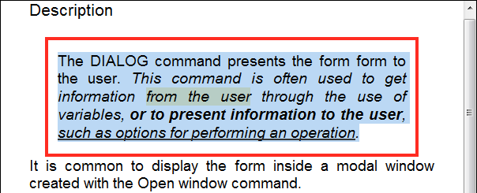

<!--REF #_command_.WP RESET ATTRIBUTES.Syntax-->**WP RESET ATTRIBUTES** ( *targetObj* ; *attribName* {; *attribName2* ; ... ; *attribNameN*} )<!-- END REF-->
<!--REF #_command_.WP RESET ATTRIBUTES.Params-->
| Parameter | Type |  | Description |
| --- | --- | --- | --- |
| targetObj | Object | &#x1F852; | Range or element or 4D Write Pro document |
| attribName | String | &#x1F852; | Name of attribute(s) to remove |

<!-- END REF-->

#### Description 

<!--REF #_command_.WP RESET ATTRIBUTES.Summary-->The **WP RESET ATTRIBUTES** command allows you to reset the value of one or more attributes in the range, element, or document passed as parameter.<!-- END REF--> This command can remove any kind of 4D Write Pro internal attribute: character, paragraph, document, table, or image. 

In the first parameter, you can pass either:

* a range, or
* an element (header / footer / body / table / paragraph / anchored or inline picture / section / subsection / style sheet), or
* a 4D Write Pro document

When an attribute value is removed using the **WP RESET ATTRIBUTES** command, the default value is applied to *targetObj*. Default values are listed in the *4D Write Pro Attributes* section. 

**Notes:** 

* When **WP RESET ATTRIBUTES** is applied to a section/sub-section object, attributes are then inherited from the parent section or document.
* When **WP RESET ATTRIBUTES** is applied to a style sheet object, the attributes are removed from the style sheet unless it is the default ("Normal") style sheet. In this case, the default value is applied to the attribute (the "Normal" style sheet defines all style sheet attributes).

If the attribute to be reset was not defined in the element passed as a parameter, the command does nothing.

#### Example 

You want to remove several attributes from the following selection:  
  
  

You can execute:  

```4d
 $range:=WP Get selection(*;"WParea")
 WP RESET ATTRIBUTES($range;wk padding)
 WP RESET ATTRIBUTES($range;wk background color)
 WP RESET ATTRIBUTES($range;wk text underline style)
 WP RESET ATTRIBUTES($range;wk margin)
 WP RESET ATTRIBUTES($range;wk border style)
```

  
The resulting document is:  
  


#### See also 

*4D Write Pro Attributes*  
[WP GET ATTRIBUTES](wp-get-attributes.md)  
[WP SET ATTRIBUTES](wp-set-attributes.md)  