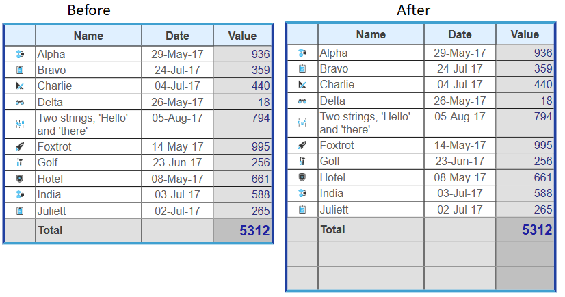

<!--REF #_command_.WP Table insert rows.Syntax-->**WP Table insert rows** ( targetObj | {*tableRef* ; *rowNumber*} {; *numRows*} )  -> Function result<!-- END REF-->
<!--REF #_command_.WP Table insert rows.Params-->
| Parameter | Type |  | Description |
| --- | --- | --- | --- |
| targetObj | Object | &#8594;  | Range or element or 4D Write Pro document |
| tableRef | Object | &#8594;  | Table reference |
| rowNumber | Longint | &#8594;  | Row index number |
| numRows | Longint | &#8594;  | Number of rows to insert (default value = 1) |
| Function result | Object | &#8592; | Range of table rows |

<!-- END REF-->

#### Description 

<!--REF #_command_.WP Table insert rows.Summary-->The **WP Table insert rows** command inserts one or several row(s) into a 4D Write Pro table.<!-- END REF-->

This command supports two syntaxes:

* If you pass a targetObj as the first parameter, the command will insert the row(s) in the first table intersecting the target. *targetObj* can contain:  
   * a range, or  
   * an element (row / paragraph / body / header / footer / inline picture / section / subsection), or  
   * a 4D Write Pro document.  
         
   If *targetObj* does not intersect with a table or text range where rows can be inserted, the command does nothing and returns Null (no error is generated).
* If you pass both a *tableRef* and a *rowNumber* as parameters, the command will insert the row(s) in the designated table and at the specified row index. If the rowNumber is higher than the number of rows in *tableRef*, the rows are appended to the table rather than inserted.

The optional *numRows* parameter defines the number of rows to insert into *targetObj* or *tableRef*. By default, if this parameter is omitted, one row is inserted.

**Result**  
  
The command returns a row range representing inserted row(s), or Null if nothing was inserted. 

#### Example 

You want to insert two rows at the end of the *Invoice* table: 

```4d
 var $row : Object
 var $table;$row : Object
 var $rowNum : Integer
 
 $table:=WP Get element by ID(WParea;"Invoice") //retrieve "Invoice" table
 
 If($table#Null)
    $rowNum:=$table.rowCount+1 //add 1 to last row to designate where to insert rows
    $row:=WP Table insert rows($table;$rowNum;2)
 End if
```

will insert the two new rows at the correct location:

 

#### See also 

[WP Table insert columns](wp-table-insert-columns.md)  