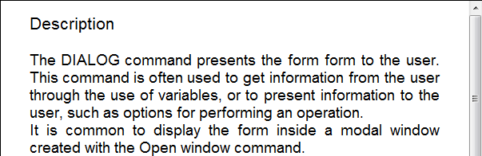

<!--REF #_command_.WP Text range.Syntax-->**WP Text range** ( *targetObj* ; *startRange* ; *endRange* ) : Object<!-- END REF-->
<!--REF #_command_.WP Text range.Params-->
| Parameter | Type |  | Description |
| --- | --- | --- | --- |
| targetObj | Object | &#8594;  | Range or element or 4D Write Pro document |
| startRange | Integer | &#8594;  | Starting offset of range in the area |
| endRange | Integer | &#8594;  | Ending offset of range in the area |
| Function result | Object | &#8592; | Range object |

<!-- END REF-->

#### Compatibility 

<!--REF #_command_.WP Text range.Summary-->**WP Text range** was named **WP Create range** in previous versions of 4D Write Pro.<!-- END REF--> It has been renamed for clarity. 

#### Description 

The **WP Text range** command returns a new range object containing the selection between *startRange* and *endRange* in the *targetObj*.

A **4D Write Pro range object** can be used to handle attributes on a text selection (in particular with the [WP GET ATTRIBUTES](../commands/wp-get-attributes.md) and [WP SET ATTRIBUTES](../commands/wp-set-attributes.md) commands). For more information, refer to the *Range handling commands* paragraph.

You can pass in *targetObj*:

* a range, or
* an element (table / row / paragraph / inline picture/ body / header / footer / section / subsection), or
* 4D Write Pro document

If no valid object is passed in the *targetObj* parameter, an empty range is returned.

In *startRange* and *endRange*, pass values corresponding to the position of the first and last characters to select in the document. You can pass wk start text in *startRange* to define the beginning of the document, and wk end text in *endRange* to define the end of the document. Keep in mind that a 4D Write Pro document not only contains visible text, but also formatting tags that are included in the range. 

**Note:** If you passed a table, row, paragraph, inline picture, body, header, footer, section or subsection element reference in *targetObj*, *startRange* and *endRange* will be relative to the element range starting and ending index. For example, if a header is passed, wk start text designates the header starting character and wk end text the header ending character; if a table element reference is passed, the command will return a text range relative to the table referenced by *targetObj*; if a section is passed, *startRange* and *endRange* are relative to the document body (parent area of a range created from a section). See example 2.

#### Example 1 

You want to select a range of 12 characters starting from the beginning of the 4D Write Pro field. The field is displayed in a form object:



If you execute:

```4d
 $range2:=WP Text range([SAMPLE]WP;wk start text;12)
 WP SELECT(*;"WParea";$range2)
```

...the result is:


#### Example 2 

You want to create a range from a section:

```4d
 var $wpRange : Object
 $wpRange:=WP Text range(wpSection;1;11) //return a range made of the first 10 characters of the section
  //if section starts at 100 in the document:
  //$wpRange.start = 100
  //$wpRange.end = 111
```

#### See also 

[WP Bookmark range](wp-bookmark-range.md)  
[WP Get body](wp-get-body.md)  
[WP Get header](wp-get-header.md)  
[WP Paragraph range](wp-paragraph-range.md)  
[WP Picture range](wp-picture-range.md)  
[WP SELECT](wp-select.md)  
[WP Selection range](wp-selection-range.md)  
[WP Table range](wp-table-range.md)  