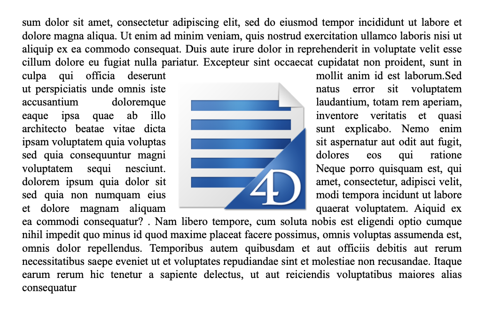

## Adding pictures 

Adding pictures to a 4D Write Pro document can be accomplished in multiple ways and depend on your needs:

* to add a **background picture**, use the wk background image or wk background image url attribute with the [WP SET ATTRIBUTES](../commands/wp-set-attributes) command
* to add an **inline picture**, *i.e.* inserted in the text flow just like a character, use the [WP INSERT PICTURE](../commands/wp-insert-picture) or the [ST INSERT EXPRESSION](../../commands/st-insert-expression) command
* to add an **anchored picture** in the page (behind or in front of the text), use the [WP Add picture](../commands/wp-add-picture) command.

The way you add a picture determines the layer it is positioned in, as illustrated in the diagram below: 


## Background pictures 

Pictures can be set as the background of 4D Write Pro documents and document elements (tables, paragraphs, sections, headers/footers, etc.).

Here is an example showing two different ways a picture can be used as a document's background:

>    

Background pictures can be set either programmatically or via the context menu. For more information, see the *Background* section in the *Using a 4D Write Pro area* article.

Background picture display can also be set either programmatically or via the context menu. Note that background display mode values actually define presets of background settings, as listed in the constant description:

| Constant                 | Comment                                                                                                                                                                                                                                                                                                                                                                                                                                                                                                    |
| ------------------------ | ---------------------------------------------------------------------------------------------------------------------------------------------------------------------------------------------------------------------------------------------------------------------------------------------------------------------------------------------------------------------------------------------------------------------------------------------------------------------------------------------------------- |
| wk proportional          | When used as value of wk image display mode, the image is aligned at the top left of the content box, not replicated, scaled to fit the content box, and it keeps its aspect ratio. When used as value of wk background display mode, presets the following attributes: wk background width \= "contain" wk background height \= "auto" wk background repeat \= wk no repeat wk background origin \= wk padding box wk background position horizontal \= wk left wk background position vertical \= wk top |
| wk proportional centered | When used as value of wk image display mode, the image is centered in the content box, not replicated, scaled to fit the content box and it keeps its aspect ratio. When used as value of wk background display mode, presets the following attributes: wk background width \= "contain" wk background height \= "auto" wk background repeat \= wk no repeat wk background origin \= wk padding box wk background position horizontal \= wk center wk background position vertical \= wk center            |
| wk replicated            | When used as value of wk image display mode, the image is aligned at the top left of the content box, replicated, and keeps its original size. When used as value of wk background display mode, presets the following attributes: wk background width \= "auto" wk background height \= "auto" wk background repeat \= wk repeat wk background origin \= wk padding box wk background position horizontal \= wk left wk background position vertical \= wk top                                            |
| wk replicated centered   | When used as value of wk image display mode, the image is centered in the content box, replicated, and keeps its original size. When used as value of wk background display mode, presets the following attributes: wk background width \= "auto" wk background height \= "auto" wk background repeat \= wk repeat wk background origin \= wk padding box wk background position horizontal \= wk center wk background position vertical \= wk center                                                      |
| wk scaled to fit         | When used as value of wk image display mode, the image is scaled to fit the content box and is not replicated. When used as value of wk background display mode, modifies the following attributes: wk background width \= "100%" wk background height \= "100%" wk background repeat \= wk no repeat wk background origin \= wk padding box wk background position horizontal \= wk left wk background position vertical \= wk top                                                                        |
| wk truncated             | When used as value of wk image display mode, the image is aligned at the top left of the content box, not replicated, and it keeps its original size. When used as value of wk background display mode, presets the following attributes: wk background width \= "auto" wk background height \= "auto" wk background repeat \= wk no repeat wk background origin \= wk padding box wk background position horizontal \= wk left wk background position vertical \= wk top                                  |
| wk truncated centered    | When used as value of wk image display mode, the image is centered in the content box, not replicated, and it keeps its original size. When used as value of wk background display mode, presets the following attributes: wk background width \= "auto" wk background height \= "auto" wk background repeat \= wk no repeat wk background origin \= wk padding box wk background position horizontal \= wk center wk background position vertical \= wk center                                            |

## Positioning and displaying of anchored pictures 

Anchored pictures are added with an absolute position, in front of/behind text, as well as anchored to the page or specific parts of a document (*i.e.*, header, footer, sections). Setting an absolute position for a picture is accomplished with the [WP Add picture](../commands/wp-add-picture) and [WP SET ATTRIBUTES](../commands/wp-set-attributes) commands.

Anchored picture positions can be modified with the following specific attributes and/or standard actions:  

| **Property (constant)**     | **Standard action**     |
| --------------------------- | ----------------------- |
| wk anchor layout            | *anchorLayout*          |
| wk anchor horizontal offset |                         |
| wk anchor horizontal align  | *anchorHorizontalAlign* |
| wk anchor vertical offset   |                         |
| wk anchor vertical align    | *anchorVerticalAlign*   |
| wk anchor origin            | *anchorOrigin*          |
| wk anchor page              | *anchorPage*            |
| wk anchor section           | *anchorSection*         |
| | *moveToBack*              |                         |
| | *moveToFront*             |                         |

Anchored pictures support automatic text wrapping when anchored to a document with options like on the left, right, largest side, above and below, or all around provided through the property wk anchor layout or the standard action **anchorLayout**. Check this [blog post](https://blog.4d.com/4d-write-pro-more-display-options-for-anchored-pictures-and-text-boxes/) for more details.



Pictures with text wrapping anchored to the body of the page do not affect the header or the footer (the picture is displayed in front of the header or the footer); on the contrary, pictures anchored to the header and footer affect the body of the page if they overlap it.

**Note**: If you want to anchor a picture with text wrapping to the header or footer, you must also set the vertical alignment of the picture to the top.

All anchored pictures are displayed in the Page view mode only. They're not displayed if:

* they are anchored to a header or footer which is not visible;
* the view mode is Draft;
* they are centered or anchored to sections and the **Show HTML WYSIWYG** option is checked;
* the "Show background" option is not selected.

## Picture expressions 

You can insert 4D expressions that return pictures in your 4D Write Pro areas. Expressions can be variables, fields, project methods, formulas, object attributes or collection elements.

You can see an expression's reference in the picture tip(\*):


(\*)As there is no text associated with an anchored image, its expression reference cannot be displayed.

All image attributes can be applied to picture expressions (wk image and wk image url attributes can only be read). Note however, that since pictures have specific attributes, 4D Write Pro must evaluate the expression at least once to detect that its result is a picture and handle it as a picture expression. It means that when a picture expression is inserted with [WP INSERT FORMULA](../commands/wp-insert-formula), [WP COMPUTE FORMULAS](../commands/wp-compute-formulas) must be called before setting any picture attributes. 

**Note**: As with other expressions, picture expressions are also impacted by the [WP COMPUTE FORMULAS](../commands/wp-compute-formulas) and [WP FREEZE FORMULAS](../commands/wp-freeze-formulas) commands.

### Anchored pictures 

Anchored picture expressions are added with the [WP Add picture](../commands/wp-add-picture) command (without the second parameter), followed by a call to the [WP SET ATTRIBUTES](../commands/wp-set-attributes) command with the wk image formula selector.

Example:

```4d
 obImage:=WP Add picture(myDoc)
 WP SET ATTRIBUTES(obImage;wk image formula;Formula(m_buildPict))
```

You can also insert picture expressions using [WP SET ATTRIBUTES](../commands/wp-set-attributes) and wk image formula on existing anchored pictures.

**Compatibility Note:** wk image expression can still be used to define picture expressions through text. However, it is recommended to use wk image formula and objects. 

Calling the [WP RESET ATTRIBUTES](../commands/wp-reset-attributes) command with wk image formula is similar to calling [WP FREEZE FORMULAS](../commands/wp-freeze-formulas) (on the entire document) in that the expression is cleared from the image attribute. However [WP FREEZE FORMULAS](../commands/wp-freeze-formulas) computes the expression before clearing, whereas [WP RESET ATTRIBUTES](../commands/wp-reset-attributes) does not. If an expression has never been computed, the default black frame image will be displayed.

### Inline pictures 

Inline picture expressions are added with the [WP INSERT FORMULA](../commands/wp-insert-formula) command.

Examples:

```4d
  //Insert a picture variable
 WP INSERT FORMULA(wpRange;Formula($vpict);wk prepend)
 
  //Insert a field
 WP INSERT FORMULA(wpRange;Formula([DOC]SamplePict);wk prepend)
 
  //Insert a 4D method
 WP INSERT FORMULA(wpRange;Formula(M_ComputeChart);wk prepend)
```

### Empty pictures 

If an image is empty (e.g. it could not be loaded, or it results from an expression that could not be computed, or it uses an unsupported picture format), by default 4D Write Pro displays a black frame rectangle:


You can remove these black rectangles from the current view using:

* the "Show empty or unsupported images" option of the Property list (see *Configuring View properties*), or
* the [WP SET VIEW PROPERTIES](../commands/wp-set-view-properties) command with the wk visible empty images selector, or
* the *visibleEmptyImage* standard action (see *Using 4D Write Pro standard actions*).

You can also use the wk visible empty images selector with the [WP EXPORT DOCUMENT](../commands/wp-export-document) and [WP EXPORT VARIABLE](../commands/wp-export-variable) commands to remove the black rectangles from exported contents.

Note that when this option is set, missing image elements will not be displayed at all even if they have borders, width, height, or background; this may impact the page layout for inline images.

## Picture properties 

All pictures have properties (attributes) such as height, width, borders, display mode, etc., that can be get or set via the 4D Write Pro language ([WP GET ATTRIBUTES](../commands/wp-get-attributes) and [WP SET ATTRIBUTES](../commands/wp-set-attributes)) or standard actions.

* The full list of properties available for pictures is provided on the *4D Write Pro Attributes* page.
* The *Image* section contains attributes that are specific to pictures only.
* The *Using 4D Write Pro standard actions* page also lists available image properties.

### Picture reference or picture URL 

You can work with picture references (picture variables, fields, expressions) or picture URLs (text representing a local or network address of the picture).

Two sets of attributes allow you to define if you want to set or get picture reference or a picture URL:

* wk image, wk background image, wk list style image: to set or to get picture references.  
When you get a picture using one of these attributes, you receive a 4D picture, no matter how the picture was defined.
* wk image url, wk background image url, wk list style image url: to set or get picture URLs.  
When you get a picture using one of these attributes, you receive a text. If the picture was defined through a reference (*e.g.* a picture variable), you get a local URI followed by the image in Base64.

**Example:**

```4d
 $range:=WP Get selection(WPArea) //get the picture selected by user
 $range:=WP Picture range($range) //create a range
 $url:="http://doc.4d.com/image/logo/poweredby4D_web.png"
 
 WP SET ATTRIBUTES($range;wk image;$url) //set an image reference from a URL
 
  //get the image
 var vPictureGet : Picture
 WP GET ATTRIBUTES($range;wk image;vPictureGet) //vPictureGet contains an image
 var vPictureURLGet : Text
 WP GET ATTRIBUTES($range;wk image url;vPictureURLGet) //vPictureURLGet=$url
```

## Retrieving pictures 

The following commands can be used to return pictures:

* [WP Picture range](../commands/wp-picture-range) \- applies only for inline images
* [WP Selection range](../commands/wp-selection-range) \- applies only for user-selected images

## Deleting pictures 

You can remove inline and anchored pictures with: 

* *Mouse/keyboard actions*
* the [WP DELETE PICTURE](../commands/wp-delete-picture) command

## Mouse/keyboard actions 

Pictures can be manipulated via the mouse or the keyboard. Available actions include:

* **SELECT**  
   * Pictures in the Front layer can be selected by clicking on them;  
   * Background pictures can be selected by CTRL+ clicking on it (Windows) or COMMAND+clicking on it (Mac);  
   * Only a single picture with an absolute position can be selected: multiple selection is not possible.
* **MOVE**  
   * Pictures can be moved and resized using the mouse; (inline images cannot be dragged outside the document).
* **INSERT**  
   * If pictures with an absolute position are pasted in Draft mode, they are displayed inline at the beginning of the current keyboard selection.
* **CUT/PASTE/COPY**  
   * Pictures can be copied to the clipboard, or cut/pasted while selected.  
   * Pasting a picture with an absolute position in Page mode will paste the picture in the first selected page and anchor it to that page, no matter the original page anchoring settings; pasted pictures will retain their offsets, unless it is pasted into a different mode than the original (for instance if the picture is copied in Page mode and pasted in Embedded mode, the offsets are reset to 0).
* **DELETE** \-Pictures can be deleted while selected with the:  
   * DELETE key, or  
   * keyboard shortcut for the action Clear