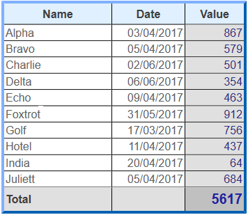
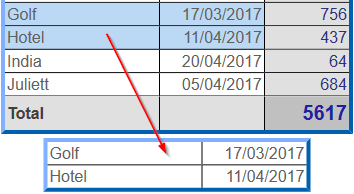
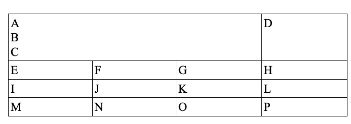
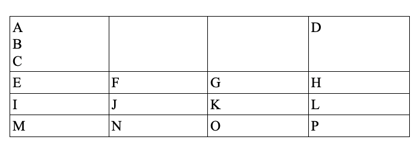
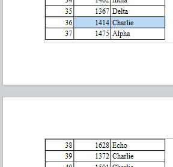
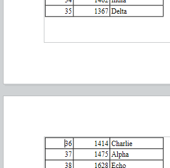
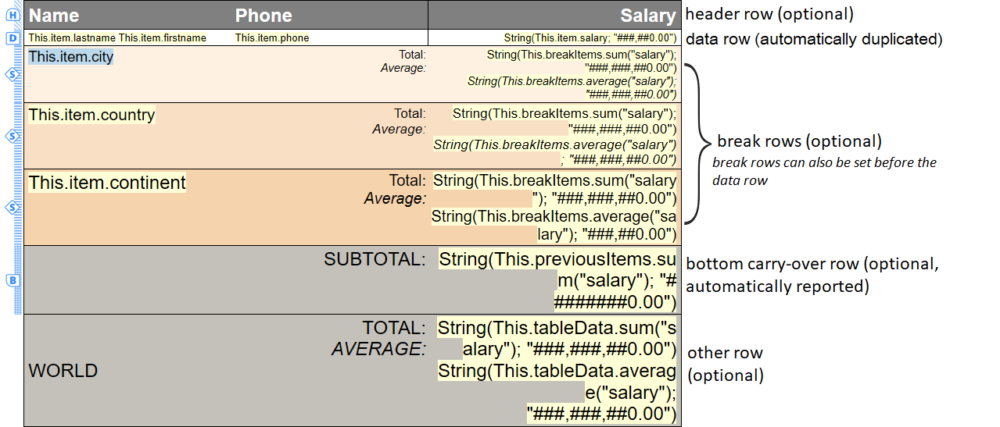
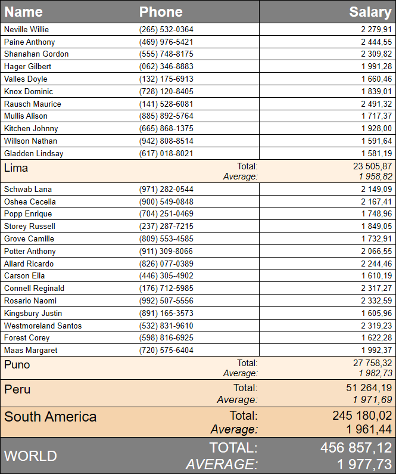
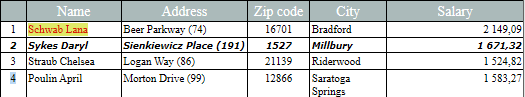
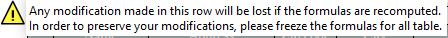

4D Write Pro documents can contain tables. 4D Write Pro tables are created and defined by programming, but their contents can be modified and handled by the user. Various 4D Write Pro table attributes are editable, including row height, alignment, margins, text style, color, or borders. 



**Note:** Since 4D Write Pro tables can be filled by programming, they can contain a large number of columns and rows. Keep in mind that very large tables will impact performances, especially if they are displayed on screen. See also [this blog post](https://blog.4d.com/4d-write-pro-tables-without-limit) for more information.

## Creating a table 

4D Write Pro tables are created by calling the [WP Insert table](../commands/wp-insert-table) command. You can then add rows by using the [WP Table append row](../commands/wp-table-append-row) command.

**Note:** A user can create a table by copying and pasting a range of cells:   


## Editing tables 

Cell contents can be added by programming using the [WP Table append row](../commands/wp-table-append-row) command.

Once a table is created, cell contents can also be edited at runtime by users. They can click into cells and select, edit, copy/paste, or delete text or pictures just like in regular paragraphs. They can navigate through cells using the **Tab** key (**Shift+Tab** to navigate in opposite direction).

Using the **Carriage return** key within a cell creates a new paragraph in the cell.

Note that cell width is fixed: when a user enters text or pastes a picture, the height of the row is automatically extended if necessary and text automatically wraps:


Users can also select columns, rows, or cells and apply available attributes regarding text style, colors, alignment, etc. using the built-in pop up menu or any customized interface. 4D Write Pro provides several commands to select any parts of a table:

* [WP Table get rows](../commands/wp-table-get-rows) to get a row range (or header row range)
* [WP Table get columns](../commands/wp-table-get-columns) to get a column range(\*)
* [WP Table get cells](../commands/wp-table-get-cells) to get a cell range

(\*) Columns do not have equivalent in html. In 4D Write Pro, a column range is actually a range of cells, which means that columns have the same priority as cells.

Once you have selected a range, you can apply any appropriate attribute using the [WP SET ATTRIBUTES](../commands/wp-set-attributes) command. Within cells, attributes are applied to paragraphs, characters, or pictures, depending on their contents. For example, you can set the height, font size, border, padding, etc. of tables or table cells (for more information, please refer to the *4D Write Pro Attributes* section).

When different attributes are applied to concurrent elements of a table, a priority order is applied for the rendering:

1. Table is rendered first
2. Rows are rendered (overriding table attributes)
3. Cells/Columns are rendered (overriding row attributes).

### Resizing columns 

The width of table columns can be modified by dragging the column separator to the left or right. The cursor changes to indicate that it can be moved horizontally and vertical line is shown in the ruler: 


Resizing columns generates an On After Edit form event.

To resize a column, click on the column separator and drag it to the left or right. Miniumum column size is 8pt. If the adjacent column on the right reaches the minimum size, all columns on the right will be moved. If the first column or an adjacent column to the left reaches the minimum size, no further resizing can occur in that direction.  
  


If you press the **Shift** key while resizing a column, the size of the adjacent column on the right will not be modified.  
  
  
  
**Note**: The Enterable property must be enabled for the 4D Write Pro document to allow column resizing.

### Merging and splitting cells 

With 4D Write Pro, you can split and merge cells in a table. Merging cells is combining two or more adjacent table cells located in the same row or column into a single cell. Splitting cells is taking already merged cells and separating them into multiple adjacent cells in the same row or column. Cells can be merged using the command [WP TABLE MERGE CELLS](../commands/wp-table-merge-cells) or the standard action **cell/merge,** and splitted using the command [WP TABLE SPLIT CELLS](../commands/wp-table-split-cells) or the standard action **cell/split**.


The table cells can be merged: 


**Example of cell merging using the language:**

1. Designate a range of cells to merge in your table, the cells have to be either adjacent horizontally or vertically, or both.
2. Call the command [WP TABLE MERGE CELLS](../commands/wp-table-merge-cells) on the selected range .

```4d
 $cells:=WP Table get cells($table;1;1;3;1)
 WP TABLE MERGE CELLS($cells)
  //or
 WP TABLE MERGE CELLS($table;1;1;3;1)
```

Existing data from the original cells is concatenated in the resulting merged cell. 

before   


after   


**Example of cell splitting using the language:**

1. Designate a range of cells to be splitted in your table, the selected range has to contain some already merged cells.
2. Call the command [WP TABLE SPLIT CELLS](../commands/wp-table-split-cells) on the selected range.

```4d
 $cells:=WP Table get cells($table;1;1;1;1)
 WP TABLE SPLIT CELLS($cells)
  //or
 WP TABLE SPLIT CELLS($table;1;1;1;1)
```

Data from the already merged cell is kept all in the first resulting cell (top left) after the split, the other resulting cells from the split remain empty.

before  


after   


**Important**: 

* Any cell belonging to a special row (data row, a break row or bottom carry-over row) cannot be vertically merged.
* Cells belonging to header rows can be vertically merged only if they all belong to other header rows (they cannot be merged with none header rows following the header rows).

**Designating merged cells:** 

A merged cell can be manipulated the same as a single cell (background color, border style, paragraph styles..) using the 4D Write Pro interface, the standard actions or the command [WP SET ATTRIBUTES](../commands/wp-set-attributes) .

All the existing table commands are applicable to ranges or elements containing merged cells. In a table that contains merged cells, the indexes of the cells remain as if no cell has been merged. 

Example : 

```4d
 $cell1:=WP Table get cells($table;1;1;1;1)
 $cell4:=WP Table get cells($table;4;1;1;1)
 WP SET ATTRIBUTES($cell1;wk background color;"yellow")
 WP SET ATTRIBUTES($cell4;wk background color;"pink")
```

before  


after   


in this example you can also pass $cell2 or $cell3 instead of $cell1 such as:

```4d
 $cell2:=WP Table get cells($table;2;1;1;1)
```

```4d
 $cell3:=WP Table get cells($table;3;1;1;1)
```

and it will have the same result as using $cell1 because $cell1, $cell2, and $cell3 all refer to the same cell after the merge, and any change applied to $cell1, $cell2, or $cell3 is actually applied to the new merged cell.

However if an x number of full rows or full columns are merged together, the following rows or columns’s indexes are decremented by x. 

## Table pagination 

When displayed in Page or Draft mode (or the context of a document printing), 4D Write Pro tables can split:

* automatically, if the table height is greater than the available page/column height,
* depending on page/column breaks set by programming or by the user.

Tables can split between rows, and rows can split too. The table pagination is dynamically updated if the orientation or column number are modified.

**Notes:** 

* You can disable automatic splits in tables by using the wk page break inside row / wk page break inside table attributes (see *4D Write Pro Attributes*) or the *table/avoidPageBreakInside* and *row/avoidPageBreakInside* standard actions (see *Using 4D Write Pro standard actions*).
* When a table row and a paragraph have different page break options, the options applied to the row have precedence. For example, when a paragraph allows page breaks, but its parent row does not, the row will not split.

Table pagination can also be controlled by programming or by the user. Available actions include:

* inserting a page break in a table:  
   * [WP INSERT BREAK](../commands/wp-insert-break) command  
   * *insertPageBreak* standard action  
   * **Insert page break** option of the default contextual menu
* inserting a column break in a table:  
   * [WP INSERT BREAK](../commands/wp-insert-break) command  
   * *insertColumnBreak* standard action  
   * **Insert column break** option of the default contextual menu

When a page break or a column break is inserted through a standard action or the contextual menu, it is added before the selected contents: the first row of the selection is moved at the beginning of the next page or column. For example:

 \===> 

**Notes:** 

* Only tables in the body part of a document can split. Breaks inserted in tables in headers and footers are ignored.
* Tables cannot be broken in different sections. Inserting a section break in a table will move the whole table to the new section.
* Breaks inside rows are not allowed when *Carry-over rows* are enabled.

## Repeated headers 

4D Write Pro allows you to define up to five header rows per table. Selected header rows will be repeated on every column or page when a column break or a page break occurs. 


Table headers are the first row(s) of the table. To define header rows, you can:

* use the *headerRowCount* standard action (see *Using 4D Write Pro standard actions*), or
* use the [WP SET ATTRIBUTES](../commands/wp-set-attributes) with wk header row count (on a table, see *Tables*), or wk header (on a row, see *Rows and columns*).

If you designate more than five rows as header (or if it results from an insertion of rows in an existing header), 4D Write Pro only uses the first five rows as header. If you remove row(s) defined in the header, the number of header rows is decreased. 

## Table datasource 

You can assign a formula object as a datasource for a table and access the resulting value(s) from within the table using *Expressions with This* (see below). The datasource formula is processed by 4D Write Pro when formulas are computed (e.g. when the document is opened, when the [WP COMPUTE FORMULAS](../commands/wp-compute-formulas) command is called, etc.). This feature takes advantage of data contexts (see [WP SET DATA CONTEXT](../commands/wp-set-data-context)). 

To assign a datasource to a table, use the [WP SET ATTRIBUTES](../commands/wp-set-attributes) command with the wk datasource and a *4D formula* object as value. For example, to fill a table with a row for every person living in France:

```4d
 $formula:=Formula(ds.people.query("country = :1";"France"))
 WP SET ATTRIBUTES($table;wk datasource;$formula)
```

* If the datasource formula object returns a (non empty) collection or entity selection, the table is automatically filled when the formula is computed: it contains at least as many rows as there are elements in the collection or entities in the entity selection. The first table row, called the data row, is used as a template row (excluding header row(s) and the possible break row(s)).
* In the data row (and break row(s)), you can insert expressions that use special keywords such as *This.item.lastname*. Expressions are replaced during processing by data from the collection or entity selection. The data row will be duplicated so that the number of item rows is equal to the number of items in the collection or entity selection after formulas are computed.
* If the datasource formula does not return a collection or a an entity selection, or if it returns an empty collection/entity selection, the table rows are not created automatically and all rows are treated as regular rows. You can define a placeholder row to be displayed in case of empty datasource.

To remove a datasource from a table, use the [WP RESET ATTRIBUTES](../commands/wp-reset-attributes) command. It will set the datasource attribute value to *null*:

```4d
 WP RESET ATTRIBUTES($table;wk datasource)
```

### Building a table with datasource 

A table design based upon a datasource can contain the following rows:

| **icon**                                                      | **Rows**              | **Number** | **Mandatory** | **Conditions**                                       | **Description**                                                                                                                                                                                                                                                                                                                                                                    |
| ------------------------------------------------------------- | --------------------- | ---------- | ------------- | ---------------------------------------------------- | ---------------------------------------------------------------------------------------------------------------------------------------------------------------------------------------------------------------------------------------------------------------------------------------------------------------------------------------------------------------------------------- |
|               | Header rows           | up to 5    | \-            | \-                                                   | Standard table header, see *Repeated headers*                                                                                                                                                                                                                                                                                                                                      |
| <br/> | Data row              | 1          | yes           | The datasource formula must return iterable elements | If the table does not have header rows and/or break row(s), the data row is the first row of the table - otherwise, it is the first row following either the header or the break row(s). It is usually filled with expressions using **This** (e.g. *This.item.value*) that give access to processed data when the document is in *Display values* mode and the row is duplicated. |
| <br/> | Sort break rows       | up to 5    | \-            | The datasource formula must return iterable elements | The row(s) appearing before or after the data row. See *Break rows*                                                                                                                                                                                                                                                                                                                |
| <br/> | Bottom carry-over row | 1          | \-            | The datasource formula must return iterable elements | The first row following the data row or the break row(s). See *Carry-over rows*                                                                                                                                                                                                                                                                                                    |
|               | Placeholder row       | 1          | \-            | The datasource must be defined                       | placeholder row is to be displayed instead of the data row and the break rows (if any) when the datasource is empty and the "Show placeholder row" attribute is set on the table via the standard action *emptyDatasource*or the constant *wk empty datasource*. The placeholder row comes immediately before the other rows.                                                      |
| |  Other rows                                                 | unlimited             | \-         | \-            | Standard rows (not duplicated)                       |                                                                                                                                                                                                                                                                                                                                                                                    |

Example (*Show references* mode):



When the formulas are computed, the data row is automatically duplicated as needed to match all entities or collection items returned by the datasource formula:



In any cases, the following statement returns the actual number of rows:

```4d
 WP GET ATTRIBUTES($table;wk row count;$vcount) //31 for the example above
```

### Carry-over rows 

Tables based on datasources support **bottom carry-over rows** that are automatically displayed at the bottom of each page/column when the table is split over more than one page/column. A carry-over row can display extra information based on previously displayed/printed items, thanks to the **This.previousItems** expression (see *Expressions with This*). This feature allows you, for example, to add subtotal rows. 


Carry-over rows are displayed: 

* when a datasource table does not fit in a single page (or column)
* at the bottom of the table
* on the first page (or first column) and all other ones except on the last one.

**Important:** Carry-over rows are only available on tables filled by a datasource formula returning a non-empty collection or entity selection and in display values mode. In all other cases or when the datasource formula has not been computed, a carry-over row is displayed as a regular row. 

To create carry-over rows:

1. In the table template, add a row just after the data row or the break row(s) and insert any necessary formulas inside, using for example **This.previousItems**.
2. Enable the carry-over row feature for your document. You can:  
\- use the *bottomCarryOverRow* standard action (see *Using 4D Write Pro standard actions*), or  
\- use the [WP SET ATTRIBUTES](../commands/wp-set-attributes) command with the wk bottom carry over row *Tables* attribute selector.

**Note:** Page breaks inside rows are not allowed when the carry-over row feature is enabled (see *Table pagination*). Corresponding options, if set, are ignored.

### Break rows 

Tables based on datasources support one or several **Sort Break Rows** that can be displayed either before or after the data row. S**ort Break Rows** help you to visually divide your already sorted datasource items in your table into different parts based on a computed formula value.


Each time the formula value changes, a new break row is inserted. Therefore, for tables to be rendered correctly, the entity selection (or collection) used as table datasource **must be sorted accordingly**. For example, if breaks by countries and cities are wanted, then the datasource must be sorted as follows: *ds.people.all().orderBy("country asc, city asc")*

The break value is defined through the *wk break formula* attribute. Value is usually a formula based on an item property like "This.item.name'', otherwise the computed value may never change which makes the break formula useless. The *wk break formula* attribute is ignored if the table has no datasource or if the row is a header. A break row must be adjacent to the data row (either before or after), or to another break row, otherwise it is ignored.

```4d
 WP SET ATTRIBUTES($row_2;wk break formula;Formula(This.item.country))
```

Thanks to the **This.breakItems** expression you can use this feature, for example, to display the total average of the data rows within one break row. breakItems is an evaluated subset of the table datasource, either an entity selection if the table datasource is an entity selection, or a collection if the datasource is a collection. So, inside a break row, you can type: *This.breakItems.sum("salary")*

To create break rows:

1. Order the datasource with the levels corresponding to the breaks you want to display, for example, *ds.People.all().orderBy("continent asc, country asc, city asc")*
2. Draw the break row(s) in the table template. If the breaks are located after the data row, they must match the **opposite sort order** as the datasource, and if they are located before the data row, they must match **the same sort order** as the datasource.
3. Set the attribute *wk break formula* to the selected row(s):

```4d
 $row:=WP Table get rows($table;2;1) //select the second row as break
 WP SET ATTRIBUTES($row_2;wk break formula;Formula(This.item.country))
```

### Expressions with This 

When used in a formula within the table, the **This** keyword gives access to different data according to the context:

| **Context**                                                                                         | **Expression**                           | **Type**                                                                         | **Returns**                                                                                                                                                                                                                                                                                                                                                                 |
| --------------------------------------------------------------------------------------------------- | ---------------------------------------- | -------------------------------------------------------------------------------- | --------------------------------------------------------------------------------------------------------------------------------------------------------------------------------------------------------------------------------------------------------------------------------------------------------------------------------------------------------------------------- |
| Anywhere                                                                                            | This.table                               | Object                                                                           | Current table                                                                                                                                                                                                                                                                                                                                                               |
| |  This.row                                                                                         | Object                                   | Current table row element                                                        |                                                                                                                                                                                                                                                                                                                                                                             |
| |  This.rowIndex                                                                                    | Number                                   | Index of the current row, starting from 1                                        |                                                                                                                                                                                                                                                                                                                                                                             |
| When a datasource has been defined for the table                                                    | This.table.dataSource                    | Object (formula)                                                                 | Datasource as a formula                                                                                                                                                                                                                                                                                                                                                     |
| |  This.tableData                                                                                   | Collection or Entity selection (usually) | Evaluated table.dataSource                                                       |                                                                                                                                                                                                                                                                                                                                                                             |
| In each data row when a table datasource returns a collection or an entity selection                | This.item.xxx                            | Any                                                                              | Mapped to each item of the table datasource collection or entity selection, for example **This.item.firstName** if the associated entity has the *firstName* attribute                                                                                                                                                                                                      |
| |  This.itemIndex                                                                                   | Number                                   | Index of the current item in the collection or entity selection, starting from 0 |                                                                                                                                                                                                                                                                                                                                                                             |
| In any row (except header rows) when a table datasource returns a collection or an entity selection | This.previousItems                       | Collection or Entity selection                                                   | Items displayed on the pages before the bottom carry over row (if any) or before the row of the expression, including the page where is displayed the row containing the expression. <br/>This expression returns the same type of value as the **This.tableData** expression.                                                                                      |
| In a break row                                                                                      | This.breakItems                          | Collection or Entity selection                                                   | Items of the collection or entity selection displayed in the rows between: the current break row and the previous break row of the same level (or the start of the table) if the break row(s) are displayed after the data row. the current break and the next break row of the same level (or the end of the table) if the break row(s) are displayed before the data row. |

In any other contexts, these expressions will return *undefined*.

**Note:** For more information about formula insertion, see [WP INSERT FORMULA](../commands/wp-insert-formula).

### Working with a table datasource 

When a table is filled from a datasource, rows are automatically created when references are computed. You can insert or delete rows, edit cell contents, change the style, etc.:


However, keep in mind that if the table datasource is recomputed, any modifications made on computed rows (except on the first row) are lost. On the other hand, since the first row is the data row, any modification made to this row will be propagated to all rows if the table datasource is recomputed. Same thing goes for break rows, any modifications made on computed break rows are lost, except for the template break rows (which can be located either at the end or the beginning of the table). 

For example:



After recomputing expressions:


When the cursor is inserted in a cell of a table filled with a datasource, a warning icon is displayed on the left side along with a tip that displays information:

 

When formulas are displayed as references or when you save the document, only the first row is displayed/saved as template (if formulas are not frozen).

When the formulas are frozen, the table becomes a standard table and the table datasource is reset. 

**Note:** *freezeExpressions* standard action does not recompute formulas.