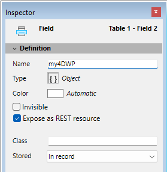
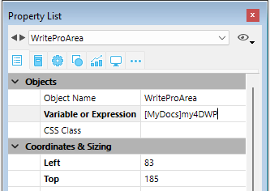

## .4wp document format 

You can save and re-open 4D Write Pro documents to and from disk without any loss using the native **.4wp** format.

The **.4wp** format consists of a zip folder whose name is the document title and whose contents are HTML text and images:

* HTML text combines regular HTML with 4D expressions (which are not computed) as well as 4D-specific tags,
* images are stored in a folder with the same name as the document title, next to the HTML file.

Since .4wp documents are based on HTML, they can be imported or opened in any external application supporting HTML.

The 4D Write Pro internal document format is a proprietary HTML extension, compatible with HTML5/XHTML5, but which supports its own subset of HTML/CSS attributes and tags. As a result, only HTML documents exported by 4D Write Pro can be opened by 4D Write Pro without any risk of data loss. Importing HTML documents that were created externally could produce errors.

For more information, you can [**download the list of 4D Write pro attributes with associated definition as CSS style or XHTML tag**](https://download.4d.com/Documents/Products%5FDocumentation/LastVersions/Line%5F19/4DWP-attributes-and-xhtml.pdf) in the 4D Write Pro XHTML.

### Backward compatibility 

You can always reopen a .4wp document with a previous version of 4D Write Pro. If it contains attributes that were added in more recent versions, these attributes are just ignored. However, if you save the document, the attributes are removed from the document and will be lost. 


## Storing 4D Write Pro documents in 4D Object fields

You can store your 4D Write Pro documents automatically in the 4D data file. If you created a 4D Write Pro area on a form and created an Object field to store the area’s contents, any text entered in the area is saved automatically with each record when the record is validated. You can then use the [QUERY BY ATTRIBUTE](../../commands/query-by-attribute) command in order to select records based on the value of their internal attributes. You can also add and query your own attributes with 4D Write Pro areas. 

This section describes the following features:

* Binding a 4D Object field to a 4D Write Pro area in a form
* Setting, getting, and querying custom attributes of stored 4D Write Pro documents using the [OB SET](../../commands/ob-set), [OB Get](../../commands/ob-get) standard object commands, and [QUERY BY ATTRIBUTE](../../commands/query-by-attribute).

### Assigning a 4D Object field to a 4D Write Pro area 

To bind a 4D Write Pro area with a 4D Object field, you just need to reference the field in the Variable Name property of the area. 

### Creating the Object field in the Structure 

In your database structure, any 4D Object field can be used to store 4D Write Pro documents. As with any Object field, you just have to define its standard properties, according to your needs:

* the field name,
* its attributes, such as "Expose as REST resource," as well as its index,
* its storage option.



### Assigning the Object field to the 4D Write Pro area 

Once you have defined an Object field to store your 4D Write Pro document, you just need to reference it in the form containing the area. You can use any table or a project form.   
In the Form editor, enter the field name using the standard "\[Table\]Field" notation in the **Variable or Expression** area of the Property list for the 4D Write Pro area:



Your 4D Write Pro area is then associated with the field, ensuring that its contents will be saved automatically with each record. Note that if you do not use the 4D standard action buttons, you will have to save the area manually using 4D commands. 

### Using custom attributes 

When 4D Write Pro areas are stored in Object fields, you can save and read any custom attributes with the 4D Write Pro document, such as, for example, the writer's name, the document category, or any additional information you may find useful. You can then query your custom attributes to select records matching the criteria.

Custom attributes will be exported with the [WP EXPORT DOCUMENT](../commands/wp-export-document) or [WP EXPORT VARIABLE](../commands/wp-export-variable) commands. They will be exported as well when converting a 4D Write Pro Object field to JSON using the [JSON Stringify](../../commands/json-stringify) command (along with the 4D Write Pro main document attributes).

To set or get custom attributes, you just need to use object notation or the [OB Get](../../commands/ob-get) and [OB SET](../../commands/ob-set) commands.

For example, in the form method, you can write:

```4d
 If(Form event code=On Validate)
    [MyDocuments]My4DWP["myatt_Last edition by"]:=Current user
    [MyDocuments]My4DWP.myatt_Category:="Memo"
    [MyDocuments]My4DWP:=[MyDocuments]My4DWP //to record the edit
 End if
```

or:

```4d
 If(Form event code=On Validate)
    OB SET([MyDocuments]My4DWP;"myatt_Last edition by";Current user)
    OB SET([MyDocuments]My4DWP;"myatt_Category";"Memo")
 End if
```

You can also read custom attributes of the documents:

```4d
 vAttrib:=[MyDocuments]My4DWP.myatt_Category
```

or:

```4d
 vAttrib:=OB Get([MyDocuments]My4DWP;"myatt_Category")
```

If you have saved custom 4D Write Pro attributes in your data file, you can query these attributes to create a selection of records containing the appropriate attribute value. In the following example, you query the table containing the Object field to select records:

```4d
 QUERY BY ATTRIBUTE([MyDocuments];[MyDocuments]My4DWP;"myatt_Category";=;"Memo")
  //selects all records in MyDocuments whose "myatt_Category" custom attribute has the value "Memo"
  //in the My4DWP Object field (bound to a 4D Write Pro area)
```

:::warning About custom attribute names

Since custom attributes share the same naming space as 4D Write Pro internal attributes, we strongly recommend that you use prefixes when defining your own attribute names in order to avoid any conflicts between internal and custom attributes. Non-prefixed names are reserved for 4D Write Pro internal attributes. You can use any custom prefix (for instance, we used "myatt\_" as a prefix in the above example).

:::

**Note:** Custom attributes cannot be handled by the [WP SET ATTRIBUTES](../commands/wp-set-attributes), [WP GET ATTRIBUTES](../commands/wp-get-attributes), and [WP RESET ATTRIBUTES](../commands/wp-reset-attributes) commands (they only support 4D Write Pro internal attributes). 


## Opening and exporting documents

In 4D applications, 4D Write Pro documents are created, imported, and exported by means of specific commands found in the **4D Write Pro** theme ([WP EXPORT DOCUMENT](../commands/wp-export-document), [WP EXPORT VARIABLE](../commands/wp-export-variable), [WP Import document](../commands/wp-import-document), [WP New](../commands/wp-new)).

You can also [associate a 4D Write Pro area with an Object field](../user-legacy/defining-a-4d-write-pro-area.md#storing-4d-write-pro-documents-in-4d-object-fields) of the database. This way, each 4D Write Pro document is automatically saved with the record and stored in the database's data. 


## Printing 4D Write Pro documents

4D Write Pro documents can be printed in two ways:

* As parts of 4D forms
* As independent documents

### Printing documents in 4D forms 

You can print 4D Write Pro embedded objects as part of any kind of [4D form](../../FormEditor/forms.md) (project, table, input, or output) using standard 4D printing commands such as [PRINT SELECTION](../../commands/print-selection) or [PRINT RECORD](../../commands/print-record). 

The standard *Print Variable Frame* option is also supported(\*) for 4D Write Pro areas, allowing you to manage size during printing. When this option is checked, the margins (outside and inside) and top border are only applied to the first page, and the margins (outside and inside) and bottom border are only applied to the last page. Pagination properties of the document are ignored: widow and orphan control is disabled and page breaks are not applied (these properties are only used for page rendering on screen, or for standalone printing of the document). When the **Print Variable Frame** option is selected, only objects located above the form area are printed. For more information about this option, refer to "*Print Variable Frame*" in the Design Reference manual.

(\*) The [Print object](../../commands/print-object) and [Print form](../../commands/print-form) commands are not compatible with this option. 

#### View mode for printing 

Regardless of the **View mode** set for the 4D Write Pro area (see *Configuring View properties*), it is always printed as in the **Embedded** mode when you use a 4D printing command such as [Print form](../../commands/print-form). In this case, the following Appearance settings are not taken into account for the 4D Write Pro form objects: Page view mode (always "Embedded"), Show headers, Show footers, Show page frame (always "No"), Show hidden characters (always "No"). 

#### Example 

The following example shows the effect of the **Print Variable Frame** option on a 4D Write Pro area embedded in the default output form. The following code is executed:

```4d
 ALL RECORDS([Movies])
 ORDER BY([Movies]Title)
 PRINT SELECTION([Movies])
```

* Here is the result with the Print Variable Frame option **unchecked** (off):  

* Here is the result with the Print Variable Frame option **checked** (on):  
  
  
*(Sample text source: Wikipedia)*

### Printing independent documents 

Starting with 4D v15 R5, 4D Write Pro includes printing features allowing you to print independent 4D Write Pro documents as well as to control standard printing options such as the format, orientation, or page numbers.

#### 4D Write Pro commands 

Basically, two commands handle the 4D Write Pro printing features: **WP PRINT** and **WP USE PAGE SETUP**.

* [WP PRINT](../commands/wp-print) launches a print job for a 4D Write Pro document or adds the document to a current print job.
* [WP USE PAGE SETUP](../commands/wp-use-page-setup) modifies the current printer page settings based on the 4D Write Pro document attributes for page size and orientation.

**Note:** On machines with Windows 7 or Windows Server 2008 R2, make sure that the *Platform Update for Windows 7* has been installed so that the printing features are supported.

#### Regular 4D commands 

The following 4D commands support 4D Write Pro printing features:

* [SET PRINT OPTION](../../commands/set-print-option) and [GET PRINT OPTION](../../commands/get-print-option): All options are supported for 4D Write Pro documents printed by [WP PRINT](../commands/wp-print). For Paper option and Orientation option, you may find it more efficient to call [WP USE PAGE SETUP](../commands/wp-use-page-setup) in order to easily synchronize these attributes with the 4D Write Pro document settings. The Page range option (15) allows you to specify the page range to print.
* [PRINT SETTINGS](../../commands/print-settings): Defines print settings for the current printer; if [WP PRINT](../commands/wp-print) is called afterwards, it takes any print settings modified by means of the Print Settings dialog boxes into account (except for margins, which are always based on the 4D Write Pro document).
* [OPEN PRINTING JOB](../../commands/open-printing-job) and [CLOSE PRINTING JOB](../../commands/close-printing-job): [WP PRINT](../commands/wp-print) can be called between these commands in order to insert one or more 4D Write Pro documents into a single print job.