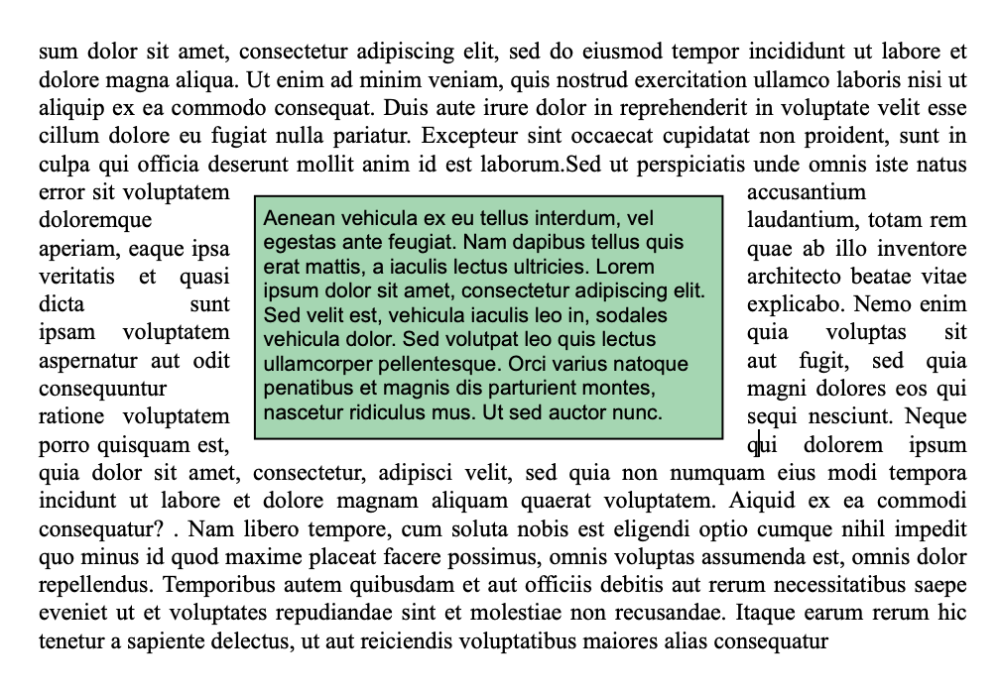

Text boxes are areas that are anchored to a page or a section and can be filled with text, inline pictures, or tables. Text boxes can be positioned anywhere on the page and meet specific needs, for example to insert a company’s name or logo or an address area.

**Note:** A text box cannot contain headers, footers, columns, anchored images, or other text boxes. 

Text boxes are added with an absolute position, in front of/behind text, as well as anchored to a page or specific parts of a document in Page mode: header, footer, a section, all sections, or a subsection. Text boxes can also be used in embedded mode (anchored to the layer box). 

Adding a text box to a 4D Write Pro document can be accomplished in the following ways:

* using the [`WP New text box`](../commands-legacy/wp-new-text-box.md) command,
* using the *insertTextBox* [standard action](./using-4d-write-pro-standard-actions.md)

To select a text box, the user has to click on it (**Ctrl/Cmd+click** if the text box is on the background layer). Once selected, the text box can be moved or resized using the mouse or arrow keys. 

To remove a selected text box, you can hit the **Delete** or **Backspace** key, use the **textBox/remove** standard action, or execute the [`WP DELETE TEXT BOX`](../commands-legacy/wp-delete-text-box.md) command. 

Text box attributes are handled with the [WP SET ATTRIBUTES](../commands/wp-set-attributes) command or [standard actions](./using-4d-write-pro-standard-actions.md). The following attributes and actions are available:

| **Property (constant)** | **Standard action**       | **Comments**                                                                |
| ----------------------- | ------------------------- | --------------------------------------------------------------------------- |
| wk width                | textBox/width             | If set to "auto", width converted to 8cm as text box width cannot be "auto" |
| wk height               | textBox/height            | If set to "auto", height is adjusted to fit the contents                    |
| wk padding              | textBox/padding           |                                                                             |
| wk border \[...\]       | textBox/border\[...\]     |                                                                             |
| wk background \[...\]   | textBox/background\[...\] |                                                                             |
| wk vertical align       | textBox/verticalAlign     |                                                                             |
| wk id                   | \-                        | cannot be empty for a text box                                              |
| wk anchor \[...\]       | textBox/anchor\[...\]     |                                                                             |
| wk owner                | \-                        | read-only                                                                   |
| wk protected            | \-                        |                                                                             |
| wk style sheet          | \-                        | read-only and always "" (no style sheet)                                    |

Text boxes support automatic text wrapping when anchored to a document with options like on the left, right, largest side, above and below, or all around provided through the property wk anchor layout or the standard action **anchorLayout**. Check this [blog post](https://blog.4d.com/4d-write-pro-more-display-options-for-anchored-pictures-and-text-boxes/) for more details.

Text boxes with text wrapping anchored to the body of the page do not affect the header or the footer (the text box is displayed in front of the header or the footer); on the contrary, text boxes anchored to the header and footer affect the body of the page if they overlap it.

**Note**: If you want to anchor a text box with text wrapping to the header or footer, you must also set the vertical alignment of the text box to the top.

Text boxes are not displayed if:

* the view mode is Draft;
* they are centered or anchored to sections and the **Show HTML WYSIWYG** option is checked;
* the "visible background" option is not enabled.

