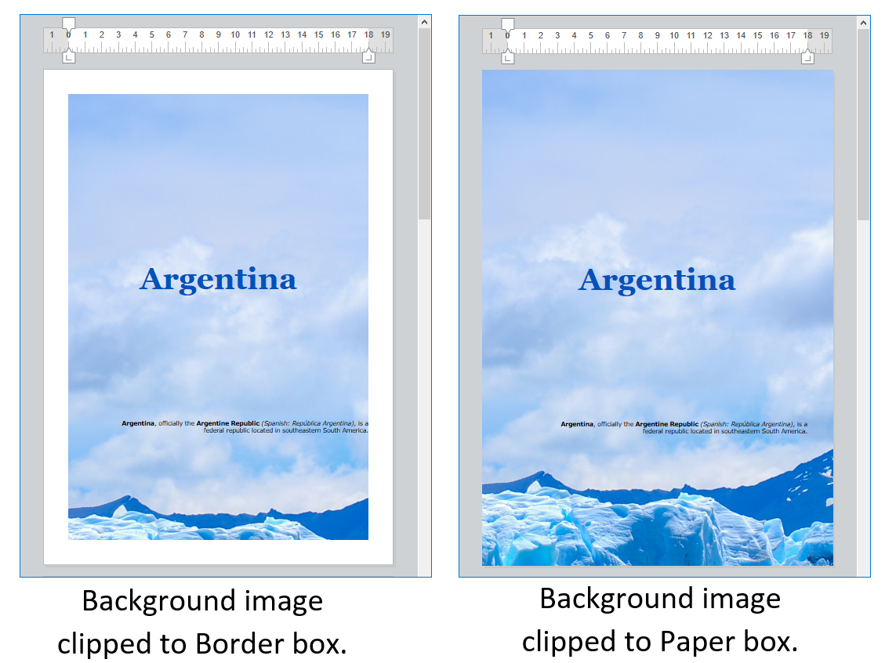
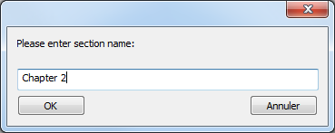
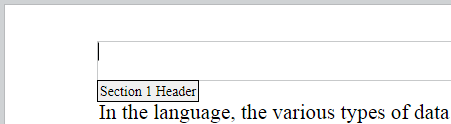
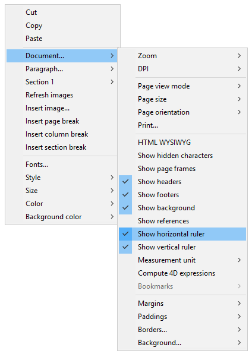
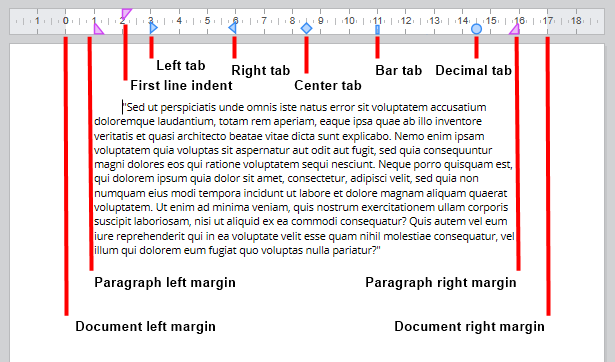
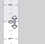
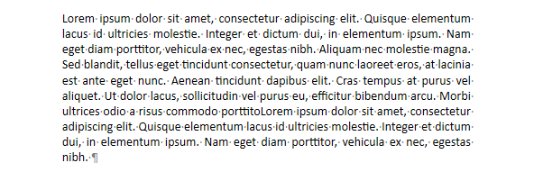
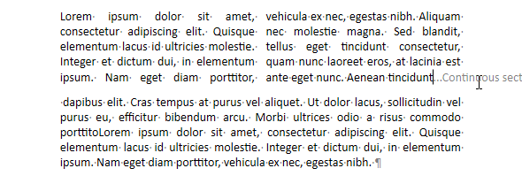

## Basics 

When the document is in [**Page** view mode](./defining-a-4d-write-pro-area.md#selecting-the-view-mode), the following document properties are available for the user:

* Page outlines to represent printing limits
* Page width and Page height (default: 21x29.7 cm)
* Page orientation (default: Portrait)
* Page margin (default: 2.5 cm)

You can also use additional commands such as **Document.../Page size** or **Document.../Page orientation**.

**Note:** When a document is in **Embedded** or **Draft** view mode, page properties can be set, even if their effect is not visible. In **Draft** view mode, the following paragraph property effects are visible:

* Page height limitation (lines drawn)
* Columns
* Avoid page break inside property
* Widow and orphan control.


## Paragraph breaks 

When displayed in Page or Draft mode (or in the context of a document printing), 4D Write Pro paragraphs can break:

* automatically, if the paragraph height is greater than the available page height,
* depending on paragraph breaks set by programming or by the user.

Breaks can be added by programming or by the user. Available actions include:

* [WP INSERT BREAK](../commands/wp-insert-break) command
* *insertPageBreak* standard action
* **Insert page break** option of the default contextual menu

### Controlling automatic breaks

You can control automatic breaks in paragraphs using the following features: 

* **Widow and orphan control**: When this option is set for a paragraph, 4D Write Pro does not allow widows (last line of a paragraph isolated at the top of a page) or orphans (first line of a paragraph isolated at the bottom of a page) in the document. In the first case, the previous line of the paragraph is added to the top of the page so that two lines are displayed there. In the second case, the single first line is moved onto the next page.
* **Avoid page break inside**: When this option is set for a paragraph, 4D Write Pro prevents this paragraph from being broken into parts on two or more pages.
* **Keep with next:** When this option is set for a paragraph, that paragraph cannot be separated from the one that follows it by an automatic break. See `wk keep with next` and the corresponding *keepWithNext* [standard action](./user-legacy/standard-actions.md).

These options can be set using the context menu, or [attributes](../commands-legacy/4d-write-pro-attributes.md) (`wk avoid widows and orphans`, `wk page break inside paragraph`, or *widowAndOrphanControlEnabled* and *avoidPageBreakInside* [standard actions](./standard-actions). 


<!-- INCLUDE lists-WP.Desc -->

## Background 

The background of 4D Write Pro documents and document elements (tables, paragraphs, sections, headers/footers, etc.) can be set with the following effects:

* colors
* borders
* images
* origin, horizontal and vertical positioning
* painting area
* repeat

These [attributes](../commands-legacy/4d-write-pro-attributes.md) can be defined programmatically for either individual elements on a page and/or entire document backgrounds with the [WP SET ATTRIBUTES](../commands/wp-set-attributes) command or by [standard actions](./standard-actions). 

Users can modify background attributes via the contextual menu as shown below:

 

For an example of adding a full-sized image as a background, see the *How Do I* (HDI) demo [here](http://download.4d.com/Demos/4D%5Fv16%5FR5/HDI%5F4DWP%5FBackImagePaperBox.zip).

## Headers, footers, and sections 

4D Write Pro documents support headers and footers. These headers and footers are related to sections.

A section is a part of a document which is defined by a page range and can have its own paging and common attributes. A document can contain any number of sections (from just one, up to the total number of pages). Each page can only belong to one section, except pages with continuous section breaks (see below). 

4D Write Pro documents can contain:

- one or more sections (one section by default)
- for each section, up to three subsections:
   - first page subsection
   - left page(s) subsection
   - right page(s) subsection

You can define a set of headers and footers for each section.

### Defining a section 

A section is a subset of continuous pages in a 4D Write Pro document. A document can contain one or more sections. A section can contain any number of pages, from a single page to the total number of pages in the document. A section page can contain a single column or up to 20 column(s). 

By default, a document contains a single section, named **Section 1**. The 4D Write Pro contextual menu displays this section number wherever you click in the document:  
  
  

You create a new section by adding a section break in the text flow:  
  
  

When a section break has been added, the contextual menu displays an incremented number for each section. You can, however, rename any section:  
  
  

The name you entered is then used as the section name everywhere in the document:  
  
   

Note that if you have defined a different first page or different left/right pages for a section, the page type is also displayed in the menu (see below).

### Inserting a continuous section break 

A continuous section break creates a new section on the same page. This allows you to create pages with sections that have different numbers of columns (see *Creating a page with multiple-column and single column sections*).

Sections created with continuous section breaks are counted in the document (they have section numbers), but unlike sections created with regular section breaks, their headers, footers, anchored images, etc. are only taken into account when a physical page break has occurred.

**Note:** If you change the page orientation for the new section after you insert a continuous section break, it turns into a regular section break.

### Section attributes 

Sections inherit attributes from the document. However, common document attributes, including headers and footers, can be modified separately for each section. The contextual pop-up menu displays the properties and attributes available at the section level:  
  
  

* **Page orientation**: allows you to set a specific page orientation (Portrait or Landscape) per section.
* **Different first page**: allows you to set different attributes for the first page of the section; this feature can be used to create flyleaves, for example. When this attribute is checked, the first page of the section is handled as a subsection itself and can have its own attributes.  
    

* **Different left and right pages**: allows you to set different attributes for left and right pages of the section. When this attribute is checked, left and right pages of the section are handled as subsections and can have their own attributes.  
    

* **Columns** commands: allow to define the number and properties of columns for the section. These options are detailed below.
* **Header** and **Footer** commands: these options allow you to define separate headers and footers. These options are detailed below.
* **Margins** / **Paddings** / **Borders** / **Background**: these attributes can be defined separately for each section. For more information on these attributes, please refer the [4D Write Pro Attributes](../4d-write-pro-attributes) article.

### Inserting headers and footers 

Each section can have specific header and footer. Headers and footers are displayed only when the document page view mode is **Page**. 

 Within a section, you can define up to three different headers and footers, depending on the enabled options:

* first page,
* left page(s),
* right page(s).

To create a header or a footer: 

1. Make sure the document is in **Page** view mode.
2. Double-click in the header or footer area of the desired section and page to switch to editing mode.  
   * The header area is at the top of the page:  
     
   * The footer area is at the bottom of the page:  
   

You can then enter any static contents, which will be repeated automatically on each page of the section (except for the first page, if enabled).


You can insert dynamic contents such as the page number or the page count using the [ST INSERT EXPRESSION](../../commands/st-insert-expression) command (for more information, please refer to the *Inserting document and page expressions* paragraph). 

**Note:** You can also handle footers and headers by programming using specific commands such as [WP Get header](../commands/wp-get-header) and [WP Get footer](../commands/wp-get-footer).

Once a header or a footer has been defined for a section, you can configure its common attributes using the contextual menu:


For more information on **Margins**, **Paddings**, **Borders**, and **Background** attributes, please refer the [4D Write Pro Attributes](../4d-write-pro-attributes) section. 

You can remove the entire definition of a header or a footer (contents and attributes) by selecting the **Remove header** or **Remove footer** command in the contextual menu. 

### Compatibility 

4D Write Pro handles headers and footers of documents converted from the 4D Write plug-in with a fixed height.

The following expressions and properties are also supported and converted from the 4D Write plug-in headers and footers:

* page number and page count variables
* distinct first page
* distinct left/right pages


## Rulers 

Horizontal rulers are available in every viewing mode of 4D Write Pro and have the following characteristics:

* Graduations in cm, mm, inches or pt according to current layout unit defined in the 4D Write Pro document. You can change measurement units using the context menu or by modifying the wk layout unit attribute.
* First line indent symbol
* Left paragraph margin symbol
* Right paragraph margin symbol
* Tabs displayed along lower edge of ruler
* Visible color contrast representing left and right page margins

Vertical rulers are available in Page mode only and have the following characteristics:

* Graduations in cm, mm, inches or pt according to current layout unit defined in the 4D Write Pro document. You can change measurement units using the context menu or by modifying the wk layout unit attribute.
* Visible color contrast representing top and bottom page margins

You can change the display status of the rulers via standard actions (see *Using 4D Write Pro standard actions*) or by checking or unchecking the **Show horizontal ruler** or **Show vertical ruler** item in the context menu of the 4D Write Pro area:  
  
  

**Note:** A specific 4D Write Pro area property allows defining the default display for the rulers (see *Configuring View properties* section).

### Adjusting text margins and indents 

#### Horizontal ruler 

You can modify the left and right margins, indents and tab positions by clicking and dragging the corresponding symbols on the horizontal ruler:  
  
  

When you hover the mouse over one of these symbols, the cursor changes to indicate that it can be moved, and a vertical guide line appears while you drag it:  
  
  

When multiple paragraphs are selected, dragging margin or indent symbols applies these margins or indents to all selected paragraphs. Holding down the **Shift** key while dragging these symbols maintains existing intervals between indents or margins in the selected paragraphs.

#### Vertical ruler 

You can modify the top and bottom margins with the vertical ruler. When you hover the mouse over the margin limit, the cursor changes to indicate that it can be moved, and a horizontal guide line appears while you drag it:  
  
   

This action can be used to modify the spacing between the top and bottom of the page and the body and the header and footer of a document. 

### Managing tabs 

You can use the horizontal ruler's context menu to create, modify or delete tabs:  
  
  

To create a tab, just right-click directly on the horizontal ruler and choose its type from the context menu; a single left click automatically creates a default left tab. You can also right-click on existing tabs to modify their type using the context menu.

**Remove tab** is only available when you right-click directly on an existing tab; you can also remove tabs by dragging them outside the horizontal ruler area.

:::note Notes 

* Tabs can also be defined programmatically with the [WP SET ATTRIBUTES](../commands/wp-set-attributes), [WP GET ATTRIBUTES](../commands/wp-get-attributes), and [WP RESET ATTRIBUTES](../commands/wp-reset-attributes) commands with the `wk tab default` and `wk tabs` selectors.
* For decimal tabs, 4D Write Pro considers the first dot or comma character from the right as the decimal separator; this default setting can be modified with the `wk tab decimal separator` selector.

:::

#### Define leading characters 

The characters preceeding tabs (leading characters) can be defined by selecting from five predefined characters or by designating a specific character to use. The predefined characters are:

* None (no characters are displayed - *default*)
* .... (dots)
* \--- (dashes)
* \_\_ (underscores)
* \*\*\* (asterisks)

Leading characters always appear before the tab and follows the text direction (left to right or right to left). They can be defined programmatically with the [WP SET ATTRIBUTES](../commands/wp-set-attributes), [WP GET ATTRIBUTES](../commands/wp-get-attributes), and [WP RESET ATTRIBUTES](../commands/wp-reset-attributes) commands using `wk leading` with the `wk tab default` or `wk tabs` selectors, or via the horizontal ruler's contextual menu (as shown below).


When **Other...** is selected, a dialog is displayed where a custom leading character can be defined.

### Multi-column rulers 

When two or more columns are defined for the document or the section, the horizontal ruler displays a specific area for each column:


**Note:** Multi-column feature is not available in **Embedded** view mode.

### On After Edit event 

An [`On After Edit`](../../Events/onAfterEdit.md) form event is triggered for a 4D Write Pro area form object whenever any of the tab or margin controls are moved, added or deleted, whether by dragging them or using the context menu.

## Columns 

4D Write Pro allows you to manage columns in your documents. Columns are chained from the left-most column to the right-most column. In other words, when entering text, the text flow will start filling the left column and continue with the column directly to the right until it reaches the end of the page. Once the end of the page is reached, the text flow cycles through the next page. In order to be able to balance the page settings, 4D Write Pro allows you to insert column breaks.


Columns can be defined at the document level (they are displayed in the whole document) and/or at the section level (each section can have its own column configuration). 

**Note:** Columns are supported in **Page view** mode and **Draft view** mode only (they are not displayed in **Embedded** view mode), and they are exported to .docx using [WP EXPORT DOCUMENT](../commands/wp-export-document) but not to HTML and MIME HTML formats (wk web page complete format).

Columns can be set using:

* the **Columns** submenu of the 4D Write Pro area context menu,
* 4D Write Pro [attributes](../commands-legacy/4d-write-pro-attributes.md),
* 4D Write Pro [standard actions](./standard-actions).
(./user-legacy/standard-actions.md)
You can set or get the following properties and actions for columns:

| **Property**      | **Description**  | **Document attributes**| **Standard actions**  |
| ----------- | -------- | ------- | --------------- |
| Number of columns    | You can define up to 20 columns for the document/section   | wk column count  | *columnCount*                                           |
| Column spacing   | Space between columns in pts, inches, or cm. Note that all columns will have the same size. Each column width is automatically calculated by 4D Write Pro according to the number of columns, the page width, and the spacing  | wk column spacing   | *columnSpacing*  |
| Column width    | (read-only attribute) Current width for each column, i.e. computed width  | wk column width  | \-    |
| Column rule style, color, and width | You can add a vertical separator (a decorative line) between columns. These options let you design the separator style, color and width. To remove the vertical separator, select **None** as a style. | wk column rule style, wk column rule color, wk column rule width | *columnRuleStyle*, *columnRuleColor*, *columnRuleWidth* |
| Insert break  | Insert a column break  | wk column break, see also [WP INSERT BREAK](../commands/wp-insert-break) | *insertColumnBreak*     |
| Columns menu     | Create a Columns sub-menu  | \- | *columns*   |

### Creating a page with multiple-column and single column sections 

*Inserting a continuous section break* in your document allows you to have multiple-column sections and single column sections on the same page. 

For example:



You can insert a continuous section break and change the number of columns to two for the first section:




## Bookmarks

4D Write Pro allows you to create and work with dynamic references to parts of your documents, called **bookmarks**. A bookmark is a named reference attached to a specific [range](./ranges.md) in the body of a 4D Write Pro document.

Bookmarks are dynamic, which means that if the user moves, adds or removes text belonging to the bookmark, the associated range will be updated automatically and the bookmark will continue to reference the same content within the document. For example:

- You create a bookmark named "MyBM" that references the "Hello world" text on page 20 of your document.
- Then you insert 50 pages at the beginning of the document.
- You will still be able to access the same "Hello world" text automatically, now on page 70 of the document, by means of the "MyBM" bookmark.

A document can contain an unlimited number of bookmarks. Several bookmarks can reference the same range, and bookmark ranges can be interleaved. However, each bookmark name must be unique in the document. Bookmarks are not imported when using the [WP INSERT DOCUMENT BODY](../commands/wp-insert-document-body) command (bookmarks in the destination document cannot be overwritten).

Once created, a bookmark is stored within the document. It is saved with the document, and can be handled by several different commands. It can also be used to reference parts of a template document. These parts can then be assembled automatically with data from the database to produce dynamic output documents such as invoices or catalogs.

Several commands allow you to create, remove, and use bookmarks:

[WP NEW BOOKMARK](../commands-legacy/wp-new-bookmark.md) to create a new bookmark from a range,
[WP GET BOOKMARKS](../commands-legacy/wp-get-bookmarks.md) to get all bookmarks defined in a document,
[WP Bookmark range](../commands-legacy/wp-bookmark-range.md) to retrieve a range from an existing bookmark,
[WP DELETE BOOKMARK](../commands-legacy/wp-delete-bookmark.md) to delete a bookmark.

## Links

4D Write Pro allows you to assign hyperlinks to any target object of your document, including ranges (text, picture, etc.), elements (table, body, footer, etc.), or the whole document. For example, you can set a URL hyperlink to a picture range; if the 4D Write Pro document is exported to HTML, users can click the picture to open a page at a specified address.

Hyperlinks can also be activated from within 4D Write Pro documents using the **Ctrl+click** (Windows) or **Cmd+click** (macOS) shortcut. In a non-enterable 4D Write Pro document, a link can be activated using a simple click.

4D Write Pro supports links of the following types:

| Link Type | Description |
|-----------|-------------|
| `url`     | Links to web pages or to any document, opens the associated application when activated (\*). Activating a URL link to a 4D Write Pro document (`.4wp`, `.4w7`) replaces the current document in the 4D Write Pro area.<br>(\*) Just like the [OPEN URL](../../commands-legacy/open-url.md) command. |
| `bookmark`| Links to bookmarks in the document |
| `method`  | Activating a link to a 4D method executes the method (provided it is registered by the [SET ALLOWED METHODS](../../commands/set-allowed-methods.md) method). |

Hyperlinks are managed through the following commands:

- [WP SET LINK](../commands-legacy/wp-set-link.md) to insert a link using a target object
- [WP Get links](../commands-legacy/wp-get-links.md) to get the collection of all links in a target object.


:::note

Links are handled as attributes, thus they can be set or get using the [WP SET ATTRIBUTES](../commands/wp-set-attributes) and [WP GET ATTRIBUTES](../commands/wp-get-attributes) commands along with the `wk link url` constant. However, we recommended using [WP SET LINK](../commands-legacy/wp-set-link.md) and [WP Get links](../commands-legacy/wp-get-links.md) because they automatically encode/decode hyperlinks as URLs. When reading links using the [WP GET ATTRIBUTES](../commands/wp-get-attributes) command, if the target object contains several links, the command returns the first link string.

:::

For example, if you want to transform the text selected by the user into a URL link to a web site:


You can write:

```4d
 $range:=WP Get selection(*;"WParea")
 WP SET LINK($range;New object("url";"http://www.4d.com"))
```


To remove a link from a target object, you can write either:

```4d
 WP RESET ATTRIBUTES($range;wk link url)
```
or

```4d
 WP SET ATTRIBUTES($range;wk link url;"")
```

**Note:** If *$range* does not include the whole link, the link is truncated but not entirely removed.


## Using commands from the Objects (Forms) theme 

The following 4D commands from the [Objects (Forms)](../../commands/theme/Objects_Forms.md) theme support 4D Write Pro form objects:


| Command                                              | Comments |
|------------------------------------------------------|----------|
| `OBJECT DUPLICATE`                                   |          |
| `OBJECT Get auto spellcheck` / `OBJECT SET AUTO SPELLCHECK` |          |
| `OBJECT Get border style` / `OBJECT SET BORDER STYLE`       |          |
| `OBJECT Get context menu` / `OBJECT SET CONTEXT MENU`       |          |
| `OBJECT GET COORDINATES` / `OBJECT SET COORDINATES`         |          |
| `OBJECT Get data source` / `OBJECT SET DATA SOURCE`         |          |
| `OBJECT GET DRAG AND DROP OPTIONS` / `OBJECT SET DRAG AND DROP OPTIONS` |          |
| `OBJECT Get enabled` / `OBJECT SET ENABLED`                 |          |
| `OBJECT Get enterable` / `OBJECT SET ENTERABLE`             |          |
| `OBJECT GET EVENTS` / `OBJECT SET EVENTS`                   |          |
| `OBJECT Get focus rectangle invisible` / `OBJECT SET FOCUS RECTANGLE INVISIBLE` |          |
| `OBJECT Get font` / `OBJECT SET FONT`                       | Applied to current selection (if any) |
| `OBJECT Get font size` / `OBJECT SET FONT SIZE`             | Applied to current selection (if any) |
| `OBJECT Get font style` / `OBJECT SET FONT STYLE`           | Applied to current selection (if any) |
| `OBJECT Get horizontal alignment` / `OBJECT SET HORIZONTAL ALIGNMENT` | Applied to current selection (if any). Support of the `wk justify` constant for 4D Write Pro areas |
| `OBJECT GET RESIZING OPTIONS` / `OBJECT SET RESIZING OPTIONS` |          |
| `OBJECT GET RGB COLORS` / `OBJECT SET RGB COLORS`           | Applied to current selection (if any) |
| `OBJECT Get type`                                           |          |
| `OBJECT Get vertical alignment` / `OBJECT SET VERTICAL ALIGNMENT` | Vertical alignment of paragraphs: only has an effect when paragraph height is greater than paragraph text height |
| `OBJECT Get visible` / [`OBJECT SET VISIBLE`](../commands/object-set-visible)                 |          |
| `OBJECT Is styled text`                                     | Returns true |
| `OBJECT MOVE`                                               |          |
| `OBJECT GET SUBFORM CONTAINER SIZE`                         |          |
| `OBJECT Get name`                                           |          |
| `OBJECT Get pointer`                                        |          |

Any OBJECT commands not listed above are not applicable to 4D Write Pro areas.

