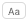

The Code editor has powerful **find and replace** features that apply to the current window. 

As soon as a find or replace function is selected, either by a [**shortcut**](#shortcuts) or a command from the **Edit** menu, a Search area is displayed in the toolbar of the method window:

You can close this area at any moment by clicking on the **x** at the rightmost side of the area. 

:::tips

The **Find in design** feature in the 4D toolbar or in the **Edit** menu is not specific to the Code editor but may be used to search for a value among all the methods and classes. 

:::

## Find

Select **Find** in the **Edit** menu or type **Ctrl+f** (Windows)/**Cmd+f** (macOS) to display/enable the Search area. 

The search defined in this area box will be performed in the code located in the window.

- The **entry** area enables you to enter the string of characters to be searched for. This area is a combo box that stores the last 15 character strings that have been searched for or replaced during the session. If you highlight text before choosing the **Find...** command, it will appear in this area. You can then either use this text or replace it with another.

- Once a string is entered or selected, all occurrences found in the opened window are highlighted. You can click on the **Next / Previous** buttons  to select all occurrences sequentially towards the beginning or end of the current method, starting from the initial location of the cursor. You can also use the **Find Next** and **Find Previous** commands of the **Edit** menu.

- The **Case Sensitive** option  is used to take the case of characters as they were entered in the find area into account. For instance, a search for "MyVar" will not find "myVar."

- The **Whole Word** option  is used to limit the search to exact occurrences of the word being searched for. When this option is checked, for instance, a search for "client" will not find either "clients" or "myclient." By default, this option is not checked; therefore, a search for "var" will find "Myvar," "variation," etc.

Be careful, unlike the **Whole Object Name** option of the Find in Design dialog box, the **Whole Word** option does not take object names into account. For example, with this option, searching for the string "My" in a method will find the "My Variable" variable. This is not the case for an overall search using the **Whole Object Name** option, where the same result will not be found in the context of the above example since the whole object name (of the variable found previously) is "My Variable" and therefore does not correspond exactly to the string entered ("My").

When you click on **OK**, 4D begins searching from the current text insertion point and continues to the end of the method. The first item corresponding to the set criteria is thus selected in the Code Editor window. It is then possible to continue the search using the **Find Next** and **Find Previous** commands of the **Edit** menu.

### Find Same

The **Find Same** command is used to find character strings identical to the one selected. This command is only active if you have selected at least one character in the Code Editor.

The search carried out is of the "Find Next" type in the current code editor window.

### Find Same Next/Previous

The **Find Same Next** and **Find Same Previous** commands are used to find character strings *strictly* identical to the ones selected. For example, the case must match.

### Bookmark All  

The **Bookmark All** command is enabled when a search has already been specified in the find or replace dialog box. When you select this command, 4D puts a bookmark at each line that contains an item corresponding to the "current" search criteria. This makes it easy to spot all the search results.

For more information about bookmarks, refer to [Using bookmarks](./write-class-method.md#using-bookmarks).

## Replace  

The **Replace** command displays the following dialog box:

- The **Find What:** area is used to define the character string or the expression to be searched for. As in the Find dialog box, this area is a combo-box that stores the last 15 character strings searched for. If you highlight text before choosing the **Replace** command, it will appear in this area.
- The **Replace with:** area is used to define the character string that will replace the one defined above. This area is also a combo-box storing the last 15 character strings that have been searched for or replaced.
- The **Whole Word** option is used to find/replace only character strings that correspond exactly to the string entered. In this case, for instance, a search for "client" will not find the strings "clients" or "myclient," etc.
- The **Case Sensitive** option is used to find/replace only character strings having the same case as that of the entered string. For instance, a search for "MyVar" will not find "myVar."
- As in the Find dialog box, the **Previous** and **Next** buttons are used to set the direction of the search: towards the beginning or end of the current method, starting from the initial location of the cursor.

The **Replace** button is used to launch the search and replace the first occurrence found. 4D begins searching from the current text insertion point and continues to the end of the method. It is then possible to continue finding/replacing using the **Replace Next** and **Replace Previous** commands of the **Edit** menu.

The **Everywhere** button is used to replace all the occurrences corresponding to the search criteria directly in the open method.

## Shortcuts

Find and replace menu commands are located at the bottom of the **Edit** menu. You can also use the following shortcuts:

||Windows|	macOS|
|---|---|---|
|Find|Ctrl + F|Cmd + F|
|Find Next|Ctrl + G|Cmd + G|
|Find Previous|Ctrl + Shift + G|Cmd + Shift + G|
|Find Same Next|Ctrl + E|Cmd + E
|Find Same Previous|Ctrl + Shift + E|Cmd + Shift + E|
|Replace|Ctrl + Alt + F|Cmd + Alt + F|
|Replace Next|Ctrl + Alt + G|Cmd + Alt + G|

