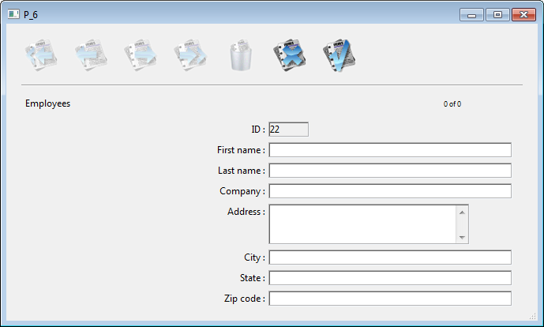

<!--REF #_command_.ADD RECORD.Syntax-->**ADD RECORD** ( {*aTable*}{;}{*} )<!-- END REF-->
<!--REF #_command_.ADD RECORD.Params-->
| Parameter | Type |  | Description |
| --- | --- | --- | --- |
| aTable | Table | &#8594;  | Table to use for data entry, or Default table, if omitted |
| * | Operator |  &#8594;  | Hide scroll bars |

<!-- END REF-->

#### Compatibility 

<!--REF #_command_.ADD RECORD.Summary-->*This command was implemented in 4D's early releases and is still useful for prototyping or basic developments.<!-- END REF--> However, to build customized and modern interfaces, it is now recommended to use generic forms based upon the [DIALOG](../commands/dialog.md) command which provide advanced features and better control over the data flow.*

#### Description 

The **ADD RECORD** command lets the user add a new record to the database for the table *aTable* or for the default table, if you omit the *aTable* parameter. 

**ADD RECORD** creates a new record, makes the new record the current record for the current process, and displays the current input form. In the Application environment, after the user has accepted the new record, the new record is the only record in the current selection. 

The following figure shows a typical data entry form. 


The form is displayed in the frontmost window of the process. The window has scroll bars and a size box. Specifying the optional *\** parameter causes the window to be drawn without scroll bars and the form window can no longer be reduced:



**ADD RECORD** displays the form until the user accepts or cancels the record. If the user is adding several records, the command must be executed once for each new record.

The record is saved (accepted) if the user clicks an Accept button or presses the Enter key (numeric keypad), or if the [ACCEPT](accept.md) command is executed. 

The record is not saved (canceled) if the user clicks a Cancel button or presses the cancel key combination (Ctrl-Period on Windows, Command-Period on Macintosh), or if the [CANCEL](cancel.md) command is executed. 

**Note:** This command does not require *aTable* to be in read/write mode. It can be used even when the table is in read-only mode (see *Record Locking*). 

After a call to **ADD RECORD**, OK is set to 1 if the record is accepted, to 0 if canceled.

**Note:** Even when canceled, the record remains in memory and can be saved if [SAVE RECORD](save-record.md) is executed before the current record pointer is changed. 

#### Example 1 

The following example is a loop commonly used to add new records to a database: 

```4d
 FORM SET INPUT([Customers];"Std Input") // Set input form for [Customers] table
 Repeat // Loop until the user cancels
    ADD RECORD([Customers];*) // Add a record to the [Customers] table
 Until(OK=0) // Until the user cancels
```

#### Example 2 

The following example queries the database for a customer. Depending on the results of the search, one of two things may happen. If no customer is found, then the user is allowed to add a new customer with **ADD RECORD**. If at least one customer is found, the user is presented with the first record found, which can be modified with [MODIFY RECORD](modify-record.md): 

```4d
 READ WRITE([Customers])
 FORM SET INPUT([Customers];"Input") // Set the input form
 vlCustNum:=Num(Request("Enter Customer Number:")) // Get the customer number
 If(OK=1)
    QUERY([Customers];[Customers]CustNo=vlCustNum) // Look for the customer
    If(Records in selection([Customers])=0) // If no customer is found…
       ADD RECORD([Customers]) // Add a new customer
    Else
       If(Not(Locked([Customers])))
          MODIFY RECORD([Customers]) // Modify the record
          UNLOAD RECORD([Customers])
       Else
          ALERT("The record is currently being used.")
       End if
    End if
 End if
```

#### System variables and sets 

Accepting the record sets the OK system variable to 1; canceling it sets the OK system variable to 0\. The OK system variable is set only after the record is accepted or canceled.

#### See also 

[ACCEPT](accept.md)  
[CANCEL](cancel.md)  
[CREATE RECORD](create-record.md)  
[MODIFY RECORD](modify-record.md)  
[SAVE RECORD](save-record.md)  

#### Properties
|  |  |
| --- | --- |
| Command number | 56 |
| Thread safe | &check; |
| Modifies variables | OK |
| Changes current record ||
| Changes current selection ||
| Forbidden on the server ||


