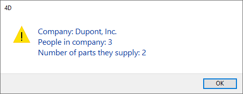
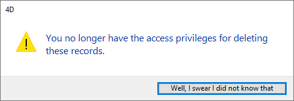

<!--REF #_command_.ALERT.Syntax-->**ALERT** ( *message* {; *okButtonTitle*} )<!-- END REF-->
<!--REF #_command_.ALERT.Params-->
| Parameter | Type |  | Description |
| --- | --- | --- | --- |
| message | Text | &#8594;  | Message to display in the alert dialog box |
| okButtonTitle | Text | &#8594;  | OK button title |

<!-- END REF-->

#### Description 

<!--REF #_command_.ALERT.Summary-->The **ALERT** command displays an alert dialog box composed of a note icon, a message, and an OK button.<!-- END REF--> 

You pass the message to be displayed in the parameter *message*. 

By default, the title of the OK button is “OK.” To change the title of the OK button, pass the new custom title into the optional parameter *okButtonTitle*. If necessary, the OK button width is resized toward the left, according to the width of the custom title you pass.

**Tip:** Do not call the **ALERT** command from the section of a form or object method that handles the On Activate or On Deactivate form events; this will cause an endless loop.

#### Example 1 

This example displays an alert showing information about a company. Note that the displayed string contains carriage returns, which cause the string to wrap to the next line:

```4d
 ALERT("Company: "+[Companies]Name+Char(13)+"People in company: "+\
 String(Records in selection([People]))+Char(13)+"Number of parts they supply: "+\
 String(Records in selection([Parts])))
```

This line of code displays the following alert box (on Windows):



#### Example 2 

The line:

```4d
 ALERT("I'm sorry Dave, I can't do that.";"Alas!")
```

displays the alert dialog box (on Windows) shown:


#### Example 3 

The line:

```4d
 ALERT("You no longer have the access privileges for deleting these records.";"Well, I swear I did not know that")
```

displays the alert dialog box (on Windows) shown:



#### See also 

[CONFIRM](confirm.md)  
[DISPLAY NOTIFICATION](display-notification.md)  
[Request](request.md)  