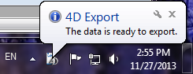

<!--REF #_command_.DISPLAY NOTIFICATION.Syntax-->**DISPLAY NOTIFICATION** ( *title* ; *text* {; *duration*} )<!-- END REF-->
<!--REF #_command_.DISPLAY NOTIFICATION.Params-->
| Parameter | Type |  | Description |
| --- | --- | --- | --- |
| title | Text | &#8594;  | Notification title |
| text | Text | &#8594;  | Notification text |
| duration | Integer | &#8594;  | Display duration in seconds |

<!-- END REF-->

*This command is not thread-safe, it cannot be used in preemptive code.*


#### Description 

<!--REF #_command_.DISPLAY NOTIFICATION.Summary-->The DISPLAY NOTIFICATION command displays a notification message to the user.<!-- END REF-->

Usually this kind of message is used by the OS or an application to inform the user of an external event (network disconnection, availability of an upgrade, etc.).

* Under Windows, the message appears in the notification area of the taskbar:  

* Under OS X (version 10.8 minimum), the message appears in a small sliding window in the top right corner of the screen.  
  
Note that in compliance with Apple specifications, the notification is only displayed when the application is not in the foreground. However, the message still appears in the "notification center" list.

In *title* and *text*, pass the title and the text of the message to display (in our example, the title is “4D Export”). You can enter up to 255 characters. 

Under Windows, the message window remains displayed as long as no activity has been detected on the machine, or until the user clicks on the close box. The optional *duration* parameter modifies the default display duration. Note that the display of notifications depends on the system configuration. 

#### Example 

```4d
 DISPLAY NOTIFICATION("4D Export";"The data is ready to export.")
```

#### See also 

[ALERT](alert.md)  